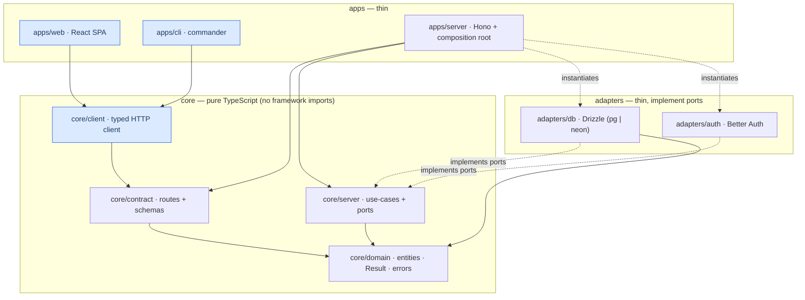

# agentproofarch

An agent-first, strictly layered full-stack TypeScript architecture for
multi-tenant SaaS — and a working reference implementation of it.

The idea in one paragraph: a pure-TypeScript core (domain, API contract,
use-cases + ports, typed client) surrounded by thin adapters (database, auth)
and thin apps (HTTP server, web SPA, CLI). Every layer
boundary is machine-enforced by lint, every capability is verifiable from the
CLI with JSON output and deterministic exit codes — so AI agents can build,
run and verify features in a closed loop, and the same commit deploys to
Vercel today **and** to a built self-hosted Docker stack (Node + Postgres +
Caddy) — `Dockerfile`, `docker-compose.prod.yml` and `Caddyfile` ship in `demo/`
(US-021 + US-022, DECIDE A2). The tenant domain-provisioning adapter
(`DomainPort`) is built for self-host — Caddy on-demand TLS gated by an internal
domain-check endpoint (US-021); the Vercel Domains API adapter (US-020) is
deferred to the A1 custom-domains slice.

## Live demo

<https://agentproofarch.vercel.app> — sign in as `demo@agentproofarch.dev` /
`demo1234`. Web is single-tenant on `*.vercel.app` (a wildcard domain is env,
not code — [ADR-0003](docs/decisions/0003-vercel-environments.md)); the API and
CLI stay fully multi-tenant via the `X-Tenant` header.

## The layers

Arrows are the **only** allowed dependency directions. Clients (`apps/web`,
`apps/cli`) reach `core/client` for all HTTP — plus the shared vocabulary they
type against (`core/contract`, `core/domain`) and the auth client adapter they
bind — and never `core/server` or `adapters/db`; that boundary is what the
lint exists to guarantee.



`core/contract` is the single seam between server and clients; `core/domain`
depends on zod alone; `apps/server/src/composition.ts` is the only place a
*server* adapter is instantiated (the auth *client* adapter is constructed in
`apps/web/src/api.ts` for web and in the CLI's `cliCtx`). See
[docs/architecture.md](docs/architecture.md) for the full rationale.

## Quickstart

Run everything from `demo/` (its own `package.json`). Node 22.

```bash
cd demo
npm ci                       # NOT npm install — see below
npm run db:up                # Postgres 16 in Docker on port 47542
npm run db:migrate
npm run db:seed              # demo user + two tenants + todos
npm run dev:web              # frontend: Vite + hot reload on 47180 (canonical)
```

**Never `npm install` here.** `lock-lint` validates `package-lock.json` under
npm-10 semantics — the exact rules `npm ci` enforces on the node-22 CI runner —
and a local npm 11 `npm install` silently prunes optional entries npm 10
requires, which broke CI twice. Add dependencies with `npx -y npm@10 install`.

For a **prod-like** page (server serving a built bundle rather than the Vite dev
server), build first, then boot the server:

```bash
npm run build:web
npm run dev:server           # API + built SPA on http://acme.localhost:47100
```

`dev:server` serves whatever `dist/web` holds — a gitignored build — so after a
contract change an old bundle fails every page; rebuild or use `dev:web`. Tenants
live on subdomains (`acme.localhost:47100`, `globex.localhost:47100`); browsers
reject `Domain=.localhost` cookies, so you sign in per subdomain in dev only.

Drive the same capabilities from the CLI — the agent feedback loop and the
reference client:

```bash
npm run --silent cli -- --json health
npm run --silent cli -- login --email demo@agentproofarch.dev --password demo1234
npm run --silent cli -- --tenant acme todo list --json
```

`--json` prints exactly one JSON envelope on stdout; exit codes come from the
error taxonomy (`validation`=2, `unauthorized`=3, `forbidden`=4, `not_found`=5,
`conflict`=6, `tenant_not_found`=7, `internal`=10).

## How this repo defends itself

Two gates, four test levels, and probes that keep the enforcers honest
([ADR-0004](docs/decisions/0004-no-exceptions-enforcement.md)):

- **`npm run check`** — the **static** gate: typecheck + ESLint (layer
  boundaries) + `lock-lint` (npm-10 lockfile semantics) + dependency-cruiser +
  `doc-lint` + vitest with coverage. **<!--count:test-files-->82<!--/count--> test files.**
- **`npm run smoke`** — the **runtime** gate (~5s): recreates an isolated
  `agentproofarch_smoke` DB, boots the real server and drives
  health → sign-in → todos → unauthorized through the CLI, asserting taxonomy
  exit codes. Static-green is not done; the app must actually run.
- **Coverage ratchet** — thresholds are a floor set to the measured minimum
  (per-metric, rounded down); a coverage regression fails `check`.
- **Four test levels** — **unit** (<!--count:test-files-->82<!--/count--> files,
  in `check`) · **integration** (<!--count:integration-tests-->48<!--/count-->,
  real Postgres, run in the `smoke` CI job) · **e2e**
  (<!--count:e2e-tests-->14<!--/count--> tests across
  <!--count:e2e-specs-->5<!--/count--> Playwright spec files, a real Chromium
  over the real stack) · **smoke** (runtime) — plus **`smoke:remote`**, the same
  CLI suite against deployed URLs.
- **CI jobs** — `check`, `smoke` (Postgres service + integration), and `e2e`
  run on every PR; `post-deploy-smoke` re-runs `smoke:remote` against real
  production/preview after each deploy.
- **Config-regression probes** — <!--count:config-regression-->47<!--/count--> tests guard the covered boundary and
  island-core rules: most feed a violating fixture to a rule and assert the gate
  still goes red; a few are structural rule-presence checks rather than
  fixture-feeding probes. Together they mean those rules cannot be silently
  deleted and stay green.
- **Doc-lint** — a fixed manifest (8 prose-promised guarantees) is checked both
  ways against enforcer config, matched by rule name: every guarantee in the
  manifest must still map to an ESLint / dependency-cruiser entry, and every
  custom `agentproofarch/*` rule must be named somewhere under `docs/`.
  Divergence fails the gate. A third check scans every git-tracked `.md` for
  leaked tool/XML delimiters (the stray closing `content`/`invoke` tags of the
  round-1 audit C1 leak) so stray agent-output markup can't survive into
  committed prose. It is a named-manifest check, not a proof that *every*
  guarantee or boundary is covered.

## Environments

Same commit; environment variables only ([ADR-0003](docs/decisions/0003-vercel-environments.md)).

| Environment | Trigger | Web | Database |
|---|---|---|---|
| **Production** | `main` → <https://agentproofarch.vercel.app> | Vercel Production | Neon `production` branch, `DB_DRIVER=neon-http`, `fra1` |
| **Staging** | long-lived `staging` branch (deployed as a Preview) | Vercel Preview | Neon `staging` branch |
| **Preview** | every PR (URL from `VERCEL_URL`, zero config) | Vercel Preview | ephemeral Neon branch, copy-on-write, deleted with the PR |
| **Dev** | local (`vercel env pull` for parity) | Vite / built bundle | Docker `postgres:16` on 47542 |

## Adding a resource

Start with the scaffolder — the canonical entry point:

```bash
npm run new:resource -- note
```

It generates the files a resource owns outright and prints an ordered checklist
for the shared files you wire by hand. The type system keeps `check` RED through
the type-forced steps (domain, contract, port/use-case, client wiring); three
steps — the CLI command, server-route registration, and the web route —
typecheck fine while still unwired, so for those the checklist, not the compiler,
guarantees completion. Full narrated walkthrough:
**[docs/first-feature.md](docs/first-feature.md) — your first feature in 30
minutes.** [`AGENTS.md`](AGENTS.md) points agents at the very same rules, so a
human and an agent build a feature the same way.

## Repository layout & docs

| Folder | Contents |
|---|---|
| [`docs/`](docs/) | [architecture.md](docs/architecture.md), the [PRD](docs/prd-agentproofarch-foundation.md), [decisions/](docs/decisions/) (ADRs), and the [first-feature guide](docs/first-feature.md) |
| [`demo/`](demo/) | The walking skeleton: multi-tenant todos with auth, tenants (foundation-owned, flat `owner`/`admin` grants — no organizations/teams concept), tenant subdomains, themed Material UI web, full CLI and enforced boundaries — see [demo/README.md](demo/README.md) |

Changing the architecture means changing [`docs/`](docs/) first, then the code.
