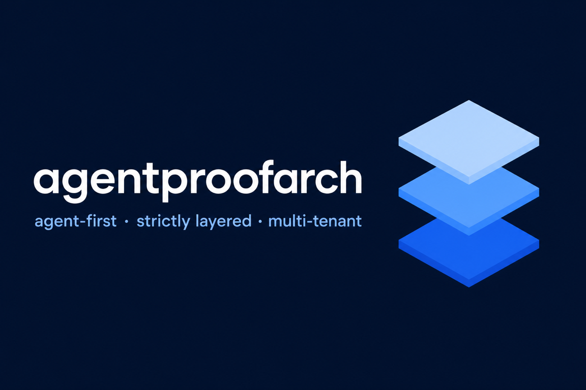

<p align="center"></p>

# agentproofarch 🔷

**agentproofarch** — an agent-first, strictly-layered TypeScript foundation for
multi-tenant SaaS.
A free, open project — [MIT licensed](LICENSE) — by **Mateusz Choma**, developed
privately in collaboration with **[CodeRoad.pl](https://coderoad.pl)** and
**[AmazingDesign.eu](https://amazingdesign.eu)**.

The idea in one paragraph: a pure-TypeScript core (domain, API contract,
use-cases + ports, typed client) surrounded by thin adapters (database, auth,
email, domain provisioning) and thin apps (HTTP server, web SPA, CLI). Every
layer boundary is machine-enforced by lint. The CLI covers the day-to-day
capability surface with JSON output and deterministic exit codes, so AI agents
can build, run and verify features in a closed loop. Known exceptions: passkeys
and Google sign-in are browser-bound (a WebAuthn ceremony and a consent
redirect), while TOTP enrolment and the internal backfill executor work over
plain HTTP but have no CLI command yet. Password change is available through
both web settings and the CLI. The same commit deploys to Vercel today
**and** to a self-hosted Docker stack.

## Documentation

**<https://chomamateusz.github.io/agentproofarch/>** — the full documentation
site: architecture with diagrams, quickstart, CLI walkthrough, guides,
operations runbooks (CI gates, environments & promotion, backup/DR), every
decision record with its WHY, and the [changelog](CHANGELOG.md).
Releases use SemVer, bumped by a dedicated release-cut pull request to `main`
and promoted from there; see
[Versioning & releases](https://chomamateusz.github.io/agentproofarch/operations/versioning-and-releases).

The normative source remains this repo: [docs/architecture.md](docs/architecture.md)
(the architecture), the [PRD](docs/prd-agentproofarch-foundation.md) (the
contract) and [docs/decisions/](docs/decisions/) (ADRs). The site presents them;
it never overrules them.

## Live demo

<https://agentproofarch.vercel.app> — sign in as `demo@agentproofarch.dev` /
`demo1234`. Web is single-tenant on `*.vercel.app` (a wildcard domain is env,
not code — [ADR-0003](docs/decisions/0003-vercel-environments.md)); the API and
CLI stay fully multi-tenant via the `X-Tenant` header.

## Quickstart

Run everything from `demo/` (its own `package.json`). Node 24 LTS.

```bash
cd demo
corepack enable && corepack prepare --activate
pnpm install --frozen-lockfile
pnpm run db:up     # Postgres 16 in Docker on port 47542
pnpm run db:migrate
pnpm run db:seed
pnpm run dev:server # API on 47100 — its own terminal
pnpm run dev:web    # Vite + hot reload on 47180 — another terminal
```

Then drive the same capabilities from the CLI — the agent feedback loop:

```bash
pnpm --silent run cli --json health
pnpm --silent run cli login --email demo@agentproofarch.dev --password demo1234
pnpm --silent run cli --tenant acme todo list --json
```

Full walkthrough, prod-like serving, the error-taxonomy exit codes and the
pnpm supply-chain controls: [quickstart on the docs site](https://chomamateusz.github.io/agentproofarch/start/quickstart)
and [demo/README.md](demo/README.md).

## Repository layout

| Folder | Contents |
|---|---|
| [`docs/`](docs/) | Normative: [architecture.md](docs/architecture.md), the [PRD](docs/prd-agentproofarch-foundation.md), [decisions/](docs/decisions/) (ADRs), [first-feature guide](docs/first-feature.md) |
| [`demo/`](demo/) | The entire implementation: multi-tenant walking skeleton with auth (password change, magic link, TOTP, passkeys), tenant subdomains + custom domains, themed web SPA, full CLI, self-host Docker stack, and the gates that defend it all — see [demo/README.md](demo/README.md) |
| [`website/`](website/) | The Docusaurus documentation site, deployed to GitHub Pages on every merge to `main` |

Changing the architecture means changing [`docs/`](docs/) first, then the code.
