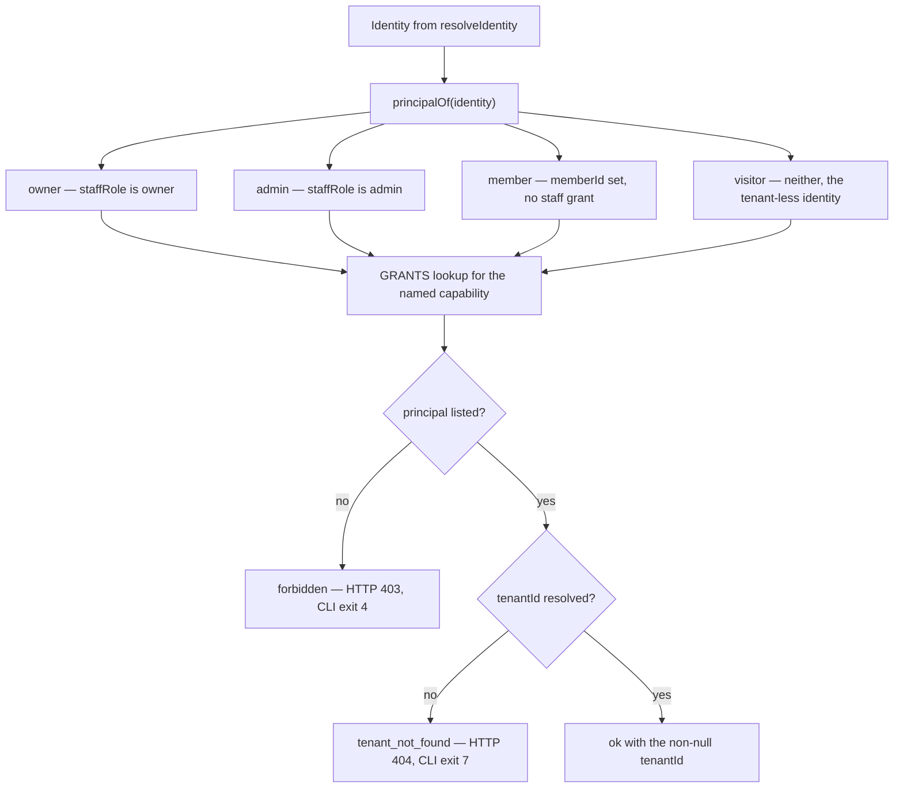

# Authorization (default-deny) 🛡️ \{#authorization-default-deny}

*Read this if you are adding a capability, or deciding who may do what inside a tenant.*

:::note[You do not need this to start]
You can build with just the [Quickstart](../start/quickstart.md) — the seeded
demo already carries a working grant table. This page is the reference for the
capability model and the tests that pin it. Come back when you are adding a
capability, changing who holds one, or reviewing a use-case that touches another
tenant's data. On a first read,
[§Two questions, two steps](#two-questions-two-steps) and
[§The capability model](#the-capability-model) are enough.
:::

"We check permissions in the handlers" is how cross-tenant data leaks happen:
one handler forgets the check, and nothing above it notices.

Authorization here is **one pure function over one closed table**, called as the
first statement of every tenant-scoped use-case. Two mechanisms keep that honest:
an exhaustive unit suite asserting every capability × principal cell, and a
structural probe that fails the build when a new use-case forgets the call.

Nothing is granted by wildcard — a principal absent from a capability's list is
denied.

## Two questions, two steps ❓ \{#two-questions-two-steps}

Tenant resolution answers *which* tenant and *whether* the caller belongs to it
([Identity & multi-tenancy](identity-and-multi-tenancy.md)). Authorization answers
*what* they may do there. Keeping them separate is what makes the second step a
pure, testable function.



## The capability model 🔑 \{#the-capability-model}

`core/domain/authorization.ts` holds the whole policy — no framework, no
database, no I/O. The `Capability` union is closed:

```ts
export const CAPABILITIES = [
  'todo:read', 'todo:write',
  'card:read', 'card:write',
  'member:read', 'member:write', 'member:remove', 'member:export',
  'staff:read', 'staff:grant', 'staff:revoke',
  'domain:read', 'domain:write',
  'tenant:create',
] as const;

export const PRINCIPALS = ['owner', 'admin', 'member', 'visitor'] as const;
```

The principal is derived, never stored:

```ts
export const principalOf = (identity: Identity): Principal => {
  if (identity.staffRole === 'owner') return 'owner';
  if (identity.staffRole === 'admin') return 'admin';
  if (identity.memberId !== null) return 'member';
  return 'visitor';
};
```

`owner` and `admin` are **distinct principals**. They were a single `staff`
principal until FR-8; the staff-grant surface is the first capability where they
diverge, so the split is honest rather than cosmetic.

## The grant table 📋 \{#the-grant-table}

The policy is data — a `Record<Capability, readonly Principal[]>` — so adding a
capability without deciding its grants **does not compile**:

| capability | owner | admin | member | visitor (tenant-less) |
|---|---|---|---|---|
| `todo:read` | allow | allow | allow | deny |
| `todo:write` | allow | allow | allow | deny |
| `card:read` | allow | allow | allow | deny |
| `card:write` | allow | allow | allow | deny |
| `member:read` | allow | allow | deny | deny |
| `member:write` | allow | allow | deny | deny |
| `member:remove` | allow | allow | deny | deny |
| `member:export` | allow | allow | deny | deny |
| `staff:read` | allow | allow | deny | deny |
| `staff:grant` | allow | **deny** | deny | deny |
| `staff:revoke` | allow | **deny** | deny | deny |
| `domain:read` | allow | allow | deny | deny |
| `domain:write` | allow | **deny** | deny | deny |
| `tenant:create` | mode-derived | mode-derived | **deny** | mode-derived |

Reading the interesting rows:

- **Members are full collaborators, not administrators.** `todo:*` and `card:*`
  are granted to `member` because todos and cards are collaborative aggregates.
  Tenant administration is not.
- **`member:*` is staff-only on purpose.** Members are the end customers this
  aggregate is *about*, managed **by** staff — granting a member `member:read`
  would let one customer enumerate the tenant's customer list. A customer's
  legitimate self-scoped read is `/api/me`, which carries no capability.
  `member:remove` is split from `member:write` so a future policy can reserve
  destructive removal for owners without reopening the capability set.
- **Only an owner may mint or remove staff** (FR-8). An admin runs the tenant but
  cannot create peers, and the **last owner cannot be revoked** — a lockout guard
  that returns a `validation` error from `revokeAdmin`. Granting admin targets an
  **existing** account by email (there are no invitations yet), so `grantAdmin`
  returns `not_found` when the email has no account.
- **`domain:write` is owner-only** for the same reason: an admin runs the tenant
  without changing *where it is reachable*.
- **`tenant:create` is selected by `TENANT_CREATION`.** The caller becomes owner
  when creation is allowed; the three modes are detailed below.

### Tenant-creation modes 🏢 \{#tenant-creation-modes}

`TENANT_CREATION` selects the instance-wide `tenant:create` grant row:

| mode | `tenant:create` principals | behavior |
|---|---|---|
| `open` (default) | `owner`, `admin`, `visitor` | Any authenticated account may self-serve a tenant. |
| `staff` | `owner`, `admin` | A caller who already holds a staff grant in any tenant may create another tenant. The first tenant must come from seed or operator tooling. |
| `closed` | none | In-app creation is denied to everyone; seed or operator tooling creates every tenant. |

The server reads the key from the single environment schema. In `staff` mode,
the tenant-less create path checks the caller's staff grants across the instance
before applying the ordinary grant table. `closed` is the same default-deny rule
with an empty grant list, not a special authorization branch. Denial uses the
existing `forbidden` response and requires no CLI or web-client handling.
The tenant-list response also returns `canCreateTenant`: `listMyTenants` runs on
that same tenant-less context and reports the same `decide(..., "tenant:create")`
verdict the create path enforces — one decision, one layer. Settings
and tenant-less onboarding render the create form only when this value is true,
so `staff`, `closed` and member-facing UI cannot advertise a rejected action.

:::caution[The member cell is context-dependent]
The `member` deny on `tenant:create` is a use-case-layer defense for callers
that carry a member context. The HTTP create route sits above tenant resolution:
under `open`, that account presents as a tenant-less `visitor` and may create;
under `staff`, only an instance-wide owner/admin grant changes that principal;
under `closed`, nobody is granted the capability.
:::

### How a tenant comes to exist 🌱 \{#how-a-tenant-comes-to-exist}

The `tenant:create` row is easiest to read as a flow. Sign-up happens at the
**platform** level, into the one account pool every tenant shares — creating an
account does not put you in any tenant. An account that holds no staff grant
and no membership is a `visitor`: authenticated, tenant-less.

Under the default `open` mode, that visitor may call `tenant:create`. The
`createTenant` use-case authorizes, validates the slug and name, and then calls
the repository's `createTenantWithOwner` — a single atomic operation (one
database round-trip) that inserts the tenant row **and** the caller's founding
`owner` grant together, so a tenant can never exist without an owner. This is
the standard self-service onboarding: sign up, create a tenant, own it.

A `member` acting *in a tenant's context* is denied `tenant:create` — being a
customer of one tenant does not license provisioning others from inside it.
Capability checks are per-request and per-tenant-context, so the **same person**
addressing the base domain has no member principal there. Whether they may
create is then determined by `TENANT_CREATION`: `open` permits the resulting
visitor, `staff` requires an existing staff grant elsewhere, and `closed`
permits nobody.

## One line per use-case 📏 \{#one-line-per-use-case}

Two helpers live in `core/server/authorize.ts`. `authorize` is the tenant-agnostic
variant; `authorizeTenant` both denies **and** hands back the resolved non-null
`tenantId`:

```ts
export const authorize = (ctx: Ctx, capability: Capability): AppError | null => {
  const verdict = decide(ctx.identity, capability, ctx.tenantCreationMode);
  return verdict.allowed ? null : forbidden(verdict.reason);
};

export const authorizeTenant = (ctx: Ctx, capability: Capability): Result<string, AppError> => {
  const denial = authorize(ctx, capability);
  if (denial) return err(denial);
  return ctx.identity.tenantId === null
    ? err(tenantNotFound('Select a tenant'))
    : ok(ctx.identity.tenantId);
};
```

Every tenant-scoped use-case therefore opens the same way, **before any
repository access**:

```ts
export const listTodos = async (ctx: Ctx, deps: TodoDeps): Promise<Result<Todo[], AppError>> => {
  const scope = authorizeTenant(ctx, 'todo:read');
  if (!scope.ok) return scope;
  return ok(await deps.todos.listByTenant(scope.value));
};
```

`scope.value` is a narrowed `string`, so the repository call cannot be made
against a null tenant — the denial and the scoping are the same statement.

A capability is modelled only where authorization is a **real decision**:
`listMyTenants` enumerates the caller's *own* staff memberships, so it is gated by
authentication and carries no capability. A self-scoped read is not an access
decision.

## Public routes never authorize 🚪 \{#public-routes-never-authorize}

The public contract group (`/api/public/*`) is unauthenticated, so expressing its
reads as a `visitor` capability would be dishonest — `visitor` is an
*authenticated* tenant-less principal, and a public reader is not authenticated at
all ([ADR-0006](../decisions/0006-public-read-only-surface.md)).

Instead the public handlers are registered **ahead of** the `/api/*`
tenant-resolution middleware and call only use-cases that take **no** identity
argument — e.g. `getPublicTenantProfile`. A public handler *structurally
cannot* reach a tenant-scoped, identity-bearing use-case. Public reads live
**outside** the capability model by construction, not as a new grant row.

That is enforced, not asserted: `config-regression/public-surface.test.ts` scans
the public app for any identity-bearing use-case name or
`authorize`/`resolveIdentity` reference, and asserts the public use-case's first
parameter is not `ctx: Ctx`.

## How each rule is actually held 🔒 \{#how-each-rule-is-actually-held}

The foundation's convention is that every rule carries an explicit enforcement
matrix, because a rule without one is prose, and prose decays.

| Tier | What it holds here |
|---|---|
| **TYPE** | `Capability` is a closed union and the helpers take it as a required argument, so a use-case cannot name a capability the union does not declare. `Record<Capability, readonly Principal[]>` is exhaustive, so adding a capability without deciding its grants fails to compile. |
| **LINT** | *n/a* — "call the predicate first" is a call-site discipline, not a syntactic shape a rule can match. |
| **TEST** | the exhaustive `decide` matrix, per-use-case denial tests, the scaffolder's generated tests, and the structural probe (below). |
| **REVIEW+AI** | flag a tenant-scoped use-case that touches a repository *before* the predicate, any grant that widens a capability beyond the table above, and any new entry in the probe's authentication-only allowlist without a self-scoped-read rationale. |

:::caution[Honest limit of the type tier]
The compiler forces the capability **name**, not the **call**. A use-case that
never calls `authorize`/`authorizeTenant` at all still typechecks. That gap is why
the structural probe below exists — and why the probe's own limits are stated
rather than glossed.
:::

## The denial tests ✅ \{#the-denial-tests}

**1. The exhaustive matrix.** `core/domain/authorization.test.ts` declares an
`EXPECTED: Record<Capability, Record<Principal, boolean>>` — exhaustive by
construction — and generates one test per cell, so every allow *and* every deny in
the table above is pinned. It also asserts the structural properties: a denial
always carries a reason and a grant never does, `owner` holds every capability,
and `admin` is denied exactly the owner-only rows (the FR-8 split).

**2. Per-use-case tests.** Each tenant-scoped use-case's suite asserts
staff-allowed, member allowed-or-denied per policy, and the tenant-less caller
denied.

**3. The scaffolder generates them.** `pnpm run new:resource` emits all three
outcomes as real tests for a new aggregate — staff allowed, member allowed per the
baseline collaborative policy (the test title carries the flip-to-forbidden
guidance for a staff-only aggregate), and the tenant-less caller `forbidden`. A
new aggregate therefore starts with its denial tests already written.

**4. The structural probe.** `config-regression/authorization.test.ts` scans
`core/server/usecases/*.ts`, treats every exported `const` whose first parameter is
`ctx: Ctx` as tenant-scoped, and asserts each one references
`authorize`/`authorizeTenant`. Its honest limits are written into the file itself:

- it matches the helper **in the function body** (a regex over source), not that
  the call *precedes* repository access — that ordering stays a review lever;
- a use-case shaped differently escapes detection;
- an intentional authentication-only use-case is a **named, reasoned allowlist
  entry** (today exactly one: `listMyTenants`, "self-scoped read of the
  caller-own staff memberships — authentication is the control, no capability"),
  never a silent omission;
- the probe also asserts it found the known use-cases, so a broken scan cannot
  pass vacuously, and that the allowlist has no stale entries.

## Adding a capability ➕ \{#adding-a-capability}

1. Add the string to `CAPABILITIES` in `core/domain/authorization.ts`.
2. The `GRANTS` record now fails to compile — decide, explicitly, which principals
   hold it.
3. Extend `EXPECTED` in the test (also exhaustive) with the four cells.
4. Name it in the use-case's first statement via `authorize` / `authorizeTenant`.
5. Add the denial tests, or let `pnpm run new:resource` scaffold them.

There is no step where a wildcard shortcut exists, which is the point.

**Where to go next.**

- **Deeper:** [ADR-0002 — member identity](../decisions/0002-member-identity-and-idp.md) — where staff grants and memberships come from.
- **Sideways:** [Identity & multi-tenancy](identity-and-multi-tenancy.md) — the first of the two questions.
- **To work:** [Adding a feature](../guides/adding-a-feature.md) — naming the capabilities a new resource needs.
