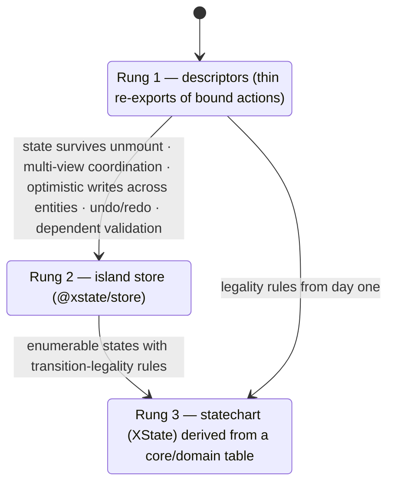
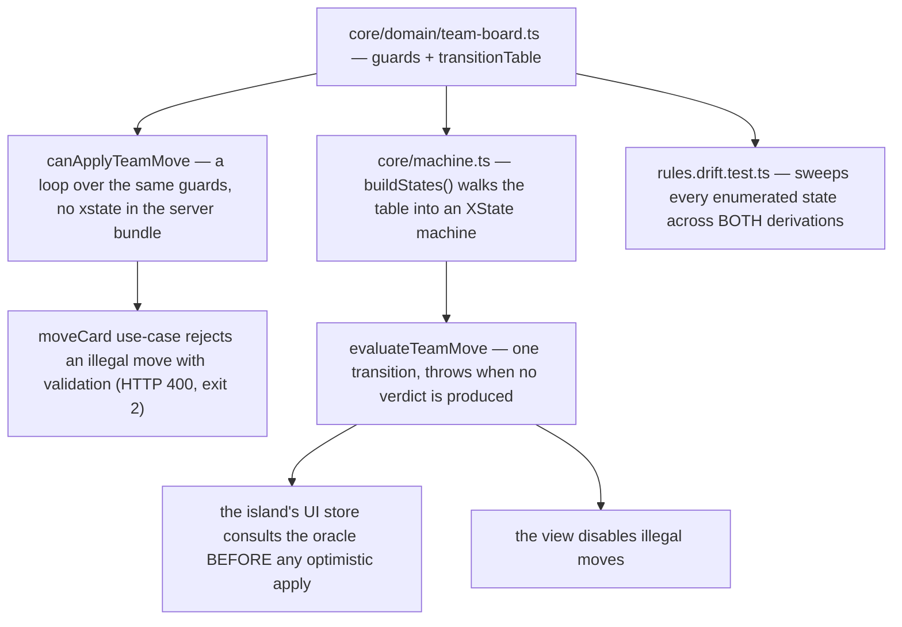
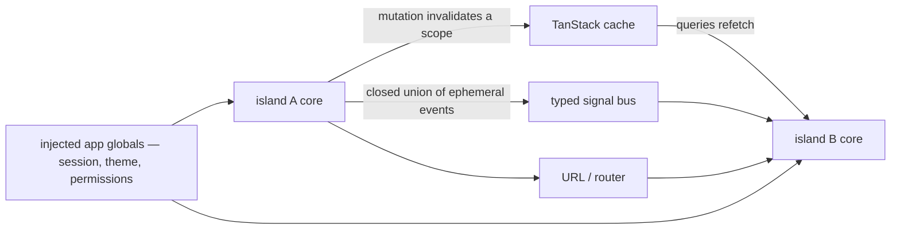

# Client state (island cores)

This page exists because client state is where architectures usually stop being
architecture. The rules here are unusual in one specific way: **the seam a view
talks to is identical on every rung of complexity**, so upgrading a feature from
"no client state" to "a full statechart" is a change *inside* the island and
invisible outside it. Views cannot tell a store from a statechart, and lint makes
sure they cannot find out. The model is decided in
[ADR-0005](../decisions/0005-client-application-state.md).

## Feature, island, core — three words for one thing

| Word | Meaning |
|---|---|
| **Feature** | `apps/web/src/features/<name>/` — the vertical slice of a business subdomain in the UI |
| **Island** | the same feature, named after its isolation guarantee: lint forbids features to import each other |
| **Island core** | `features/<name>/core/` — a pure TS module: events in, selectors out, machine inside |
| **View** | a React component inside the feature; talks exclusively to its own island's core |

A business **subdomain** is not a feature: the demo has one tasks subdomain and
*three* islands over it (todos, the personal board, the team board). That
distinction is the whole reason `core/domain` is singular while `features/` is
plural — see the [glossary](../start/glossary.md).

## The seam: events in, selectors out

Every island core's public API is a closed event union plus selector functions.
The machine is **not exported**, so a view cannot type against it:

```ts
export interface BoardCore<TList, TInvalidates> {
  send(event: BoardEvent): void;
  subscribe(listener: () => void): () => void;
  readonly boardSelectors: BoardSelectors<TList, TInvalidates>;
}
```

`send` returns `void`. That is the CQRS partition applied recursively at the
view↔core seam: **events are writes, selectors are reads, and an event never
returns data.** Request/response over events is what kills this pattern, and the
return type makes it unwritable — there is nothing to await and nothing to
destructure.

The web adapter is one line of glue: feed `subscribe` plus the `snapshot` selector
into `useSyncExternalStore`. A TUI would consume `subscribe(listener)` and the
selectors directly.

## Portable by construction

An island core is a **factory over its dependencies**, not a module that reaches
out for them:

```ts
export const createBoardCore = <TList, TInvalidates>(
  deps: BoardCoreDeps<TList, TInvalidates>,
): BoardCore<TList, TInvalidates> => { /* … */ };
```

Composition moves **out** of the core. `features/<name>/index.web.ts` is the one
site that injects the real gateway, the bound server-read descriptors and an id
source, then re-exports the seam the view consumes:

```ts
const core = createBoardCore({
  gateway: boardGateway,
  descriptors: { list: actions.board, invalidates: actions.boardInvalidates },
  generateId: () => crypto.randomUUID(),
});

export const send = core.send;
export const subscribe = core.subscribe;
export const boardSelectors = core.boardSelectors;
```

The descriptors thread through **generically**: the core passes them to
`useQuery`/invalidation at the view but never looks inside them, so it needs no
api or query types at all. Direction stays lawful — a feature may import
`api.ts`, but `api.ts` must never import a feature, which is why the transport is
exposed there as a *structural* gateway object rather than by reaching into the
island.

| Portability property | How it is guaranteed |
|---|---|
| the core imports no `api.ts` and no web composition | `no-restricted-imports` parent-relative ban + depcruise `island-core-is-portable` + a config-regression probe |
| the core typechecks without a DOM | `tsconfig.islands.json` (`lib: ["ES2023"]`, **no DOM**) run as `typecheck:islands` inside `check` |
| the public seam runs in plain node | a per-island node test driving `createXCore(deps)` with a fake gateway — no jsdom |
| composition happens at exactly one site | `features/<name>/index.web.ts`; `api.ts` stays feature-free |

So "DOM-free" is proven by a compiler program, not asserted in prose: a core that
touches `window`, `document` or a React type fails `typecheck:islands`.

## The three-rung ladder

The seam is uniform; the **machine** escalates.



| Rung | Machine | Demo exemplar |
|---|---|---|
| 1 | none — the core re-exports the feature's bound descriptors; `send` is a typed, exhaustive stub | `features/members/core/` |
| 2 | an island store (`@xstate/store`) holding in-flight optimistic ops and one undo step | `features/board/core/` |
| 3 | a statechart **derived** from a `core/domain` transition table, consulted as an oracle | `features/team-board/core/` |

**The view API never changes across rungs.** Graduation is a core-internal diff.

:::info Graduation must name its trigger
A core graduates only when a measurable trigger fires, and the PR says which one.
Rung choice is judgment against named triggers, so there is deliberately **no lint
rule** for it: it is a review question, and the `ai-review` gate is the tier that
flags rung-2/3 machinery with no trigger *and* trigger-hitting features stuck on
rung 1.

That gate is fail-closed and, since 2026-07-26, a **required check on
`main-gates`** — a PR without a `PASS` verdict cannot merge, so the semantic
half of these rules is enforced, not advisory. Details in
[CI gates](../operations/ci-gates.md).
:::

:::caution Honest state of the tree
Only three features have a `core/` folder. `todos` and `auth` predate the seam and
carry none yet — they gain one when first touched by real client state — and
`settings` is view-only. That is the honest reading of "every other feature remains
rung 1": no other feature fires a graduation trigger. Every **new** island starts
from the scaffolder.
:::

```bash
npm run new:island -- <name>                      # rung 1 seam: events, selectors, core test, view, route
npm run new:island -- <name> --machine=store       # rung 2, with optimistic-apply + undo tests
npm run new:island -- <name> --machine=statechart  # rung 3, with the transition table and a drift test
```

## The two-machines contract

The dividing line, verbatim: **local state is state that must die on reload —
anything "save progress" is server state.**

- the island store **never holds a copy of server data**; it reads through the
  TanStack cache, and optimistic updates go through `onMutate`/rollback;
- TanStack **never holds edit or interaction state**.

`features/board/core/store.ts` holds exactly three things — in-flight pending ops,
one reversible undo step, and a `committedRev` counter the view uses to invalidate
once. The card list itself lives in the cache, and `core/selectors.ts` merges cache
plus overlay to render the board.

## What lint actually enforces

Every rule below is a real entry in `eslint.config.js` or
`.dependency-cruiser.cjs`. The island-core rules are additionally backed by a
config-regression probe (`config-regression/island-core.test.ts`), which plants a
violating fixture and asserts `check` still goes red — that is how a rule is kept
from rotting once nobody remembers writing it.

| Rule | Scope | Forbids |
|---|---|---|
| `web-features-are-islands` (depcruise) + `boundaries` per-feature capture | `features/<a>/**` | importing `features/<b>/**` |
| `island-core-is-framework-agnostic` (depcruise) + `no-restricted-imports` | `features/*/core/**` | `react`, `react-dom`, `@tanstack/react-query`, `@xstate/store/react`, `@xstate/react` |
| `island-core-is-portable` (depcruise) + a parent-relative import ban | `features/*/core/**` | any `apps/web/src` path outside its own core dir — including `api.ts` and sibling features |
| store-library confinement pattern | all of `apps/web` **except** island cores | importing `@xstate/store` or `xstate` outside a core |
| zustand ban | all of `apps/web` | importing `zustand` at all — it is not a demo dependency |
| persist ban | `features/*/core/**` | store persistence middleware / JSON storage — client state must die on reload |
| storage-globals ban | all of `apps/web` | `localStorage`, `sessionStorage` (one designated exception: `theme-mode.tsx`) |
| `agentproofarch/query-descriptors-only` | all of `apps/web` | a query built from an inline object, a descriptor not imported, or one imported from another feature's module |
| `QUERY_KEY_BAN` / `HTTP_GLOBALS` / `CLIENT_CONSTRUCTION_BANS` (eslint.config.js) | all of `apps/web` | inline `queryKey`/`queryFn`, raw `fetch`, holding an `ApiClient` or a port in feature code |
| `setQueryData` ban | all of `apps/web` **except** a feature's `optimistic.ts` | manual cache writes outside the single-resource optimistic path |
| `agentproofarch/event-suffix-taxonomy` | `features/*/core/events.ts` | an imperative event name — see below |
| `agentproofarch/sx-layout-only` | all of `apps/web` | colour, typography, background and border-styling keys in an `sx` prop — `sx` carries layout/spacing/flex/grid/position/sizing only, and `theme.ts` owns the visual language. Existing debt is held by a **frozen per-file baseline that may only shrink** |
| `web-api-is-the-only-client-construction-site` | all of `apps/web` except `api.ts` and `main.tsx` | binding an adapter anywhere else |

React correctness runs at **error** level in the same gate:
`react-hooks/rules-of-hooks`, `react-hooks/exhaustive-deps`,
`react-compiler/react-compiler`, `jsx-a11y` recommended, and the TanStack Query
plugin rules.

### Intent-named events

Events name what the **user did**, never what should happen — `deleteConfirmed`,
not `deleteOrder`. Each island's events are one closed union in one file, and the
custom lint rule enforces the suffix taxonomy so the imperative form is
*unwritable*:

`…Requested` · `…Confirmed` · `…Cancelled` · `…Changed` · `…Selected` ·
`…Opened` · `…Closed` · `…Added` · `…Moved` · `…Removed` · `…Failed` ·
`…Succeeded`

```ts
export type BoardEvent =
  | { type: 'refreshRequested' }
  | { type: 'cardAdded'; title: string; column: string }
  | { type: 'cardMoved'; cardId: string; fromColumn: string; fromIndex: number;
      toColumn: string; toIndex: number; toColumnSize: number }
  | { type: 'undoRequested' };
```

The rule itself is unit-tested with ESLint's `RuleTester`. The semantic half — "do
these events report intent, or smuggle a decision?" — stays a review question.

## Rung 3: the derived machine and its oracle

When transition legality is a **business rule** (WIP limits, an enforced status
path), client-only enforcement is cosmetics: the CLI walks straight past it. So the
rules live once, in `core/domain`, as a **transition table as plain data** — zero
new dependencies, so "zod only" stands unamended:

```ts
export const transitionTable: Readonly<Record<TeamColumn, readonly GuardId[]>> = {
  todo: ['wip-limit'],
  'in-dev': ['wip-limit'],
  review: ['review-requires-in-dev', 'wip-limit'],
  done: ['done-only-from-review', 'wip-limit'],
};
```

Both sides **derive** from that one table:



The team board's demo limits are `{ 'in-dev': 3, review: 2 }`; a column absent from
the map is unbounded. The guards are three pure predicates:
`done-only-from-review`, `review-requires-in-dev` (reading the card's `visited`
history) and `wip-limit`.

:::danger Hand-writing the domain machine is forbidden
`buildStates()` assembles the statechart from the table at runtime. A hand-wired
machine drifts from the table, and drift is exactly the failure mode the property
test catches. Both derivations **fail loud**: if no verdict is produced for a pair
the table forgot to cover, `evaluateTeamMove` throws — never a permissive default.
The rejected alternative (one shared machine) was probe-verified to **fail open** on
unhandled transitions, which is why it was rejected.
:::

The drift test is not decorative — it does three things:

1. asserts the derived machine and the server check agree on **every** enumerated
   `(column, card, event)` pair, including the **WIP=1** edge limit;
2. proves non-vacuity: every rejection rule *and* at least one allowance is
   actually exercised;
3. proves its own detection power with a **planted mutant** — a hand-written
   machine that drops a guard must fail the suite.

### Oracle, not owner

The derived machine contains **domain states only** (columns plus guards). UI
states — drag lifecycle, optimism, undo — never enter it; the failure mode there is
the server "knowing" about the mouse. The island's own hand-written UI machine
treats the derived machine as an **oracle**, in one of two sanctioned shapes:

- **Oracle-guard** — the shape the demo ships: the store calls the derivation's
  evaluator and reads the verdict before touching the gateway.

  ```ts
  const verdict = evaluateTeamMove(
    event.board,
    { cardId: event.cardId, toColumn: event.toColumn },
    TEAM_WIP_LIMITS,
  );
  if (!verdict.allowed) {
    return { ...ctx, lastRejection: { cardId: event.cardId, toColumn: event.toColumn, rule: verdict.rule } };
  }
  ```

  A blocked move never becomes a pending op and never reaches the server; its
  rejecting rule id is recorded so the UI can name the reason.
- **Child-actor** — the UI machine `invoke`s the derived machine and reads the
  verdict from the child's context. Use it when the UI needs to react to the
  domain machine's state *over time*, not just gate a single event.

Either way the dependency points one direction: UI machine → derived domain
machine. Domain states never mirror UI states back.

:::note Accepted cost
A runtime-assembled machine is invisible to static XState tooling — no visualizer,
no typegen. That was traded for having exactly one source of truth for the rules.
:::

## Optimism holds one intent per entity

An overlay card whose operation has not settled carries a client-generated id and a
position the server has not confirmed. A second intent fired in that window would
target an id the server may not know (404) or a stale column (rule rejection), then
roll back. So the seam **refuses further intents on a pending entity**: the action
buttons render `disabled` with `(saving)` appended to the accessible name until the
operation settles.

```tsx
aria-label={`Move ${card.title} left${savingSuffix}`}
disabled={saving || leftColumn === undefined}
```

Both boards do this, and each page's test file pins the closed window
behaviourally. Related spike learning, also shipped: `toIndex` is **clamped before
the gateway**, in the use-case, so a client's optimistic index can never diverge
from persisted order.

## How islands coordinate — four channels, and only these



1. **Server cache** — the default for anything durable: mutation → invalidation →
   the other core's queries refetch. The cache *is* the pub/sub: local, instant, and
   already in the dependency graph.
2. **Typed signal bus** — ephemeral, client-only, a closed union with one owning
   island per event, **core-to-core only**. Views never see the bus.
3. **Injected app globals** — session, theme, permissions: a shared dependency
   injected at composition, not "communication".
4. **URL / router** — coordination through the address, shareable for free.

:::caution The bus module does not exist yet
ADR-0005 declares the need proven and defines the channel, but no bus event has
been written, so the module — and the lint rule confining it to
`features/*/core/**` — **land with the first bus event**. What exists today is the
decision and its shape.

There is also **no stringly-typed event bus**, ever: an untyped bus hides coupling
from the dependency graph, the enforcers stop telling the truth, and agents cannot
trace control flow. And two features that constantly coordinate are still one
feature.
:::

A screen spanning two subdomains has exactly three legal routes: **(a)**
route-level composition — the route renders both islands' views, each on its own
core; **(b)** core↔core mediation — core A subscribes to island B and re-exposes
through its own selectors, so A's views still see one seam; **(c)** injected app
globals. Deleting island B never breaks island A's *views* — at most a typed
subscription inside A's core.

## Server state stays separate

Server state is TanStack Query only, consuming **bound actions**: `core/client`
exports query/mutation factories, `apps/web/src/api.ts` binds them once, and
features import ready actions. Feature code never holds an `ApiClient`, a port or
an adapter, never defines `queryKey`/`queryFn` inline, and never touches `fetch` —
all lint. The **descriptor object is the seam**, and TanStack is a vocabulary
dependency, never wrapped in a port.

The CQRS partition is type-enforced end to end: contract route methods carry a
phantom read/write brand through `core/client`, so `defineQuery` accepts only a
`GET`-tagged call and `defineMutation` only a write-tagged one. Every client — web,
CLI, future — consumes the same partition.

URL state has its own rule: **path params are resource identity, search params are
shareable filters**, and neither is duplicated into component state.

## Other apps/web rules worth knowing

- `main.tsx` is composition only: providers plus router wiring.
- `routes/` are thin: parse params, render a feature. No core, no adapters, no api
  wiring.
- `components/ui/` is presentational: no core, no features, no TanStack.
- `lib/` is pure TypeScript with no React and no app-internal imports.
- `theme.ts` is the entire visual language — no colors or fonts anywhere else, held
  by `agentproofarch/sx-layout-only` above rather than by convention.
- Non-trivial behaviour extracts to `*.logic.ts` and is unit-tested without
  rendering; component tests use real providers plus MSW, **never hook mocks**.
- Trivial, component-lifetime state stays `useState`/`useReducer` in a view; React
  context is for cross-cutting concerns only (theme, session).

:::caution Two app-level policies are prescribed but not wired
**Bundle budgets** — the mechanism (a size gate in `check` with route-level
splitting) is prescribed, thresholds are per app, and **no size gate is wired
yet**. **Browser matrix** — the intended default is evergreen-latest only
(browserslist `last 2 versions, not dead`), and **no `browserslist` config ships
yet**. Both are deliberately left to the product.
:::

## Further reading

- [ADR-0005](../decisions/0005-client-application-state.md) — the decision, the
  spike learnings and the rejected alternatives.
- [`docs/island-graduation.md`](https://github.com/chomamateusz/agentproofarch/blob/main/docs/island-graduation.md)
  — the guided reading of the rung-2 → rung-3 diff between the two boards.
- [`docs/server-state.md`](https://github.com/chomamateusz/agentproofarch/blob/main/docs/server-state.md)
  — the full server-state policy (`staleTime`/`gcTime`, invalidation scopes).
- [`docs/frontend-lint-plan.md`](https://github.com/chomamateusz/agentproofarch/blob/main/docs/frontend-lint-plan.md)
  — the phased rollout of the rules tabulated above.
