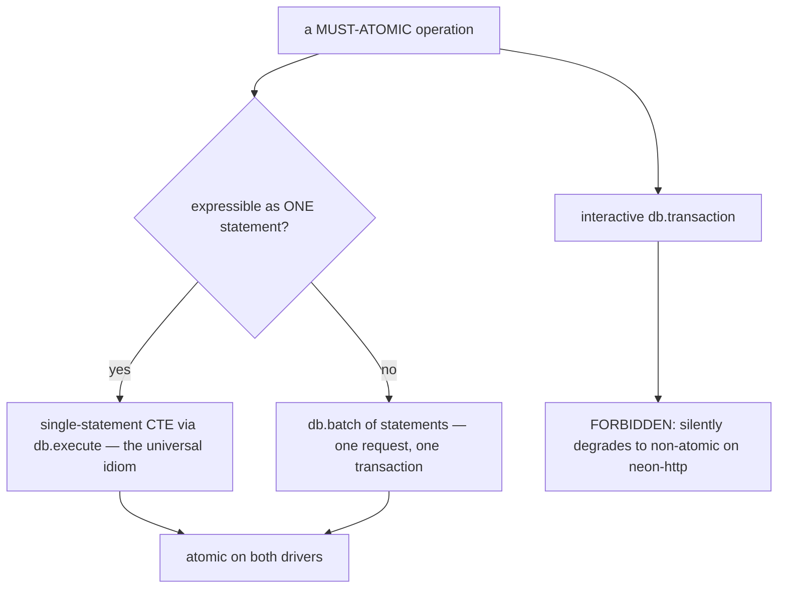
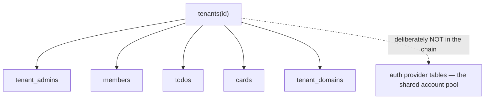

# Data & transactions 🗄️ \{#data--transactions}

:::note[You do not need this to start]
You can build with just the [Quickstart](../start/quickstart.md) — the seeded
demo and single-row writes work without reading this. This page is the
reference for the data layer and its atomicity doctrine. Come back when you are
writing a migration, adding an aggregate, or making a multi-row write that must
never be observable half-done.
:::

The same `db.transaction(async tx => …)` that is perfectly atomic on
`node-postgres` is **not atomic at all** on Neon's HTTP driver — same code, same
types, silently different guarantee. Nothing in the type system tells you. A multi-row write that must never be observable half-done is
"100% unacceptable in a transient state" (owner ruling, DECIDE C1) — so this page
is how that is *enforced*, plus the cross-cutting data conventions that were
settled deliberately, before the next aggregate copied whatever shape happened to
exist.

## Per-target guarantee matrix 📊 \{#per-target-guarantee-matrix}

Two drivers are selected by `DB_DRIVER` (`node-postgres` for self-host and dev,
`neon-http` on Vercel — where the env schema **refuses to boot** on any other
value). They do not offer the same transaction primitive:

| Idiom | `node-postgres` (self-host / dev) | `neon-http` (Vercel) |
|---|---|---|
| single-statement CTE, one `db.execute` | atomic — one statement is always its own transaction | **atomic** — one HTTP request is one implicit transaction |
| `db.batch([...])` | atomic — wrapped in one `BEGIN`/`COMMIT` | **atomic** — Neon runs the array in one HTTP request/transaction |
| interactive `db.transaction(async tx => …)` | atomic — real `BEGIN`/`COMMIT` on one pooled connection | **NOT atomic** — the HTTP driver is stateless; each `tx` query is a separate request, so a mid-sequence failure leaves earlier writes committed |



:::danger[Interactive transactions are forbidden for atomic work]
`db.transaction()` may be used **only** on self-host-only maintenance paths that
never run on Vercel — and such a path must say so in code. Anywhere else it is a
correctness bug that passes every local test.
:::

## The MUST-ATOMIC list ⚛️ \{#the-must-atomic-list}

Each operation that must never be observable half-done is implemented as **one
port method**, so the compiler — not review — prevents a caller from half-doing
it:

| Operation | Why | Idiom |
|---|---|---|
| `TenantRepository.createTenantWithOwner` | a tenant with no owner is unadministrable | single-statement CTE |
| `StaffRepository.revokeLastOwnerSafe` | two concurrent revokes must never both pass the owner count | single conditional `DELETE` |

The tenant + founding grant, in one round-trip
(`adapters/db/repositories.ts`):

```sql
WITH new_tenant AS (
  INSERT INTO tenants (id, slug, name, created_at)
  VALUES ($1, $2, $3, $4)
  RETURNING id
)
INSERT INTO tenant_admins (id, tenant_id, user_id, role)
SELECT $5, id, $6, 'owner' FROM new_tenant
```

The last-owner guard, where the count is taken **under a row lock** so concurrent
revokes serialize (`adapters/db/staff-repository.ts`):

```sql
WITH locked_owners AS (
  SELECT id FROM tenant_admins
  WHERE tenant_id = $1 AND role = 'owner'
  FOR UPDATE
)
DELETE FROM tenant_admins
WHERE tenant_id = $1 AND user_id = $2
  AND (role <> 'owner' OR (SELECT count(*) FROM locked_owners) > 1)
RETURNING id
```

The returned row count is the proof: `1` = revoked, `0` = refused as the last
owner (or no such grant). The count-based guard is the **authoritative**
enforcement; the use-case's `findGrant` read only shapes the error taxonomy.

:::info[The doc and the code cannot drift]
`config-regression/must-atomic.test.ts` parses the
`<!-- MUST-ATOMIC:begin -->` block out of `docs/architecture.md` and asserts every
entry names a **single** port method that actually exists in
`core/server/ports.ts`. Split a MUST-ATOMIC operation back into two calls and the
named method disappears — the probe fails, because the doc would otherwise promise
atomicity the port shape no longer enforces.
:::

Enforcement beyond the probe: an adapter test counts driver round-trips (exactly
one `execute`) for the CTE operations, and an integration test fires two
concurrent writers at the race-prone one and asserts the invariant holds.

## Data lifecycle ♻️ \{#data-lifecycle}

**Hard delete is the default** (normative now). A tenant-scoped delete removes the
row. "Soft-delete everything" is a lie the moment one query forgets the
`deleted_at IS NULL` filter — a leaked row then reads as live data, and that
filter lives in every query, not in the schema.

`deleted_at` is reserved for aggregates with a real product requirement for
undo/trash, added per feature, never blanket. Where used: **every** repository
query for that aggregate must filter it, recovery must be explicit, and a partial
unique index (`WHERE deleted_at IS NULL`) is mandatory wherever a soft-deleted row
must not block re-creating the same natural key. That is convention enforced by
review plus the aggregate's repo tests — not by type or lint — so the honest
posture is to keep the soft-deleting surface tiny. **No current aggregate uses
it.**

**Tenant offboarding is a schema invariant** (normative now). Every tenant-scoped
table FK-chains to `tenants(id)` with `ON DELETE CASCADE`, so offboarding is one
statement and the *database* guarantees no orphans:



`deleteTenant` therefore issues no child deletes at all. Global/shared tables are
outside the chain on purpose: one account spans many tenants, so it must never
cascade from a single tenant's deletion. The invariant is mechanically checked:
the offboarding-cascade integration test seeds every aggregate for a throwaway
tenant, deletes the tenant row, and asserts zero rows remain while a sibling
tenant is untouched (`repositories.integration.test.ts`).

**GDPR mechanics** are **normative when triggered** (trigger: the first real
end-user personal data in production, beyond the demo seed). Right to
access/portability is an `exportTenantData` use-case walking the tenant's
aggregates into one JSON envelope, exposed as a `--json` CLI command and a web
action; right to erasure is the tenant cascade plus account anonymisation, with
any owned-email snapshot tombstoned in place. **Until the trigger fires this is a
documented use-case shape, not shipped code.** The same trigger activates the
preview/staging data doctrine (previews branch from a scrubbed or seed-only
parent; non-production deployments sit behind access protection).

**Retention** is a sink setting, not code: the application stores no logs or
traces itself, so retention is Sentry's per-project window or the columnar tier's,
named there. **Backups** on Vercel/Neon are Neon instant restore
(branch-from-timestamp) — the Free tier's **6-hour** restore window is fine for
the demo and explicitly insufficient for production personal data; a longer window
is a paid-plan flip made when the GDPR trigger fires. Self-host owns its own
cadence. See [Backup & DR](../operations/backup-dr.md).

:::note[Out of scope: an audit trail]
There is no append-only audit log at the foundation level (trigger: a specific
compliance or contractual requirement). Wide events are **observability**, not
audit — sampled, short-retained, shaped for debugging. An audit trail is durable,
complete, tamper-evident and answers "who changed what, when" on demand; when a
real need appears it is a new aggregate with its own retention, not a telemetry
setting.
:::

## Data conventions 📐 \{#data-conventions}

Decided 2026-07-20 (DECIDE C2) — *before* the next aggregate copied the current
shape. Existing tables are grandfathered where noted: documented legacy, never a
template.

| Convention | Status | Rule |
|---|---|---|
| **Money** | normative now, **not yet exercised** | integer minor units plus a closed ISO-4217 currency union — `amountMinor` + `currency`, defined once in `core/domain` when the first money aggregate lands. Never floats, never `numeric`/`real`/`double` columns |
| **Timestamps** | normative now for **new** tables | `timestamp('…', { withTimezone: true })`; the domain and contract keep speaking ISO-8601 strings, with the mapping at the adapter's column |
| **IDs** | normative now for **new** tables | native `uuid('id')` primary keys, application-minted; an FK column always matches the type of the key it references |
| **List pagination** | normative now for **future** list endpoints | cursor-based: request `?cursor=<opaque>&limit=<n>` with a server-side cap; response `{ items, nextCursor }` where `nextCursor` is `null` on the last page. Never a raw offset |
| **Concurrency** | normative now | last-write-wins, **documented per aggregate**. The named upgrade is a `version` column with `WHERE version = $expected`, adopted per aggregate when its trigger fires |

Why integer minor units and not Postgres `numeric`: an amount crosses four
decimal-hostile layers — JSON, JS `number`, zod, TS arithmetic — and `numeric`
survives none of them (drivers surface it as a string, the first careless coercion
reintroduces binary floats, JSON has no decimal type), while integer minor units
are exact in every layer, sum and compare with plain integer arithmetic, and are
the payment provider's native vocabulary. Sub-cent precision scales the minor unit
(micro-units); formatting for humans is a view concern (`Intl.NumberFormat`), never
stored.

Why cursors and not offsets: offsets skew under concurrent writes (rows shift
between pages) and cost the database the full skipped prefix, while a keyed cursor
is stable and index-backed.

### The grandfather list, stated out loud 👴 \{#the-grandfather-list-stated-out-loud}

| Table | Legacy shape | Migrated? |
|---|---|---|
| `tenants`, `members`, `todos`, `cards` | text `id`, text ISO `created_at` | **No** — deliberately. Nothing ranges or sorts across zones on them; converting is a routine expand→contract package the day a query needs index-backed time semantics |
| `tenant_domains` | text `id` (carries no timestamp column at all) | **No** — same reasoning |
| generated Better Auth tables | naive `timestamp`, non-UUID ids | **No** — provider-owned |
| `backfill_checkpoints` (migration `0007`) | `uuid` PK + `timestamptz` | this is the **first table built to the new convention** — the worked example |

The grandfather list is **closed**: a migration adding a text PK or a naive/text
time column to a *new* table is rejected in review unless it FK-chains to a legacy
text key.

:::caution[Honest caveat — three of these conventions are prescriptions, not practice]
Money, cursor pagination and `version` columns have **no implementation in the
tree** — no aggregate carries money, the existing list endpoints (todos, cards)
return the full tenant-scoped array as **exempt** small bounded lists, and every
current aggregate is last-write-wins. That is deliberate: blanket version columns
are refused for the same reason blanket soft-delete is — a mechanism nobody
exercises is a lie waiting to be believed. What exists today is the *decision*, so
the first implementation has nothing to invent.
:::

## Invariant placement matrix 🧭 \{#invariant-placement-matrix}

Every data invariant is placed deliberately — at the database, at the database
*and* the app boundary, or app-only with a stated reason why the DB cannot express
it — and each placement carries its test. The default is **push it to the DB**: a
constraint the database enforces cannot be bypassed by a raw insert, a forgotten
code path, or a future adapter.

| Invariant | Enforced where | Mechanism and test |
|---|---|---|
| `tenant_admins.role` in `('owner','admin')` | **DB + app** | DB `CHECK` `tenant_admins_role_check` (migration `0006`); the adapter also zod-parses on read. Test: raw-SQL bad role is rejected |
| `tenant_domains.kind` in `('subdomain','custom')` | **DB** | `CHECK` `tenant_domains_kind_check`. Test: raw-SQL bad kind rejected |
| `cards.board` in `('personal','team')` | **DB + app** | `CHECK` `cards_board_check`; use-cases validate at their boundary. Test: raw-SQL bad board rejected |
| `cards.column` legal for its `board` | **DB + app** | compound `CHECK` `cards_column_check` over `(board, column)` pairs; each board validates its column at the use-case. Test: raw-SQL `personal`/`in-dev` rejected |
| `members.marketing_consents[].channel` in `MarketingChannel` | **app-only** (zod at the read boundary) | jsonb — a per-element closed set no column `CHECK` can express — so `memberSchema.parse` at the repository boundary **throws** rather than leaking an untyped channel into core. Test: raw-SQL garbage channel makes `findMember` throw |
| `cards` row shape (int position ≥ 0, board enum, string array `visited`) | **app-only** (zod at the read boundary) | `cardSchema.parse` on read throws on a corrupted row. Test: raw-SQL negative position makes `listByTenant` throw |
| a tenant always has ≥ 1 owner | **app**, one atomic conditional statement | a cross-row cardinality invariant Postgres cannot express as a column constraint → `revokeLastOwnerSafe` under a row lock. Test: two concurrent revokes, tenant never reaches zero owners |
| every tenant-scoped row cascades from `tenants(id)` | **DB** (FK `ON DELETE CASCADE`) | the offboarding-cascade integration test |

The general pattern: **closed sets go to the database**; **structural shapes and
per-element rules inside jsonb go to a boundary zod parse that throws loudly**; and
**cross-row cardinality goes into one atomic statement**. A new closed-set column
ships with its `CHECK` in the same migration — a plain, immediately-validated
`CHECK`, so existing rows must conform or the migration fails. Grandfather nothing
silently.

:::caution[Constraint-adding migrations need a restore point first]
A migration adding a `CHECK`, `NOT NULL`, unique or FK constraint validates every
existing row at `ALTER` time and **fails the deploy if any row violates** — that
*is* the guarantee, but on production it means the deploy can abort mid-migration.
Before shipping one to staging/production, take a Neon branch-from-timestamp
restore point, so a violating row that only surfaces against real data is a
one-command rollback rather than an incident. Previews (ephemeral branches) and
self-host (own backup cadence) need no extra step.
:::

## Migrations 🚚 \{#migrations}

Migrations run at build time against that environment's own database — previews
migrate their ephemeral branch (always safe), staging and production are
forward-only, and a destructive change ships as **two** deploys
(expand → contract), the same vocabulary the contract uses for breaking changes
([Errors & API versioning](errors-and-api-versioning.md)).

The sequence itself is mechanically gated (DECIDE F2): `pnpm run doc-lint` runs
`lintMigrations`, which fails the build on a duplicate, gapped or
non-`<NNNN>`-prefixed migration, or a `meta/_journal.json` that does not match the
`.sql` files on disk — and a config-regression probe plants a duplicate to prove
the gate still fires.
