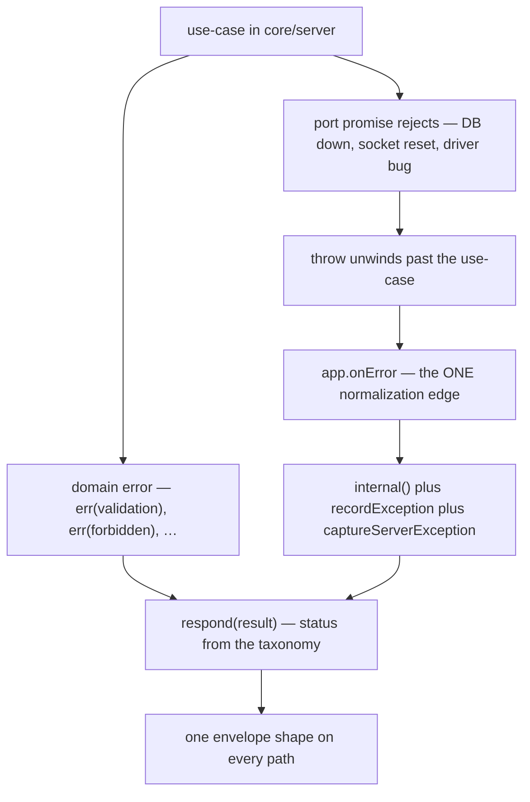
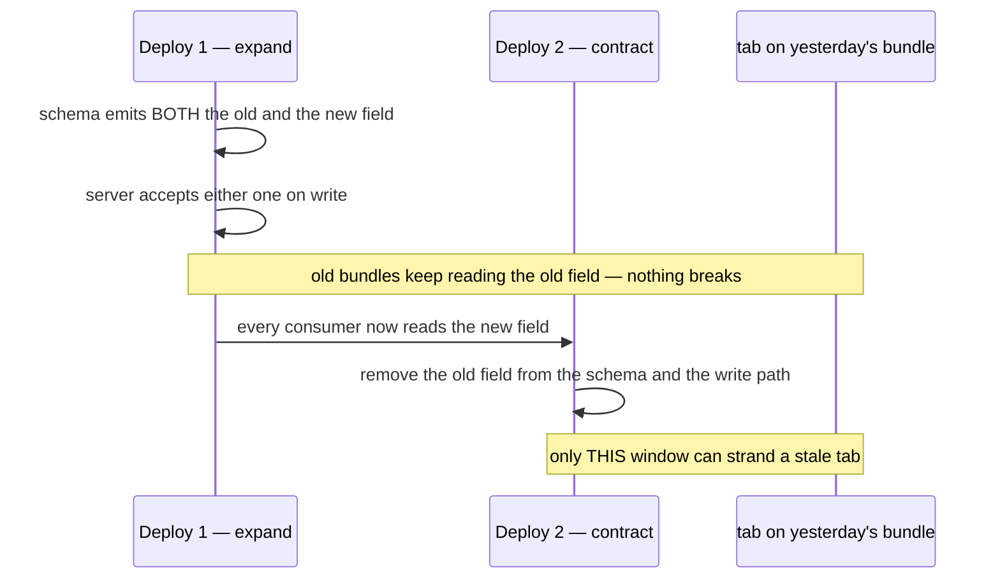

# Errors & API versioning 🚨 \{#errors--api-versioning}

:::note[You do not need this to start]
You can build with just the [Quickstart](../start/quickstart.md) — the error
taxonomy already works out of the box. This page is the reference for the error
model and the no-versioning contract. Come back when you are adding an error
kind, mapping a new failure to an HTTP status or CLI exit code, or wondering
why there is no `/v1`.
:::

This page exists because two decisions here look like omissions until you see the
reasoning. First: use-cases return `Result<T, AppError>` and deliberately **do
not** catch infrastructure failures — those are normalized once, at a single edge.
Second: there is **no `/v1`, no version header, no content negotiation**, because
server, web and CLI ship from one commit and the compiled contract *is* the
version. Both are decided contracts, and both carry named triggers for the day
they stop holding.

## The taxonomy 🗂️ \{#the-taxonomy}

`ErrorCode` is a closed union in `core/domain/errors.ts`, mapped exhaustively in
exactly two places — to HTTP statuses for the API and to process exit codes for the
CLI, both in `core/contract/http-status.ts`. Adding a code without deciding both
mappings does not compile, because both are `Record<ErrorCode, number>`.

| `ErrorCode` | HTTP | CLI exit | Meaning |
|---|---|---|---|
| `validation` | 400 | 2 | input failed a boundary parse, or a domain rule rejected it |
| `unauthorized` | 401 | 3 | no authenticated session |
| `forbidden` | 403 | 4 | authenticated, but the capability is not held |
| `not_found` | 404 | 5 | the addressed resource does not exist |
| `conflict` | 409 | 6 | a concurrency or uniqueness conflict |
| `tenant_not_found` | 404 | 7 | unknown tenant **or** no access to it (existence-hiding) |
| `unavailable` | 503 | 8 | a dependency is down — what `/api/health/ready` returns |
| `internal` | 500 | 10 | anything unmapped, produced only at the normalization edge |

Errors are constructed through named factories, never by hand:

```ts
export const forbidden = (message = 'Not allowed'): AppError => appError('forbidden', message);
export const validation = (message: string, details?: unknown): AppError =>
  appError('validation', message, details);
```

`AppError` carries `code`, `message` and an optional `details` — typically a zod
`flatten()` payload for a validation failure.

## `Result`, not exceptions 🎯 \{#result-not-exceptions}

`core/domain/result.ts` is deliberately tiny and dependency-free:

```ts
export type Result<T, E> = { ok: true; value: T } | { ok: false; error: E };

export const ok = <T>(value: T): { ok: true; value: T } => ({ ok: true, value });

export const err = <E>(error: E): { ok: false; error: E } => ({ ok: false, error });
```

The return annotations are load-bearing: without them TypeScript widens `ok: true`
to `boolean` and the union stops discriminating.

A use-case's signature therefore *tells* you it can fail, and its failure modes are
the closed taxonomy above. Dropping `Result` and throwing across a boundary is one
of the structural changes that takes a fork
[off the foundation](../decisions/0004-no-exceptions-enforcement.md).

## Domain error versus infrastructure failure ⚖️ \{#domain-error-versus-infrastructure-failure}

This is the split that matters:



The edge itself is five lines:

```ts
app.onError((error, c) => {
  const appError = internal();
  recordException(error);
  captureServerException(error, { appError, identity: c.get('identity') });
  return respond(err(appError));
});
```

Both observers — the OTel span and the Sentry sink — attach to that single error,
so there is exactly one capture path and never scattered `captureException` calls
([Observability](observability.md) has the full wiring, and what is not wired).
This is a decided contract (owner ruling 2026-07-20, closing audit rider CP-4/F8):
normalization stays at the single edge, and use-cases never grow per-call
`try`/`catch` for infrastructure failures.

## One envelope, everywhere ✉️ \{#one-envelope-everywhere}

```json
{ "ok": true, "data": { "todos": [] } }
```

```json
{ "ok": false, "error": { "code": "forbidden", "message": "todo:write is not permitted for member" } }
```

`core/contract/envelope.ts` defines it twice on purpose: `envelopeSchema(data)` for
a fully typed round-trip, and `looseEnvelopeSchema` (data left `unknown`) so a
client parses the envelope first and the route's payload second. Every response —
success, 404, 503 — goes through `respond()`, so a client never has to handle a
non-JSON body from `/api/*`.

## The client side of the taxonomy 💻 \{#the-client-side-of-the-taxonomy}

`core/client/http.ts` parses in three steps and produces a taxonomy error at each
failure:

| Failure | Result |
|---|---|
| `fetch` rejects | `internal` — "Network error calling …" |
| body is not JSON | `internal` — "Non-JSON response from … (HTTP …)" |
| envelope shape unknown | `internal` — "… does not match the contract envelope" |
| envelope says `ok: false` | the server's `AppError`, passed through unchanged |
| `data` fails the route schema | `internal` — "Response data from … does not match the contract" |

For TanStack Query the boundary converts value-or-throw exactly once:

```ts
export const unwrap = <T>(result: Result<T, AppError>): T => {
  if (!result.ok) throw new ApiError(result.error);
  return result.value;
};
```

`ApiError` carries the original `AppError`, so the UI **renders** the taxonomy
rather than re-mapping it ad hoc, and a root error boundary is mandatory.

The CLI funnels the same `Result` through one `emit`:

```ts
if (!result.ok) process.exitCode = EXIT_CODE_BY_ERROR_CODE[result.error.code];
```

With `--json` it prints exactly one envelope on stdout; without it, a human line on
stdout and `error(<code>): <message>` on stderr. One decision, three renderings —
which is what makes the CLI a real verification surface for an agent (see
[CLI walkthrough](../guides/cli-walkthrough.md)).

## Why there is no API version 🔢 \{#why-there-is-no-api-version}

Server, web and CLI ship **together from one commit**
([ADR-0003](../decisions/0003-vercel-environments.md)). The `core/contract` zod
schemas compile into all three, so client and server are never independently
versioned. `/v1`-style URL versioning solves skew between separately-released
client and server — a split this architecture does not have.

**No version namespace, no version header, no content negotiation.** The
contract's types are the version, checked at build for every consumer at once: a
breaking change that reaches production un-migrated is a red `pnpm run check`, not a
runtime surprise.

## Normative now: every change to `core/contract` 📜 \{#normative-now-every-change-to-corecontract}

- **Additive-first.** New request fields are optional with a server default; new
  response fields are pure additions. A field's name, type and meaning are
  **immutable once shipped** — the old bundle still reads it under the old
  contract.
- **Rename / remove / retype = breaking = expand → contract, two deploys.** The
  same discipline ADR-0003 mandates for destructive migrations, one vocabulary for
  both.
- **Widening an enum is breaking for readers.** A new `ErrorCode` or status value
  an old bundle's exhaustive `switch` cannot handle is an expand step: teach
  clients the value first, emit it second.
- **zod-parse at every boundary** is what makes a contract violation fail loud
  instead of corrupting state.

### Expand → contract, concretely 🪗 \{#expand--contract-concretely}

Illustrating the rule with a hypothetical rename of a response field; this is the
*procedure*, not a change the repo has made:



The window is deliberately narrow: only deploy 2 can strand anything, and the
stranding is loud, never silent.

## The one real skew: the stale tab ⏳ \{#the-one-real-skew-the-stale-tab}

CLI and server are always the same commit; only a long-lived SPA session drifts. A
tab left open overnight runs yesterday's bundle against today's API.

`core/client` zod-parses every response and returns an `internal` error saying the
payload does not match the contract, which the root error boundary renders together
with the request's trace id — the same failure the 2026-07-12 stale-`dist/web`
incident exercised.

:::info[Fail-loud-and-refresh is the accepted foundation UX]
An error card beats a wrong render or silent data loss. A "reload for the latest
version" hint is a **recommended affordance, not a required mechanism**, and no
push-based version check is prescribed — the Vercel target has no resident channel
to push over.
:::

Trace-id exposure is safe by design: the W3C trace id is a random correlation id
with no PII and no capability, actionable only to someone who already has backend
log access — so surfacing it turns a support ticket into a one-line log lookup at
zero disclosure cost.

## Normative when triggered 🔔 \{#normative-when-triggered}

| Trigger | Rule |
|---|---|
| the first **external consumer** not built from this commit (public API, third-party integrator, separately-released mobile app) | introduce explicit versioning — the compiled-contract argument no longer holds. Cheapest first: additive-only with a dated capability field; then a `/v1` URL prefix per major; then per-request `Accept-Version`. Internal `X-Tenant` clients do not count |
| the first **webhook we emit** to creators or integrators | version the **payload**, not the URL: embed a `schemaVersion` in the event body, keep old fields additively, let subscribers pin. Delivery and idempotency reuse the inbound-webhook pattern; this covers only the payload contract |

:::note[Out of scope]
Per-tenant or per-product API variants, GraphQL-style field-level deprecation
tooling, and consumer-driven contract testing against external partners. All three
arrive with the external consumer that triggers real versioning — building them
first would mean maintaining machinery for a consumer that does not exist.
:::

## Cache headers are part of the response contract 🧊 \{#cache-headers-are-part-of-the-response-contract}

`respond()` owns them, so the default cannot be forgotten:

| Surface | `Cache-Control` |
|---|---|
| authenticated, tenant-scoped JSON | `no-store` — always |
| **any** error envelope | `no-store`, regardless of the argument passed |
| public contract group, 2xx | `public, max-age=0, s-maxage=…, stale-while-revalidate=…` via the one `publicCacheControl` helper |
| hashed SPA assets | `public, max-age=31536000, immutable` |
| `index.html` | the platform's revalidate-always default |

`private, max-age=N` is wrong for tenant-scoped JSON: `private` only bars *shared*
caches, so the browser (or a tenant-oblivious intermediary) still stores a body
that one origin serves for many tenants — a cross-tenant leak the moment identity
resolves differently on the same connection. And there is deliberately **no
`ETag`/`Last-Modified`/304 on the JSON API**: HTTP revalidation would duplicate the
only client read cache (TanStack Query), so the two layers never cache the same
bytes and there is nothing to invalidate twice.

A config-regression probe asserts the `s-maxage` and `stale-while-revalidate`
tokens appear in that **one** helper and nowhere else, so no call site can
hand-write a cache string.

:::caution[What the smoke gate can and cannot see behind Vercel]
Vercel's CDN **consumes** `s-maxage`/`stale-while-revalidate` at the edge and
strips them from the client-visible header, so behind Vercel the observable
remainder is just `public, max-age=0`. `smoke:remote` therefore asserts that
remainder **plus** `x-vercel-cache: HIT`/`STALE` on a repeat request as proof the
edge actually cached, while direct-to-origin smoke (local, docker) asserts the
literal helper output.
:::
