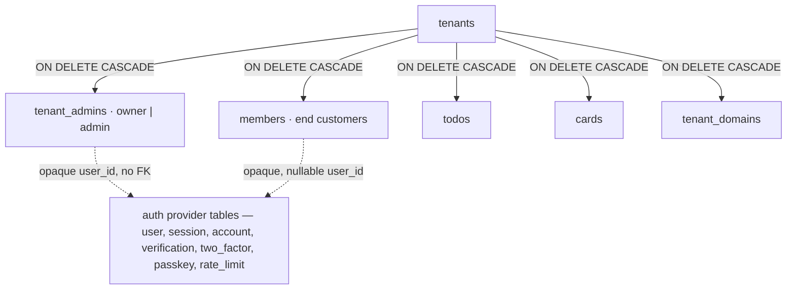

# Identity & multi-tenancy 🏢 \{#identity--multi-tenancy}

:::note[You do not need this to start]
You can build with just the [Quickstart](../start/quickstart.md) — the seeded
tenants already resolve on `*.localhost`. This page is the reference for the
identity split and tenant addressing. Come back when you are adding an auth
method, touching tenant resolution, or planning a real base domain. On a first
read, [§Who are you, versus who are you here](#who-are-you-versus-who-are-you-here)
and [§Tenant resolution order](#tenant-resolution-order) are enough.
:::

"Multi-tenant" is where most SaaS foundations quietly sell out: they let the
auth provider own the organization model, and two years later swapping the
provider is a data migration rather than an adapter change.
Here the split is deliberate and enforced — **the provider owns authentication
only; every relationship lives in foundation tables** — and the second half of
the page is the part nobody writes down: what tenant addressing *actually* does
in each environment, including the one place where it is impossible.

## Who are you, versus who are you here 🪪 \{#who-are-you-versus-who-are-you-here}

[ADR-0002](../decisions/0002-member-identity-and-idp.md) decides the split:

- **Global account = authentication only.** One account per email, holding
  credentials and nothing else, behind a narrow, OIDC-shaped `AuthPort`. Better
  Auth is the default adapter; its topology (embedded, separate container, SaaS)
  is a composition-root choice.
- **Tenant staff** — the `tenant_admins` aggregate: flat `owner | admin` grants.
  There is deliberately **no teams/organizations concept**; multiple admins are
  just multiple rows.
- **End customers ("members")** — a tenant-scoped aggregate of our own: profile,
  tags, GDPR marketing consents, an owned email snapshot, export.

No auth-provider organization/team feature is used for either population. The
reasons, from the ADR: provider org APIs let a user *list their organizations*
(which would leak one creator's other tenants to a shared customer), provider-
attached relationship data turns an IdP swap into a data migration, and tenant
creation must never depend on the auth provider.

`userId` is an **opaque string**. Foundation tables never FK provider tables.

## The tables and their cascade posture 🗄️ \{#the-tables-and-their-cascade-posture}



| Table | Owns | Key columns | Cascade |
|---|---|---|---|
| `tenants` | the tenant itself | `id` (text), `slug` (unique), `name`, `created_at` | root of the chain |
| `tenant_admins` | staff grants | `tenant_id` FK, `user_id` (opaque), `role` | `ON DELETE CASCADE` from `tenants`; unique on `(tenant_id, user_id)` |
| `members` | the customer relationship | `tenant_id` FK, nullable `user_id`, `email`, `tags`, `marketing_consents`, `external_customer_ids` | `ON DELETE CASCADE`; unique on `(tenant_id, user_id)` and `(tenant_id, email)` |
| `tenant_domains` | where the tenant is reachable | `tenant_id` FK, `domain` (globally unique), `kind` (`subdomain`/`custom`), `verified` | `ON DELETE CASCADE` |
| provider tables | credentials, sessions, 2FA secrets, passkeys | provider-generated ids | **deliberately outside the chain** — one account spans many tenants |

Two consequences worth naming:

- **Tenant offboarding is one statement.** `DELETE FROM tenants WHERE id = $1`
  removes every tenant-scoped row, with the database — not application code —
  guaranteeing no orphans. See [Data & transactions](data-and-transactions.md).
- **`members.user_id` is nullable on purpose.** `ensureMember` provisions a member
  row before any auth account exists (a payment webhook can create a customer),
  and the account is claimed on that user's first authenticated tenant resolution.

## The identity a use-case sees 👤 \{#the-identity-a-use-case-sees}

`resolveIdentity` produces exactly one shape, and it is the whole input to
authorization:

```ts
export interface Identity {
  userId: string;
  email: string;
  name: string;
  tenantId: string | null;
  tenantSlug: string | null;
  tenantName: string | null;
  staffRole: StaffRole | null;   // 'owner' | 'admin' | null
  memberId: string | null;
}
```

`staffRole` and `memberId` are independent: a person can be staff, a member, both,
or neither (the tenant-less **visitor**). The principal derivation and grant table
live in [Authorization](authorization.md).

## Tenant resolution order 🧭 \{#tenant-resolution-order}

One fixed order, implemented in `core/server/usecases/resolve-identity.ts`:

1. **Exact custom-domain match** in `tenant_domains` (verified rows only).
2. **The subdomain label of `APP_BASE_DOMAIN`**, treated as the tenant slug.
3. **The `X-Tenant` header** — the CLI and other non-browser clients.

A request on the bare base domain with no header yields a tenant-less identity,
which is a legitimate state (that is how the create-tenant onboarding works).
Membership is **always** verified: resolving a tenant does not grant access to it.

:::info[The wildcard payoff]
Because step 2 treats *any* subdomain label as a slug, a single wildcard domain
makes every tenant resolve automatically — **no per-tenant registration needed**.
`tenant_domains` exists for step 1, the custom-domain case.
:::

:::caution[Existence-hiding is deliberate, do not "fix" it]
A caller who names a tenant by **slug or `X-Tenant`** and has no access gets
`tenant_not_found` (HTTP 404, CLI exit 7) with the message
`No tenant "<slug>" or you do not have access to it` — byte-identical to the
response for a tenant that does not exist. A revoked admin therefore cannot
distinguish "removed" from "never existed". This is recorded as an accepted
verification residual in the
[deferred-work register](https://github.com/chomamateusz/agentproofarch/blob/main/docs/backlog.md)
precisely so nobody later "corrects" it to `forbidden`.

A caller who arrived by **custom domain** gets `forbidden` instead — the domain
already proved the tenant exists, so hiding it would be theatre.
:::

## Slugs are a value object 🔤 \{#slugs-are-a-value-object}

A tenant slug becomes a subdomain, so it is normalized first and validated second
(`core/domain/slug.ts`):

```ts
export const normalizeSlug = (raw: string): string =>
  raw
    .trim()
    .toLowerCase()
    .replace(/[^a-z0-9]+/g, '-')
    .replace(/^-+|-+$/g, '');

export const slugSchema = z.string().transform(normalizeSlug).pipe(canonicalSlugSchema);
```

`canonicalSlugSchema` enforces 3–63 characters, the pattern
`^[a-z0-9]+(?:-[a-z0-9]+)*$`, and rejects a reserved list (`www`, `api`, `app`,
`admin`, `auth`, `login`, `internal`, `health`, `billing`, `settings`, … 25
entries in total). The edge therefore accepts human input while only one canonical
form is ever persisted or resolved.

:::caution[Known residual]
`normalizeSlug` **drops** diacritics rather than transliterating them, so a fully
diacritic Polish tenant name yields a near-empty slug. Recorded as an accepted
residual with a named trigger (the first real complaint, or the next edit to
`slug.ts`).
:::

## Tenant addressing per environment 🌐 \{#tenant-addressing-per-environment}

This is the honest table. "Base domain" means something different in each
environment, and the code handles each case explicitly rather than pretending.

| Environment | Tenant addressing | Session scope | Caveat |
|---|---|---|---|
| **Local dev** (`*.localhost`) | full subdomain tenancy — `acme.localhost:47100` | **per-subdomain** | browsers reject `Domain=.localhost` cookies, so a session does not span siblings; `crossSubDomainCookies` is off for `localhost` |
| **Vercel shared apex** (`<project>.vercel.app`) | **impossible** — see below | single deployment URL | `tenantUrl()` returns `null`; web runs single-tenant, multi-tenancy is CLI-only via `X-Tenant` |
| **Real base domain + wildcard** (`*.example.com`) | full subdomain tenancy, one wildcard resolves all tenants | spans sibling subdomains (`crossSubDomainCookies` on) | wildcard cert needs an ACME **DNS-01** challenge → NS delegation to Vercel (or `_acme-challenge` delegation) |
| **Custom domain** (`shop.acme.com`) | step 1 of resolution, once `verified` | **its own cookie world** — sign-in per domain, deliberate isolation | Vercel attaches each host through the US-020 Domains API adapter (built, `VERCEL_TOKEN` pending); self-host needs nothing |
| **Docker self-host** | subdomain *and* custom domain both work | as configured | Caddy `on_demand_tls` asks an internal endpoint before minting a cert |

### The `*.vercel.app` impossibility 🚫 \{#the-vercelapp-impossibility}

This is a platform restriction, confirmed live — not a configuration mistake:

> `<team>` does not have access to `*.<project>.vercel.app` domains

Vercel refuses to add a subdomain under a project's own `*.vercel.app`, so
`acme.<project>.vercel.app` **cannot be attached at all**. The code says so
out loud rather than failing at runtime (`apps/web/src/lib/tenant.ts`):

```ts
export const tenantUrl = (slug: string): string | null => {
  const { protocol, hostname, port } = window.location;
  const parts = hostname.split('.');
  const base = parts.length > 1 ? parts.slice(1).join('.') : hostname;
  if (base === 'vercel.app') return null;
  return `${protocol}//${slug}.${base}${port ? `:${port}` : ''}`;
};
```

A `null` there means the tenant switcher cannot navigate by host, so the deployed
web app is single-tenant per deployment URL while the API and CLI stay fully
multi-tenant through `X-Tenant`. That is also how `pnpm run smoke:remote` drives a
deployed environment.

### The custom-domain path 🛣️ \{#the-custom-domain-path}

The way out is a real owned base domain, or per-tenant custom domains:

| Concern | Vercel target | Docker self-host |
|---|---|---|
| Wildcard cert | ACME DNS-01 → **NS delegation** to Vercel, or narrow `_acme-challenge` delegation | Caddy on-demand TLS, no wildcard needed |
| Records-only DNS (no NS delegation) | individual non-wildcard per-tenant hosts (HTTP-01 via CNAME), each attached to the project by the US-020 adapter | n/a |
| Domain provisioning port | `vercel` adapter (**built**, US-020): `provision`/`remove` attach and detach the host over the Domains API, `check` reads the domain and its config back — [live run still pending](../operations/self-host-and-domains.md#us-020-built-and-never-run-live) | `caddy` adapter (**built**): `provision`/`remove` are no-ops, `check` is a DNS lookup against `SELF_HOST_TARGET_CNAME`/`_IP` |
| Plan limits | see [Wildcard vs per-host attach](../operations/self-host-and-domains.md#wildcard-base-domain-vs-per-host-attach) for the Vercel Hobby caps | none |

The tenant-facing surface is built (US-019): `/app/settings/domains` and the
matching CLI verbs list, attach, verify and detach domains through
`TenantDomainRepository` + `DomainPort`. Authorization splits the two halves —
`domain:read` is staff-readable (`owner` + `admin`), `domain:write` is
**owner-only**, so an admin runs the tenant without changing where it is
reachable. Operational detail lives in
[Self-host & domains](../operations/self-host-and-domains.md).

:::caution[The demo's own setup is in progress]
Two shapes are recorded in `architecture.md`, and neither is live yet:

- a free **eu.org** domain, `agentproofarch.eu.org`, delegated to Vercel's
  nameservers — chosen precisely because it is not the company's production DNS
  zone, so the delegation carries no risk. That NS delegation is what buys the
  DNS-01 wildcard cert, and it waits on eu.org approval.
- the **company-DNS bridge**, the owner's chosen shape: the `coderoad.pl` zone
  cannot be NS-delegated, so one plain wildcard CNAME record
  `*.agentproofarch.coderoad.pl → cname.vercel-dns.com` resolves every tenant
  host. Records-only means no DNS-01 wildcard cert, so each per-tenant host is
  attached to the Vercel project for its own HTTP-01 cert — the `vercel`
  provisioner's job, which waits on `VERCEL_TOKEN`.

**Until one of the two lands**, the deployed web stays single-tenant on
`*.vercel.app` and multi-tenancy is CLI-only. Related residual: the
cross-subdomain session on a real base domain is documented but **not locally
testable** — it gets verified live on the first custom base-domain deployment.
:::

## Sessions 🍪 \{#sessions}

- One session spans `APP_BASE_DOMAIN` subdomains when the base domain is real
  (`crossSubDomainCookies` on); off for `localhost`, because browsers reject
  `Domain=.localhost`.
- Each **custom domain is its own cookie world** — members sign in per custom
  domain. This hard-isolates sessions between tenants, and it is a feature, not a
  gap.
- `trustedOrigins` is resolved **dynamically** against verified `tenant_domains`
  at composition time, alongside the app base URL and the deployment's own
  Vercel URLs (so previews and staging authenticate on their generated hosts
  without per-branch env vars).
- Cookie hardening: `HttpOnly` + `SameSite=Lax` by default, `Secure` driven by
  `SECURE_COOKIES` (required outside local dev — the env schema **refuses to
  boot** without it once deployed).

## Auth methods, as built 🔐 \{#auth-methods-as-built}

Every method is exposed **exclusively** through `AuthClientPort` — no client ever
names a provider route or SDK, and dependency-cruiser proves it
(`auth-provider-sdk-only-in-adapters-auth`).

| Method | Port surface | Status |
|---|---|---|
| Email + password | `signUp`, `signIn`, `signOut` | built |
| Magic link | `requestMagicLink` | built (US-026) — sent through `EmailPort` |
| Social (Google) | `signInSocial` | built (FR-26) — wired **only** when `GOOGLE_CLIENT_ID` *and* `GOOGLE_CLIENT_SECRET` are both present; the login page reads a public `/api/config` flag to decide whether to show the button |
| TOTP 2FA | `enableTwoFactor`, `verifyTotp`, `disableTwoFactor` | built (US-028a) |
| Passkeys | `registerPasskey`, `listPasskeys`, `removePasskey`, `signInPasskey` | built (US-028a) — `rpID = APP_BASE_DOMAIN`, so one credential works across every tenant subdomain |

`listPasskeys` is the one **read**-tagged method on the port, because the passkey
roster lives on the provider surface rather than in the contract API.

:::note[The zod 4 migration was a prerequisite, not a whim]
`@better-auth/passkey` pinned a `better-call` whose optional `zod@^4` peer
conflicted with the tree's `zod@^3`. The migration to `zod@^4` was done **first**,
gates green, before the plugin went in — recorded in the
[changelog](../changelog.md) for 2026-07-21.
:::

## Tenant, not instance 🏘️ \{#tenant-not-instance}

One instance (one database) hosts many tenants over one shared account pool: a
creator's unrelated brands should be **tenants**, not new deployments. New
instances are for hard isolation only, and cross-instance/cross-app SSO is an
evolution path (promote to a central OIDC IdP, swap the `AuthPort` adapter), never
a foundation feature. Self-hosted instances have independent account pools by
construction.

## Deletion is two operations 🗑️ \{#deletion-is-two-operations}

| Operation | Who | Removes | Leaves |
|---|---|---|---|
| Creator removes a member | tenant staff (`member:remove`) | the member row and its tenant-scoped data | the global account, and every other tenant's relationship with that person |
| User erases their global account | the platform (GDPR request) | credentials at the provider | each tenant's own controller duty for its data; the owned email snapshot is tombstoned in place, not left as PII |

The full GDPR mechanics (`exportTenantData`, erasure across Neon preview
branches) are **normative when triggered** — the trigger is the first real
end-user personal data in production, beyond the demo seed. Today they are a
documented use-case shape, not shipped code. See
[Data & transactions](data-and-transactions.md).

## Where next ➡️ \{#where-next}

- Deeper: [ADR-0002](../decisions/0002-member-identity-and-idp.md) — the member-identity decision and its rejected alternatives.
- Sideways: [Authorization](authorization.md) — what the resolved identity may do.
- To work: [Custom domains & TLS](../operations/self-host-and-domains.md) — attaching a real tenant domain.
