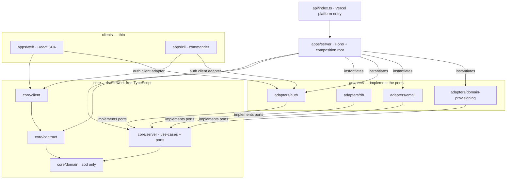

# Layers 🧱 \{#layers}

A layered architecture that lives in a README is a suggestion, and suggestions do
not survive contact with an agent generating a hundred files. Here the layers are a **graph with machine-checked edges**: every
allowed dependency direction below is spelled out twice — once in
`eslint.config.js` (`eslint-plugin-boundaries`, denying everything by default)
and once in `.dependency-cruiser.cjs` — so a wrong import is a red
`npm run check`, not architectural drift somebody notices six months later.

## The stack 🥞 \{#the-stack}

The layer definition, from
[`docs/architecture.md` §Layers](https://github.com/chomamateusz/agentproofarch/blob/main/docs/architecture.md):

| Layer | Contents | May depend on |
|---|---|---|
| `core/domain` | entities, `Result`, error taxonomy, zod schemas | zod only |
| `core/contract` | API routes, I/O schemas, error envelope | `core/domain` |
| `core/server` | use-cases + ports (interfaces) | `core/domain` |
| `core/client` | typed HTTP client + query/mutation definitions | `core/contract` |
| `adapters/*` | implementations of ports (db, auth, email, domain provisioning) | `core` |
| `apps/server` | HTTP wiring + composition root | everything server-side |
| `apps/web` | SPA, no SSR | `core/client` (+ the auth client adapter) |
| `apps/cli` | commands | `core/client` |



Two edges in that diagram are the ones people get wrong:

- **Adapters point *inward*.** `adapters/db` imports the `TodoRepository`
  interface from `core/server`; `core/server` never imports `adapters/db`. The
  arrow from the composition root (`apps/server/src/composition.ts`) to an
  adapter is *instantiation*, not a dependency of the domain.
- **`core/contract` is the only bridge.** `apps/web` and `apps/cli` type
  themselves against the same zod schemas the server implements. Neither client
  can reach `core/server` or `adapters/db` at all.

## The dependency-rule table 📋 \{#the-dependency-rule-table}

The ESLint element map (`boundaries/elements`) classifies every file, and
`boundaries/element-types` runs with `default: 'disallow'` — so each row below is
an *explicit permission*, and anything not listed fails with the message
`${file.type} is not allowed to import ${dependency.type} (see PRD §3.2)`.

| Element (pattern) | Allowed to import |
|---|---|
| `core-domain` (`core/domain/**`) | `core-domain` |
| `core-contract` (`core/contract/**`) | `core-domain`, `core-contract` |
| `core-server` (`core/server/**`) | `core-domain`, `core-server` |
| `core-client` (`core/client/**`) | `core-domain`, `core-contract`, `core-client` |
| `adapter-db` / `adapter-auth` / `adapter-domains` | `core-domain`, `core-server`, `core-client`, and each other |
| `app-server` (`apps/server/**`) | `core-domain`, `core-contract`, `core-server`, the three adapter types, `app-server` |
| `platform-entry` (`api/**`) | `app-server` — nothing else |
| `app-web` (`apps/web/**`) | `core-domain`, `core-contract`, `core-client`, `adapter-auth`, `app-web` |
| `app-cli` (`apps/cli/**`) | `core-domain`, `core-contract`, `core-client`, `adapter-auth`, `app-cli` |

Inside `apps/web` the same mechanism continues at a finer grain: `web-main`,
`web-api`, `web-routes`, `web-features`, `web-ui`, `web-lib`, `web-theme` are
separate element types, and the `web-features` pattern captures the feature name
so a feature may only import itself. That is how "features are islands" is
enforced — see [Client state](client-state.md).

`boundaries/external` adds the package-level half of the same rule:
`core-domain`, `core-contract` and `core-server` may not import `react`,
`react-dom`, `hono`, `drizzle-orm`, `better-auth`, `pg` or `commander`;
`core-client` gets the same list minus `commander`.

## What dependency-cruiser enforces 🚢 \{#what-dependency-cruiser-enforces}

`npm run depcruise` runs over `core adapters apps scripts api` as a **second,
independent** pass. It sees the same graph from a different angle — including
`node_modules` targets, which is how the vendor-containment bans work — and it
covers directories the ESLint element map does not classify.

| depcruise rule | Forbids |
|---|---|
| `no-circular` | any circular dependency, anywhere |
| `core-domain-depends-on-nothing` | `core/domain` → `core/contract`, `core/server`, `core/client`, `adapters`, `apps` |
| `core-domain-only-zod` | `core/domain` → any package except `zod` (an allow-list; `*.test.ts` exempt for vitest) |
| `core-server-pure` | `core/server` → `core/contract`, `core/client`, `adapters`, `apps` |
| `core-contract-only-domain` | `core/contract` → `core/server`, `core/client`, `adapters`, `apps` |
| `core-client-never-server-side` | `core/client` → `core/server`, `adapters`, `apps` |
| `no-frameworks-in-core` | `core/**` → `hono`, `react`, `react-dom`, `drizzle-orm`, `better-auth`, `pg`, `commander` |
| `adapters-never-import-apps` | `adapters/**` → `apps/**` |
| `web-never-server-side` | `apps/web` → `core/server`, `adapters/db`, `adapters/domain-provisioning`, `apps/server`, `apps/cli` |
| `cli-is-a-pure-api-client` | `apps/cli` → `core/server`, `adapters/db`, `adapters/domain-provisioning`, `apps/server`, `apps/web` |
| `vercel-and-neon-only-in-adapters` | `@vercel/*` / `@neondatabase/*` outside `adapters/**` and `api/index.ts` |
| `auth-provider-sdk-only-in-adapters-auth` | `better-auth` / `@better-auth/*` outside `adapters/auth` |
| `smtp-sdk-only-in-adapters-email` | `nodemailer` / `@aws-sdk/*` outside `adapters/email` |
| `island-core-is-framework-agnostic` | `features/*/core/**` → `react`, `react-dom`, `@tanstack/react-query`, `@xstate/store/react`, `@xstate/react` |
| `island-core-is-portable` | `features/<x>/core/**` → any `apps/web/src` path outside its own core dir |
| `web-ui-is-presentational`, `web-lib-no-react`, `web-lib-has-no-app-internal-deps`, `web-routes-stay-thin`, `web-features-consume-bound-actions`, `web-features-are-islands`, `web-api-is-the-only-client-construction-site` | the intra-`apps/web` graph (see [Client state](client-state.md)) |

:::info[Two enforcers, deliberately not identical]
The ESLint element map declares element types for `adapters/db`,
`adapters/auth` and `adapters/domain-provisioning` — but **not** for
`adapters/email`. That directory is held by dependency-cruiser
(`adapters-never-import-apps`, `smtp-sdk-only-in-adapters-email`) instead. The
imperfect overlap between the two tools is the reason both run: each one catches
things the other misses, and both sit in the same red gate.
:::

## What knip enforces ✂️ \{#what-knip-enforces}

`npm run knip` is the dead-weight gate — the reason a generated file that nothing
imports cannot quietly accumulate. Its rule severities are a deliberate split
(`knip.jsonc`):

| knip rule | Severity | Meaning |
|---|---|---|
| `files` | **error** | a source file nothing reaches is dead — delete it |
| `dependencies` / `unlisted` | **error** | an unused `package.json` entry, or an import with no declared dependency |
| `unresolved` | **error** | an import that resolves to nothing |
| `binaries` | **error** | a script calling a binary no dependency provides |
| `duplicates` | **error** | the same export exposed twice |
| `exports` / `types` / `nsExports` / `nsTypes` / `enumMembers` | **warn** | reported, does **not** fail `check` |

:::caution[Honest caveat: unused *exports* are warnings, not errors]
`exports` and `types` are `warn` on purpose. The foundation ships API surface
ahead of its consumers (theme tokens, island-core interfaces, contract schemas,
client query helpers) while the PRD build-out wires them in, so export-level
pruning would thrash against work in flight. `knip.jsonc` records the intent to
tighten them to `error` once that scope is built — until then, "no unused export"
is *not* a guarantee this repo makes.
:::

Entries knip cannot infer are declared explicitly: `api/index.ts` (the Vercel
serverless entry, referenced from `vercel.json`),
`eslint-plugin-agentproofarch/index.js`, `adapters/auth/auth.generate.ts`
(codegen config, never imported), `scripts/*`, the Playwright specs under `e2e/`
and `visual/`, and every `*.test.ts`.

## Where the rules run 🏃 \{#where-the-rules-run}

```bash
npm run check
# = typecheck && typecheck:islands && lint && lock-lint
#   && depcruise && knip && doc-lint && test:coverage
```

Static-green is not done: `npm run smoke` is the second, runtime gate — it boots
the real server against a real database and drives health, sign-in and todos
through the CLI, asserting taxonomy exit codes. See
[CI gates](../operations/ci-gates.md).

## Dependency-free is not the goal 🎯 \{#dependency-free-is-not-the-goal}

Replaceability is. Core bans **infrastructure** — anything with a plausible
second implementation or a platform difference (frameworks, servers, drivers) —
and that lives behind a port. **Vocabulary** libraries are ordinary imports on
the per-layer allow-list: `zod` in `core/domain`, `@tanstack/query-core` in
`core/client`, and the `@opentelemetry/api` no-op facade for business
annotations.

:::danger[Port theater]
Never wrap a vocabulary library in a port. An interface with exactly one
implementation forever re-states the library's API without buying anything: a
`QueryPort` over TanStack Query would have to re-type `status`/`fetchStatus`,
invalidation and optimistic-update semantics — and still would not survive an
engine swap. Extend the allow-list deliberately instead; the "when do I add a
port" rule lives in [Ports & adapters](ports-and-adapters.md).
:::

For genuinely complex clients (realtime push sync, event sourcing, heavy
concurrency) a richer vocabulary such as Effect is a legitimate choice in the
same slot, but it is a **foundation** decision, never an incremental one: it
replaces zod + query-core wholesale and needs its own guardrails. The default
stays zod + `@tanstack/query-core`.

## The one sanctioned platform name 🏷️ \{#the-one-sanctioned-platform-name}

`@vercel/*` and `@neondatabase/*` are lint-contained to `adapters/`. This is
dependency containment, not a ban on the vendor's *name*: the bare
platform-detection string `VERCEL` is legitimately read in
`apps/server/src/env.ts` and `core/server/config.ts` to select behaviour, and
that is fine. What must never
leak into core is coupling to a vendor **SDK**.

Beyond imports, three strictness rules apply everywhere: **no `any`**, **no `as`**
(except `as const`), and **zod-parse at every boundary** — the last one is what
turns a contract violation into a loud failure instead of corrupted state (see
[Errors & API versioning](errors-and-api-versioning.md)).

## Divergence cannot be silent 📢 \{#divergence-cannot-be-silent}

`npm run doc-lint` closes the loop from the other direction: removing an enforcer
from config without updating the docs that promise it fails the gate
([ADR-0004](../decisions/0004-no-exceptions-enforcement.md)). Weakening a
*structural* rule — letting a client import `core/server`, a framework into
`core/**`, dissolving the `core/contract` seam, throwing across a boundary
instead of returning `Result`, re-enabling `any`/`as` — is a legitimate choice
that forfeits the name and the guarantee, and it has to be written down.
