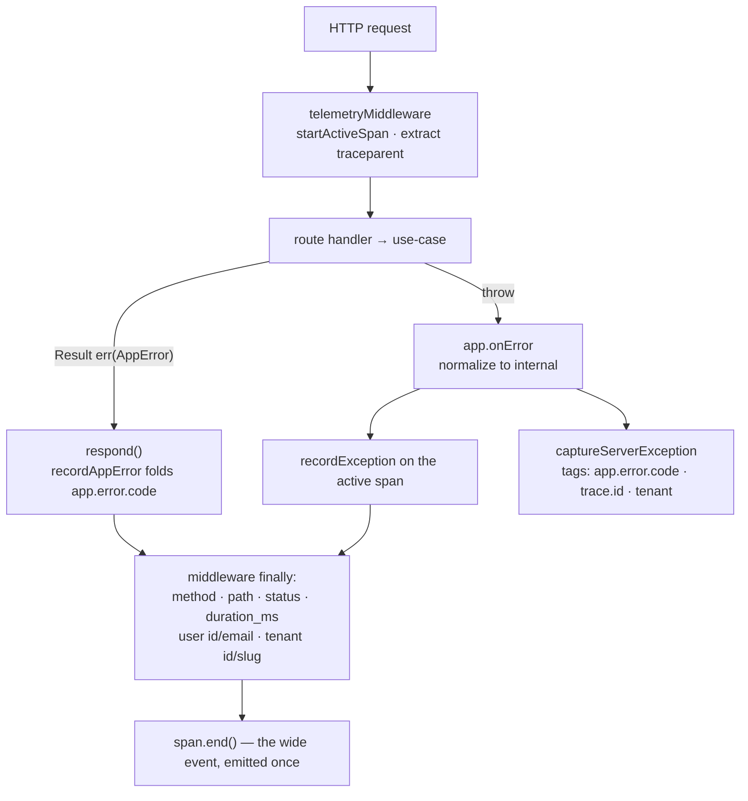

# Observability

A production request fails at 03:00 and you have one question: *what was true
during it?* Step logs answer a different question — what the code was doing —
and they answer it in fragments that share nothing but a timestamp. So this
foundation does not step-log. It builds **one context-rich event per request**,
annotates the active span as facts accrue (user, tenant, taxonomy code, status,
duration) and emits it exactly once. `no-console` in `apps/server` is what stops
the old habit from creeping back: the wide event *is* the log.

The second half of this page is the part most observability docs leave out —
which of that is **wired today** and which is a written-down policy nobody has
implemented yet.

:::info Sources
Normative: [`docs/observability.md`](https://github.com/chomamateusz/agentproofarch/blob/main/docs/observability.md).
Code: `demo/apps/server/src/telemetry.ts` (the middleware), `demo/apps/server/src/observability.ts` (the sinks), `demo/apps/web/src/observability.ts`, `demo/core/client/http.ts` (`traceparent` injection), `demo/api/index.ts` (the serverless flush).
:::

## The standard, and why it is not a port

Instrumentation is **OpenTelemetry**, through `@opentelemetry/api` — a
dependency-free facade that no-ops until an SDK is registered in the composition
root. That property is what makes it *vocabulary* under the dependency policy
rather than an adapter concern: core may annotate through it, the exporter is
wired at the edge, and the vendor is a config choice.

There is deliberately **no `ObservabilityPort`**. A port earns its existence when
a second implementation or a platform difference actually exists
([Ports & adapters](ports-and-adapters.md)); the OTel facade is already the
industry's port, and an error sink is configuration, not a replaceable domain
dependency. Wrapping either would be port theater.

## Three chokepoints, zero feature changes

Errors and traces already funnel through single points, so instrumentation
attaches *there* — never inside a use-case, never in a feature.

| Point | File | What it does |
|---|---|---|
| Hono middleware + `app.onError` | `apps/server/src/telemetry.ts`, `app.ts` | `telemetryMiddleware` opens one span per request, continues an incoming `traceparent`, annotates in `finally` and ends the span; the single `app.onError` seam normalizes a throw to `internal`, records it on the active span and captures it to Sentry |
| Web root error boundary + `QueryCache.onError` | `apps/web/src/main.tsx`, `query-client.ts` | both call `reportError`, so a render crash and a failed query take the same reporting path; the root fallback renders the active trace id for the user to paste into a support message |
| `core/client` `request()` | `core/client/http.ts` | injects a W3C `traceparent` header when a trace is active — the FE→BE unification point, and a *provider callback* rather than an in-core SDK dependency, which is why it can be tested with a stub |

The attributes that land on every request span are fixed in `telemetry.ts`:
`http.request.method`, `url.path`, `http.response.status_code`,
`http.server.duration_ms`, and — once the tenant middleware has resolved an
identity — `app.user.id`, `app.user.email`, `app.tenant.id`, `app.tenant.slug`.
A *returned* `AppError` never throws, so `recordAppError` folds its
`app.error.code` in from the response path; that is how a `403` shows up in the
event without inventing an exception.

**High cardinality is the point.** User, tenant, session, trace and business ids
are the fields worth having; the policy is never to strip them to save volume,
and to control cost with tail sampling instead — always keep errors and slow
requests (>p99), sample the happy path at 1–5%. Read that as written intent: see
the matrix below for what actually runs.

## What is wired today

| Piece | Status | Detail |
|---|---|---|
| Request span + wide event | **wired** | `telemetryMiddleware`, registered third in `app.ts` ([Request lifecycle](request-lifecycle.md)) |
| Server error sink (Sentry Node) | **wired, env-gated** | `SENTRY_DSN` absent = clean no-op: no client, no network, so dev and CI are untouched |
| Server tracing export (OTLP) | **optional, env-gated** | a Node tracer provider + OTLP exporter register only when `OTEL_EXPORTER_OTLP_ENDPOINT` or `..._TRACES_ENDPOINT` is set; otherwise `@opentelemetry/api` stays a no-op facade |
| Browser error reporting (Sentry React) | **wired, env-gated** | `VITE_SENTRY_DSN`; browser tracing integration on, `tracesSampleRate: 1` |
| Browser OTel provider | **not wired** | no browser tracer provider is registered, so `core/client`'s `traceparent` reads the no-op facade and sends **no header** — the SPA does not originate a trace id today |
| Trace id in the CLI | **not wired** | the CLI's `createApiClient` is built without a `traceparent` provider |
| DB-hop instrumentation | **not built** | there is no span around a repository call; the wide event stops at the server boundary |
| Tail sampling | **documented, not implemented** | the keep-errors / sample-happy-path policy above exists as doctrine only |

The server sink is deliberately a **pure sink**: `skipOpenTelemetrySetup` (tracing
stays OTel's — no double provider) and `defaultIntegrations: false` (no global
`uncaughtException`/`unhandledRejection` hooks, no auto-instrumentation). So an
error reaches Sentry through exactly one seam, `captureServerException` at
`app.onError`, and the event carries the trace id read off the active span — a
Sentry issue and its wide event sit on the same trace. Returned domain errors
(validation, not-found, unauthorized) are expected outcomes and are **not**
captured; only the unhandled `internal` path is
([Errors & API versioning](errors-and-api-versioning.md)).

`Sentry` and OTLP are independent: either, both or neither may be on. Which
vendor sits behind OTLP — Sentry's trace ingest, Axiom, a self-hosted ClickHouse
on the Docker target — is exporter config in the composition root, never a code
change.

:::note The serverless flush
On Vercel an invocation freezes the moment the response is returned, so a batched
span or a queued Sentry event would simply be lost. `startServerObservability()`
returns **one force-flush hook** that drains both pipelines, and `api/index.ts`
calls it in a `finally` around every request. On Docker the long-lived process
flushes normally — same seam, different lifetime.
:::

## Where you add instrumentation

- **Business context on the current request** → annotate the active span through
  the `@opentelemetry/api` facade from the use-case. That is allowlisted
  vocabulary; a use-case never imports an SDK, exporter or vendor package.
- **A new error path** → nowhere. Throwing reaches `app.onError`, returning an
  `AppError` reaches `respond()`; both are already instrumented, and adding a
  second `captureException` is the specific thing review rejects.
- **A new sink or exporter** → the composition-root module for that app
  (`apps/server/src/observability.ts` or `apps/web/src/observability.ts`) and
  nothing else.
- **Step logs** → never. Emission belongs to the middleware, exactly once.

## Enforcement

| Tier | What holds the line |
|---|---|
| **TYPE** | `captureServerException` is the only exported capture, and its `AppError` + `Identity` parameters come from `core/domain` — a caller cannot invent an untyped capture |
| **LINT** | `boundaries` keeps `core/**` and the clients off `apps/server`; `no-console` is an error across `apps/server` (scoped off only for the composition root's startup/fatal path, `entry.*.ts` and `env.ts`) and bans `console.log` in `apps/web`, so step-logging around the seam does not compile past `check` |
| **TEST** | `apps/server/src/observability.test.ts` drives `app.onError` with a fake DSN and an injected sink and asserts **exactly one** capture carrying the app-error, trace and tenant tags — and that everything no-ops when no DSN configured a client |
| **REVIEW+AI** | a second `Sentry.captureException` anywhere but the seam, or a `@sentry/node` import outside the sink module, is rejected in review |

:::caution Honest caveats
- **Sentry containment is convention plus review, not a dependency-cruiser rule.** `@vercel/*`, `@neondatabase/*`, `better-auth` and the SMTP SDKs each have a machine-checked fence; `@sentry/node` and `@sentry/react` do not ([Ports & adapters](ports-and-adapters.md)). Nothing but review stops a second import today.
- **The SPA does not originate a trace id.** With no browser OTel provider registered, `traceparent` is never sent, so a browser error and its server-side wide event are not joined on one trace. Choosing the browser provider and sampler is an open decision, not shipped work.
- **The tail-sampling policy is documented intent.** Nothing samples anything today; with no exporter configured, nothing is exported either.
- **No DB-hop instrumentation.** A slow query shows up only as request duration.
- **`tracesSampleRate: 1` in the browser** is the launch default and directly contradicts the 1–5% happy-path sampling policy above — it is cheap while no DSN is configured, and it is one of the numbers the open wiring decision has to settle.
:::
