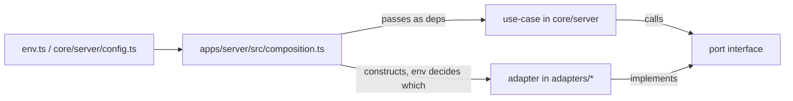
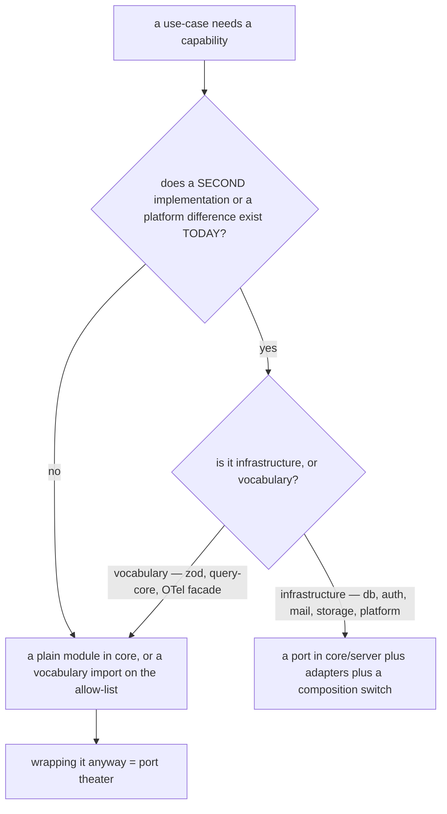

# Ports & adapters 🔌 \{#ports--adapters}

:::note[You do not need this to start]
You can build with just the [Quickstart](../start/quickstart.md) — the dev
defaults already select working adapters for every port. This page is the
reference for the built port set and the rule for adding one. Come back when a
use-case needs a new external capability, or you are swapping an adapter. On a
first read, [§How a port works here](#how-a-port-works-here) and
[§When to add a port](#when-to-add-a-port) are enough.
:::

Two questions, answered precisely: **what is actually behind a port in this
repo today**, and **when are you allowed to add one**. The second
question matters more than it looks — a port with exactly one implementation
forever is not architecture, it is a second copy of a library's API. So the rule
is blunt: *add a port only when a second implementation or a platform difference
actually exists*, and everything below is either a port that clears that bar or an
honest note that it does not exist yet.

## How a port works here ⚙️ \{#how-a-port-works-here}

A port is a plain TypeScript `interface` in `core/server` (or, for the one client
port, in `core/client`). No decorators, no DI container, no registry.



Three conventions hold across all of them:

- **Ports return plain `Promise`.** The use-case wraps the outcome in
  `Result<T, AppError>`; a rejected port promise is an infrastructure failure,
  normalized once at `app.onError` (see
  [Errors & API versioning](errors-and-api-versioning.md)).
- **`tenantId` comes first** on every tenant-scoped repository method, so the type
  system will not let a query span tenants.
- **Domain flows call ports through use-cases.** Three edge exceptions are
  deliberate: readiness pings `HealthPort` and the auth middleware resolves the
  session directly at the HTTP boundary (no domain decision is being made),
  the internal Caddy `ask` route reads `tenant_domains` directly, and the
  Better Auth adapter sends through `EmailPort` (an adapter composing a port
  the composition root handed it).

## The built port set 🧰 \{#the-built-port-set}

Distilled from `demo/core/server/ports.ts` (plus the one client port in
`core/client/auth-port.ts`). Every entry below exists in the tree today.

### Repository ports 🗄️ \{#repository-ports}

| Port | Methods | Adapter |
|---|---|---|
| `TodoRepository` | `listByTenant`, `create` | `adapters/db/repositories.ts` |
| `CardRepository` | `listByTenant(tenantId, board)`, `create`, `updatePositions(tenantId, board, updates)` | `adapters/db/cards-repository.ts` |
| `MemberRepository` | `listByTenant`, `findByEmail`, `findByTenantAndId`, `create`, `update`, `deleteByTenantAndId` | `adapters/db/members-repository.ts` |
| `StaffRepository` | `listByTenant`, `findGrant`, `grant`, **`revokeLastOwnerSafe`** | `adapters/db/staff-repository.ts` |
| `TenantRepository` | `findById`, `findBySlug`, **`createTenantWithOwner`**, `deleteTenant` | `adapters/db/repositories.ts` |
| `TenantAccessReader` | `listTenantsForStaff`, `findStaffGrant`, `findMember` | `adapters/db/repositories.ts` |
| `TenantDomainRepository` | resolution reads (`findByDomain` verified-only, `listVerifiedDomains`) + the US-019 CRUD (`listByTenant`, `findAnyByDomain`, `findByTenantAndDomain`, `add`, `setVerified`, `removeByTenantAndDomain`) | `adapters/db/repositories.ts` |
| `UserDirectory` | `findByEmail` → `DirectoryUser` | `adapters/db/staff-repository.ts` |

The two **bold** methods are the MUST-ATOMIC operations: each is one port method
precisely so the compiler prevents a caller from half-doing it. Their SQL and their
probe are in [Data & transactions](data-and-transactions.md).

`UserDirectory` is worth a note because it is easy to confuse with `AuthPort`:
`AuthPort` maps *session → identity*, while `UserDirectory` is an unauthenticated
email → account **directory read**, needed because FR-8 grants admin access to an
account that must already exist (there are no invitations yet, so `grantAdmin`
returns `not_found` for an unknown email).

### Capability ports 🔑 \{#capability-ports}

| Port | Shape | Adapters | Selected by |
|---|---|---|---|
| `AuthPort` (server) | `getAuthenticatedUser(requestHeaders) → AuthenticatedUser` or `null` | `adapters/auth/create-auth.ts` (Better Auth) | — |
| `AuthClientPort` (client) | `signUp`, `signIn`, `signOut`, `requestMagicLink`, `signInSocial`, `enableTwoFactor`, `verifyTotp`, `disableTwoFactor`, `registerPasskey`, `listPasskeys`, `removePasskey`, `signInPasskey` | `adapters/auth/client-adapter.ts` (Better Auth client + magic-link, two-factor and passkey plugins) | — |
| `EmailPort` | `sendMail({ to, subject, text, html?, link? })` | `adapters/email/smtp.ts` (nodemailer), `adapters/email/ses.ts` (SESv2 HTTP API) | `EMAIL_TRANSPORT` |
| `DomainPort` | `provision(domain)`, `check(domain) → DomainCheck`, `remove(domain)` | `adapters/domain-provisioning/vercel.ts`, `.../caddy.ts`, `.../noop.ts` | `DOMAIN_PROVISIONER` |
| `HealthPort` | `pingDatabase() → boolean` | `adapters/db/repositories.ts` | — |
| `BackfillPort` | `loadCheckpoint`, `saveCheckpoint`, plus the registered data operations (today `normalizeMemberEmails(cursor, limit)`) | `adapters/db/backfill-repository.ts` | — |
| `IdGenerator`, `Clock` | `nextId()`, `nowIso()` | constructed inline in the composition root (`randomUUID`, `new Date().toISOString()`) | — |

`HealthPort` exists because liveness and readiness are different questions:
readiness pings the database, and **liveness never calls this port at all** (see
[Health & attestation](../operations/health-and-attestation.md)).

`IdGenerator` and `Clock` are the two injected primitives that keep use-cases pure
and deterministic in tests — the cheapest ports in the repo and the ones that pay
back the most.

:::caution[The normative §Ports list in `docs/architecture.md` is narrower than the code]
`docs/architecture.md` §Ports enumerates `TodoRepository`, `CardRepository`,
`TenantDomainRepository`, `TenantRepository` and `TenantAccessReader` among the
repository ports. The code additionally declares `MemberRepository`,
`StaffRepository`, `UserDirectory` and `BackfillPort`. That section says it is
"generated from `demo/core/server/ports.ts` … keep it in sync with the code" — so
`ports.ts` is the source of truth, and the list above is read from it. Treat the
gap as documentation lag, not as an undeclared port.
:::

### `AuthClientPort` details worth knowing 🔐 \{#authclientport-details-worth-knowing}

- Every method is the **exclusive** surface for its flow: no client names a
  provider route or SDK. That is grep-proof and depcruise-proof
  (`auth-provider-sdk-only-in-adapters-auth`).
- `listPasskeys` is the **one read-tagged method**, because the passkey roster lives
  on the provider surface rather than in the contract API.
- Passkeys are scoped by `rpID = APP_BASE_DOMAIN`, so one credential works across
  every tenant subdomain (server plugin table: migration `0008_passkey`).
- Google social sign-in is wired **only** when `GOOGLE_CLIENT_ID` *and*
  `GOOGLE_CLIENT_SECRET` are both present — present-both-or-dormant gating, with
  the login page reading a public `/api/config` flag to decide whether to render
  the button.

### `EmailPort` details worth knowing 📧 \{#emailport-details-worth-knowing}

`link` is the optional primary-action URL a transactional mail carries; a transport
embeds it in the body and otherwise ignores the field. That keeps the magic link
**one consumer** of the seam rather than the port's shape
([ADR-0007](../decisions/0007-email-port-and-magic-link-transport.md)).

| Transport | What it is | Fails fast when |
|---|---|---|
| `smtp` (default) | any RFC SMTP relay via nodemailer — **Amazon SES SMTP credentials work unchanged** | `SMTP_HOST` is unset |
| `ses` | Amazon SES **direct** over the SESv2 HTTP API, standard `AWS_*` credentials | any of `AWS_REGION`, `AWS_ACCESS_KEY_ID`, `AWS_SECRET_ACCESS_KEY` is missing |

:::info[There is deliberately no dev transport]
Dev, e2e and CI run the **real** `smtp` adapter pointed at a local **Mailpit**
(`docker-compose.dev.yml`, SMTP on port 47925) that captures real sends instead of
delivering. The magic-link smoke and e2e phases read the message back over
Mailpit's HTTP API to recover the link and follow it — so there is **no in-app
retrieval route** that would have to be kept off production. `EMAIL_FROM` is the
single verified sender; per-tenant branded senders are a when-triggered extension.
:::

### `DomainPort` per target 🌐 \{#domainport-per-target}

| Provisioner | Target | `provision` / `remove` | `check` |
|---|---|---|---|
| `vercel` | the Vercel target | attach / detach the host on the Vercel project over the Domains API | the project's domain + config endpoints report `verified` and not `misconfigured` |
| `caddy` | Docker self-host | no-ops — Caddy issues certificates on demand | DNS lookup that the domain resolves to `SELF_HOST_TARGET_CNAME` or `SELF_HOST_TARGET_IP` |
| `noop` (default) | dev | no-ops | always accepts |

The `vercel` adapter (US-020) exists because a wildcard cert on Vercel needs an
ACME DNS-01 challenge, hence NS delegation. Where the base domain is a company
zone that cannot be delegated, a plain wildcard CNAME resolves every tenant host
but certs are **per host over HTTP-01**, so each host must be attached to the
project individually — which is exactly what `provision` does. Attach is
convergent: an already-attached host (`409`) is a success, so the use-case may
retry. The token travels only in the `Authorization` header, never into a log or
an error detail, and every API response is zod-parsed at the boundary.

:::caution[`vercel` is proven against a stubbed `fetch` only]
The adapter has **never run against the live Domains API**. That caveat has one
canonical home so it can be deleted in one place the day it stops being true:
[US-020: built, and never run live](../operations/self-host-and-domains.md#us-020-built-and-never-run-live).
:::

The US-019 use-cases sit on top: `addDomain` provisions then writes an unverified
row, `checkDomain` runs `check` and persists the resulting `verified` flag, and
`removeDomain` detaches then releases. On self-host, TLS needs zero per-tenant
config: Caddy's `on_demand_tls { ask … }` calls an **internal-only** domain-check
endpoint before minting a certificate — served by a *separate* Hono app on
`INTERNAL_PORT`, never published outside the container network. Operational detail:
[Self-host & domains](../operations/self-host-and-domains.md).

## The composition root 🌳 \{#the-composition-root}

`apps/server/src/composition.ts` is the only place env decides which adapters run.
Platform names may appear here and in adapters, never in core.

```ts
export const selectDomainPort = (env: Env): DomainPort => {
  if (env.DOMAIN_PROVISIONER === 'vercel') {
    if (!env.VERCEL_TOKEN || !env.VERCEL_PROJECT_ID) {
      throw new Error('DOMAIN_PROVISIONER=vercel requires VERCEL_TOKEN and VERCEL_PROJECT_ID');
    }
    return createVercelDomainPort({
      token: env.VERCEL_TOKEN,
      projectId: env.VERCEL_PROJECT_ID,
      ...(env.VERCEL_TEAM_ID === undefined ? {} : { teamId: env.VERCEL_TEAM_ID }),
    });
  }
  if (env.DOMAIN_PROVISIONER === 'caddy') {
    return createCaddyDomainPort({
      targetCname: env.SELF_HOST_TARGET_CNAME,
      targetIp: env.SELF_HOST_TARGET_IP,
    });
  }
  return createNoopDomainPort();
};
```

`vercel` is **never inferred** from running on Vercel — the platform env carries no
API token, so selecting the provisioner is explicit and an incomplete credential
block refuses to boot rather than silently stopping domain attachment.

Selection is **fail-fast**, not silently degrading — the same shape applies to
email: choosing `ses` without its AWS block throws at composition time:

```ts
if (env.EMAIL_TRANSPORT === 'ses') {
  if (!env.AWS_REGION || !env.AWS_ACCESS_KEY_ID || !env.AWS_SECRET_ACCESS_KEY) {
    throw new Error('EMAIL_TRANSPORT=ses requires AWS_REGION, AWS_ACCESS_KEY_ID and AWS_SECRET_ACCESS_KEY');
  }
  /* … */
}
```

### The env switches 🎛️ \{#the-env-switches}

Every key is defined once, in `core/server/config.ts` (DECIDE F4), so the runtime
server and the migrate/seed entry points cannot drift on a default.

| Variable | Values | Default | Selects |
|---|---|---|---|
| `DB_DRIVER` | `node-postgres`, `neon-http` | `neon-http` when `VERCEL` is set, else `node-postgres` | the Postgres driver in `adapters/db/client.ts`; **forced** to `neon-http` under `VERCEL` by an env refinement |
| `DOMAIN_PROVISIONER` | `vercel`, `caddy`, `noop` | `noop` | the `DomainPort` adapter |
| `VERCEL_TOKEN`, `VERCEL_PROJECT_ID`, `VERCEL_TEAM_ID` | credentials (`TEAM_ID` only for a team-owned project) | unset | required by `DOMAIN_PROVISIONER=vercel`; an incomplete block refuses to boot |
| `EMAIL_TRANSPORT` | `smtp`, `ses` | `smtp` | the `EmailPort` adapter |
| `INTERNAL_PORT` | a port number | unset | whether the self-host internal control-plane app starts at all |
| `INTERNAL_BACKFILL_SECRET` | ≥ 24 chars | unset | whether the Vercel backfill route mounts at all |

The last two share a design idea worth copying: **an unset secret means the surface
does not exist**, so a deploy that forgot to configure it cannot expose an
unauthenticated endpoint.

### Two sanctioned exceptions to "adapters only in the composition root" ⚠️ \{#two-sanctioned-exceptions-to-adapters-only-in-the-composition-root}

1. the **auth client adapter**, constructed in `apps/web/src/api.ts` for the web and
   in the CLI's context — clients need an auth client, and they have no server
   composition root;
2. `adapters/db/migrate.ts`, an operational entry that reads
   `DB_DRIVER`/`DATABASE_URL`/`VERCEL` itself, as a sanctioned composition point
   outside the server root.

## Vendor containment 📦 \{#vendor-containment}

Every vendor SDK is fenced to the one directory that owns it — and the fences are
dependency-cruiser rules, not conventions:

| Vendor | Allowed only in | Rule |
|---|---|---|
| `@vercel/*`, `@neondatabase/*` | `adapters/**`, plus the platform entry `api/index.ts` | `vercel-and-neon-only-in-adapters` |
| `better-auth`, `@better-auth/*` | `adapters/auth` | `auth-provider-sdk-only-in-adapters-auth` |
| `nodemailer`, `@aws-sdk/*` | `adapters/email` | `smtp-sdk-only-in-adapters-email` |
| `@sentry/node`, `@sentry/react` | the server's and web's composition-root sink modules | contained by convention and review, **not** by a rule — an error sink is config, not a port (a `SentryPort` would be port theater); see [Observability](observability.md) |

## Deferred and not built ⏭️ \{#deferred-and-not-built}

Stated plainly, because an aspirational port is worse than no port:

| Port | Status | Trigger |
|---|---|---|
| `StoragePort` | **not built** — shape, adapters and rules are fixed in the docs | the first feature that persists a caller-supplied binary (avatar, product asset, a GDPR-export file outliving one request). In-request bytes streamed straight to a response do **not** trigger it |
| `JobsPort` | **not built** — the platform difference is proven, the need is not | the first real deferred job. Executor would differ per target: a drain endpoint plus a QStash schedule on Vercel, a resident pg-boss worker on self-host |

`StoragePort`'s shape is already decided, so the first implementation has
nothing to invent:

- three methods — `put(tenantId, path, body, opts)`,
  `getSignedUrl(tenantId, path, opts)`, `remove(tenantId, path)`;
- **tenant scoping is the port's job**: the caller passes a logical `path`, the
  adapter composes `tenants/<tenantId>/<path>` and rejects any path that
  escapes the prefix, so the key space is closed by construction;
- **reads go through short-lived signed URLs** — objects are private, and the
  client never receives a bucket credential or a permanent public URL.

## When to add a port ➕ \{#when-to-add-a-port}



:::danger[Port theater]
An interface with exactly one implementation forever re-states a library's API
without buying replaceability. The named example: a `QueryPort` over TanStack Query
would have to re-type `status`/`fetchStatus`, invalidation and optimistic-update
semantics — and still would not survive an engine swap. Two more that were
deliberately *not* built: an `IStore` interface over the island-store library (the
island core's own API is the facade), and a Sentry port (an error sink is config).
:::

The corollary is the cheerful one: because the ports are few and small, swapping a
platform really is a composition-root edit. Both deploy targets run from the same
commit with a different `DB_DRIVER` and `DOMAIN_PROVISIONER` — see
[Environments](../operations/environments.md) and
[Self-host & domains](../operations/self-host-and-domains.md).
