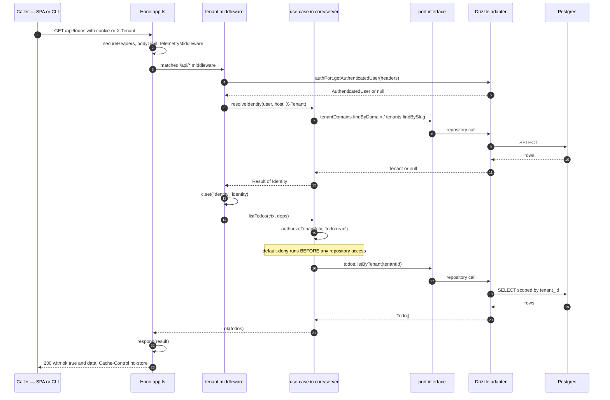
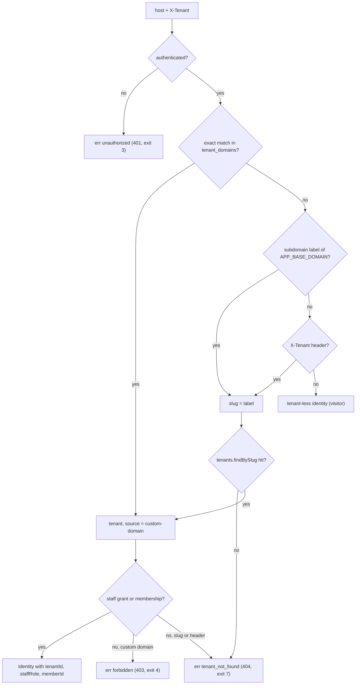

# Request lifecycle

This page exists because every security property in this architecture is really
a claim about **order**: authentication before tenant resolution, tenant
resolution before authorization, authorization before the first repository call,
and exactly one place where anything becomes an HTTP response. If you cannot
point at the line where each of those happens, the properties are hypotheses.
So here is the order, as `demo/apps/server/src/app.ts` actually registers it.

## The happy path



## Registration order in `app.ts`

Hono matches in registration order, so this list *is* the lifecycle. Everything
above the `/api/*` tenant middleware answers **without** an identity.

| # | Registered | Scope | What it does |
|---|---|---|---|
| 1 | `secureHeaders(...)` | `*` | CSP (`script-src 'self'`), `nosniff`, `Referrer-Policy`, `frame-ancestors 'none'` |
| 2 | `bodyLimit(...)` | `/api/*` | 100 KB cap; over-limit returns a `validation` **envelope**, never a non-JSON body |
| 3 | `telemetryMiddleware` | `*` | one wide span per request; continues an incoming `traceparent` |
| 4 | `app.onError` | — | the single normalization edge (see below) |
| 5 | `/api/health/live`, `/api/health/ready`, `/api/health` | exact | liveness never touches the DB; all three carry the build attestation |
| 6 | Better Auth handler | its own prefix | `GET`/`POST` delegated to `deps.auth.handler` |
| 7 | `/api/config` | exact | unauthenticated flags read by the pre-auth login page (`googleEnabled`) |
| 8 | `/api/internal/backfills/:name` | exact, **conditional** | mounted only when `INTERNAL_BACKFILL_SECRET` is set; gated by an `x-internal-secret` header |
| 9 | `registerPublicRoutes(app, deps)` | `/api/public/*` | open `GET` CORS + the two public tenant routes |
| 10 | `GET`/`POST` `/api/tenants` | exact | tenancy self-service — authenticated, deliberately *above* tenant resolution |
| 11 | **tenant middleware** | `/api/*` | authenticate → `resolveIdentity` → `c.set('identity', ...)` |
| 12 | `/api/me`, todos, cards, members, staff, domains | `/api/*` | tenant-scoped routes; every handler parses input with a contract schema |
| 13 | `app.all('/api/*', ...)` | `/api/*` | totalizer: taxonomy `not_found` envelope for an unmatched path or wrong method |

:::note Why three surfaces sit above identity resolution
They are three different reasons, all deliberate:

- **Health** must answer when the database is unreachable — that is the whole
  point of a readiness probe.
- **The public group** (`/api/public/*`) is unauthenticated by design. Because it
  is registered before the middleware, a public handler *structurally cannot*
  reach a tenant-scoped, identity-bearing use-case — and a config-regression
  probe (`config-regression/public-surface.test.ts`) asserts exactly that.
- **`/api/tenants`** is self-scoped: listing and creating *your own* tenants must
  work on any host, including a tenant domain the caller has no access to (where
  the middleware below would deny). It builds a tenant-less identity from the
  session and calls `listMyTenants` / `createTenant` directly.
:::

Step 13 matters more than it looks. Without a totalizer, an unknown `/api/*` path
returns Hono's bare `text/plain` 404, which `core/client` can only degrade into a
generic `internal` "Non-JSON response". Routing it through `respond()` keeps the
taxonomy honest — and the Better Auth prefix is explicitly carved out so a real
auth route is never masked by our envelope.

## Identity resolution

`resolveIdentity` (`core/server/usecases/resolve-identity.ts`) is a pure
use-case: it takes the authenticated user, the request's host and `X-Tenant`
header, and returns `Result<Identity, AppError>`.



The resulting `Identity` is the only thing a use-case sees:

```ts
export interface Identity {
  userId: string;
  email: string;
  name: string;
  tenantId: string | null;
  tenantSlug: string | null;
  tenantName: string | null;
  staffRole: StaffRole | null;
  memberId: string | null;
}
```

Two details in that flowchart are load-bearing:

- **Nested subdomains are not tenant slugs.** `subdomainOf` returns `null` when
  the label itself contains a dot, so `a.b.localhost` never resolves a tenant.
- **The denial shape depends on how the tenant was addressed.** A caller who
  reached a tenant by *custom domain* and has no access gets `forbidden` (the
  domain already proved the tenant exists); a caller who used a *slug or header*
  gets `tenant_not_found` with the message
  `No tenant "<slug>" or you do not have access to it`. That is deliberate
  existence-hiding — see [Identity & multi-tenancy](identity-and-multi-tenancy.md).

## Authorize, then touch data

Every tenant-scoped use-case runs the capability predicate as its **first
statement**. `authorizeTenant` both denies and hands back the resolved non-null
`tenantId`, so an allowed caller narrows to its tenant without a second guard:

```ts
export const listTodos = async (ctx: Ctx, deps: TodoDeps): Promise<Result<Todo[], AppError>> => {
  const scope = authorizeTenant(ctx, 'todo:read');
  if (!scope.ok) return scope;
  return ok(await deps.todos.listByTenant(scope.value));
};
```

The route above it stays thin — parse, call, respond — and holds no business
logic at all:

```ts
app.get(API_PATHS.todos, async (c) => {
  const result = await listTodos({ identity: c.get('identity') }, deps);
  return respond(result.ok ? ok({ todos: result.value }) : result);
});
```

Full model, including the grant table and the tests that pin every cell:
[Authorization](authorization.md).

## The response seam

`respond()` in `apps/server/src/respond.ts` is the *only* place an envelope
becomes a `Response` — the authenticated app and the public group both go through
it:

```ts
export const respond = <T>(result: Result<T, AppError>, cacheControl = 'no-store'): Response => {
  const envelope = toEnvelope(result);
  if (!envelope.ok) recordAppError(envelope.error);
  const status = envelope.ok ? 200 : HTTP_STATUS_BY_ERROR_CODE[envelope.error.code];
  return new Response(JSON.stringify(envelope), {
    status,
    headers: {
      'content-type': 'application/json',
      'cache-control': envelope.ok ? cacheControl : 'no-store',
    },
  });
};
```

Three properties fall out of that one function:

1. **The envelope is uniform.** `{ ok: true, data }` or `{ ok: false, error }`,
   always JSON, on every path including 404 and 503.
2. **Status comes from the taxonomy**, never hand-written per route
   (`HTTP_STATUS_BY_ERROR_CODE` in `core/contract/http-status.ts`).
3. **`no-store` is the default and errors are pinned to it** regardless of the
   `cacheControl` argument — so a transient public failure can never be cached at
   the edge. A public 2xx opts into caching by passing `publicCacheControl(...)`,
   the one helper allowed to emit `s-maxage` / `stale-while-revalidate`.

## The one normalization edge

Use-cases return `Result<T, AppError>` for **domain** errors and deliberately do
**not** catch infrastructure rejections. A thrown port promise unwinds to
`app.onError`, which is the single place it becomes `internal`:

```ts
app.onError((error, c) => {
  const appError = internal();
  recordException(error);
  captureServerException(error, { appError, identity: c.get('identity') });
  return respond(err(appError));
});
```

Both observers — the OTel span and the Sentry sink — attach to that one error, so
there is exactly one capture path and never scattered `captureException` calls.
This split is a decided contract (owner ruling 2026-07-20): normalization stays
at the single edge, and use-cases never grow per-call `try`/`catch` for
infrastructure failures. Details in
[Errors & API versioning](errors-and-api-versioning.md).

## The same lifecycle from the CLI

Nothing above is browser-specific, which is the point of the agent-first
principle. The CLI builds the same `core/client` `ApiClient`, sends `X-Tenant`
instead of relying on a host, and funnels every result through one `emit`
that maps the taxonomy to an exit code:

```ts
if (!result.ok) process.exitCode = EXIT_CODE_BY_ERROR_CODE[result.error.code];
```

So `forbidden` is HTTP 403 in a browser and exit code 4 in a shell — the same
decision, two renderings. The walkthrough lives in
[CLI walkthrough](../guides/cli-walkthrough.md).

## What is not in this lifecycle

- **No resident process on the Vercel target.** No queue workers, schedulers or
  websockets — the invocation *is* the lifetime. Deferred work is a
  `JobsPort` + executor design that is **documented, not built** (the port joins
  the tree when the first real deferred job lands).
- **No `ETag`/`Last-Modified`/304 on the JSON API.** HTTP revalidation would
  duplicate the only client read cache (TanStack Query), so the two layers never
  cache the same bytes.
- **No per-route authorization middleware.** Authorization is a use-case-layer
  call, not an HTTP-layer decorator, because the CLI and any future client must
  hit the same check.
