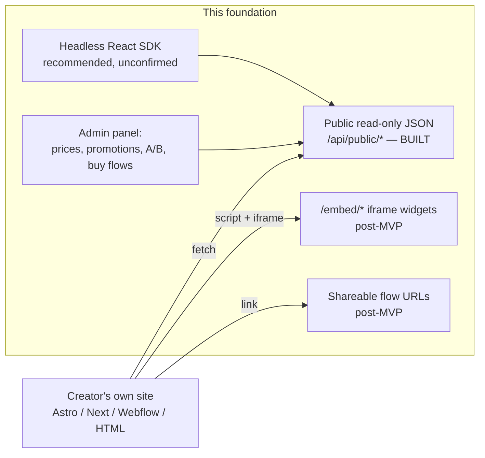

# ADR-0001 — Public surface: headless API and embeds instead of hosted pages

**2026-07-11 · accepted (owner-approved).** Supersedes the earlier in-discussion proposal of SSR'd public pages in Hono. → [full ADR on GitHub](https://github.com/chomamateusz/agentproofarch/blob/main/docs/decisions/0001-public-surface-embeds-over-pages.md)

## Summary

Products on this foundation render **no public marketing or landing pages**. The public surface is a headless JSON API plus — post-MVP — iframe embed widgets and shareable flow URLs. SEO is the creator's own site's job; what the platform owns is the commerce layer.

## The WHY

The question that started this was technical: how do you render public, SEO-relevant creator pages under the foundation's "static SPA, no SSR, no Next.js" rule? During review the product owner **redefined the problem** instead of answering it.

Creators already have excellent tools for building sites — Astro, Next, Webflow, plain HTML. A platform-hosted page/template system would compete with those tools on their home turf and lock creators into our blanks. What creators cannot build themselves is the commerce layer: prices, promotions, A/B variants, buy flows. That is what belongs to the platform, configured in the admin panel and consumable from any external site.

Stated that way, the SSR question dissolves — there are no pages to render.

## Decided

1. **No public marketing/landing pages.** A hosted-pages/template system is at most a distant nice-to-have.
2. **Public read-only contract routes** (headless JSON): unauthenticated GET, open CORS, cacheable with tenant-content versioning. This is the base layer every other consumer builds on, and in PoC/MVP the only consumer interface. Its built shape is [ADR-0006](./0006-public-read-only-surface.md).
3. **Shareable flow URLs** for complete flows (checkout-style), served on the tenant's domain and linkable from anywhere — the Stripe Payment Links model, so a creator with zero infrastructure can still sell.
4. **Iframe embed widgets — post-MVP**: a `<script>` loader plus an iframe on `/embed/*`, rendered by Hono via `hono/jsx` (typed templates producing plain HTML, no client runtime), with postMessage auto-resize and per-widget theme options. Iframe isolation protects both sides — CSS and JS — and keeps versioning on the platform.
5. **Headless React SDK — recommended, pending owner confirmation**: a thin npm package of unstyled hooks/components with types reused from `core/contract`. The Stripe precedent is the model: their React components wrap the transport; ours would wrap the public JSON API. Publishing it would deliberately amend the no-package-publishing non-goal.
6. **Next.js remains rejected.**

## Alternatives considered

| Alternative | Verdict | Why |
|---|---|---|
| **SSR'd public pages in Hono** (the original proposal) | superseded by this ADR | It answers the wrong question. With no pages to render, the SSR machinery — SEO/meta handling, a page cache strategy — buys nothing. What survives of it shrinks to the `/embed/*` widget endpoints. |
| **Next.js** | rejected | It buys page-rendering features for a product that no longer renders pages. The cost is a second framework, its platform idioms, a heavier self-host story and blurred layer boundaries. |
| **A hosted page/template system** | at most a distant nice-to-have | It competes with tools creators already use — and use better — while locking them into platform templates. |

## Consequences

- **The SSR design shrinks to embeds.** No SEO/meta machinery, no page cache strategy.
- **A/B assignment happens server-side per widget impression**, and conversion attribution flows through checkout metadata (a variant id) back via the payment webhook.
- **Public routes form a new contract group with their own rules** — no identity, open CORS, cache headers — enforced like every other boundary. [ADR-0006](./0006-public-read-only-surface.md) is where those rules became code.
- **The downstream product's own PRD had to be rewritten**: public product pages → embeds + headless API + shareable checkout links. That PRD lives in the product repo, not this foundation repo.

:::caution[What is not built]
Points **3, 4 and 5** — shareable flow URLs, `/embed/*` widgets and the headless React SDK — are **not built today**. Only point 2, the public read-only surface, exists in the tree, and even there the shipped scope is two routes over a public tenant profile ([ADR-0006](./0006-public-read-only-surface.md)). The commerce-layer capabilities this ADR names as platform-owned — prices, promotions, A/B variants, buy flows — are product concerns and are not part of the foundation.
:::
