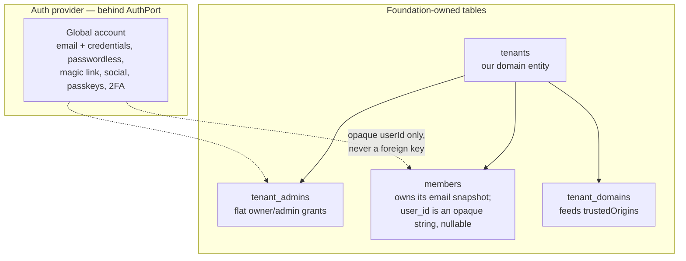

# ADR-0002 — Member identity: global authentication, tenant-owned relationship 🔐 \{#adr-0002--member-identity-global-authentication-tenant-owned-relationship}

**2026-07-11 · accepted (owner-approved).** → [full ADR on GitHub](https://github.com/chomamateusz/agentproofarch/blob/main/docs/decisions/0002-member-identity-and-idp.md)

## Summary 📋 \{#summary}

Separate **"who are you"** from **"who are you here"**. The auth provider supplies authentication and nothing else, behind a narrow OIDC-shaped `AuthPort`. Every relationship — tenants, staff grants, members — lives in foundation-owned tables. **No auth-provider organization or team feature is used at all.**

## The WHY 🤔 \{#the-why}

Two user populations exist, and only one of them fits an auth provider's organization model:

- **Creator teams** — staff of a tenant. These *would* fit an org plugin.
- **End customers ("members")** — course students, community members — who belong to tenants and may belong to several.

The hard requirements settled it. The customer relationship belongs to the creator (profile, tags, GDPR marketing consents stored per tenant); per-tenant export must be complete; one email may be a customer of many tenants; **a member must not be able to enumerate their tenants**; creators remove a member from their own tenant only; accounts must be creatable without a password from a payment webhook; and sessions must work across tenant subdomains and custom domains.

Four reasons then rule out provider org features entirely:

1. **Privacy leak.** Provider org APIs let a user list their own organizations — precisely what the requirements forbid.
2. **Data gravity.** Relationship data attached to provider tables turns an IdP swap into a *data migration*. Applied uniformly to customers *and* staff, a swap touches sign-in only.
3. **Mutual incompatibility.** Better Auth, Clerk and Auth0 org features are incompatible APIs, so adopting any of them couples the foundation to one vendor.
4. **Semantics and scale** do not match what the product needs.

## Decided ⚖️ \{#decided}

1. **Global account = authentication only** — email + credentials, passwordless allowed, magic-link sign-in — managed by the provider behind a narrow, OIDC-shaped `AuthPort`. Provider swappability is a *requirement*; nothing but authentication may live on this account.
2. **Members = a tenant-scoped aggregate in our database**, with no ports or adapters: plain core domain plus a repository. All relationship data lives here.
3. **No auth-provider organization/team feature at all.** `tenants`, `tenant_admins` (flat owner/admin grants — the teams concept is deliberately postponed, so multiple admins are just multiple rows) and `members` are foundation tables. The member row owns its **email snapshot**, so an export never joins provider tables, and `userId` stays an opaque string.
4. **Deletion is two operations**: a creator removes a member (member row + tenant data; the account survives) versus a user erasing their global account (a platform-level GDPR request; per-tenant data remains each controller's duty).
5. **Sessions**: one session across `APP_BASE_DOMAIN` subdomains, while **each custom domain is its own cookie world** — members sign in per custom domain, which *hard-isolates* sessions between tenants. `trustedOrigins` resolves dynamically against verified `tenant_domains`.
6. **The IdP topology is a composition-root decision**: embedded Better Auth (default, so self-host stays one `docker compose up`), a separate container acting as an OIDC provider, or a SaaS provider — all behind the same `AuthPort`. An adapter swap, not a plugin system.
7. **Tenant, not instance**: one instance hosts many tenants over one account pool, so one customer account across a creator's unrelated brands is free *within* an instance. New instances are for hard isolation only; cross-instance SSO is an explicit non-goal of the foundation.

### GDPR split 🔏 \{#gdpr-split}

The creator is the **controller** of their tenant's member data (profile, tags, consents, progress). The platform operator is a **processor** for tenant data and the controller of the minimal global account. Marketing consents exist only per tenant, and per-tenant export (CSV/JSON including email) is a foundation capability.

## Alternatives considered 🔀 \{#alternatives-considered}

| Alternative | Verdict | Why |
|---|---|---|
| **Use the provider's organization/team plugin** | rejected | Lets a user enumerate their own organizations (a forbidden privacy leak), creates data gravity on provider tables, and couples the foundation to one vendor's incompatible API. |
| **Query the provider for member emails at export time** | rejected | Couples the creator's core business asset to provider availability and rate limits — Auth0 and Clerk management APIs throttle hard at export scale — and loses the emails entirely if the account or provider goes away. |
| **A member email snapshot with no refresh** | rejected as the whole answer | The snapshot can go stale after an account email change, so it refreshes on sign-in (`AuthPort` already carries the fresh email) and via provider update webhooks. Consents stay bound to the email they were given for. |
| **Instance-per-tenant isolation** | rejected as the default | One instance hosting many tenants over a shared account pool is what makes one customer account across a creator's brands free. Separate instances remain available for hard isolation. |
| **A central OIDC provider from day one** | deferred | It is the answer for cross-instance/cross-app SSO, reachable by promoting the IdP and swapping adapters — with members aggregates untouched. Until then it would add a fleet-wide single point of failure for sign-in. |

## Consequences ⚡ \{#consequences}

- **The provider-coupling debt is resolved.** The demo originally modelled tenants as Better Auth organizations. As of 2026-07-20 the P1 migration batch is complete: `demo/` ships foundation-owned `tenants`, `tenant_admins` and `members` tables (`demo/adapters/db/app-schema.ts`), the organization plugin is gone, and no provider table backs tenancy.
- **The members aggregate is built** (2026-07-21): the `member` domain, `member:read` / `:write` / `:remove` / `:export` capabilities, use-cases `ensureMember` (the idempotent find-or-create entry point), `listMembers`, `updateMember`, `removeMember`, `exportMember`, contract routes, CLI `member` verbs and a staff-facing web island — with cross-tenant isolation and removal-cascade integration tests plus a smoke phase. Its recorded stances:
  - **Authorization**: `member:*` is **staff-only** (owner or admin). Members are the end customers this aggregate is *about*, managed by staff rather than editors of the roster; a customer's self-scoped read is `/api/me`, not a capability. `member:remove` is split from `member:write` so a later policy can reserve destructive removal for owners.
  - **Concurrency**: last-write-wins — short-lived per-tenant rows, where a lost profile edit costs a re-type, not data.
  - **Deletion**: a hard delete of the member row, which today is the only tenant-scoped data keyed by the member (todos and cards are authored by `userId`).
  - **Storage**: `members` is on the grandfathered list, so it keeps text ids and text ISO timestamps rather than mixing timestamp types in one table. New sibling aggregates keyed by `member_id` adopt uuid/timestamptz. `user_id` is **nullable**, because `ensureMember` provisions a member row before an auth account exists.
- **We re-implement what the org plugin gave for free** — membership tables, invitation tokens. A few small tables and use-cases, judged cheaper than coupling every relationship to one provider's API.
- **The foundation PRD was rewritten** (§3.4, FR-6/7 amended, FR-19..25 and US-025..028 added, US-007 redefined with no organization plugin).

:::caution[Risks acknowledged, and what is not built]
- **A future central IdP would be a single point of failure** for sign-in across a fleet, and account takeover would span contexts. Named mitigations: email verification, per-domain magic links, and passkeys — passkeys are now **built** ([ADR-0007](./0007-email-port-and-magic-link-transport.md) consequences).
- **Self-hosted instances have independent account pools.** SSO across them is a hosted-operator feature, not a property of the architecture.
- **Per-tenant IdP / enterprise SSO** (tenant-configured SAML/OIDC federation) is **not built**; it sits in the deferred-work register with the first enterprise customer ask as its trigger.
- **The teams concept is postponed** — `tenant_admins` is deliberately flat owner/admin grants.
- **Account-enumeration posture is a known residual**: registration and login currently reveal account existence through Better Auth defaults, recorded for the first external security review.
:::
