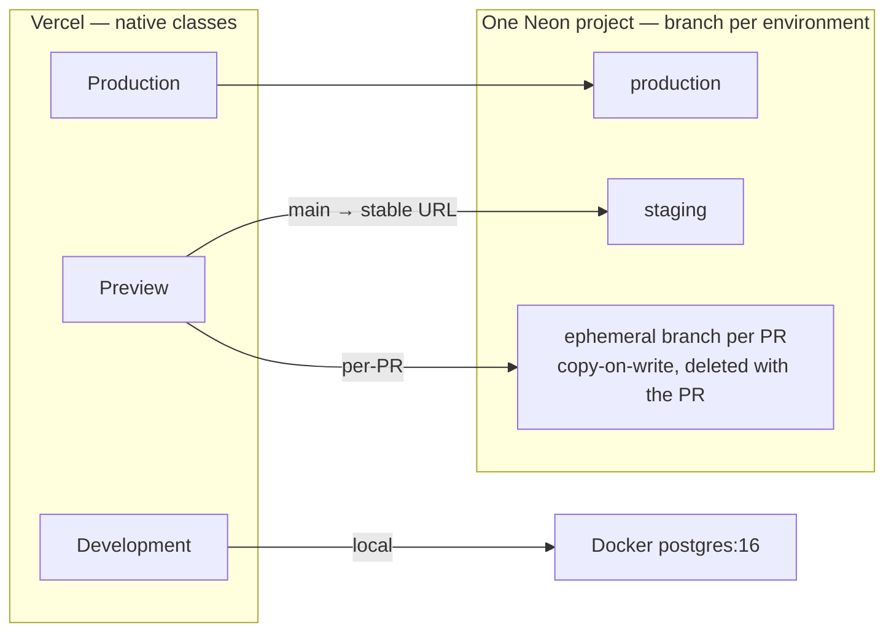

# ADR-0003 — Vercel environments: dev, staging, prod + previews on Hobby 🔺 \{#adr-0003--vercel-environments-dev-staging-prod--previews-on-hobby}

**2026-07-14 · accepted; release topology superseded 2026-07-24.** → [full ADR on GitHub](https://github.com/chomamateusz/agentproofarch/blob/main/docs/decisions/0003-vercel-environments.md)

## Summary 📋 \{#summary}

Map onto Vercel's **native** environment model rather than inventing one on top of it, give every environment its own Neon branch, and run migrations at build time against that environment's own database. Zero fixed cost on Vercel Hobby + Neon Free.

:::warning[Superseded in part (2026-07-24)]
Decision point 1's **release mapping** has changed. **Staging is now `main`** (its Preview on a stable URL), and **production is a dedicated `production` branch** with Vercel Production Branch Tracking set to it; the long-lived `staging` branch relic is deleted. A production release is an **owner-approved PR `main → production`** whose merge triggers the production build, gated by the `production-protection` ruleset with an empty bypass list; agents act as a Write-not-Admin machine account.

The normative text is [`architecture.md` §Environments](https://github.com/chomamateusz/agentproofarch/blob/main/docs/architecture.md) — rendered here as [Environments & promotion](../operations/environments.md). **Points 2–7 below are unchanged.**
:::

## The WHY 🤔 \{#the-why}

The foundation named Vercel as the default deploy target but never defined what "staging" meant on it, which database each environment talks to, or when migrations run. Inventing an environment model *on top of* the platform's own is how config drift starts — two models to keep in sync, with the platform winning every disagreement. So the decision was to adopt the platform's model and fill in only what it does not answer.

## Decided (as recorded) ⚖️ \{#decided-as-recorded}

1. **Map onto Vercel's native model** (Production / Preview / Development) rather than inventing one. Non-production deployments derive base URL and trusted auth origin from the platform-injected `VERCEL_URL` / `VERCEL_BRANCH_URL`, so **a preview is fully functional — sign-in included — with zero per-branch configuration**. Branch-scoped environment variables remain available on Hobby if staging ever needs to diverge, but none are required. *(This point's branch→environment mapping is what was superseded; the `VERCEL_URL` derivation stands.)*
2. **One Neon project, branch per environment**: `production`, `staging`, and an **ephemeral copy-on-write branch per preview PR**, created by the Neon⇄Vercel marketplace integration and deleted with the PR. `DATABASE_URL` is injected per environment by the integration; `DB_DRIVER=neon-http` everywhere on Vercel.
3. **Migrations at build time.** The build runs `db:migrate` against the environment's own database before building the SPA, so previews always test the PR's schema on a disposable branch. Staging and production are **forward-only**: destructive changes ship expand → contract across two deploys.
4. **Entry**: `demo/api/index.ts` exports a node-style handler through `@hono/node-server/vercel` (with `NODEJS_HELPERS=0`); `vercel.json` routes `/api/*` to the function and everything else to the static SPA build with an SPA fallback. Root directory is `demo`.
5. **Function and database co-located in Europe**: the function runs in `fra1` and the Neon project lives in `aws-eu-central-1`. Cross-continent pairing is a known failure mode — the original us-east-1 database forced the function to `iad1` as a stopgap until the database was migrated to Frankfurt. **Rule: whoever moves one side moves both.**
6. **No custom domain yet** (an accepted constraint): the web app is single-tenant on `*.vercel.app` while API and CLI stay fully multi-tenant via `X-Tenant`. Attaching a wildcard domain later changes env vars (`APP_BASE_DOMAIN`), **not code**. `DOMAIN_PROVISIONER` is live with `caddy` for self-host and `vercel` (US-020) for this target; this deployment stays on the `noop` default until the owner sets `VERCEL_TOKEN` + `VERCEL_PROJECT_ID`, which is also when the adapter first runs live.
7. **Remote runtime gate**: `smoke:remote` reuses the smoke CLI suite against a deployment URL (health → sign-in → todos → negative case), replacing the boot-a-server phase with the deployed target.

## Alternatives considered 🔀 \{#alternatives-considered}

| Alternative | Verdict | Why |
|---|---|---|
| **Invent a custom environment model on top of Vercel's** | rejected | Two models to keep in sync is how config drift starts, and the platform wins every disagreement. |
| **Vercel Custom Environments** | unavailable | A Hobby-plan limitation, accepted rather than worked around. |
| **Per-branch environment variables for previews** | rejected as a requirement | Unnecessary: `VERCEL_URL` / `VERCEL_BRANCH_URL` already make a preview fully functional including sign-in. Branch-scoped vars remain available if staging ever needs to diverge. |
| **A separate database per preview created by hand** | rejected | The Neon⇄Vercel marketplace integration creates an ephemeral copy-on-write branch per PR and deletes it with the PR — cheaper and self-cleaning. |
| **Decoupled migration gates** (migrate as its own step, not the build) | deferred | Build-time migration couples deploy and migrate; the expand→contract rule plus Neon's instant branch restore are the accepted mitigations. Revisit when a real product needs a separate migration gate. |
| **Attaching a custom domain immediately** | deferred | It changes env vars, not code, so the constraint was accepted for the foundation phase. See [Environments & promotion](../operations/environments.md) for the wildcard mechanics. |

## Consequences ⚡ \{#consequences}

- **$0 fixed cost.** The whole matrix — three environments plus previews — runs on free tiers.
- **Hobby limits accepted**: no Custom Environments, single-member team, non-commercial use. Upgrading to Pro changes configuration, not architecture.
- **Build-time migrations couple deploy and migrate.** Mitigated by the expand→contract rule and Neon's instant branch restore.
- **Browser multi-tenancy is unexercised on previews** until a wildcard domain exists; the CLI/`X-Tenant` path keeps it covered by `smoke:remote`.

:::caution[What changed, and what is still pending]
- **The release topology in point 1 no longer describes reality** — see the warning at the top of this page, and [Environments & promotion](../operations/environments.md) for the current model.
- **Point 6 is still in force on Vercel.** Neither recorded base-domain shape is live — the `agentproofarch.eu.org` delegation waits on eu.org approval, the company-DNS bridge waits on `VERCEL_TOKEN` — so the deployed web app stays single-tenant on `*.vercel.app`. Both shapes are laid out in [Identity & multi-tenancy](../architecture/identity-and-multi-tenancy.md).
- **US-020 — the Vercel Domains API `DomainPort` — is now built** but has never run against the live API, and this deployment still runs `DOMAIN_PROVISIONER=noop`, whose `check` accepts every domain; see [US-020: built, and never run live](../operations/self-host-and-domains.md#us-020-built-and-never-run-live).
:::
