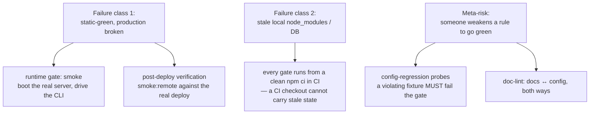

# ADR-0004 — No-exceptions enforcement: CI gates, post-deploy verification, config-regression probes

**2026-07-17 · accepted, with one sub-decision deferred to the owner.** Amended 2026-07-20 (post-deploy scope). → [full ADR on GitHub](https://github.com/chomamateusz/agentproofarch/blob/main/docs/decisions/0004-no-exceptions-enforcement.md)

## Summary

Both gates — the static `check` and the runtime `smoke` — are **required CI checks on every PR**, run from a clean `npm ci`. Every production deploy is independently re-verified end to end. And the enforcers themselves are enforced: config-regression probes feed a deliberately violating fixture to each rule and assert the gate still goes red.

## The WHY

Two gates on the honour system are worth nothing, and two concrete failure classes proved it.

**1. Five consecutive deploy-config failure layers (PRs #10–#15):** native subpath imports, the Vercel handler runtime, handler arity, the body parser, region co-location, `NODEJS_HELPERS`. Every one of them was **static-green** — typecheck, lint, dependency-cruiser and vitest all passed — and production was broken anyway. *Static analysis cannot see a runtime contract with the platform.*

**2. Three stale-local-state incidents**, where a green local run reflected an out-of-date `node_modules` or database rather than the committed tree, so "works on my machine" diverged from "works from a clean checkout".

The lesson is the project's own rule made load-bearing: **static-green is not done.** The app must actually boot and be driven end to end, from a clean checkout, on every PR and after every deploy — and nobody must be able to quietly delete a rule and stay green.

## Decided

1. **Both gates are required CI checks on every PR** (`ci` workflow, on `pull_request` and `push` to `main`):
   - **`check`** — `npm ci && npm run check`, the static gate from a clean install: typecheck, ESLint layer boundaries, `lock-lint`, dependency-cruiser, doc-lint and vitest with coverage. *(The chain has since grown to eight members, adding `typecheck:islands` and `knip` — see [CI gates](../operations/ci-gates.md).)*
   - **`smoke`** — the runtime gate against a `postgres:16` service container. It verifies the installed tree matches `package-lock.json`, drops and recreates the isolated `agentproofarch_smoke` database, migrates, seeds, boots the real server and drives health → sign-in → todos → unauthorized through the CLI. **A clean CI checkout structurally cannot carry stale local state**, which closes the second failure class.
2. **Post-deploy verification against real production.** `post-deploy-smoke` listens for the `deployment_status` event and, on a successful deployment, checks out the deployed commit and runs `smoke:remote` against it. This is the only gate that exercises the actual platform contract that broke in #10–#15: it turns "deployed" into "deployed and verified working".
3. **Config-regression probes.** The lint and dependency-cruiser configurations are themselves covered by behavioural tests: a deliberately violating fixture **must** fail the gate. Weaken or delete a rule, and the corresponding probe goes green where it should be red — so the test suite fails. *You cannot disable a rule silently and keep CI green.*
4. **Doc-lint** (`npm run doc-lint`, wired into `check`) keeps docs and enforcer configuration in sync **both ways**:
   - **docs → config**: an in-script manifest maps prose-promised guarantees (layer boundaries, `@vercel/*` and `@neondatabase/*` containment, "no `any`", "no `as`", "features are islands") to their concrete ESLint / dependency-cruiser entries, each with the doc section it is promised in. Any literal `agentproofarch/<rule>` id spelled in the docs is checked too.
   - **config → docs**: every custom rule in `eslint-plugin-agentproofarch/rules` must be documented **by name** somewhere under `docs/`, so an enforcer cannot be added in silence.
   - **leaked-delimiter scan**: every git-tracked `.md` is read and the check fails if a stray tool/XML delimiter survived into committed prose, so stray agent-output markup cannot ship in the docs.
   - **dead relative links**: every git-tracked `.md` has its relative link targets resolved on disk. Build-generated docs are a named exception (today exactly one — `website/docs/changelog.md`, written by `prebuild`), because they are legitimately absent from a clean checkout; the exception is a literal path list, so a typo still fails.
5. **Third-party actions are pinned by full commit SHA**, never a mutable tag — a tag can be force-moved onto malicious code under an unchanged CI config. A trailing comment records the version the SHA resolved to (`# v4.3.0`, `# v4.4.0`; a comment may also record just the major line the pin tracks — `# v1` for `claude-code-action`, pinned at its `v1.0.181` release commit); bumps come through the same dependency PRs and pass both gates.

## Alternatives considered

| Alternative | Verdict | Why |
|---|---|---|
| **Run the gates locally, on the honour system** | rejected by evidence | Three stale-local-state incidents: a green local run reflected out-of-date `node_modules` or a stale database rather than the committed tree. |
| **Static analysis only** (typecheck + lint + unit tests) | insufficient | Proven insufficient five times in a row. A runtime contract with the platform is invisible to static tools. |
| **`docker compose` inside the `smoke` job** | unnecessary | `smoke.ts` creates and drops its own isolated `agentproofarch_smoke` database over the provided `DATABASE_URL`, so a bare `postgres:16` service container is enough. |
| **Trust that lint rules stay in place** | rejected | Without probes, the cheapest way to make a red build green is to weaken the rule that caught it. |
| **Pin actions by tag (`@v4`)** | rejected | A tag is mutable and can be force-moved onto malicious code with no visible change to the workflow file. |
| **A PR-template review checklist for the REVIEW+AI tier** | rejected as the endpoint | The owner's direction (2026-07-20, DECIDE F1) commissioned a **full AI-review CI gate** instead of a transitional checklist. It now ships as the fail-closed `ai-review` workflow. |

## Consequences

- **Every PR is red until both gates pass**, and every production deploy is independently re-verified end to end. Both historical failure classes are structurally caught.
- **Branch protection is server-enforced.** The repository is **public**, so GitHub rulesets are available at no cost, and two are in force with **empty bypass lists**: `main-gates` on `main` (PR + the required checks `check` / `smoke` / `e2e` / `docker-smoke` / `ai-review` + "require branches up to date", 0 approvals, merge-commit only) and `production-protection` on `production` (`check` / `smoke` / `e2e` / `docker-smoke` + **1 required approval**, stale approvals dismissed on push, merge-commit only). A merge is therefore *blocked*, not merely marked red. This supersedes the earlier private-repo limitation, when the branch-protection API returned `403 "Upgrade to GitHub Pro"` and enforcement was discipline-only — **going public was the resolution.**
- **CI runs only on the canonical repo.** Every job is guarded with `if: github.repository == 'chomamateusz/agentproofarch'`, so a fork never spends Actions minutes or fails on missing secrets and services.
- **Probes and doc-lint add maintenance surface** — fixtures must track the rules they guard — accepted as the price of turning "you cannot silently disable a rule" from a hope into a mechanical guarantee.

### Amendment (2026-07-20): post-deploy scope and target URL

Decision point 2 described the narrowest form of the gate. The shipped workflow is broader, and all three sources now agree:

- **Both Production *and* Preview deployments are smoked** — staging deploys as a Preview, so it is covered too.
- **The target URL depends on the environment.** A Production deploy drives the production **alias** (`https://agentproofarch.vercel.app`): the alias is what users hit, it proves promotion/aliasing worked, and Better Auth only trusts `APP_BASE_URL` as the CSRF origin. Preview and staging deploys drive their own per-deployment `environment_url`, which their `VERCEL_URL`-derived auth origin already trusts.
- **Because it drives live production, `smoke:remote` obeys the production smoke-account doctrine**: a dedicated canary tenant, never `db:seed` against a real database, credentials from CI secrets, forks overriding the defaults, and a non-self-poisoning drive. Its concurrency half is enforced by a per-environment group with `cancel-in-progress: false`, so overlapping deploys cannot race the shared canary.

:::caution[Honest caveats]
- **Doc-lint is a named-manifest check**, not a proof that every prose-promised guarantee or boundary is covered by an enforcer.
- **Some config-regression tests are structural rule-presence checks** rather than fixture-feeding probes.
- **The AI-review gate that fulfils the REVIEW+AI tier is built and, since 2026-07-26, a required check on `main-gates`** — armed after it accumulated a verdict track record. See [CI gates](../operations/ci-gates.md).
- **Two jobs report without blocking.** `visual` ([ADR-0008](./0008-visual-regression.md)) and `docs-build` are deliberately non-required, each for a stated reason; `ai-review` graduated to the `main-gates` required set on 2026-07-26.
:::
