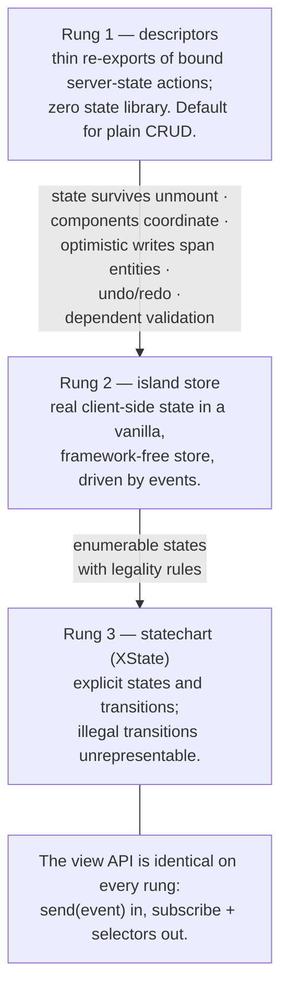

# ADR-0005 — Client application state: island cores with a ladder of machines 🎛️ \{#adr-0005--client-application-state-island-cores-with-a-ladder-of-machines}

**2026-07-19 · accepted;** the two machine choices were resolved by the owner the same day, after a code spike. → [full ADR on GitHub](https://github.com/chomamateusz/agentproofarch/blob/main/docs/decisions/0005-client-application-state.md)

## Summary 📋 \{#summary}

Every feature (island) exposes exactly one seam: **events in, selectors out**. What varies is the machine behind that seam, on a three-rung ladder, and a core graduates a rung only when a **measurable trigger** fires. The view API is identical on every rung, so graduation never touches views.

## The WHY 🤔 \{#the-why}

The server-state seam was fully regulated — descriptors, the CQRS partition, the QueryClient policy, optimistic updates. Client *application* state was one paragraph: `useState`/`useReducer` local to the feature, context for cross-cutting concerns, no global state libraries.

That paragraph holds for CRUD lists and says nothing about multi-step edits, drag lifecycles, or optimistic sequences with undo. Without a rule, **agents facing such a feature are likely to improvise inconsistent topologies** — exactly the "two paths without a selection rule" failure this architecture exists to prevent.

The gap surfaced while auditing an external (anonymized) frontend-guidelines document. Most of it did not survive adversarial review: strict assumptions with zero enforcement, a hand-rolled view factory reimplementing what React context provides, reads and writes mixed on one channel. Its strongest concept *did* survive — **a framework-agnostic client core that views talk to through events in and subscriptions out, with the state machinery invisible behind that seam** — and five negotiation rounds hardened it into this architecture's idioms.

## Decided ⚖️ \{#decided}

### The ladder 🪜 \{#the-ladder}

1. **Island cores.** Every feature has a `core/` module with one public API — events in, selectors out. Views render UI and talk exclusively to their own island's core. There is **no generic `IStore { get/set/subscribe }`** over the state library: that would be port theater, re-typing a library's API without buying replaceability. The web provider/context only *delivers* the core instance to the tree; it is a delivery mechanism, not an abstraction.
2. **Uniform seam, ladder of machines inside** — **no opt-outs**, because optionality makes agents guess.
3. **CQRS at the view seam.** Events are writes (intentions), selectors are reads, and **an event never returns data**. A view needing the result of its own event reads it through a selector after the state changes. This is the single most important boundary condition: request/response over events is how the pattern dies.
4. **Cardinality.** Many views → one island core is the norm. One view → **exactly one core, its own island's** — never another island's. A screen needing two domains has three legal routes: route-level composition, core↔core mediation, or injected app globals. Deleting island B therefore never breaks island A's *views*, at most its core's typed subscriptions.
5. **Four core↔core channels, and only these**: the **server cache** (default for anything durable — the cache is the pub/sub, zero coupling, survives reload), a **typed signal bus** (a closed union, one owning island per event, core-to-core only — *views never see the bus*), **injected app globals** (session, theme, permissions), and the **URL/router** (often the best bus, because it is shareable for free).
6. **The two-machines contract.** The island store and the server cache have disjoint jurisdictions: the store **never holds a copy of server data** (it reads through the cache; optimistic updates go through `onMutate`/rollback), TanStack **never holds edit/interaction state**, and the dividing line is verbatim normative — **local state is state that must die on reload; anything "save progress" is server state.**
7. **Intent-named events.** Events name what the user did, not what should happen: `deleteConfirmed`, never `deleteOrder`. Each island's events are one closed union in one file, with member names ending in a suffix from a fixed taxonomy that the shipped `agentproofarch/event-suffix-taxonomy` rule enforces.
8. **Pure-TS cores — portable by construction.** A core is a pure TypeScript module: no React, no DOM, no `react-query`, **no `api.ts`**. It is a factory over its dependencies (`createBoardCore(deps)`), composed in a single web binding (`features/<name>/index.web.ts`) that injects the real gateway and bound descriptors.
9. **Isomorphic domain rules for guarded transitions.** When transition legality is a *business* rule (WIP limits, an enforced status path), it is domain logic, not view logic — implemented client-only it is cosmetics, since a CLI request would walk straight past it. Such rules live as pure predicates in `core/domain`; the server enforces them on mutation and the island wires the same predicates as transition guards for instant UX.

### The two library choices (resolved by spike) 📦 \{#the-two-library-choices-resolved-by-spike}

- **(a) Rung-2 store: `@xstate/store`.** Its event map *is* the events-in seam — the store's `on: { cardAdded: … }` keys mirror the island's event union one-to-one with zero explicit generics and zero casts — and the same-vendor `fromStore` bridge makes rung-2 → rung-3 graduation a **supported move rather than a rewrite**. Substitute clause: `zustand/vanilla` is acceptable *only* for a team that foresees no graduation to rung 3; the demo always uses the first choice.
- **(b) Isomorphic rules: transition-table-as-data.** The table (allowed moves + guard predicates) lives as plain data in `core/domain` with **zero dependencies**, so "zod only" stands unamended. The island's XState machine is **derived from the table programmatically — hand-writing the machine is forbidden** — the server check is derived from the same table, and a **drift property test in CI** proves the two derivations agree.

## Alternatives considered 🔀 \{#alternatives-considered}

| Alternative | Verdict | Why |
|---|---|---|
| **The external guidelines document as written** | mostly rejected | Strict assumptions with zero enforcement, a hand-rolled view factory reimplementing React context, reads and writes mixed on one channel. Only its core concept — the framework-agnostic core behind an events/subscriptions seam — survived. |
| **A generic `IStore` interface over the state library** | rejected | Port theater: it re-types a library's API without buying replaceability. |
| **Opt-in seam** (only "complex" features get a core) | rejected | Optionality makes agents guess, which is the exact failure mode this ADR exists to close. Rung 1 is scaffolder-generated boilerplate instead. |
| **`zustand/vanilla` as the default rung-2 store** | rejected as default, allowed as substitute | Its event map does not mirror the seam as directly, and there is no same-vendor bridge to rung 3, so graduation becomes a rewrite. |
| **Full XState at rung 2** | rejected | Spiked as a reference implementation; the ladder exists so simple client state does not pay statechart cost. |
| **A shared machine for isomorphic rules (option B2)** | **rejected on spike evidence** | Two proven reasons: the rules are **board-scoped** while the machine is **card-scoped**, so every server check had to rebuild a synthetic per-card context around a board-global question — and it **fails open**: probe-verified, an unhandled transition returned its placeholder `{ allowed: true }` as the server's answer. |
| **A stringly-typed client event bus** | still banned | This ADR *narrows* the earlier "no client event bus" decision rather than reversing it: what is sanctioned is exactly the closed-union escape hatch that decision reserved, now with a proven need, an owner per event, and a views-never-touch-it rule. |

### The evidence 🔍 \{#the-evidence}

A code spike with **five implementations** over one shared behaviour suite — rung 2 as `zustand/vanilla`, `@xstate/store` and a full-XState reference; isomorphic rules as table-as-data versus a shared machine. It was judged by **two independent judge panels** whose disagreements were settled by an adjudicator with **verified runtime probes** (fail-open, index clamping, interleaving, subscription granularity — each reproduced against the code, not argued). Both panels independently picked `@xstate/store` and the table.

:::note[The spike report is not in the repo]
The full spike report and decision-context notes are **not committed**; their conclusions and probe results are summarised in the ADR itself. That is stated in the ADR and repeated here so nobody hunts for missing files.
:::

### Spike learnings that became implementation requirements 💡 \{#spike-learnings-that-became-implementation-requirements}

- **Fail loud on unhandled transitions.** The derived machine and check **throw** when no verdict is produced; never seed a permissive initial verdict — fail-open is exactly what sank the shared machine.
- **Clamp raw payload indices (`toIndex`) before the gateway call**, not only in optimistic state. Both rung-2 spike stores forwarded raw indices, so persisted order could silently diverge from optimistic order. The server re-clamps regardless.
- **Drift property tests must cover WIP=1 edge limits** (both spike suites omitted `{todo: 1}` / `{done: 1}`) and must demonstrate their own detection power with a **planted mutant** — a hand-wired machine that drops a guard must make the suite fail.
- **The `as`-free event-carrier typing trick.** XState's `types` field infers the event union from a value, and a single object literal collapses the union; under the no-`as` regime, pass a value whose *static* type is already the full union (index a `Record<ColumnId, MachineEvent>`), never `{} as MachineEvent`.

## Consequences ⚡ \{#consequences}

- **Honest cost: the seam taxes simple features.** A rung-1 core is extra files where `useQuery(actions.todos)` was two lines. Mitigation: rung 1 is scaffolder-generated re-export boilerplate, and uniformity is what removes agent guesswork — a fixed small tax instead of a variable large one when agents improvise topologies.
- **Enforcement surface grows**: new lint rules (event-suffix taxonomy, core purity bans, persistence bans, `setQueryData` confinement) plus config-regression probes for each, and every normative rule in the architecture section ships an explicit TYPE/LINT/TEST/REVIEW+AI matrix.
- **The two-machines contract is only partially lintable.** The bans are mechanical; copying the *shape* of a server response into a store is semantic and stays a review + AI-tier check — an acknowledged residual risk.
- **The demo gained two exemplar boards** (landed 2026-07-20): `features/board/` (rung 2 on `@xstate/store`) and `features/team-board/` (rung 3 over the `core/domain/team-board.ts` transition table) — two islands over one tasks subdomain.
- **Portability is enforced, not promised** (landed 2026-07-21): `tsconfig.islands.json` (no DOM) runs as `typecheck:islands` inside `check`; a `no-restricted-imports` parent-relative ban plus the depcruise `island-core-is-portable` rule stop a core importing `api.ts` or any web path outside its own directory, with a config-regression probe; and each island's public factory is node-tested with a fake gateway. **The claim is now literal: typechecked without DOM, public seam node-tested.**
- **Two scaffolders, one story.** `new:resource` owns the server/data slice and ships a rung-0 CRUD page reading `actions.<name>` directly — a coreless *starting point*, not an exemption from "no opt-outs". Its checklist and generated page both name the graduation path; `new:island` is the scaffolder that plants the uniform seam.

:::caution[Honest caveats]
- **Every other demo feature is rung 1, honestly so.** Todos and auth fire no graduation trigger; pre-existing features carry no explicit `core/` folder and gain one when first touched by real client state.
- **The "TUI consumer" claim is scoped precisely.** What is proven is that cores typecheck without DOM and their public seams are node-tested with a fake gateway — not that a TUI exists.
- **A forms doctrine does not exist.** The frontend section promises one; the deferred-work register records it as unbuilt, triggered by the first multi-step or dynamic form.
- **Semantics of intent-named events cannot be linted.** The suffix rule makes the imperative form unwritable and pushes vocabulary the right way, but whether an event name honestly reports intent stays a review/AI-tier check.
:::

Rendered architecture for this seam: [Client state](../architecture/client-state.md).
