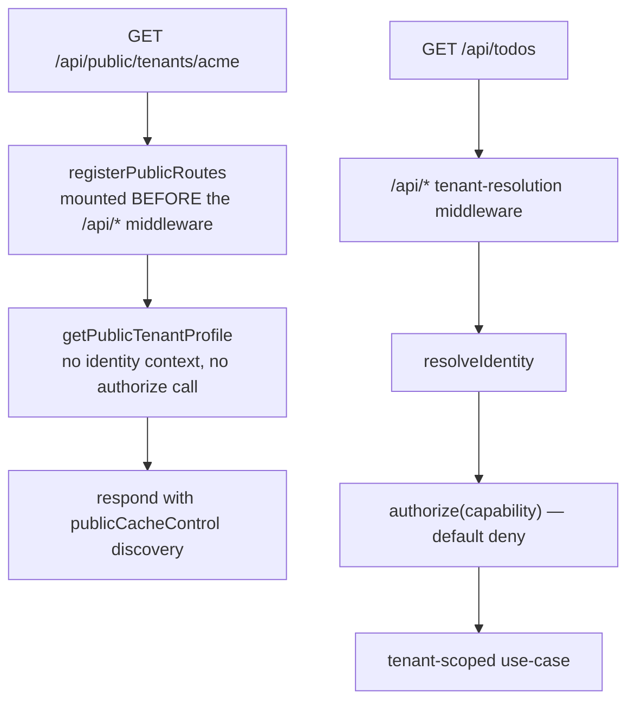

# ADR-0006 — Public read-only contract surface: built shape and stances 👀 \{#adr-0006--public-read-only-contract-surface-built-shape-and-stances}

**2026-07-21 · accepted.** Implements US-028, FR-23, FR-24; builds on [ADR-0001](./0001-public-surface-embeds-over-pages.md). → [full ADR on GitHub](https://github.com/chomamateusz/agentproofarch/blob/main/docs/decisions/0006-public-read-only-surface.md)

## Summary 📋 \{#summary}

A structurally separate `/api/public/*` route group: unauthenticated, open-CORS, edge-cacheable JSON that runs **before** tenant resolution and calls a use-case with **no identity and no `authorize`**. Its cache key is a content version *derived* from the tenant's visible fields rather than stored in a column.

## The WHY 🤔 \{#the-why}

[ADR-0001](./0001-public-surface-embeds-over-pages.md) committed the foundation to a headless public surface — unauthenticated read-only JSON, open CORS, cacheable with tenant-content versioning, consumable from any creator-hosted site. But until this package, **the `no-store` default at the `respond()` seam was the entire cache policy and no public route existed.** This ADR records the shape that shipped and, more importantly, the non-obvious stances chosen while building it — the ones a future contributor would otherwise "fix" in the wrong direction.

## Decided ⚖️ \{#decided}

### 1. A structurally distinct route group 🛣️ \{#1-a-structurally-distinct-route-group}

```ts
export const PUBLIC_API_ROUTES = {
  tenantDiscovery: { method: 'GET', path: `${PUBLIC_API_PREFIX}/tenants/:slug` },
  tenantProfile: { method: 'GET', path: `${PUBLIC_API_PREFIX}/tenants/:slug/v/:version` },
} as const;
```

Its own registry in `core/contract`, separate from `API_ROUTES`. The demo route is a public tenant profile exposing **`slug`, `displayName`, `contentVersion` only** — never emails, members, staff or todos. Two routes: a short-cached **discovery** and a long-cached, version-keyed **profile**.

### 2. Before identity, never authorize 🔐 \{#2-before-identity-never-authorize}



Public handlers are registered ahead of the `/api/*` tenant-resolution middleware, so a public request is answered by a terminal handler and **never reaches identity resolution**. The reasoning is a refusal to be dishonest: modelling a public reader as a `visitor` capability would misrepresent it, because `visitor` is an *authenticated* tenant-less principal. So public reads sit **outside** the default-deny capability model by construction rather than by exception, and a config-regression probe asserts exactly that — the public app references no identity-bearing use-case, and the public use-case is not `ctx: Ctx`-shaped (the US-028 acceptance criterion).

### 3. Content version — derived, not stored 🔢 \{#3-content-version--derived-not-stored}

`tenantContentVersion` is a pure **FNV-1a (32-bit, base36)** derivation over the tenant's visible public fields (`slug`, `name`).

**The tradeoff, stated:** a `content_version` column bumped on every tenant-visible write buys monotonicity and survives hashing pressure as the visible surface grows, at the cost of a migration plus write-path plumbing in every mutating use-case. A cache key only needs *"different content ⇒ different key"*, which a pure derivation gives for free — a future tenant-rename use-case busts the edge cache with zero extra code. **The switch to a column happens the day the visible surface outgrows a cheap hash or needs monotonic ordering.**

### 4. The version is a cache key, not a content selector 🗝️ \{#4-the-version-is-a-cache-key-not-a-content-selector}

The profile route returns **current** content and echoes the **current** version regardless of the `:version` in the path. A consumer that requested a stale key sees the bust in the body and re-discovers. The key's format is validated (`publicVersionSchema` — base36 only), so a junk key is a `400`, never a cached garbage entry.

### 5. One cache helper, errors always `no-store` 💾 \{#5-one-cache-helper-errors-always-no-store}

```ts
export const PUBLIC_CACHE_PROFILES = {
  discovery: { sMaxage: 30, staleWhileRevalidate: 30 },
  profile: { sMaxage: 300, staleWhileRevalidate: 600 },
} as const;

export const publicCacheControl = (profile: PublicCacheProfile): string => {
  const { sMaxage, staleWhileRevalidate } = PUBLIC_CACHE_PROFILES[profile];
  return `public, max-age=0, s-maxage=${sMaxage}, stale-while-revalidate=${staleWhileRevalidate}`;
};
```

`core/contract/cache.ts` is the only place a public `Cache-Control` string is built, and a probe asserts the `s-maxage` / `stale-while-revalidate` tokens appear nowhere else. The shape means the browser always revalidates while the edge caches for `s-maxage` and serves stale while it refreshes. It is applied at the shared `respond()` seam, which pins **errors** to `no-store` regardless of the requested value — a transient failure can never be cached at the edge.

### 6. CORS on the public group only 🌐 \{#6-cors-on-the-public-group-only}

`hono/cors` (`origin: '*'`, `GET` plus preflight) is mounted on `/api/public/*` **alone**; the authenticated `/api/*` surface stays CORS-closed. A probe asserts the authenticated app imports no CORS middleware, and `smoke` proves the separation from a foreign `Origin`.

### 7. Shareability by slug (FR-24) 🔗 \{#7-shareability-by-slug-fr-24}

The profile is slug-addressed, so the same URL resolves identically on the apex or any tenant subdomain or custom domain — a superset of tenant-domain shareability, proven unauthenticated across hosts in tests and in `smoke`.

## Alternatives considered 🔀 \{#alternatives-considered}

| Alternative | Verdict | Why |
|---|---|---|
| **Model the public reader as a `visitor` capability** | rejected | Dishonest: `visitor` is an *authenticated* tenant-less principal. Routing a public read through the capability model would weaken the meaning of every other capability check. |
| **A stored `content_version` column** | deferred, with a named switch condition | Buys monotonicity and survives hashing pressure, at the cost of a migration plus write-path plumbing in every mutating use-case. Adopt it the day the visible surface outgrows a cheap hash. |
| **Treat `:version` as a content selector** (serve historical content) | rejected | It would require storing historical content and turn a cache key into an API contract. Instead the route echoes current content and version, and a stale key self-corrects. |
| **Purge-based cache invalidation** | rejected | Busting **by key** needs no purge API, no vendor coupling and no invalidation race: new content is a new version, hence a new URL, hence a new cache entry. |
| **Hand-written `Cache-Control` strings at call sites** | rejected | Drift is inevitable. One helper plus a probe that the tokens appear nowhere else makes the shape impossible to fork. |
| **Global CORS on `/api/*`** | rejected | It would regress the same-origin session boundary. CORS is scoped to the public group, with a probe and a foreign-`Origin` smoke assertion holding the line. |

## Consequences ⚡ \{#consequences}

- **The `respond()` seam gained an optional `cacheControl` argument** (default `no-store`), and was lifted into `apps/server/src/respond.ts` so the public app can share it without a circular import.
- **A public, no-session CLI command** (`public profile <tenant>`) exercises the discovery → profile flow; the CLI builds a header-less client for it. That command is also the reason the flow is smoke-covered without a browser.
- **Shareable checkout flows, `/embed/*` widgets and the headless SDK remain unbuilt** (post-MVP, [ADR-0001](./0001-public-surface-embeds-over-pages.md)).

:::caution[Honest caveats]
- **The demo's public surface is deliberately tiny** — one tenant profile over two routes. It is the *shape* the foundation commits to, not a feature-complete public API.
- **The content version is a 32-bit hash.** Collisions are possible in principle, which is precisely why the ADR names the switch condition to a stored column rather than claiming the hash is sufficient forever. It is also **not monotonic** — you cannot order two versions in time.
- **A consumer holding a stale version key gets current content**, not a `404` or a redirect. That is intended (the bust is visible in the body), but it means version keys are not durable identifiers.
- **Probes prove structure, not intent.** They assert the public app references no identity-bearing use-case and imports no CORS middleware; they cannot prove a future public route exposes nothing sensitive. That stays a review + AI-tier check.
:::

Rendered architecture for the surrounding rules: [Errors & API versioning](../architecture/errors-and-api-versioning.md).
