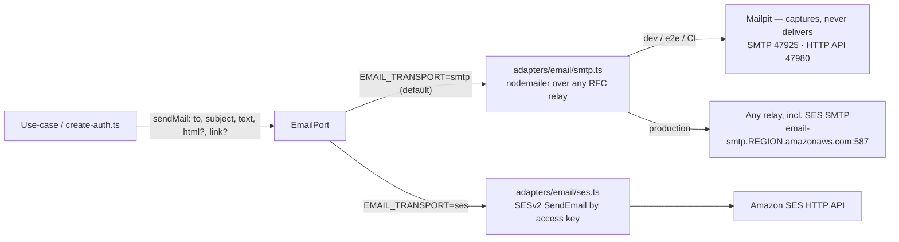

# ADR-0007 — `EmailPort` shape and the magic-link transport

**2026-07-21 · accepted (owner-approved).** → [full ADR on GitHub](https://github.com/chomamateusz/agentproofarch/blob/main/docs/decisions/0007-email-port-and-magic-link-transport.md)

## Summary

One minimal port — `sendMail({ to, subject, text, html?, link? })` — with two adapters selected by `EMAIL_TRANSPORT`: `smtp` (default, any RFC relay, SES SMTP credentials work unchanged) and `ses` (SESv2 HTTP API by access key). **There is no dev transport**: dev, e2e and CI run the *real* SMTP adapter against a local Mailpit that captures every send.

## The WHY

US-026 — passwordless member provisioning plus magic-link sign-in — is the first feature that must send mail, so it is the trigger that turned the roadmap's deferred `EmailPort` into a built port. The roadmap had sketched `send({ to, subject, html, text })` with a Resend adapter on both targets and a `console` dev adapter. Two forces reshaped that sketch:

1. **The owner's delivery ruling.** The universal default transport is **SMTP**, not Resend: it must work with Amazon SES SMTP credentials out of the box and be trivially swappable behind the port. Real SES credentials arrive later via env; dev and CI must do **no** real delivery.
2. **Dev must surface the link.** The acceptance criterion is explicit — in dev the magic-link URL must be retrievable, with no email sent to a real inbox. A test, CLI or e2e run needs to retrieve *that specific link*, deterministically.

The second force is where the interesting decision lives. The obvious answer is a dev-only route or a `DevMailbox` that hands the link back — and that answer is rejected, because **anything dev-only in the app is something that must be kept off production forever.**

## Decided

### 1. Port shape: `sendMail({ to, subject, text, html?, link? })`

Minimal and generic. The magic link is **one consumer** of `sendMail`, not the port's shape: the magic-link email is composed in `create-auth.ts` and passes the raw URL as the optional `link` field. `link` is a general transactional-mail concept — a primary call-to-action URL — not a dev hack; a transport embeds it in the body and otherwise ignores the field. No `tenantId`, because there is one verified sender domain (`EMAIL_FROM`).

### 2. Two adapters, selected in the composition root

| | `smtp` (default) | `ses` |
|---|---|---|
| Mechanism | nodemailer over any RFC SMTP relay | `@aws-sdk/client-sesv2`, `SendEmail` |
| Credentials | optional SMTP auth — an open local relay needs none | standard `AWS_REGION`, `AWS_ACCESS_KEY_ID`, `AWS_SECRET_ACCESS_KEY` |
| Why it exists | one default that already works with SES SMTP credentials (`SMTP_HOST=email-smtp.<region>.amazonaws.com`, port 587, STARTTLS) | for teams that cannot or will not open an outbound SMTP port |
| Misconfiguration | — | selecting `ses` **without** its credential block is a **composition error** — fail fast, never silent non-delivery |

nodemailer was chosen over a hand-rolled SMTP client: it is well maintained, handles STARTTLS, auth and encoding, and SES-SMTP compatibility is a first-class use case for it. Every email-vendor SDK (nodemailer and `@aws-sdk/*`) is contained to `adapters/email` by a single dependency-cruiser rule — the same containment pattern the layer doctrine applies everywhere.

### 3. No dev transport — a real send to a local Mailpit

Dev, e2e and CI run the **real** `smtp` adapter pointed at a local **Mailpit** (a service in `docker-compose.dev.yml`, and a service container in the `smoke` / `e2e` / `visual` CI jobs). Mailpit captures every send instead of delivering it, and exposes an HTTP API on `:47980`.

The magic-link smoke and e2e phases therefore do the **same round-trip a human makes**: request a link, read the captured message back over the API (`/api/v1/messages`, `/api/v1/message/{id}`), extract the verify URL, follow it. The CLI's `login-link` requests a link and, given `--link <url>` copied from Mailpit or a real inbox, follows it.

**There is no `/api/dev/magic-link` route and no `DevMailbox`.** Nothing dev-only ships in the app, so nothing has to be kept off production.

### 4. Member↔user binding on first sign-in

A member provisioned by `ensureMember` has a **null `userId`** until they first authenticate. Binding happens in `resolveIdentity`: when no member is yet bound to the account, the (tenant, email) member row is claimed via `bindMemberOnSignIn`. It is tenant-aware (resolution already knows the tenant), **idempotent** (a bound account short-circuits before the bind read), and **safe** (a member already bound to a different account is never re-bound or granted). It carries no capability — a system step gated by an established session, like tenant resolution itself.

## Alternatives considered

| Alternative | Verdict | Why |
|---|---|---|
| **Resend as the default transport** (the roadmap sketch) | rejected by owner ruling | SMTP is the one universal default: it must work with SES SMTP credentials out of the box and be swappable behind the port without the app learning which relay it is. |
| **A `console` dev adapter** (the roadmap sketch) | rejected | A third transport that exists only for dev, whose behaviour therefore differs from what production runs. The real adapter against a capture inbox exercises the production path instead. |
| **A dev-only `/api/dev/magic-link` route or a `DevMailbox`** | rejected | Anything dev-only in the app is a permanent obligation to keep it off production. Mailpit moves that surface out of the application entirely. |
| **A hand-rolled SMTP client** | rejected | nodemailer is well maintained and handles STARTTLS, auth and encoding; SES-SMTP compatibility is a first-class use case for it. |
| **`tenantId` on the port** (per-tenant senders) | rejected for now | One verified sender domain (`EMAIL_FROM`) is the current policy; per-tenant branded senders remain a when-triggered extension. |
| **Shaping the port around the magic link** | rejected | The magic link is *a consumer*, not the port's purpose. `link` stays a general "primary call-to-action URL" so an order receipt or export-ready notice reuses `sendMail` unchanged. |
| **A hosted capture service (MailTrap-style SaaS)** | rejected | Mailpit is the self-hosted equivalent, so dev and CI need no third-party account or network dependency. |

## Consequences

- **Better Auth's magic-link plugin delegates to `EmailPort.sendMail`** — one transport, one from-address policy, as the roadmap called for. The social (Google) and TOTP 2FA plugins ride the same auth adapter.
- **Passkeys are built** (US-028a). The `@better-auth/passkey` package pinned a `better-call` whose optional `zod@^4` peer conflicted with this tree's former `zod@^3`, so **the migration to `zod@^4` was the named unblock** — landed first with all gates green, then the plugin was wired. The server plugin adds a `passkey` table (migration `0008_passkey`) scoped by `rpID = APP_BASE_DOMAIN`, so one credential spans every tenant subdomain; the register/list/remove/sign-in surface is exposed only through `AuthClientPort`, never a provider route in a client.
- **The Resend/`console` split is superseded.** Future non-auth transactional mail (order receipt, export-ready notice) reuses `sendMail` from a use-case.
- **CI gained a Mailpit service container** in the `smoke`, `e2e` and `visual` jobs, with `MP_SMTP_AUTH_ACCEPT_ANY` and `MP_SMTP_AUTH_ALLOW_INSECURE` set — see [CI gates](../operations/ci-gates.md).

:::caution[Honest caveats]
- **`smoke:remote` skips the magic-link phase.** Against a real deployment a real relay delivers and there is no capture inbox to read the message back from, so that phase is not exercised there.
- **Deliverability is unowned.** SPF/DKIM/DMARC alignment, bounce and complaint handling, and suppression lists are the operator's job on whichever relay is configured; the port has no view of them.
- **Per-tenant branded senders are not built** — one verified `EMAIL_FROM` per deployment.
- **Reading the dev magic link is a manual step in dev.** Open Mailpit's UI/API at `http://localhost:47980`; there is deliberately no in-app shortcut.
:::

Rendered architecture for the port set: [Ports & adapters](../architecture/ports-and-adapters.md).
