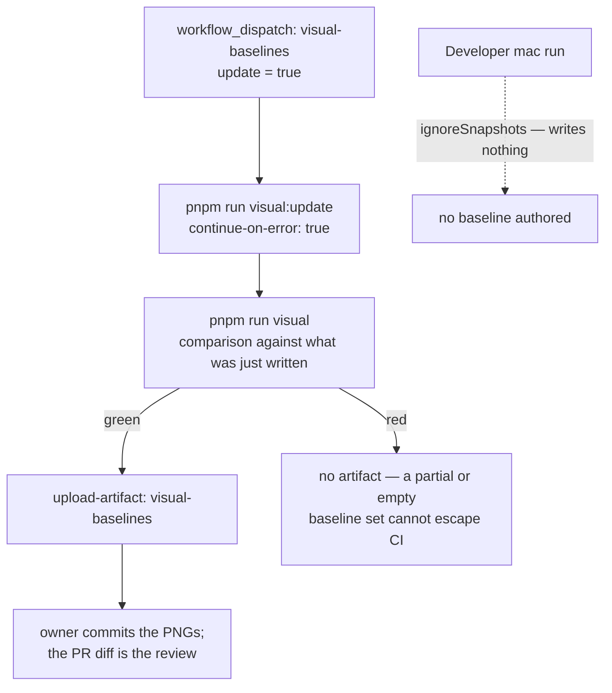

# ADR-0008 — Visual regression: Playwright screenshots with CI-rendered baselines 📸 \{#adr-0008--visual-regression-playwright-screenshots-with-ci-rendered-baselines}

**2026-07-25 · accepted (owner-approved).** Builds on [ADR-0004](./0004-no-exceptions-enforcement.md) (enforcement, not convention) and the flake doctrine. → [full ADR on GitHub](https://github.com/chomamateusz/agentproofarch/blob/main/docs/decisions/0008-visual-regression.md)

## Summary 📋 \{#summary}

Playwright `toHaveScreenshot()` over the existing e2e boot harness, with baselines committed in-repo and **rendered only by the linux CI runner**. The comparison is exact on both axes (`maxDiffPixels: 0` *and* `threshold: 0`), the suite is structurally isolated from the required `e2e` check, and the `visual` job is **deliberately not required** until the owner arms it.

## The WHY 🤔 \{#the-why}

The browser gate proves *behaviour* — a login lands on the ledger, the WIP guard blocks, a card survives a reload — and is completely blind to *appearance*. A theme token, an MUI upgrade or a stray `sx` value can repaint the whole shell without failing a single assertion.

What this repo cannot accept in exchange for that coverage is a gate that is *usually* green. Pixel comparison is the classic rerun-to-green offender, and the flake doctrine — **a flake is a P1 bug, never rerun-to-green** — forbids it outright.

So the design centre is not coverage. It is **determinism**: a visual check earns its place only if the same commit produces byte-identical screenshots on every run. Anything that cannot be made byte-identical is masked, scoped away, or not screenshotted at all.

## Decided ⚖️ \{#decided}

### 1. Playwright `toHaveScreenshot()`, baselines committed in-repo 🖼️ \{#1-playwright-tohavescreenshot-baselines-committed-in-repo}

The repo already runs Playwright over the real stack with a boot harness (`scripts/e2e-server.ts`) that drops, migrates and seeds an isolated database and serves the built bundle from `entry.node.ts`. Visual regression rides that harness: **no new runtime, no new service, no new hosting decision.** Baselines are PNGs in `demo/visual/__screenshots__/`, reviewed in the pull request that changes them — the diff *is* the approval.

### 2. Baselines are rendered inside CI (linux), never on a developer mac 🐧 \{#2-baselines-are-rendered-inside-ci-linux-never-on-a-developer-mac}

Screenshot bytes are a function of the OS font stack and rasterizer, so a mac-rendered baseline is *guaranteed* to differ from the linux runner's. Two mechanisms enforce this rather than a README plea:

```ts
ignoreSnapshots: process.platform !== 'linux',
snapshotPathTemplate: '{testDir}/__screenshots__/{platform}/{projectName}/{arg}{ext}',
```

- Snapshot paths are **platform-scoped**, so a mac run cannot overwrite the linux baselines the gate compares against.
- `ignoreSnapshots` is on for **every non-linux platform**, so a mac run writes nothing at all — with or without `--update-snapshots`.



The authoring run **cannot** gate anything, because Playwright reports a newly written snapshot as a failure. That is exactly why the second run exists: it re-renders as a *comparison* against what was just written, so a run that died before the harness booted cannot ship an empty or partial artifact. It is the determinism check in miniature.

### 3. A separate suite, structurally isolated 🧪 \{#3-a-separate-suite-structurally-isolated}

The specs live in `demo/visual/` with their own `playwright.visual.config.ts` and `pnpm run visual`, not in `demo/e2e/`. The required check `e2e` therefore cannot go red because a screenshot moved — **the isolation is a directory, not a filter someone can forget to apply.**

### 4. The check is NON-REQUIRED until the owner arms it 🔕 \{#4-the-check-is-non-required-until-the-owner-arms-it}

The required set (`check` / `smoke` / `e2e` / `docker-smoke`, plus `ai-review` on `main-gates` since 2026-07-26) deliberately omits the `visual` job: it reports, it does not block. Arming it is a one-line ruleset edit made only after the check has a run history of green comparisons — and it is **reverted the moment the gate flakes**, because a flaky required gate is a P1 and, per ADR-0004's stance, an enforcer that cannot be trusted is worse than no enforcer.

### 5. Determinism levers — the whole point 🎚️ \{#5-determinism-levers--the-whole-point}

All set in `playwright.visual.config.ts`:

| Lever | Value | What it removes |
|---|---|---|
| `animations` + `reducedMotion` | `'disabled'` + `'reduce'` | the login card's `settle` keyframe and every MUI transition land on their end state |
| `viewport`, `deviceScaleFactor`, `scale` | 1280×800, `1`, `'css'` | layout and raster size never depend on the runner's display |
| `colorScheme`, `locale`, `timezoneId` | `'light'`, `'en-US'`, `'UTC'` | ambient theme, and locale-dependent number/date formatting |
| `caret` | `'hide'` | a focused input's blinking caret is a two-state pixel region by construction |
| `maxDiffPixels` **and** `threshold` | `0` **and** `0` | exact on both axes |
| `retries` | `0` | the rerun-to-green option is simply not offered |
| `workers` / `fullyParallel` | `1` / `false` | cross-test contention on the shared seeded database while a page rasterizes |

The double zero is the subtle one. Playwright's default `threshold` of `0.2` counts a pixel as equal until it has drifted a fifth of the YIQ distance — which would let a **uniform theme shift repaint the whole image at zero diff pixels**. A tolerance budget on either axis is a slow leak: it hides a one-pixel shift today and a real regression next quarter.

### 6. Only genuinely stable surfaces are screenshotted 🎯 \{#6-only-genuinely-stable-surfaces-are-screenshotted}

The seed writes every demo todo with the same `createdAt`, and the ledger orders by that column — so the row order is a database tie and the rendered date is the day the seed ran. Neither is stable, so **the ledger's list is not screenshotted**. The authenticated surface under test is the app shell chrome (wordmark, tenant switcher, staff-role chip, account email, navigation), which is fully determined by the seed. The rest are public: the login page, its error state, and the register page.

Four baselines exist today, all under `visual/__screenshots__/linux/chromium/`: `login.png`, `login-error.png`, `register.png`, `app-shell-chrome.png`. **Four screenshots that are trustworthy beat twenty that are re-baselined on sight.**

## Alternatives considered 🔀 \{#alternatives-considered}

| Alternative | Verdict | Why |
|---|---|---|
| **Storybook + Lost Pixel** | rejected | The repo has no Storybook. Adopting it for *visual testing* means adding a whole component-catalog stack — its build, addon graph and a duplicate of every component's provider wiring — as a test dependency, then maintaining stories that drift from the real routes. It also tests components in isolation, which is precisely where a theme or layout regression hides. Lost Pixel's OSS mode leaves baseline hosting unanswered (its managed platform is the answer it wants), reintroducing the question in-repo baselines settle for free. |
| **A SaaS diffing service** (Chromatic / Percy / Applitools) | rejected | Putting a third-party API inside a merge gate makes another company's uptime, quota and auth part of this repo's ability to ship, and the baselines live somewhere the repository cannot review or restore. Screenshot bytes are small and diffable; git is already the review surface. Chromatic is also paid. |
| **A tolerance budget** (`maxDiffPixels > 0` or Playwright's default `threshold: 0.2`) | rejected | A slow leak: it hides a one-pixel shift today and a real regression next quarter — and the default threshold specifically would let a uniform colour shift pass at zero diff pixels. |
| **Retries on the visual suite** | rejected | A retry that turns a screenshot green is exactly the rerun-to-green the flake doctrine bans. |
| **Reusing the `e2e` suite** (a tag or filter instead of a directory) | rejected | A filter is something a contributor can forget to apply; a separate directory and config cannot be forgotten. |
| **Screenshotting the ledger list** | rejected | Seeded rows tie on `createdAt` (unstable order) and the rendered date is the seed day. Not byte-stable, therefore not screenshotted. |
| **Making `visual` required immediately** | rejected | It has no run history yet, and an untrusted required gate is worse than none ([ADR-0004](./0004-no-exceptions-enforcement.md)). |

## Consequences ⚡ \{#consequences}

- **`pnpm run visual` is a no-op-ish local convenience on macOS** — it drives the pages but compares nothing. Visual feedback for a developer comes from the CI job's uploaded diff artifact, not a local run: a deliberate trade for baselines that mean one thing everywhere.
- **An intentional UI change is a two-step pull request**: land the change, dispatch `visual-baselines` with `update: true`, commit the new PNGs. The reviewer sees the before/after in the diff.
- **Runner-image drift will one day redraw a baseline with no code change** (a font package changing in `ubuntu-latest`). That is the known cost of exactness; it surfaces as a red **non-required** job, is re-baselined deliberately, and is the reason the check is not armed by default.

:::caution[Honest caveats]
- **`visual` blocks nothing today.** It reports. Arming it is an owner action that has not been taken.
- **Coverage is four screenshots.** Three public surfaces plus the app shell chrome — chosen for byte-stability, not for breadth. Most of the UI is not visually covered, on purpose.
- **One browser, one viewport, one colour scheme**: Chromium at 1280×800, light. There is no cross-browser, responsive or dark-mode visual coverage.
- **A developer on macOS gets no local signal at all** — not a reduced signal, none. The artifact from CI is the only feedback channel.
- **Component-level regressions in isolation are not covered**, since the suite screenshots real routes. That was the deliberate trade against a Storybook-based approach.
:::
