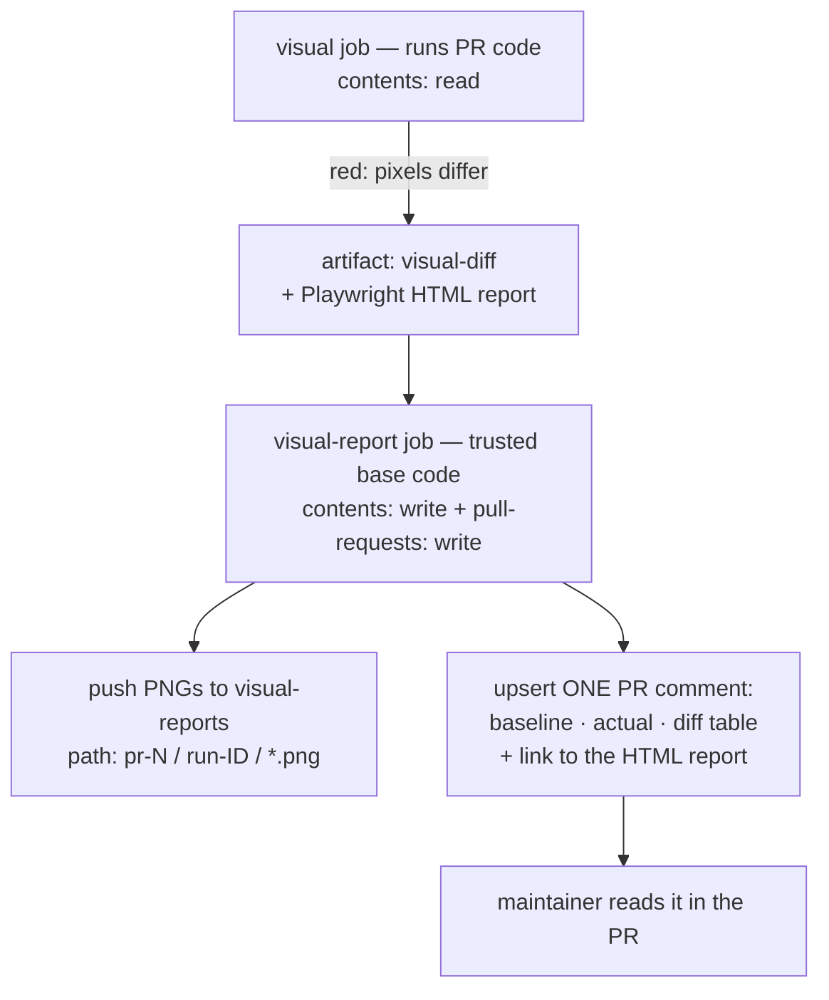

# ADR-0013 — The visual review loop: a GitHub-native gallery and an approval that commits 🔁 \{#adr-0013--the-visual-review-loop-a-github-native-gallery-and-an-approval-that-commits}

**2026-07-27 · accepted (owner-approved).** Extends [ADR-0008](./0008-visual-regression.md) (the capture and the comparison — that ADR stays as written) and builds on [ADR-0004](./0004-no-exceptions-enforcement.md) and the CHEAP SECRETS doctrine. → [full ADR on GitHub](https://github.com/chomamateusz/agentproofarch/blob/main/docs/decisions/0013-visual-review-loop.md)

## Summary 📋 \{#summary}

When the `visual` job finds differences, CI publishes Playwright's own expected / actual / diff PNGs to an unprotected `visual-reports` branch — shown to readers as **baseline · actual · diff** (Playwright's "expected" *is* the committed baseline, and the gallery says so) — and posts **one** upserted pull-request comment with an inline gallery plus a link to the full HTML report. A maintainer replies `/approve-visuals`; a workflow verifies the author, dispatches `visual-baselines` against the PR branch, and the new baselines are **committed** — after which GitHub's own 2-up / swipe / onion-skin image diff on the Files tab is the final review artifact. No vendor, no account, no new secret.

## The WHY 🤔 \{#the-why}

ADR-0008 built everything except the part a human touches. Reviewing a pixel difference today means: open the Actions run, download a zip, unzip it, open PNGs locally, decide, dispatch `visual-baselines`, download a second zip, copy files into the working tree, commit. **Nine manual steps, none of them inside the pull request.**

`visual` is the only job in the pipeline whose output cannot be read where it is produced.

A market evaluation (2026-07-27) of Argos, Visual Regression Tracker, Chromatic, Lost Pixel, Percy and Vizzly asked whether a vendor closes the loop. The finding is structural, not commercial:

:::info[The one sentence that decided it]
Every service in this category keeps **its own** baseline store. Clicking "Approve" in a vendor's UI updates **their** baseline — it never writes a PNG into this repository, so the ADR-0008 dispatch-and-commit still has to happen afterwards, by hand.
:::

And the best reviewer in the evaluation is already installed: GitHub renders a committed PNG change with 2-up, swipe and onion-skin modes, in the PR, for anyone with a browser and no account anywhere. The missing piece was never the viewer — it was getting the bytes in front of a human *before* the decision and turning the decision back into a commit *after* it.

## Decided ⚖️ \{#decided}

### 1. The gallery is published into the pull request 🖼️ \{#1-the-gallery-is-published-into-the-pull-request}



- **The publisher never runs pull-request code.** `visual-report` checks out the protected base SHA explicitly, never the PR head, and downloads the artifact on failure. It also runs after a green comparison to update an existing sticky comment to "no visual changes". The job that builds and runs the app keeps `contents: read`; only the publisher holds write scopes, and it holds them where there is no PR-authored code to execute.
- **Artifact file names are untrusted input** (a spec title becomes a path), so only entries matching `^[A-Za-z0-9._-]+-(expected|actual|diff)\.png$` are copied, flattened.
- **The run ID is in the path on purpose.** `raw.githubusercontent.com` caches by URL; a fixed per-PR path would show the *previous* run's image for minutes. A new run is a new URL, and a new URL cannot be stale.
- **The branch is bounded, not accumulating**: each publication rewrites `visual-reports` as a single orphan root commit holding the directories of currently open PRs only, serialised by a `concurrency` group. Nothing triggers off that branch — `ci.yml` runs on `pull_request` and pushes to `main`, and Pages is published by `actions/deploy-pages`, not from a branch.
- **One comment, edited.** A hidden `<!-- visual-review-gallery -->` marker identifies it — the `ai-review` sticky-comment pattern, reused rather than reinvented.

#### Update 2026-08-01 — the deliberate change was the invisible one 🪞 \{#deliberate-baseline-changes}

A PR that re-renders the baselines and **commits** them — the normal way to ship a UI change here, and the end state of every `/approve-visuals` — makes the comparison green *by construction*: no mismatch, no artifact, nothing in the table. GitHub then collapses the committed PNG diff in **Files changed**, so exactly where before/after matters most, nobody sees it. The same upserted comment now carries a second section, **"Deliberate baseline changes in this PR"**: one row per changed baseline with `Before (base)` and `After (head)` images side by side (a new baseline reads *new surface* in the Before cell, a deleted one *baseline removed* in the After cell, a rename takes its Before from the previous path). The mismatch table gained its own heading — *Pixel mismatches against the committed baselines* — so the two situations can never be confused.

The publisher checks out the trusted base and has no head tree to diff, so the changed files come from the **pull-request files API**, and each side is a `raw.githubusercontent.com` URL pinned to `base.sha` or `head.sha` — both in the event payload, both immutable, so no cache can serve a stale pixel. The repository is public, so those URLs need no token. File names are PR-authored input: only paths under `demo/visual/__screenshots__/` in `[A-Za-z0-9._-]` segments, ending in `.png`, with no `..` segment, become a URL — and the head SHA enters the job as a **URL component, never as a checkout ref**, which the structural probe pins.

### 2. Approval closes the loop in git ✅ \{#2-approval-closes-the-loop-in-git}

A maintainer comments `/approve-visuals`. `approve-visuals.yml` verifies the comment, then dispatches the existing `visual-baselines` workflow (`update: true`, plus a new `commit: true` input) against the PR's branch. That run re-renders the baselines on the linux runner, **re-runs the suite as a comparison against what it just wrote** — the ADR-0008 gate, now gating a push instead of an upload — and commits the PNGs onto the branch.

The exact rule, evaluated before any step runs:

```yaml
on:
  issue_comment:
    types: [created]

jobs:
  guard:
    if: >-
      github.repository == 'chomamateusz/agentproofarch'
      && github.event.issue.pull_request != null
      && startsWith(github.event.comment.body, '/approve-visuals')
      && (
        github.event.comment.author_association == 'OWNER'
        || contains(fromJSON(vars.VISUAL_APPROVERS || '[]'),
                    github.event.comment.user.login)
      )
```

| Clause | Why it reads that way |
|---|---|
| `author_association == 'OWNER'` | GitHub computes the field per comment from the commenter's relationship to the repository; it is payload, not user input. On a user-owned repo exactly one account is `OWNER`. |
| `vars.VISUAL_APPROVERS` | A plain (non-secret) JSON array of logins, **empty by default** — today the rule is owner-only, and widening it is a visible admin-only settings change. |
| `COLLABORATOR` / `MEMBER` not accepted | Write access here belongs to the machine account, and an agent that wants a re-baseline **dispatches `visual-baselines` itself** — it does not need to talk to itself through a comment. |
| `types: [created]` only | A comment can be edited by someone other than its author, while `comment.user` stays the original author; "approval by editing" is therefore unreachable. |
| A failing rule produces **no run and no reply** | Replying would let any stranger make the bot post on demand. The gallery comment states who may approve. |

The read-only guard trims the body and requires exact equality with `/approve-visuals`; only then can the privileged job run. **The comment body is data, never code**: `actions/github-script` reads it from the webhook context, and it is never interpolated into a `run:` step.

**Then GitHub's native PNG diff is the final review artifact.** The baselines arrive as a normal commit, so the Files tab renders each screenshot with 2-up, swipe and onion-skin. That view — not the command — is the decision of record.

### 3. The security walk (TIMELINE-TRACE) 🕵️ \{#3-the-security-walk-timeline-trace}

**A stranger tries to make CI commit for them.** They comment `/approve-visuals`. GitHub emits `issue_comment.created` with an `author_association` of `NONE`/`CONTRIBUTOR` that they cannot set. The `if:` is evaluated **against the default-branch version of the workflow file** — `issue_comment` is a repository-level event, so GitHub never runs the PR's version. **The rule they are trying to pass is a rule they cannot have edited**, because editing it requires merging to `main`, which is behind the `main-gates` ruleset with an empty bypass list. The condition is false, **no job is created**, no token is minted, nothing is commented.

**The owner approves on a same-repo PR.** The read-only guard applies the author rule and exact trimmed command check. The privileged job runs on `actions: write` + `contents: read` + `pull-requests: write`; it refuses when `head.repo.full_name != github.repository`, records the head SHA, and dispatches. The dispatched run holds `contents: write` while executing PR-authored code — acceptable for a stated reason, not by omission:

- the ref must be a branch **in this repository**, so its author already has Write: the dispatch confers no new privilege;
- today's manual dispatch already runs the same code with the same identity, minus the write scope;
- `main` and `production` are governed by rulesets with **empty bypass lists**, so a `contents: write` token cannot land a commit on either. The ruleset wall, not the token, is what protects releases;
- the job requests no other scope and needs no repository secret at all.

:::caution[The fork limitation, stated rather than discovered]
For a pull request **from a fork** the `GITHUB_TOKEN` is read-only regardless of the `permissions:` block and has no access to the fork's repository. **Neither half of the loop works**: the gallery job is guarded on `head.repo.full_name == github.repository` and skips, and baselines cannot be committed to a branch that does not exist here. `pull_request_target` — a write token on a workflow checking out untrusted code — is rejected outright.

The manual path: the `visual` job still uploads the diff artifact and HTML report, and a maintainer either commits the PNGs onto the fork branch by hand (with *Allow edits from maintainers*), or pushes the fork head to a branch here, runs the loop, and asks the contributor to cherry-pick the baseline commit.
:::

There is also a race worth naming: the branch can move between the comment and the dispatch. It is **not** patched with a lock — the re-render always targets the current tip, which is the only correct baseline, and the review happens at the committed diff rather than at the command.

**Update (2026-07-28):** this race is closed as of [PR #96](https://github.com/chomamateusz/agentproofarch/pull/96). `approve-visuals` passes the head SHA it recorded as a `sha` input, `visual-baselines` checks out that exact commit rather than the branch tip, and the run still pushes to the branch — so a tip that moved in between makes the push fail non-fast-forward instead of baselining code no maintainer looked at.

## Alternatives considered 🔀 \{#alternatives-considered}

| Alternative | Verdict | Why |
|---|---|---|
| **Argos** | kept as an **optional add-on** | Takes our exact PNGs with **zero secrets** (GitHub OIDC, tokenless fallback for public repos), but its Approve writes to Argos's baseline store, so it cannot close a loop that ends in git. **Trigger:** two occasions in one calendar month where the inline gallery is insufficient and a maintainer downloads the report anyway — then it is added as an advisory commit status, never as a gate. |
| **Visual Regression Tracker** (self-hosted) | rejected | Best OSS review UI in the evaluation and a live server, but baselines leave git for its own database and file store, and its Playwright agent has not been pushed since 2024-08. |
| **Chromatic** | rejected | Uploads DOM archives and renders them in its own cloud — the second render farm the hard constraint forbids. |
| **Lost Pixel** | rejected | Sunset: repository archived 2026-04-22, team at Figma, no shutdown date published. A live pricing page is not evidence of a live product. |
| **Percy** | rejected | `percy upload` fits technically, but the price is a long-lived `PERCY_TOKEN` in CI and a second-class product path. |
| **Vizzly** | rejected | The closest "almost" — bring-your-own-screenshots, MIT CLI, free OSS plan — lost on a closed backend from a one-year-old vendor plus a CI token. |
| **reg-suit / reg-cli** as the gallery generator | rejected | An unnecessary fourth image pipeline: Playwright already writes expected/actual/diff and ships a report with the same viewer modes. |
| **GitHub Pages for the gallery** | rejected | Couples the docs deployment to test output for a link a raw URL already provides. |
| **`pull_request_target`** | rejected | A write token on a workflow that checks out untrusted code, to serve the one case this design deliberately leaves manual. |
| **A GitHub App or PAT** so the baseline commit re-triggers CI | rejected | Solves a real annoyance by introducing exactly the long-lived credential CHEAP SECRETS exists to avoid. |

## Consequences ⚡ \{#consequences}

- **Nine manual steps become three**: read the comment, type `/approve-visuals`, review the committed image diff.
- **`ci.yml` grows one job, `visual-baselines` one input, and the visual config one reporter.** No new service, no account, no secret — the whole loop runs on the ephemeral `GITHUB_TOKEN`.
- **The repository grows a `visual-reports` branch**: machine-written, one commit of history, bounded by the open PRs with differences, unprotected on purpose (protecting it would block the force-push that keeps it bounded).

:::caution[Honest caveats]
- **A commit pushed with `GITHUB_TOKEN` does not trigger workflows.** After the baselines land, the PR's `visual` status still shows the pre-approval run until the next push or a manual re-run. Cosmetic today — `visual` blocks nothing — and **not cosmetic on the day the owner arms it**, which the arming decision must account for.
- **Fork contributors get a strictly worse experience**, on record: a red non-required job and an artifact, with a documented manual path instead of the one-command loop.
- **The gallery images are public**, served from a public repository — already true of every committed baseline here, and worth revisiting the moment a screenshot could contain non-demo data.
:::
