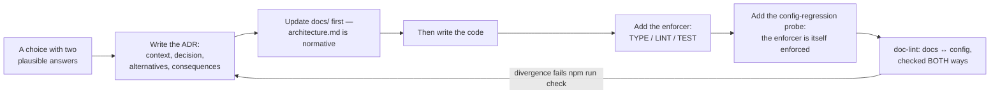

# Decisions (ADRs) 📜 \{#decisions-adrs}

This section exists because an agent-written codebase drifts wherever a choice was never written down: given two plausible paths and no selection rule, every agent picks a different one, and by the tenth feature the codebase has ten topologies. So every architectural choice that could reasonably have gone another way is recorded **before** it is built — and wherever a machine can hold the line, an enforcer is added in the same breath. That is the whole culture: **decide, then enforce.**

## Three habits make it concrete 🔁 \{#three-habits-make-it-concrete}

- **The document moves first.** Changing the architecture means changing `docs/` first, then the code. PRD §3 is the original contract; `architecture.md` is its normative, implementation-facing form.
- **A promise in prose must map to an enforcer.** `doc-lint` checks a fixed manifest of prose-promised guarantees against the ESLint and dependency-cruiser configuration **both ways**, matched by rule name — and every custom `agentproofarch/*` rule must be documented by name under `docs/`. Divergence fails `npm run check`. It is a named-manifest check, not proof that *every* guarantee is covered.
- **The enforcers are themselves enforced.** Config-regression probes feed a deliberately violating fixture to a rule and assert the gate still goes red, so a rule cannot be silently deleted ([ADR-0004](./0004-no-exceptions-enforcement.md)).

### The enforcement tiers 🛡️ \{#the-enforcement-tiers}

Normative rules in `architecture.md` ship an explicit matrix over four tiers, and knowing which tier a rule sits in tells you exactly how much to trust it:

| Tier | Mechanism | Strength |
|---|---|---|
| **TYPE** | zod schemas in `core/contract`, branded client call surfaces, exhaustive `Record`s | strongest — the wrong shape does not compile |
| **LINT** | ESLint (including custom `agentproofarch/*` rules), dependency-cruiser, knip | mechanical, and probe-guarded |
| **TEST** | unit, integration against real Postgres, `smoke`, `e2e`, `smoke:remote`, config-regression probes | behavioural evidence from a clean checkout |
| **REVIEW+AI** | human review plus the fail-closed [`ai-review`](../operations/ci-gates.md) gate | the honest home of rules a machine cannot check — semantics, intent, dishonest prose |

A rule whose only tier is REVIEW+AI is documented as such rather than presented as guaranteed. That is deliberate: several ADRs here name a residual risk that stays review-tier (copying a server response's *shape* into a client store, for instance).

## The record 📇 \{#the-record}

| ADR | Subject | Date · status |
|---|---|---|
| [0001](./0001-public-surface-embeds-over-pages.md) | Public surface — headless API and embeds instead of hosted pages | 2026-07-11 · accepted |
| [0002](./0002-member-identity-and-idp.md) | Member identity — global authentication, tenant-owned relationship | 2026-07-11 · accepted |
| [0003](./0003-vercel-environments.md) | Vercel environments — dev, staging, prod + previews on Hobby | 2026-07-14 · accepted; **release topology superseded 2026-07-24** |
| [0004](./0004-no-exceptions-enforcement.md) | No-exceptions enforcement — CI gates, post-deploy verification, config-regression probes | 2026-07-17 · accepted; amended 2026-07-20 |
| [0005](./0005-client-application-state.md) | Client application state — island cores with a ladder of machines | 2026-07-19 · accepted |
| [0006](./0006-public-read-only-surface.md) | Public read-only contract surface — built shape and stances | 2026-07-21 · accepted |
| [0007](./0007-email-port-and-magic-link-transport.md) | `EmailPort` shape and the magic-link transport | 2026-07-21 · accepted |
| [0008](./0008-visual-regression.md) | Visual regression — Playwright screenshots with CI-rendered baselines | 2026-07-25 · accepted |
| [0010](./0010-tenant-creation-policy.md) | Tenant-creation policy — an env-selected `TENANT_CREATION` mode | 2026-07-26 · accepted |

ADR-0009 is allocated to the in-flight pnpm migration and lands with its own PR.

Every page here summarises the decision, the WHY, the alternatives and the consequences. **The full text of each ADR stays authoritative** and lives in [`docs/decisions/`](https://github.com/chomamateusz/agentproofarch/tree/main/docs/decisions).

### How to read a status 🚦 \{#how-to-read-a-status}

An ADR is never edited into agreement with reality — it is **superseded in place**, with a dated note. ADR-0003 is the live example: its release topology changed on 2026-07-24 (`main` became staging, `production` became the release branch), so the ADR carries a superseding note while its other six decision points remain in force. The rule that makes this readable: the ADR records what was decided *then*, and `architecture.md` records what is normative *now*.

## What the ADR set does not contain 🚧 \{#what-the-adr-set-does-not-contain}

Three honest boundaries, so nobody reads this section as the complete decision record.

**1. Not every decision became an ADR.** An owner-decision batch (merged 2026-07-21, [PR #48](https://github.com/chomamateusz/agentproofarch/pull/48)) adjudicated several queued items — C1 write atomicity, C3 invariant placement, C4 backfills, B5 agent operating hygiene and the F2 migration lint — and those landed in `architecture.md` and the [changelog](../changelog.md) rather than as standalone ADR files. Two more decisions are recorded normatively outside `docs/decisions/` too: the DECIDE F1 AI-review gate (now the [`ai-review`](../operations/ci-gates.md) workflow) and the 2026-07-24 promotion topology ([Environments & promotion](../operations/environments.md)).

**2. Accepted-but-deliberately-unbuilt work is a register, not an ADR.** It lives in the [deferred-work register](https://github.com/chomamateusz/agentproofarch/blob/main/docs/backlog.md), each entry with a **named trigger**. When a trigger fires, the entry graduates into an ADR or an implementation slice — it never gets built silently. The register is descriptive, not normative: if an entry contradicts the architecture, the architecture wins until the entry is adjudicated. Representative entries and their triggers:

| Deferred | Trigger |
|---|---|
| Day-2 operations: rollback doctrine, SLOs, alerting ladder, DB performance doctrine, SIGTERM drain and pool error handling | first real production incident, or the first paying tenant |
| Threat model, SBOM/supply chain, session-policy numbers, break-glass procedure | first external security review, or the first enterprise questionnaire |
| Feature flags · forms doctrine · a11y (WCAG + axe) · i18n · product analytics | one named trigger each (first dark launch, first multi-step form, first public-facing product UI, …) |
| Per-tenant IdP / enterprise SSO · billing · search · load testing · IaC | the respective product need |
| Foundation upgrade contract (release manifest, change classes, conformance command) | the second app consuming this foundation |

**3. Open questions are not decisions.** Owner decisions still awaiting answers — including the provider and secret choices that block specific slices, such as the `VERCEL_TOKEN` that gates the *live verification* of the built US-020 adapter — are tracked in the register's DECIDE queue, deliberately *not* here, because they are not decided yet.

:::note[Verification residuals are recorded, not polished away]
The register also carries accepted, report-only findings — a slug value object that drops diacritics instead of transliterating; `domainNameSchema` accepting a raw IPv4; a revoked staff member's denial being byte-identical to a stranger's (deliberate existence-hiding, recorded so nobody "fixes" it); the built US-020 Vercel domain adapter never having run against the live Domains API. Each has a named trigger. Recording them is the point: an undocumented known quirk is indistinguishable from a bug nobody noticed.
:::
