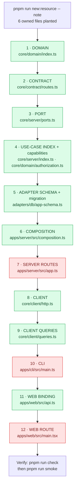
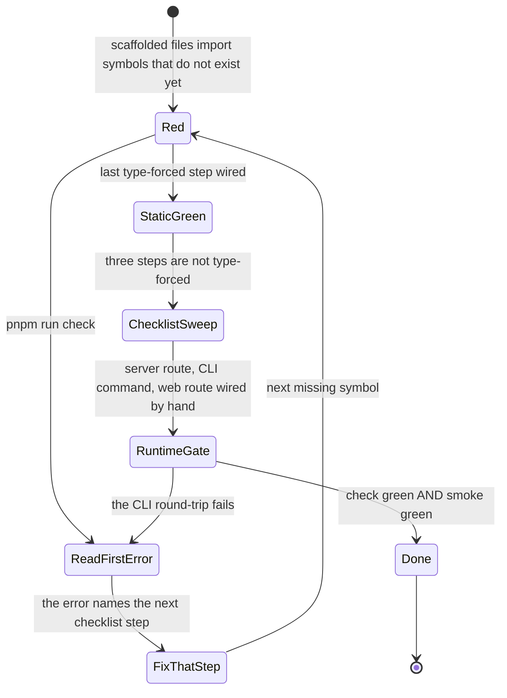

# Adding a feature

Adding a resource to a strictly layered stack touches twelve files, and the
tempting fix — a generator that writes all twelve — is the wrong one: generated
edits to *shared* files rot the moment anyone else touches them. So the scaffolder
here does something deliberately partial. It writes only the files the new resource
owns outright, leaves every shared file alone, and prints an ordered checklist with
the anchor line and a paste-ready snippet for each hand edit. The generated code
imports symbols that do not exist yet, which means `pnpm run check` is **red from the
first second** and every error it prints is literally the next step. You are not
following a tutorial; you are following the compiler.

The long-form narration lives in the repository as
[`docs/first-feature.md`](https://github.com/chomamateusz/agentproofarch/blob/main/docs/first-feature.md)
("your first feature in 30 minutes"). This page is the condensed working version.

## 1. Scaffold

```bash
cd demo
pnpm run new:resource -- note        # singular kebab-case: note, blog-post
```

Six files land — everything a resource owns and nothing shared:

| Generated | What it is |
|---|---|
| `core/domain/note.ts` | the entity + zod schemas (the source of truth for shape) |
| `core/server/usecases/notes.ts` | `listNotes` / `addNote`, authorizing first |
| `core/server/usecases/notes.test.ts` | three real tests + `it.todo` placeholders |
| `adapters/db/notes-repository.ts` | the Drizzle repository behind the port |
| `apps/web/src/features/notes/NotesPage.tsx` | the page component |
| `apps/web/src/routes/notes.tsx` | the route module |

The name is validated before anything is written: it must be singular kebab-case,
must not collide with an existing file, and must not be one of the reserved names
(`todo`, `tenant`, `health`, `me`, `auth`, `member`, `identity`). Add `--dry-run`
to see the plan and the checklist without touching the tree.

:::info Why a hand-rolled script and not Plop
`scripts/new-resource.ts` needs no dependency and no template DSL — templates are
plain text in `scripts/templates/*.tpl`, read at runtime. It is also repo-rule
aware in a way no generic generator is: it knows `check` must stay red through the
type-forced steps, and its self-test renders every template and parses the output
with the TypeScript compiler, so template rot is a failing test rather than a
runtime surprise. The scaffolders import nothing from `core/` or `apps/` — node
builtins and their own templates only — so extracting them into a package later is
mechanical.
:::

## 2. The 12-step chain



Green steps are **type-forced**: skip one and `pnpm run check` cannot go green.
Red steps are not.

:::danger Three steps the compiler cannot hold
A hand-registered server route (step 7 — routes are wired against `API_PATHS` with
no parity check), a missing CLI command (step 10) and an unregistered web route
(step 12) all typecheck perfectly while unwired. `check` will go green with a
feature that has no HTTP route and no CLI command. For those three the printed
checklist — not the compiler — is what guarantees completion. Finish the list.
:::

## 3. Let the red check drive you

This is the whole rhythm. Run the gate, read the *first* error, do the step it
names, run it again.

```bash
pnpm run check
```



Each error is a signpost: a missing schema export points at the contract step, an
unknown `NoteRepository` type at the port step, an unresolved `api.listNotes` at
the client step. The checklist gives you the anchor line to search for and the
exact snippet to paste, so you are never hunting.

Two steps genuinely need thought rather than pasting.

**Authorization (step 4b).** The generated use-cases call
`authorizeTenant(ctx, 'note:read' | 'note:write')`, and those capabilities are not
in the `Capability` union yet — so `check` stays red until you *name them and
decide their grants*. Default-deny, no wildcard. The checklist's baseline is
collaborative (`['owner', 'admin', 'member']`, matching the generated tests); for a
staff-only aggregate grant `['owner', 'admin']` and flip the member test to assert
a `forbidden` denial. There is no way to add a capability without making that
decision explicitly.

**Schema and migration (step 5).** The template gives you a `title`-only table
mirroring `todos`. A real note probably wants a `body`, maybe a `pinned` flag —
edit `core/domain/note.ts` (the zod schema is the source of truth), the contract
schemas and the `pgTable` columns together, because the boundary between them is
zod-parsed at runtime. Then:

```bash
pnpm run db:generate     # drizzle-kit diffs the schema into a new SQL migration
pnpm run db:migrate      # applies it to your dev database
```

Commit the generated migration. Never hand-edit an applied one — add a new
migration instead; deployed migrations are forward-only, expand then contract.

## 4. Tests at the core, first

Behaviour lives in the use-case layer, and that layer is pure: no server, no
database, no React. Fill in the generated test file before you wire any UI.

```bash
pnpm exec vitest run core/server/usecases/notes.test.ts
```

The scaffolder already ships three **real** authorization tests (staff allowed,
member per policy, tenant-less denied) plus `it.todo` placeholders for the rest.
Turn the placeholders into real tests: the happy path (`addNote` returns `ok`,
`listNotes` returns only the active tenant's rows) and at least one failure (empty
title → `validation`). Getting these green first means the hard part is verified
independently of Hono and React.

## 5. Verify through the CLI

Once the chain compiles, the CLI is the fastest proof the feature is really wired
end to end:

```bash
pnpm run dev:server &
pnpm --silent run cli login --email demo@agentproofarch.dev --password demo1234
pnpm --silent run cli --tenant acme note add Buy milk
pnpm --silent run cli --tenant acme note list --json
```

If that round-trips, every layer from contract to repository is connected. This is
the same loop `pnpm run smoke` automates and the same loop an agent uses — see
[CLI walkthrough](./cli-walkthrough.md).

## 6. The web page

`NotesPage.tsx` and its route module are already generated; steps 11–12 bind them
to the query client and register the route.

```bash
pnpm run dev:web        # Vite + hot reload on 47180
```

Always `dev:web` for frontend work — `dev:server` serves a gitignored built bundle
that goes stale after a contract change.

:::note The generated page is rung 0, not an exemption
The generated page reads server state directly through `actions`, exactly like the
pre-existing todos page. That is a deliberate starting point, not a carve-out from
[ADR-0005](../decisions/0005-client-application-state.md): the moment the feature
grows its own *client* state, give it the island seam with
`pnpm run new:island -- note`, point that island's selectors at this resource's
`actions.notes`, and read through the core instead of `api.ts`. `new:resource` owns
the server/data slice; `new:island` owns the client feature and its rung-1
events-in / selectors-out seam. See [Client state](../architecture/client-state.md).
:::

## 7. Green, then a PR

```bash
pnpm run check          # static
pnpm run smoke          # runtime
pnpm run e2e            # browser — required for any apps/web change
```

The PR template is this checklist made explicit: `check` green, `smoke` green,
`e2e` green for a web change, architecture docs updated *first* if you moved a
boundary, `website/docs` and a `CHANGELOG.md` entry for a behaviour-visible change,
new dependencies via `pnpm add`, build-script allowances justified by a red gate,
work done in a git worktree, and
a filed P1 linked if any gate run was flaky. CI re-runs `check`, `smoke` and `e2e`
on a clean checkout, `docker-smoke` boots the container stack, and
`post-deploy-smoke` re-verifies the deployed result. See
[Agent workflow](./agent-workflow.md) and [CI gates](../operations/ci-gates.md).

## Where to look next

- [Layers](../architecture/layers.md) — what each step of the chain is *for*.
- [Authorization](../architecture/authorization.md) — the capability model behind
  step 4b.
- [Data and transactions](../architecture/data-and-transactions.md) — migration
  and atomicity rules behind step 5.
- [Testing doctrine](./testing-doctrine.md) — what to test at which level.
