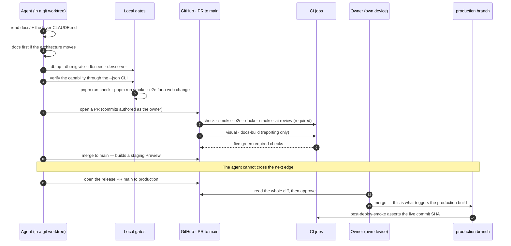
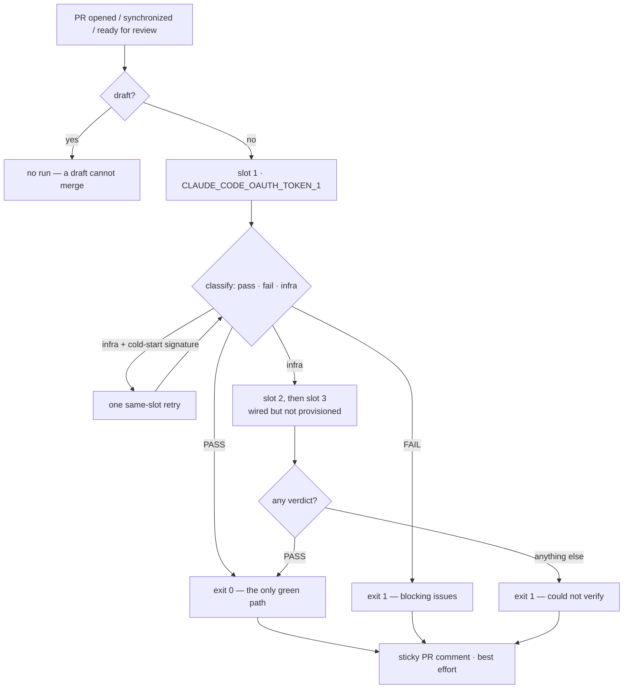

# Agent workflow

This repository is written by AI agents, and that is not a footnote — it is the
design constraint the whole architecture answers. So the workflow is documented
here for the same reason the layer boundaries are: because "the agent was told to
be careful" is not an enforcement, and every rule that matters has to be carried by
something a machine or a permission boundary holds. What follows is how a change
actually travels from an agent's worktree to production, including the parts that
are deliberately impossible for the agent to do.

Sources:
[`CLAUDE.md`](https://github.com/chomamateusz/agentproofarch/blob/main/CLAUDE.md)
(root, symlinked as `AGENTS.md`),
[`demo/CLAUDE.md`](https://github.com/chomamateusz/agentproofarch/blob/main/demo/CLAUDE.md),
the per-layer `CLAUDE.md` files under `demo/core`, `demo/adapters` and `demo/apps`
(each with its own `AGENTS.md` symlink), the
[release runbook](https://github.com/chomamateusz/agentproofarch/blob/main/docs/deploy-promotion.md)
and the
[PR template](https://github.com/chomamateusz/agentproofarch/blob/main/.github/pull_request_template.md).

## One rulebook, two readers

`AGENTS.md` is a **symlink** to `CLAUDE.md` — at the repository root and in every
layer directory. That is the whole trick: an agent and a human open the same file,
so they cannot be following divergent conventions. The rules are also *placed*
where they apply — `demo/core/CLAUDE.md` beside the pure layers,
`demo/adapters/CLAUDE.md` beside the adapters, `demo/apps/CLAUDE.md` beside the apps —
so the relevant page is the one already next to the file being edited.

And the ordering rule sits at the top of the root file: **changing the architecture
means changing `docs/` first, then the code.** The document moves first; the code
follows. A PR that quietly moves a boundary without moving the prose is a PR that
review rejects.

## The lifecycle of a change

## The rules an agent works under

- **Worktrees, never the main checkout.** Concurrent sessions must not collide, and
  the PR template has a checkbox for it.
- **Verify through the CLI first, then the gates.** `db:up` → `db:migrate` →
  `db:seed` → `dev:server` → the `--json` CLI flow, and only then `check`, `smoke`,
  and `e2e` for any `apps/web` change. The CLI is the loop because it is the only
  surface with a machine-readable envelope and a taxonomy exit code
  ([CLI walkthrough](./cli-walkthrough.md)).
- **Dependencies via `pnpm add`** using the `packageManager` pin. `lock-lint`
  inside `check` enforces the same frozen-lockfile semantics used by CI; a
  dependency build script is allowlisted only after a gate proves it necessary.
- **Zero comment narration.** A comment is allowed *only* for a non-obvious WHY the
  code cannot express. What-narration, section headers and change-describing
  comments are blocking — that is written verbatim into the `ai-review` gate's
  prompt, so it is checked, not merely requested.
- **Docs and changelog travel with the change.** A behaviour-visible change — a new
  capability, CLI command, route, env var, gate or operational procedure — updates
  `website/docs` **and** adds a `CHANGELOG.md` entry in the same PR. Honestly: this
  one is enforced by review and the PR checklist, **not** by a gate.
- **No rerun-to-green.** A red gate means the commit is wrong or the gate is wrong;
  one of them gets fixed. A run that went green only via the Playwright retry needs
  a filed P1 linked in the PR ([Testing doctrine](./testing-doctrine.md)).

## The identity split

Two identities do two different jobs, and the split is visible in the public
history of every PR.

| | Commits and pushes | GitHub API operations |
|---|---|---|
| **Acting as** | the owner's git identity (`Mateusz Choma <chomamateusz@gmail.com>`) | the machine account **`chomamateusz-agent`** |
| **Doing** | authoring commits, pushing branches | opening PRs, merging to `main`, issue and review API calls |
| **Permission** | repository write via the owner's key | collaborator with **Write, never Admin** |
| **Cannot** | — | approve a PR into `production`, edit or delete a ruleset, force-push past one |

Open any merged PR and you can see both: the commit author is the owner, while the
PR author and `mergedBy` are `chomamateusz-agent`. "The owner writes the code; the
agent has restricted CLI access."

:::info The wall is the ruleset, not the credential
It is tempting to read the split as "the agent is weak, therefore production is
safe". That is not the mechanism. Two GitHub rulesets are:

- **`main-gates`** on `main` — require a PR, **0** approvals, five required status
  checks (`check`, `smoke`, `e2e`, `docker-smoke`, `ai-review`), require branches up to date,
  block force-pushes, **empty bypass list**. The agent merges here freely, behind
  the gates.
- **`production-protection`** on `production` — require a PR, **1 required
  approval**, the same four checks, block force-pushes, **empty bypass list** (no
  role, not even Admin, merges past it).

The agent can push code and merge to `main`. It cannot approve a
`main → production` PR — and since Production Branch Tracking points at
`production`, that approval is what triggers the build that sees production
secrets. Write-not-Admin is what stops the agent editing the rulesets; the empty
bypass list is what stops anyone else. The owner's diff review therefore lands
**before** the secret-exposed build, by construction rather than by discipline.
See [Environments and promotion](../operations/environments.md).
:::

## The `ai-review` gate: "could not verify" is not green

The most agent-specific piece of CI. `ai-review.yml` runs
`anthropics/claude-code-action` (pinned to a commit SHA) on `pull_request`
`opened`/`synchronize`/`ready_for_review` targeting `main`, skipping drafts — a
draft cannot be merged, and marking it ready re-triggers the gate. The model
reviews **only the PR diff** (`git diff origin/main...HEAD`, not the whole
repository) against this repo's own doctrine files, with read-only tools, and
returns a structured verdict: `{ verdict: PASS | FAIL, summary, blocking_issues }`.

The properties worth naming:

- **Exactly one green path.** A `FAIL` verdict, an infra failure on every available
  slot, an empty or malformed output, or a missing slot-1 secret all exit RED. The
  model never sets the exit code — `.github/scripts/classify-review.sh` maps each
  attempt to `pass | fail | infra`, and `gate-review.sh` exits 0 only on a `PASS`.
- **Forks are not exempted.** A PR from a fork gets no secrets, so every slot skips
  and the gate exits RED. A skipped required check would count as passing, which is
  precisely the failure mode being designed against.
- **Token failover is infra-only.** Slots are tried in order; a later slot is
  attempted *only* when the earlier one produced no verdict. A legitimate
  `PASS`/`FAIL` fails fast and never burns the next token re-running the same
  verdict. A preflight step emits presence booleans without ever echoing a token.
- **One narrow retry.** A single same-slot retry exists for the documented
  cold-start signature ([claude-code#23265](https://github.com/anthropics/claude-code/issues/23265))
  — an `is_error` result at zero cost, meaning the model was never called, whose
  text is not an auth rejection. Every other infra failure keeps the
  failover-then-RED behaviour. That predicate had to be *tightened* once, because
  it also matched a rejected credential and burned a doomed retry
  ([#61](https://github.com/chomamateusz/agentproofarch/pull/61)).
- **Posting is best-effort, deliberately.** The verdict goes back as a single
  sticky PR comment (edit-last-else-create) so a comment-API hiccup cannot flip a
  real `PASS` to RED.

:::warning Honest caveats
The gate has been a **required `main-gates` check since 2026-07-26**, so a PR
without a `PASS` verdict cannot merge to `main`. Only
`CLAUDE_CODE_OAUTH_TOKEN_1` is provisioned — slots `_2` and `_3` are wired and skip
cleanly while absent. And a `timeout-minutes: 15` bound exists because of a known
`--json-schema` CLI hang; a timeout is a RED could-not-run, never a silent pass.
:::

## Secrets hygiene, and why the review token is not an exception

The stance (`demo/README.md`, "Operating hygiene for agent-driven repos") is that
safety is an operating property of the environment, not a policy list an agent is
asked to remember (DECIDE B5):

- Production secrets live **only** in the platform env store, entered by a human,
  scoped per environment. `.env.example` documents *names* only.
- No platform CLI (`vercel`, `neonctl`, cloud CLIs) stays logged in on a machine an
  agent drives, and no production database URL is reachable from an agent's shell.
- The dangerous edges are blocked at the **tool boundary** — the harness's
  hook/sandbox layer denies writes outside the worktree, network to production
  hosts, and launching platform CLIs. A blocked command is enforcement; a
  documented "please don't" is not.
- The `ai-review` OAuth token is a subscription-scoped, rotatable, limited-value
  credential from `claude setup-token` — not a production secret — so keeping it as
  a repo Actions secret does not violate the rule above. The workflow never echoes
  it.

## Attestation: proving the running code is the reviewed code

Every deploy exposes its build commit SHA on `/api/health*`, and `smoke:remote`
asserts the live SHA equals the SHA that was reviewed and promoted. That
assertion — not a line in a deploy log — is what proves the running code is the
code that passed the gates. `post-deploy-smoke` re-runs it on every successful
Production or Preview deployment. See
[Health and attestation](../operations/health-and-attestation.md).

## Audits, and writing down what was *not* built

Periodic audit packages review the repository against its own doctrine and produce
two artefacts: **DEFER lists** (accepted as real, deliberately not built) and
**verification residuals** (things a package claimed but did not fully prove).
Both are persisted in the
[deferred-work register](https://github.com/chomamateusz/agentproofarch/blob/main/docs/backlog.md)
rather than living in session notes, each with a named trigger — "first real
production incident", "first enterprise questionnaire", "first multi-step form",
"the second app consuming this foundation". When a trigger fires the entry
graduates into an ADR or an implementation slice; it never gets built silently —
US-020 is the worked example: "a tenant needing a non-subdomain domain" fired, and
the entry graduated into a built adapter with its residual still recorded.

The register is explicitly **descriptive, not normative**: if an entry contradicts
`architecture.md`, the architecture wins until the entry is adjudicated. And the
residuals are recorded even when they are uncomfortable — the Vercel domain
adapter, for instance, is built and offline-tested but has still never run against
the live Domains API, and the register says so.

Audit findings get fixed like anything else: the last session-audit pass landed as
[#61](https://github.com/chomamateusz/agentproofarch/pull/61), hardening the
cold-start predicate, fixing a log-channel escape where model-authored text at
column 0 was executed as workflow commands, and making the visual gate's
`threshold: 0` match what [ADR-0008](../decisions/0008-visual-regression.md)
already claimed.

## Reading list for an agent joining this repository

1. `CLAUDE.md` (root) — the map, and the docs-first rule.
2. `docs/architecture.md` — normative. PRD §3 is the original contract.
3. `demo/CLAUDE.md` — the two gates, the layer rules, the flake doctrine, the
   12-step chain.
4. The `CLAUDE.md` next to the layer you are about to edit.
5. [Adding a feature](./adding-a-feature.md) and
   [Testing doctrine](./testing-doctrine.md) — the working procedures.
6. [`docs/backlog.md`](https://github.com/chomamateusz/agentproofarch/blob/main/docs/backlog.md)
   — before proposing something, check whether it was already considered and
   deferred.
