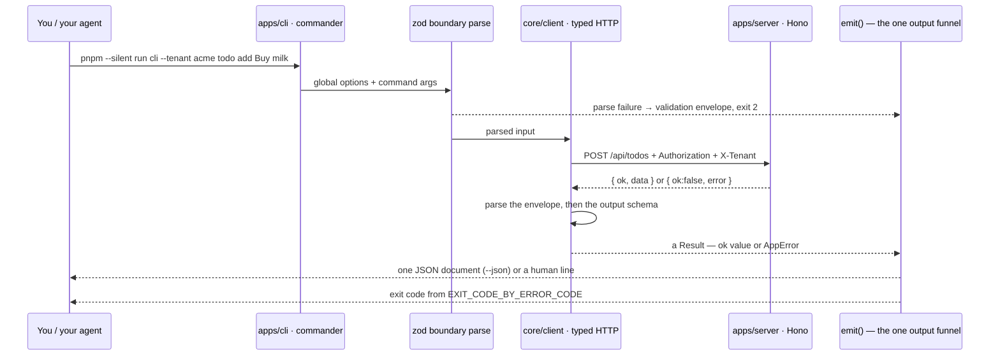

# CLI walkthrough ⌨️ \{#cli-walkthrough}

*Read this if you are driving the system from the CLI — by hand, or as an agent. Per-command transcripts live in the [CLI command reference](./cli-reference.md).*

An agent *can* read a screenshot to decide whether it wired a feature correctly —
vision-loop verification works. It is just a poor default: probabilistic where an
exit code is exact, and one to two orders of magnitude more tokens and latency
per check. The CLI is the closed verification loop that answers cheaply and
exactly instead. It covers the day-to-day capability surface, with known
exceptions of two kinds: passkeys and Google sign-in are browser-bound (the CLI
auth adapter hard-errors on the WebAuthn ceremony, and the Google consent
redirect needs a browser) and so is the *completion* of a password reset (the CLI
owns the request half, `account request-password-reset`, but the token that
finishes it exists only inside the emailed link, which opens the web app's
`/reset-password` form), while TOTP enrolment and the internal backfill
executor (`POST /api/internal/backfills/:name`) run over plain HTTP and simply
have no CLI command yet. For what it does cover, each capability has a command,
`--json` prints exactly **one** JSON document on stdout, and the process exit
code is mapped from the error taxonomy rather than chosen ad hoc.

It is also the reference client. It goes through `core/client` exactly like the
web app does, never hand-writing a URL, so a CLI round-trip proves every layer
from contract to repository is wired. This page covers the invocation model, the
stored config, the envelope and the exit codes; the
[CLI command reference](./cli-reference.md) walks every command group as it
exists in `demo/apps/cli/src/main.ts`.

Run everything from `demo/`. `--silent` keeps pnpm's own output off stdout:

```bash
pnpm --silent run cli --json health
```

## The invocation model ▶️ \{#the-invocation-model}



Three properties fall out of that shape and matter to anyone scripting it:

- **A bad argument never reaches the network.** Global options and command
  arguments are zod-parsed at the CLI boundary; a failure emits one `validation`
  envelope and returns.
- **A commander parse failure is an envelope too.** The program sets
  `exitOverride()` and silences commander's own stderr, so an unknown command or a
  missing option becomes exactly one `validation` envelope with exit 2 — not
  plain-text stderr and a bare exit 1.
- **A response that does not match the contract is an error, not a surprise.**
  `core/client` parses the envelope and then the route's output schema; a mismatch
  becomes `internal` rather than a half-typed object.

## Global options and stored config ⚙️ \{#global-options-and-stored-config}

| Option | Meaning |
|---|---|
| `--json` | machine-readable output: exactly one JSON document on stdout |
| `--api-url <url>` | API base URL for this invocation; must parse as a URL |
| `--tenant <slug>` | tenant slug for this invocation; must parse as a canonical slug |

The config lives at `~/.config/agentproofarch/config.json`, is written
atomically with mode `0600`, and keeps one session profile per canonical API
origin:

```json
{
  "version": 2,
  "currentOrigin": "http://localhost:47100",
  "profiles": {
    "http://localhost:47100": {
      "token": "…",
      "tenant": "acme"
    },
    "https://agentproofarch.vercel.app": {
      "token": "…",
      "tenant": null
    }
  }
}
```

API URL precedence is `--api-url` → `APP_CLI_API_URL` → the local dev default
when running inside this repo → `currentOrigin`. Tenant precedence is
`--tenant` → `APP_CLI_TENANT` → the selected origin profile. The token always
comes from that profile; there is no token environment variable.

`login` / `register` / `login-link --link` store the session token under the
active origin only, `tenant switch` stores that origin's tenant, and `logout`
attempts to revoke the session server-side, then sets that origin's token back
to `null` even if revocation fails. A bearer-authenticated CLI that retained its
local copy after a failed revocation would leave stale credentials on disk.

A deliberate context switch keeps both sessions:

```bash
pnpm --silent run cli origin use http://localhost:47100
pnpm --silent run cli --api-url https://agentproofarch.vercel.app login --email you@example.com --password '…'
pnpm --silent run cli origin list
pnpm --silent run cli origin use http://localhost:47100
```

`origin list` marks `currentOrigin` and reports only whether each profile has a
token, never the token itself. Inside this checkout, repo detection still
defaults ordinary invocations to localhost; use `--api-url` or
`APP_CLI_API_URL` when deliberately targeting a deployment from here.

:::note[Position does not matter]
Global options are declared on the root program and commander collects them onto
it wherever they appear, so `cli -- --tenant acme todo list` and
`cli -- todo list --tenant acme` are equivalent — `cliCtx()` reads
`program.opts()` either way. The repository's own examples use both. `--json` is
additionally sniffed straight off `process.argv`, so even a commander parse
failure emits its envelope as JSON when you asked for JSON.
:::

## The envelope and the exit codes 📦 \{#the-envelope-and-the-exit-codes}

`--json` emits the `Result` re-wrapped as an envelope, pretty-printed with two
spaces:

{/*release-version*/}

```json
{
  "ok": true,
  "data": {
    "version": "1.2.0",
    "sha": "unknown",
    "status": "ok",
    "database": "up"
  }
}
```

{/*/release-version*/}

```json
{
  "ok": false,
  "error": {
    "code": "forbidden",
    "message": "Not allowed"
  }
}
```

Without `--json` a success prints a human line on **stdout** and a failure prints
`error(<code>): <message>` on **stderr**. Either way the exit code is
`EXIT_CODE_BY_ERROR_CODE[code]`:

| Error code | Exit | HTTP status | Typical cause |
|---|---|---|---|
| — (success) | 0 | 200 | |
| `validation` | 2 | 400 | bad argument, illegal board move, malformed payload |
| `unauthorized` | 3 | 401 | no session, or the stored token expired |
| `forbidden` | 4 | 403 | authenticated but the capability is not granted |
| `not_found` | 5 | 404 | no such row *in this tenant* |
| `conflict` | 6 | 409 | uniqueness violation |
| `tenant_not_found` | 7 | 404 | `--tenant` names a tenant that does not resolve |
| `unavailable` | 8 | 503 | readiness failure (the database is down) |
| `internal` | 10 | 500 | an unhandled infrastructure rejection |

That table is a single exhaustive mapping in `core/contract/http-status.ts`: one
`Record<ErrorCode, number>` for HTTP status and one for exit code, so a new error
kind cannot be added without both. The smoke gate imports the same table and
asserts against it, which is why the CLI's exit codes and the server's statuses
cannot drift.

## Using it as an agent loop 🤖 \{#using-it-as-an-agent-loop}

The point of the exit codes is that a script can branch on them without parsing
prose:

```bash
pnpm --silent run cli --tenant acme todo list --json > out.json
case $? in
  0) jq '.data.todos | length' out.json ;;
  3) echo "session expired — re-run login" ;;
  7) echo "unknown tenant — check --tenant" ;;
  *) jq -r '.error.code + ": " + .error.message' out.json; exit 1 ;;
esac
```

The runtime gate does exactly this, at a larger scale: `pnpm run smoke` boots the
real server against an isolated database and drives health → sign-in → todos →
unauthorized through this same CLI, asserting the taxonomy exit codes on the way
(including `unauthorized` = 3 and a `--tenant` that does not resolve =
`tenant_not_found` = 7). See [Testing doctrine](../guides/testing-doctrine.md) and
[Errors and API versioning](../architecture/errors-and-api-versioning.md).

## Where next ➡️ \{#where-next}

- [CLI command reference](./cli-reference.md) — every command group and subcommand,
  with real output.
- [Adding a feature](./adding-a-feature.md) — the loop applied to a new resource.
