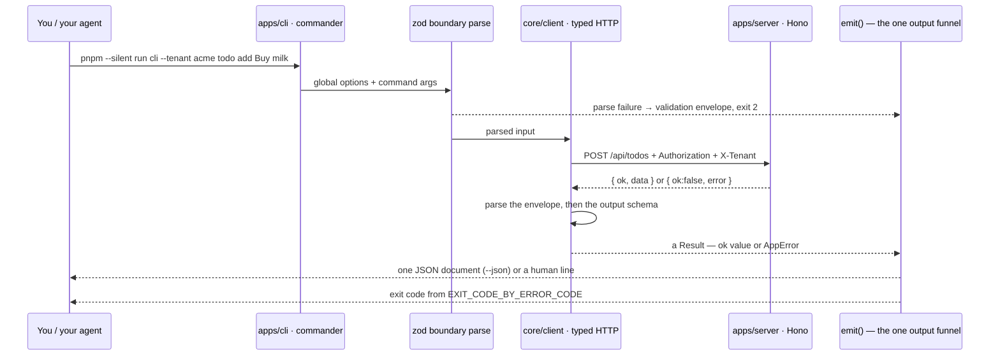

# CLI walkthrough ⌨️ \{#cli-walkthrough}

*Read this if you are driving the system from the CLI — by hand, or as an agent.*

An agent cannot read a screenshot to decide whether it wired a feature correctly.
The CLI is the closed verification loop that answers instead. Three properties
make it one: every capability has a command, `--json` prints exactly **one** JSON
document on stdout, and the process exit code is mapped from the error taxonomy
rather than chosen ad hoc.

It is also the reference client. It goes through `core/client` exactly like the
web app does, never hand-writing a URL, so a CLI round-trip proves every layer
from contract to repository is wired. This page walks every command group as it
exists in `demo/apps/cli/src/main.ts`.

Run everything from `demo/`. `--silent` keeps pnpm's own output off stdout:

```bash
pnpm --silent run cli --json health
```

## The invocation model ▶️ \{#the-invocation-model}



Three properties fall out of that shape and matter to anyone scripting it:

- **A bad argument never reaches the network.** Global options and command
  arguments are zod-parsed at the CLI boundary; a failure emits one `validation`
  envelope and returns.
- **A commander parse failure is an envelope too.** The program sets
  `exitOverride()` and silences commander's own stderr, so an unknown command or a
  missing option becomes exactly one `validation` envelope with exit 2 — not
  plain-text stderr and a bare exit 1.
- **A response that does not match the contract is an error, not a surprise.**
  `core/client` parses the envelope and then the route's output schema; a mismatch
  becomes `internal` rather than a half-typed object.

## Global options and stored config ⚙️ \{#global-options-and-stored-config}

| Option | Meaning |
|---|---|
| `--json` | machine-readable output: exactly one JSON document on stdout |
| `--api-url <url>` | API base URL for this invocation; must parse as a URL |
| `--tenant <slug>` | tenant slug for this invocation; must parse as a canonical slug |

Both `--api-url` and `--tenant` **override** the stored config for that
invocation. The config lives at `~/.config/agentproofarch/config.json`, is written
with mode `0600`, and holds three keys:

```json
{
  "apiUrl": "http://localhost:47100",
  "token": null,
  "tenant": null
}
```

`login` / `register` / `login-link --link` store the session token there,
`tenant switch` stores the active tenant, and `logout` sets the token back to
`null` — after revoking the session server-side first, because a bearer-authenticated
CLI that only cleared its local copy would leave the session valid.

:::note[Position does not matter]
Global options are declared on the root program and commander collects them onto
it wherever they appear, so `cli -- --tenant acme todo list` and
`cli -- todo list --tenant acme` are equivalent — `cliCtx()` reads
`program.opts()` either way. The repository's own examples use both. `--json` is
additionally sniffed straight off `process.argv`, so even a commander parse
failure emits its envelope as JSON when you asked for JSON.
:::

## The envelope and the exit codes 📦 \{#the-envelope-and-the-exit-codes}

`--json` emits the `Result` re-wrapped as an envelope, pretty-printed with two
spaces:

```json
{
  "ok": true,
  "data": {
    "status": "ok",
    "database": "up",
    "version": "0.1.0",
    "sha": "unknown"
  }
}
```

```json
{
  "ok": false,
  "error": {
    "code": "forbidden",
    "message": "Not allowed"
  }
}
```

Without `--json` a success prints a human line on **stdout** and a failure prints
`error(<code>): <message>` on **stderr**. Either way the exit code is
`EXIT_CODE_BY_ERROR_CODE[code]`:

| Error code | Exit | HTTP status | Typical cause |
|---|---|---|---|
| — (success) | 0 | 200 | |
| `validation` | 2 | 400 | bad argument, illegal board move, malformed payload |
| `unauthorized` | 3 | 401 | no session, or the stored token expired |
| `forbidden` | 4 | 403 | authenticated but the capability is not granted |
| `not_found` | 5 | 404 | no such row *in this tenant* |
| `conflict` | 6 | 409 | uniqueness violation |
| `tenant_not_found` | 7 | 404 | `--tenant` names a tenant that does not resolve |
| `unavailable` | 8 | 503 | readiness failure (the database is down) |
| `internal` | 10 | 500 | an unhandled infrastructure rejection |

That table is a single exhaustive mapping in `core/contract/http-status.ts`: one
`Record<ErrorCode, number>` for HTTP status and one for exit code, so a new error
kind cannot be added without both. The smoke gate imports the same table and
asserts against it, which is why the CLI's exit codes and the server's statuses
cannot drift.

## Session: `health`, `register`, `login`, `login-link`, `logout`, `whoami` 🔐 \{#session-health-register-login-login-link-logout-whoami}

### `health` 🩺 \{#health}

```bash
pnpm --silent run cli health
```

```text
status=ok db=up v0.1.0 sha=unknown
```

`version` is `package.json`'s version — the single release-identity source — and
`sha` is the build attestation (`APP_COMMIT_SHA`), reported as `unknown` locally
because only a deploy sets it. There are three health routes:
`/api/health/live` (never touches the database), `/api/health/ready` (returns the
`unavailable` envelope with HTTP 503 when the database is down, never a 200), and
the compat `/api/health` the `health` command calls, which reports the database
status inline at 200.

### `register`, `login`, `whoami` 🔑 \{#register-login-whoami}

```bash
pnpm --silent run cli register --name Demo --email demo@agentproofarch.dev --password demo1234
pnpm --silent run cli login --email demo@agentproofarch.dev --password demo1234
pnpm --silent run cli whoami
```

```text
registered and signed in as demo@agentproofarch.dev
signed in as demo@agentproofarch.dev
demo@agentproofarch.dev @ Acme Sp. z o.o. (acme, staff: owner)
```

With no tenant selected `whoami` prints
`demo@agentproofarch.dev (no tenant selected)`. Its `--json` form is the
`/api/me` payload:

```json
{
  "ok": true,
  "data": {
    "userId": "…",
    "email": "demo@agentproofarch.dev",
    "name": "Demo User",
    "tenant": {
      "id": "tenant-acme",
      "slug": "acme",
      "name": "Acme Sp. z o.o.",
      "staffRole": "owner",
      "memberId": null
    }
  }
}
```

### `login-link` ✉️ \{#login-link}

Passwordless sign-in is two steps, because there is deliberately no in-app
dev route that hands you the link:

```bash
pnpm --silent run cli login-link --email mag@example.com
# → magic link requested for mag@example.com — open it from your inbox (dev/CI: Mailpit)
#   read it at http://localhost:47980
pnpm --silent run cli login-link --email mag@example.com --link 'http://localhost:47100/api/auth/magic-link/verify?...'
# → signed in as mag@example.com via magic link
```

### `logout` 🚪 \{#logout}

```bash
pnpm --silent run cli logout        # revokes server-side, then drops the token
```

## `tenant`: `list`, `create`, `switch` 🏢 \{#tenant-list-create-switch}

`tenant` is the **staff** surface — the tenants you administer, not the tenants
you are a customer of.

```bash
pnpm --silent run cli tenant list
```

```text
acme	Acme Sp. z o.o.	(owner)
globex	Globex Corp	(admin)
```

```bash
pnpm --silent run cli tenant create Northwind Traders
# → created tenant: Northwind Traders (northwind-traders)
pnpm --silent run cli tenant switch globex
# → active tenant: Globex Corp (globex)
```

`tenant create` derives the slug from the name with `normalizeSlug` unless you
pass `--slug`, and makes you its owner. `tenant switch` first checks the slug
against your staff memberships and refuses locally with `not_found` (exit 5) —
"You do not administer any tenant with slug …" — before writing anything to
config.

## `todo`: `list`, `add` 📝 \{#todo-list-add}

The smallest complete vertical slice, and the one the smoke gate drives.

```bash
pnpm --silent run cli --tenant acme todo list
pnpm --silent run cli --tenant acme todo add Buy milk
```

```text
- Wdrożyć walking skeleton na produkcję  (3f8a1c02)
- Sprawdzić izolację danych między tenantami  (b17d94ee)
added: Buy milk (9c2e04b7)
```

Ids are printed truncated to 8 characters; `--json` gives you the full row:

```json
{
  "ok": true,
  "data": {
    "todos": [
      {
        "id": "3f8a1c02-…",
        "tenantId": "tenant-acme",
        "title": "Wdrożyć walking skeleton na produkcję",
        "createdBy": "…",
        "createdAt": "2026-07-26T09:12:44.921Z"
      }
    ]
  }
}
```

Tenant isolation is not a filter you remember to apply — every tenant-scoped
use-case takes `ctx.identity` and every repository method requires a `tenantId`.
Switch the header and the same command returns a different world:

```bash
pnpm --silent run cli --tenant globex todo list
# → - Globex: przygotować prezentację architektury  (…)
```

## `card`: `list`, `add`, `move` 🃏 \{#card-list-add-move}

Two boards share one substrate. `--board personal` (the default) has columns
`todo`/`doing`/`done` and no path rules. `--board team` is the *guarded* exemplar:
ordered columns `todo → in-dev → review → done`, with WIP limits of **3** on
`in-dev` and **2** on `review`.

```bash
pnpm --silent run cli card add Sketch the API
pnpm --silent run cli card list
pnpm --silent run cli card add Ship it --board team
pnpm --silent run cli card move <id> --board team --to in-dev
pnpm --silent run cli card list --board team
```

```text
added: Sketch the API [todo#0] (5b1f7ac9)
- [todo] Sketch the API  (5b1f7ac9)
added: Ship it [todo#0] (ae30c184)
moved: Ship it -> [in-dev#0] (ae30c184)
- [in-dev] Ship it  (ae30c184)
```

`move` takes `--to <column>` (required) and an optional 0-based `--index`;
omitting `--index` appends to the end of the target column. Three team-board
guards can reject a move, and the rejection is a `validation` error (exit 2) that
names the broken rule:

| Guard | Rule |
|---|---|
| `wip-limit` | the destination column is at its limit (`in-dev`: 3, `review`: 2) |
| `review-requires-in-dev` | a card may only enter `review` if it has visited `in-dev` |
| `done-only-from-review` | `done` is reachable only from `review` |

Team cards are also born in `todo` only — the entry column is a rule, not a
default, because a card spawned directly in `done` would have bypassed every
guard above.

```bash
pnpm --silent run cli card move <id> --board team --to done; echo "exit=$?"
# → error(validation): …done-only-from-review…
# → exit=2
```

## `member`: `list`, `ensure`, `update`, `remove`, `export` 👥 \{#member-list-ensure-update-remove-export}

Members are the tenant's **end customers** — a different concept from staff. The
whole group is staff-only.

### `member list` 📋 \{#member-list}

```bash
pnpm --silent run cli --tenant acme member list
```

```text
- alice@example.com	Alice Example  (member-a)  [vip, early-adopter]
- mag@example.com	Magic Link Member  (member-a)  [provisioned]
```

### `member ensure` ♻️ \{#member-ensure}

```bash
pnpm --silent run cli member ensure carol@example.com --name "Carol Example" --tag vip --tag beta
# → created: carol@example.com (…)      # run again → exists: carol@example.com (…)
```

Idempotent find-or-create keyed on email — the entry point a provisioning
integration calls.

### `member update` ✏️ \{#member-update}

```bash
pnpm --silent run cli member update <id> --name "Carol E." --tag vip
```

`--tag` **replaces** the whole tag set. `--clear-name` clears the display name
explicitly, which is why it is a separate flag from omitting `--name`.

### `member export` 📤 \{#member-export}

```bash
pnpm --silent run cli member export <id>
# → exported carol@example.com at 2026-07-26T09:31:02.004Z
```

The GDPR access/portability dump.

### `member remove` 🗑️ \{#member-remove}

```bash
pnpm --silent run cli member remove <id>
# → removed: <id> (members deleted: 1)
```

Deletes the member and their tenant-scoped data, leaving the global account
untouched.

## `staff`: `list`, `grant`, `revoke` 👑 \{#staff-list-grant-revoke}

Flat `owner`/`admin` grants — there is no organizations/teams concept in the
foundation. Listing is staff-readable; granting and revoking are **owner-only**.

```bash
pnpm --silent run cli staff list
```

```text
- demo@agentproofarch.dev	Demo User  (owner)
```

```bash
pnpm --silent run cli staff grant colleague@example.com
# → granted: colleague@example.com (admin)     # re-run → already staff: …
pnpm --silent run cli staff revoke --email colleague@example.com
# → revoked: … (grants removed: 1)
```

There are **no invitations**: the target must already have an account, and a
grant against an unknown email is `not_found` (exit 5). Revoking the last owner
is refused — the tenant cannot be left ownerless.

## `domain`: `list`, `add`, `check`, `remove` 🌐 \{#domain-list-add-check-remove}

Custom domains for the active tenant. Reading is staff-readable; add, check and
remove are owner-only.

Every transcript in this section is **shown with the `noop` provisioner** — the
dev and Vercel default. The same commands against the `caddy` self-host
provisioner print a configured DNS target and a real verification detail; that
transcript is on
[Self-host & custom domains](../operations/self-host-and-domains.md#driving-it-from-the-cli).

```bash
pnpm --silent run cli --tenant acme domain list
```

```text
- acme.localhost	verified
(no DNS target configured)
```

The target line is what the web add-flow renders as the DNS record to create. It
reports `no DNS target configured` under the `noop` provisioner — dev and Vercel —
because that provisioner sets neither a CNAME nor an IP; the `caddy` self-host
provisioner sets exactly one.

```bash
pnpm --silent run cli domain add shop.example.com
# → attached: shop.example.com (pending)
pnpm --silent run cli domain check shop.example.com
# → shop.example.com: pending — <detail from the DNS check>
pnpm --silent run cli domain remove shop.example.com
# → removed: shop.example.com (rows: 1)
```

A newly added domain is **unverified** until `domain check` confirms DNS points at
the deploy target. See
[Self-host and domains](../operations/self-host-and-domains.md) for the two
provisioning paths.

## `public`: `profile` 📣 \{#public-profile}

The unauthenticated read surface, deliberately exercised with **no session** — the
command builds a second API client that carries neither token nor tenant header.

```bash
pnpm --silent run cli public profile acme
```

```text
acme	Acme Sp. z o.o.	(v1f4kq9)
```

It is a two-step call on purpose, mirroring the caching model: discovery
(`/api/public/tenants/acme`) returns the current content version, then the
version-keyed profile (`/api/public/tenants/acme/v/<version>`) is fetched — that
URL is long-cached and busted by the version in the path, not by a header. The
profile carries only `slug`, `displayName` and `contentVersion`; the schema strips
anything else that tries to ride along. The version token is derived from the
tenant's visible content, so a rename changes it — yours will differ from the
sample. Rationale:
[ADR-0006](../decisions/0006-public-read-only-surface.md).

## Command reference 📋 \{#command-reference}

| Group | Commands |
|---|---|
| session | `health`, `register`, `login`, `login-link`, `logout`, `whoami` |
| `tenant` | `list`, `create <name...>` `[--slug]`, `switch <slug>` |
| `todo` | `list`, `add <title...>` |
| `card` | `list` `[--board]`, `add <title...>` `[--board] [--column]`, `move <id> --to <column>` `[--board] [--index]` |
| `member` | `list`, `ensure <email>` `[--name] [--tag…]`, `update <id>` `[--name] [--clear-name] [--tag…]`, `remove <id>`, `export <id>` |
| `staff` | `list`, `grant <email>`, `revoke --email` \| `--user-id` |
| `domain` | `list`, `add <domain>`, `check <domain>`, `remove <domain>` |
| `public` | `profile <tenant>` |

## Using it as an agent loop 🤖 \{#using-it-as-an-agent-loop}

The point of the exit codes is that a script can branch on them without parsing
prose:

```bash
pnpm --silent run cli --tenant acme todo list --json > out.json
case $? in
  0) jq '.data.todos | length' out.json ;;
  3) echo "session expired — re-run login" ;;
  7) echo "unknown tenant — check --tenant" ;;
  *) jq -r '.error.code + ": " + .error.message' out.json; exit 1 ;;
esac
```

The runtime gate does exactly this, at a larger scale: `pnpm run smoke` boots the
real server against an isolated database and drives health → sign-in → todos →
unauthorized through this same CLI, asserting the taxonomy exit codes on the way
(including `unauthorized` = 3 and a `--tenant` that does not resolve =
`tenant_not_found` = 7). See [Testing doctrine](../guides/testing-doctrine.md) and
[Errors and API versioning](../architecture/errors-and-api-versioning.md).
