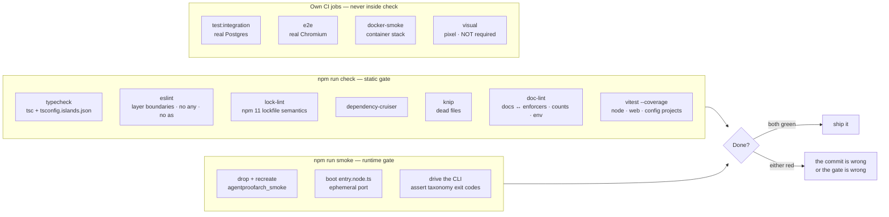

# Writing tests per the doctrine ✅ \{#writing-tests-per-the-doctrine}

Most test suites answer "does the happy path work". This one is built to answer a
harder question: **can an agent's change break something quietly?** That reframes
everything. The gates are non-negotiable rather than advisory, coverage is a
ratchet rather than a target, a flake is a bug rather than an annoyance to rerun
past, and the enforcers themselves get tested — because a lint rule someone
weakened is exactly the kind of silent regression the whole structure exists to
prevent. This page is the practical version of that stance: which level a test
belongs to, what to assert there, and which test classes you are expected to write
and not just hope for.

Doctrine source:
[`demo/CLAUDE.md`](https://github.com/chomamateusz/agentproofarch/blob/main/demo/CLAUDE.md)
and [ADR-0004](../decisions/0004-no-exceptions-enforcement.md).

## The two gates, and everything hanging off them 🛡️ \{#the-two-gates-and-everything-hanging-off-them}



:::danger[Done = `check` green AND `smoke` green]
Static-green is not done; the app must actually run. And do not weaken a lint rule
to make either gate green — that inverts the whole point of having one.
:::

## Where does my test go? 🗂️ \{#where-does-my-test-go}

Four levels carry the doctrine — unit, integration, e2e, smoke:

| Level | Command | Environment | Count today | Where it runs |
|---|---|---|---|---|
| **unit** | `npm run test` (inside `check`) | node + jsdom, **no database** | 84 test files | every `check`, locally and in CI |
| **integration** | `npm run test:integration` | real Postgres, opt-in via `VITEST_INTEGRATION=1` | 48 tests | the CI `smoke` job — the only one with a database |
| **e2e** | `npm run e2e` | real Chromium over the real stack | 15 tests / 6 specs | the CI `e2e` job |
| **smoke** | `npm run smoke` | real server, driven through the CLI | the runtime gate | locally + the CI `smoke` job |

…plus two suites that are not levels of their own, because neither is a place a
new test gets written:

| Suite | Command | Environment | What it is | Where it runs |
|---|---|---|---|---|
| **remote smoke** | `npm run smoke:remote` | a deployed URL | the **same** smoke suite pointed at a deploy, not a separate set of tests | `post-deploy-smoke`, after every deploy |
| **pixel** | `npm run visual` | Chromium + CI-rendered baselines | screenshot comparison, deliberately **not a required check** ([ADR-0008](../decisions/0008-visual-regression.md)) | the `visual` job |

The unit run is split into vitest **projects**, and which one your file lands in is
decided by its path:

| Project | Includes | Environment | Why |
|---|---|---|---|
| `node` | `core/**`, `adapters/**`, `apps/cli/**`, `apps/server/**`, `scripts/**`, the ESLint plugin, **and** `apps/web/src/features/*/core/**` | node | island cores are pure TS, so their tests run without jsdom — that is how TUI portability gets exercised on every `check` |
| `web` | the rest of `apps/web/**` | jsdom + msw + user-event | component tests; 15s timeout because parallel CI load pushes render/settle waits past the 5s default |
| `config` | `config-regression/**` | node | probes that run the real linter |
| `integration` | `**/*.integration.test.ts` | node + Postgres | added only when `VITEST_INTEGRATION=1` |

The `node` project explicitly **excludes** `*.integration.test.ts`, so a
database-dependent test can never leak into a database-free run and fail
mysteriously in `check`.

Pixel comparison lives in its own suite and its own config
(`playwright.visual.config.ts`) so a moved screenshot can never redden `e2e`
([ADR-0008](../decisions/0008-visual-regression.md)).

## Testing a port without a live adapter 🔌 \{#testing-a-port-without-a-live-adapter}

Use-cases depend on **ports** — interfaces — so the unit level needs no fakes
framework, no container, no mock library. A hand-written object that satisfies the
interface is the whole apparatus, and injected `ids`/`clock` make the output
deterministic. This is the pattern used throughout `core/server/usecases`:

```ts
const fakeRepo = (initial: Todo[] = []) => {
  const store = [...initial];
  const repo: TodoRepository = {
    listByTenant: async (tenantId) => store.filter((t) => t.tenantId === tenantId),
    create: async (todo) => {
      store.push(todo);
    },
  };
  return { repo, store };
};

const deps = (repo: TodoRepository) => ({
  todos: repo,
  ids: { nextId: () => 'todo-1' },
  clock: { nowIso: () => '2026-07-03T00:00:00.000Z' },
});
```

Returning `store` alongside `repo` is the trick that makes write assertions cheap:
you assert on the *result* and on what actually reached the port.

## The test classes you are expected to write 🧪 \{#the-test-classes-you-are-expected-to-write}

These are not stylistic suggestions — each one guards a failure mode this
architecture claims to prevent, so a claim without its test class is an unbacked
claim.

### Denial tests (default-deny, at the unit level) ⛔ \{#denial-tests-default-deny-at-the-unit-level}

Every tenant-scoped use-case authorizes **first**: its opening statement is the
capability predicate. So every use-case needs a test proving the denial happens
before any repository access:

```ts
it('denies a tenant-less caller with forbidden (default-deny predicate runs first)', async () => {
  const { repo } = fakeRepo();
  const listed = await listTodos({ identity: identity(null) }, deps(repo));
  expect(listed).toMatchObject({ ok: false, error: { code: 'forbidden' } });

  const added = await addTodo({ identity: identity(null) }, { title: 'x' }, deps(repo));
  expect(added).toMatchObject({ ok: false, error: { code: 'forbidden' } });
});
```

The scaffolder ships three of these as **real** tests for every new resource
(staff allowed, member per policy, tenant-less denied) — they start red and stay
red until you name the capabilities and their grants.

### Cross-tenant probes 🏢 \{#cross-tenant-probes}

A tenant-scoped read must not merely filter — it must be *unable* to see another
tenant's row, and the leak must surface as `not_found`, not `forbidden` (which
would confirm the row exists). Assert both the error and that the other tenant's
data is untouched:

```ts
it('returns not_found for a card the tenant does not own (cross-tenant denial)', async () => {
  const { repo } = fakeRepo([...seed(), card('other', 't-globex', 'todo', 0)]);
  const result = await moveCard(
    { identity: identity('t-acme') },
    { cardId: 'other', toColumn: 'doing', toIndex: 0 },
    deps(repo),
  );
  expect(result).toMatchObject({ ok: false, error: { code: 'not_found' } });
  expect(await layout(repo, 't-globex')).toEqual({ todo: ['other'] });
});
```

### Corrupted-row tests (integration level) 🗄️ \{#corrupted-row-tests-integration-level}

Reading is a boundary, and boundaries are zod-parsed. The way to prove that is to
plant a row the application could never have written — with raw SQL — and assert
the read **rejects** rather than returning a half-valid object:

```ts
it('the adapter zod boundary rejects a corrupted card row (negative position)', async () => {
  await db.execute(
    sql`INSERT INTO cards (id, tenant_id, title, board, "column", position, visited, created_at)
        VALUES ('itest-corrupt-card', ${tenantB.id}, 'corrupt', 'personal', 'todo', -1, '[]'::jsonb, '2026-01-01T00:00:00.000Z')`,
  );
  await expect(cardRepo().listByTenant(tenantB.id, 'personal')).rejects.toThrow();
});
```

The same suite has the mirror case for invariants a database *can* hold — a
`CHECK` constraint rejecting an illegal column for its board — which is the point:
put the invariant in the database where the database can carry it, and at the zod
read boundary where it cannot (jsonb columns admit no closed-set `CHECK`).

### Config-regression probes ⚙️ \{#config-regression-probes}

47 tests whose subject is the **enforcers**. Two shapes, and the difference is
worth being honest about:

- **Fixture-fed probes** (most of them) write a deliberately illegal file into the
  real tree at a path where the rule applies, run the real linter, and assert the
  specific `ruleId` fires — an `as` cast in `core/domain`, a `core` file importing
  `adapters`, one feature importing another, a restricted package import, a broken
  drizzle migration sequence. All fixtures live under a per-run token directory and
  are always swept away.
- **Structural probes** are text or regex scans over real sources: that every
  MUST-ATOMIC operation in `architecture.md` maps to exactly one port method, that
  every tenant-scoped use-case names the authorize predicate, that the public
  contract group keeps its stance.

:::warning[What the probes honestly do not prove]
The structural probes state their own limits in the source. The authorization scan
proves the `authorize`/`authorizeTenant` identifier appears in the function body —
**not** that the call precedes repository access; that ordering stays a review
lever. It also only recognizes a use-case shaped as an exported `const` whose first
parameter is `ctx: Ctx`; a differently shaped one escapes detection. Likewise
`doc-lint` checks a fixed manifest of prose-promised guarantees against the
enforcer configuration both ways, by rule name — it is a named-manifest check, not
a proof that every guarantee or every boundary is covered.
:::

**The rule for you: when you add an enforcer, add the probe that feeds it a
violating fixture and asserts the gate still goes red.** Otherwise the rule can be
deleted silently and everything stays green.

## Coverage is a ratchet, not a target 📈 \{#coverage-is-a-ratchet-not-a-target}

Thresholds in `vitest.config.ts` are a **floor set to the measured minimum**,
per metric, rounded down — currently statements 76, branches 89, functions 82,
lines 76. A regression below the floor fails `check`; when coverage climbs, the
floor is raised to track it. The config carries a dated log of every adjustment
and its cause, because a floor that moves without a reason is a floor nobody
trusts.

Two consequences to internalize:

- **A "low" number can be honest.** Integration-only files (repositories,
  `migrate.ts`) read 0% in the database-free run because their real coverage lives
  in `test:integration`, which runs where Postgres exists.
- **Some files are excluded, with the reason written down.** The smoke/e2e
  orchestration scripts, the Mailpit HTTP client and `doc-lint` have no
  database-free unit surface at all — they boot servers or drive deploys — so
  counting them as 0% would falsely depress the floor for everyone else. They are
  exercised by the `smoke` and `e2e` CI jobs instead.

## A flake is a P1 bug 🚨 \{#a-flake-is-a-p1-bug}

Owner ruling, 2026-07-20 (DECIDE F3). **The gates are deterministic. A red gate
means the commit is wrong or the gate is wrong — one of them gets fixed.**
Rerunning a red CI job until it passes is prohibited.

Playwright keeps `retries: 1` with `trace: 'on-first-retry'`, and that is *not* a
loophole — it is diagnostic capture. Any run that went green **because** of the
retry is flaky-flagged and requires a filed P1 before merging. The PR template
carries the line, and a rerun-to-green merge without a linked P1 is rejected in
review.

Two things follow from taking that seriously:

- Flakes get **fixed at the source**. The `EADDRINUSE` e2e startup flake was filed
  as a P1 and closed by making the harness free the port before boot
  ([#55](https://github.com/chomamateusz/agentproofarch/pull/55)) — not by adding
  a retry.
- Where a harness genuinely cannot be deterministic under test load, the *reason*
  is written into the config: the `web` project's 15s timeout says jsdom + msw +
  user-event under parallel CI CPU load, and the e2e harness boots with
  `AUTH_RATE_LIMIT: 'off'` because the specs replay many sign-ins from one bucket
  (the baseline is on everywhere else, including dev).

## Checklist for a new test 📋 \{#checklist-for-a-new-test}

1. Pure logic? → unit, in the layer that owns it, with a hand-written port fake.
2. Touches SQL, a constraint, or a read boundary? → `*.integration.test.ts`.
3. Only observable in a browser? → an e2e spec — and remember `e2e` is required for
   any `apps/web` change.
4. New capability reachable from a client? → it belongs in the smoke flow, with its
   taxonomy exit code asserted.
5. New enforcer? → a config-regression probe that proves it still rejects.
6. Coverage moved down? → find out why before you touch the floor.

Further reading: [CI gates](../operations/ci-gates.md) for the job layout,
[ADR-0004](../decisions/0004-no-exceptions-enforcement.md) for why none of this is
bypassable, and [Agent workflow](./agent-workflow.md) for how it fits a
PR.
