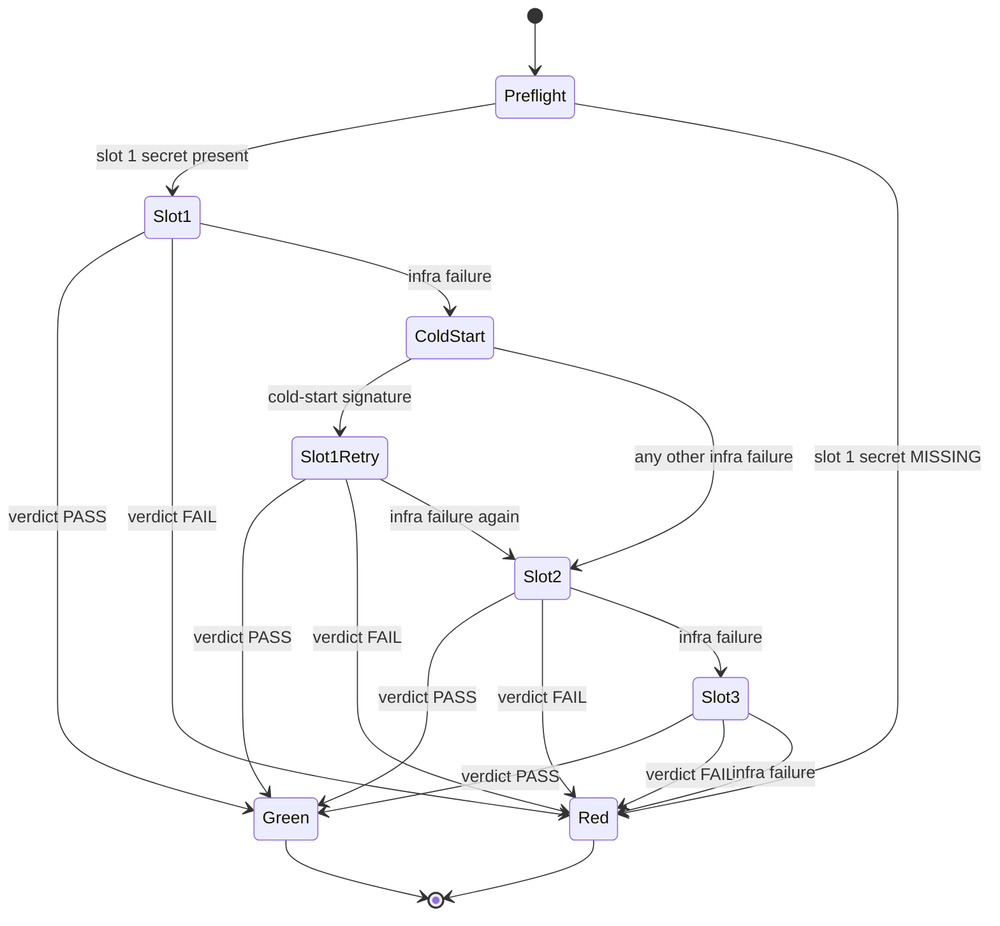

# The `ai-review` gate 🤖 \{#the-ai-review-gate}

*Read this if you maintain the workflows. To merge a PR, the one-screen summary
in [CI gates](./ci-gates.md#the-required-set) is enough.*

The design goal is one sentence: **"could not verify" and "verified safe" must never collapse to the same colour.** A review check that cannot run — limits hit, tool unavailable, timeout — is **red**, exactly like a found defect. This is the implementation of the fail-closed bullet in the repo's operating hygiene (DECIDE F1 — an [owner ruling from the decision queue](https://github.com/chomamateusz/agentproofarch/blob/main/docs/backlog.md)). The gate has been a **required `main-gates` check since 2026-07-26**.

## Shape 🧱 \{#shape}

`anthropics/claude-code-action` (pinned to a commit SHA) reviews **only the PR diff** — the prompt instructs the model to fetch `git diff origin/main...HEAD` itself rather than read the whole repository — against this repo's doctrine: layer boundaries, the comment doctrine (zero narration), no false claims in prose, no weakening of gates or lint rules to go green, authorize-first tenant-scoped use-cases, no `any`, no `as` except `as const`, and domain errors returned as `Result` rather than thrown. The model gets **read-only tools only**:

```
--model ${{ vars.AI_REVIEW_MODEL || 'sonnet' }}
--max-turns ${{ vars.AI_REVIEW_MAX_TURNS || 40 }}
--allowedTools "Read,Grep,Glob,Task,Bash(git diff:*),Bash(git fetch:*),Bash(git log:*),Bash(git show:*)"
--json-schema '{"type":"object","properties":{"verdict":{"type":"string","enum":["PASS","FAIL"]},…}}'
```

It never writes files, never posts, and never sets the exit code. The workflow does all three. The prompt's own instruction closes the ambiguity gap: *when a real doctrine violation is genuinely in doubt, FAIL.*

## The slot ladder 🪜 \{#the-slot-ladder}



Slots are `CLAUDE_CODE_OAUTH_TOKEN_1` (present today) then the wired-but-optional `_2` and `_3`. Two rules keep the ladder honest:

- **Failover happens only on infra failure.** A real `PASS` or `FAIL` fails fast and never burns the next token re-running the same verdict — the `if:` expression on each later slot literally tests that no earlier slot produced `pass` or `fail`.
- **Absent slots skip cleanly.** A preflight step emits presence booleans and never echoes a token value:

```bash
[ -n "$SLOT1" ] && echo "has_slot_1=true" >> "$GITHUB_OUTPUT" || echo "has_slot_1=false" >> "$GITHUB_OUTPUT"
```

GitHub Actions has no native cross-step token failover; this ordered-attempt ladder is the smallest honest wrapper for it.

## Verdict → exit code ⚖️ \{#verdict--exit-code}

`classify-review.sh` maps each attempt to `pass | fail | infra | skip`. Anything that is not an explicitly parsed verdict is `infra` — empty output, non-JSON, a missing `verdict` field, a crashed or rate-limited attempt:

```bash
verdict="$(printf '%s' "$raw" | jq -r 'if type == "object" then (.verdict // "") else "" end' 2>/dev/null || true)"
case "$verdict" in
  PASS) emit pass ;;
  FAIL) emit fail ;;
  *) emit infra ;;
esac
```

`gate-review.sh` is the authoritative exit code. It walks the slots in order and the first explicit verdict wins:

```bash
for outcome in "${O1:-}" "${O1R:-}" "${O2:-}" "${O3:-}"; do
  case "$outcome" in
    pass) echo "AI review PASS — mergeable."; exit 0 ;;
    fail) echo "AI review FAIL — blocking doctrine issues; merge blocked."; exit 1 ;;
  esac
done
echo "AI review could not obtain a verdict from any available token slot …"
exit 1
```

Everything that is not a positive `PASS` exits non-zero.

| Situation | Gate colour | Why |
|---|---|---|
| A slot returns `verdict: PASS` | green | the only green path |
| A slot returns `verdict: FAIL` | red | blocking doctrine issues |
| Every available slot fails on infra | red | "could not verify" is not "verified safe" |
| Empty or malformed model output | red | classified `infra` |
| `CLAUDE_CODE_OAUTH_TOKEN_1` missing | red | no slot to consult |
| PR from a fork | red | fork runs get no secrets, so all slots skip |
| Job hits `timeout-minutes: 15` | red | bounds the known `--json-schema` CLI hang |
| The verdict comment fails to post | unchanged | posting is `continue-on-error`, so an API hiccup cannot flip a real PASS |

The fork row is the sharpest illustration of the doctrine: fork PRs are deliberately **not** skipped by the job guard, because a skipped *required* check would count as passing.

## The cold-start retry 🔁 \{#the-cold-start-retry}

There is exactly **one** exception to strict slot ordering: a single same-slot retry when an attempt matches the known cold-start signature of [claude-code#23265](https://github.com/anthropics/claude-code/issues/23265) — a `result` event that errored **while costing nothing**, meaning the model was never actually called. `detect-coldstart.sh` reads the CLI execution log:

```bash
cold_start="$(jq -r '
  [ (if type == "array" then .[] else . end)
    | select(type == "object" and .type == "result") ]
  | last
  | (. != null and .is_error == true and .total_cost_usd == 0
     and (((.result // "") | tostring)
          | test("authenticat|invalid bearer|unauthorized|\\b401\\b"; "i") | not))
' "$exec_log" 2>/dev/null || echo false)"
```

Two design details are worth reading twice:

- **The default is fail-safe `false`.** A missing, empty or unparsable log is *not* a cold start, so the gate behaves exactly as it would without this step.
- **A rejected credential is excluded on purpose.** A dead token also produces an errored zero-cost result — the model is never reached — so the result text is tested for auth-rejection wording. Retrying a dead token in the same slot can only fail again, and would merely delay failover to slot 2.

## The un-masking story 🎭 \{#the-un-masking-story}

This is the debugging story worth telling, because it changed what the workflow logs. The action masks **every** failed run that carried a `--json-schema` behind one message:

> `--json-schema was provided but Claude did not return structured_output`

The base action throws that before reaching the branch that would report the real error, so an auth rejection, a rate limit and a network drop all surface as the same schema-shaped lie. `failure-reason.sh` is the only place the underlying message reaches the log — it prints the CLI's own last `result` event:

```bash
jq -r '… | "subtype=\(.subtype) is_error=\(.is_error) num_turns=\(.num_turns) cost=\(.total_cost_usd)\nresult=\(.result)"' \
  "$exec_log" | sed 's/^/  | /'
```

Three constraints shaped that short script:

1. **It is diagnostic only.** Callers run it with `continue-on-error`, so it can never move the gate; a missing or unparsable log is reported, not fatal.
2. **Every emitted line is prefixed** (`sed 's/^/  | /'`). `.result` is model-authored, PR-influenced text: an embedded newline followed by `::` could otherwise reach column 0, where the runner would execute it as a workflow command (`::add-mask::`, `::error::`) against the job's own log.
3. **It runs before the next attempt.** Every attempt writes the *same* execution-log path, so each slot's un-masking step must run before the following attempt overwrites it — which is why the step order is attempt → classify → un-mask → cold-start check → next attempt.

The same PR-controlled-text discipline runs throughout the gate: model output and attempt outcomes arrive as **environment variables** and are parsed with `jq`, never interpolated into the shell.

## Posting 💬 \{#posting}

`post-review.sh` posts a single **sticky** comment (`gh pr comment --edit-last`, falling back to create) so repeated pushes update one comment instead of spamming the PR. When no slot produced a verdict it says so explicitly — "RED (could not run)", with the reason and the remedy — rather than staying silent.

Concurrency is one in-flight review per PR (`cancel-in-progress: true`), so a new push supersedes the previous run.

:::note[Token hygiene]
The OAuth token is a subscription-scoped, rotatable, limited-value credential from `claude setup-token` — **not** a production secret, so keeping it as a repo Actions secret does not violate the "production secrets never in Actions" rule. The workflow never echoes it. Adding slots `_2`/`_3` later needs no workflow edit: create the secrets, and the already-wired slots start participating.
:::

## Where next ➡️ \{#where-next}

- [CI gates](./ci-gates.md) — where this gate sits among the others.
- [Agent workflow](../guides/agent-workflow.md) — the PR lifecycle this gate reviews.
- [ADR-0004](../decisions/0004-no-exceptions-enforcement.md) — why gates are enforcement, not convention.
