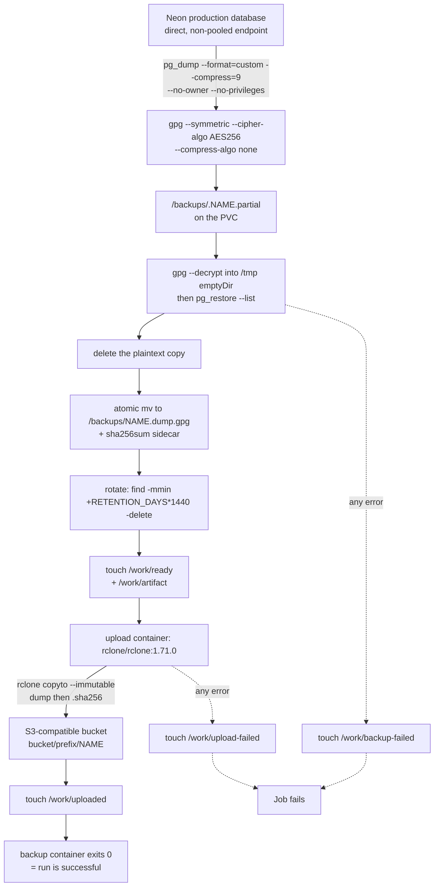
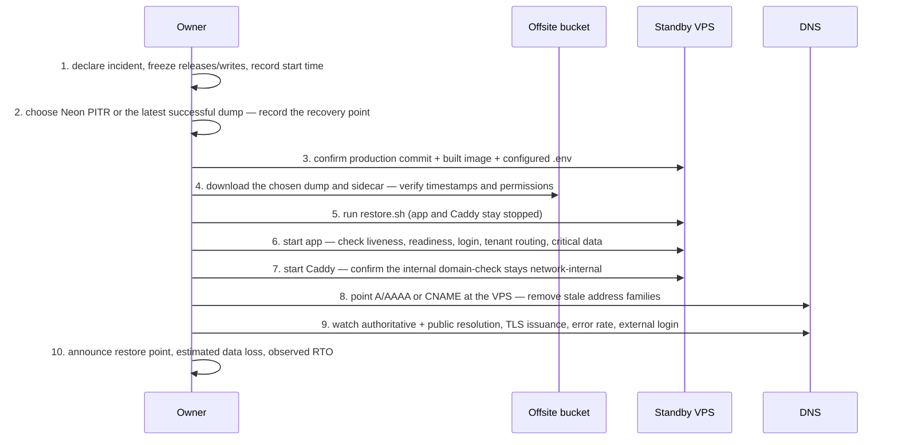

# Backup & disaster recovery 💾 \{#backup--disaster-recovery}

*Read this if you are responsible for getting this system back after losing it.*

The whole deployment topology assumes two vendors — Vercel and Neon — so the disaster to plan for is losing one of them entirely: account suspension, provider outage, or a destructive migration that outran its restore window. The production backup package therefore lives **outside** both: it runs on the owner's k3s VPS, while GitHub Actions exercises it only against disposable services and throwaway credentials. No production credential belongs in GitHub, this repository, a shell command or shell history. The cold standby is the repository's own Docker self-host stack, which means DR reuses a target that a required CI check already proves works.

:::info[Source of truth]
[`demo/ops/backup/README.md`](https://github.com/chomamateusz/agentproofarch/blob/main/demo/ops/backup/README.md) plus the manifests beside it: [`namespace.yaml`](https://github.com/chomamateusz/agentproofarch/blob/main/demo/ops/backup/namespace.yaml), [`secret.template.yaml`](https://github.com/chomamateusz/agentproofarch/blob/main/demo/ops/backup/secret.template.yaml), [`pvc.yaml`](https://github.com/chomamateusz/agentproofarch/blob/main/demo/ops/backup/pvc.yaml), [`cronjob.yaml`](https://github.com/chomamateusz/agentproofarch/blob/main/demo/ops/backup/cronjob.yaml), [`restore.sh`](https://github.com/chomamateusz/agentproofarch/blob/main/demo/ops/backup/restore.sh). Installed by hand on the VPS; acceptance-tested by [`.github/workflows/dr-acceptance.yml`](https://github.com/chomamateusz/agentproofarch/blob/main/.github/workflows/dr-acceptance.yml).
:::

## CI acceptance scope 🧪 \{#ci-acceptance-scope}

The non-required `dr-acceptance` job creates a disposable k3d cluster with PostgreSQL 16 and MinIO, deploys the checked-in package, and runs two CronJob-derived backups. It proves Job completion, local rotation, an encrypted non-plaintext artifact, its SHA-256 sidecar, an identical offsite copy, restoration through the checked-in `restore.sh` into a scratch Docker Compose database, byte-identical known rows, and refusal of a one-byte-corrupted dump. It also creates the Secret with the README's documented single-env-file `kubectl create secret` form and asserts that every key the CronJob consumes is present.

That job is package acceptance, not a production DR drill. k3d cannot prove real k3s node storage and restart behavior, a real offsite failure domain or lifecycle policy, Neon compatibility and production-scale dump time, real provider credentials, recovery-key custody, DNS failover, or the stated RPO/RTO. Those remain VPS installation and quarterly-drill evidence.

## The CronJob model ⏰ \{#the-cronjob-model}

One `CronJob` (`agentproofarch-postgres-backup`, schedule `7 * * * *`, `Etc/UTC`) runs two containers that hand off through a shared `emptyDir` at `/work`. The handshake is what makes "successful" mean *both* copies exist.



Five properties of that flow are the design, not incidentals:

1. **Validation is end to end.** The artifact is decrypted again and its catalog read with `pg_restore --list` *before* it is published. A dump that cannot be listed never becomes a backup.
2. **The plaintext copy is quarantined.** Verification needs a transient decrypted file, and it is written to the backup container's **private** `emptyDir` at `/tmp` — never to the PVC, never to the volume shared with the upload container, never offsite. Only the encrypted `.dump.gpg` and its checksum leave the node.
3. **Publication is atomic.** The dump is written to a dotted `.partial` name and `mv`'d into place only after verification, so a crashed run never leaves a half-written file that looks like a backup.
4. **Rotation runs before the upload wait.** Local rotation happens as soon as the local artifact is final, so a prolonged offsite outage cannot fill the PVC with an unbounded backlog while the run blocks on `rclone`.
5. **The run is not green until both copies exist.** The backup container polls for `/work/uploaded` and exits `1` if it sees `/work/upload-failed`; the upload container polls for `/work/ready` and exits `1` on `/work/backup-failed`. Either half failing fails the Job.

### Manifest facts 📄 \{#manifest-facts}

| Setting | Value | Where |
|---|---|---|
| Schedule | `7 * * * *`, `timeZone: Etc/UTC` | `cronjob.yaml` |
| Overlap policy | `concurrencyPolicy: Forbid`, `startingDeadlineSeconds: 1800` | `cronjob.yaml` |
| Retry / deadline | `backoffLimit: 1`, `activeDeadlineSeconds: 2700`, `ttlSecondsAfterFinished: 86400` | `cronjob.yaml` |
| Job history | `successfulJobsHistoryLimit: 3`, `failedJobsHistoryLimit: 5` | `cronjob.yaml` |
| Local retention | `RETENTION_DAYS: "14"` | `cronjob.yaml` env |
| Local storage | 20 GiB, `local-path`, `ReadWriteOnce` | `pvc.yaml` |
| Images | `postgres:16-bookworm`, `rclone/rclone:1.71.0` | `cronjob.yaml` |
| Namespace | `agentproofarch-backup` | `namespace.yaml` |

### Security posture 🔒 \{#security-posture}

Both containers run with the same hardening, which is worth listing because a backup pod holds the most sensitive credential in the system:

- `runAsNonRoot: true`, `readOnlyRootFilesystem: true`, `allowPrivilegeEscalation: false`, `capabilities: drop: [ALL]`, `seccompProfile: RuntimeDefault`.
- `automountServiceAccountToken: false` — the pod has no reason to talk to the Kubernetes API.
- The encryption key is mounted from a Secret with `defaultMode: 0440`, projected as the single item `backup-passphrase`, and read by `gpg --passphrase-file`; it never appears on a command line.
- The upload container gets `RCLONE_CONFIG=/dev/null` and receives every credential as `RCLONE_CONFIG_OFFSITE_*` env from the Secret — there is no rclone config file to leak.
- `rclone copyto --immutable` refuses to overwrite an existing object, so a re-run cannot silently replace an earlier artifact.

## Retention 🗓️ \{#retention}

| Tier | Window | Owned by |
|---|---|---|
| Local PVC | 14 days of hourly encrypted artifacts (`RETENTION_DAYS`) | the CronJob's `find … -delete` |
| Offsite bucket | **at least 35 days**, ideally with object versioning or object lock | the bucket's lifecycle policy — the CronJob never deletes offsite objects |

The bucket must sit in a **failure domain independent of both the VPS and Neon**; that independence is the entire point of the offsite copy. The default 20 GiB PVC only holds 14 days of hourly artifacts while each encrypted dump stays under roughly 60 MiB — read the real artifact size after the first run and either grow the PVC or shorten `RETENTION_DAYS` before the window closes.

## RPO and RTO — as stated, with the conditions ⏱️ \{#rpo-and-rto--as-stated-with-the-conditions}

The operating target is **roughly a one-hour RPO and a 30–60 minute RTO**, and the README is explicit that both numbers only hold under stated conditions:

- **The RPO is the age of the newest *successful* run.** The honest worst case is therefore one schedule interval **plus one dump duration**, and everything written after that point is lost unless Neon itself survives and Neon PITR can be used instead.
- **The RTO assumes the standby VPS already holds the production commit *and a pre-built application image*.** A cold `docker compose build` on an unprepared host adds several minutes and breaks the budget outright.

:::warning[Measure, don't trust the table]
The README's instruction is unambiguous: measure both numbers in the quarterly drill rather than trusting the table. A restore drill is the only evidence that the RPO/RTO pair is real.
:::

## Install (on the VPS) 🛠️ \{#install-on-the-vps}

Generate the symmetric key on an owner-controlled machine and store a second copy in the owner's password manager or offline vault:

```bash
umask 077
openssl rand -base64 48 > /root/agentproofarch-backup-passphrase
chmod 600 /root/agentproofarch-backup-passphrase
```

:::danger[Losing both copies of the key makes every backup unrecoverable]
Rotating the key requires **keeping the old key** until every backup encrypted with it has expired.
:::

Then, from `demo/ops/backup/` on the k3s VPS:

```bash
kubectl apply -f namespace.yaml
install -m 600 /dev/null /root/agentproofarch-backup.env
# edit that file in a local editor; it holds exactly these keys:
#   DATABASE_URL, S3_PROVIDER, S3_ENDPOINT, S3_REGION,
#   S3_ACCESS_KEY_ID, S3_SECRET_ACCESS_KEY, S3_BUCKET, S3_PREFIX
printf 'backup-passphrase=%s\n' "$(cat /root/agentproofarch-backup-passphrase)" \
  >> /root/agentproofarch-backup.env

kubectl create secret generic agentproofarch-backup-secrets \
  --namespace agentproofarch-backup \
  --from-env-file=/root/agentproofarch-backup.env \
  --dry-run=client \
  --output yaml |
  kubectl apply -f -
shred -u /root/agentproofarch-backup.env
kubectl apply -f pvc.yaml
kubectl apply -f cronjob.yaml
kubectl get cronjob,pvc -n agentproofarch-backup
```

The passphrase joins the same env file because kubectl refuses to combine `--from-env-file` with `--from-file` in a single `create secret` call, and the file is shredded once the Secret exists. The `--dry-run=client | kubectl apply -f -` flow exists so **no secret value ever reaches a command line** or shell history. Two constraints on the values: use Neon's **direct** endpoint, not its pooled one, and keep the prefix free of a leading slash. `secret.template.yaml` is a reference containing placeholders only — never apply it unedited, never commit a populated copy.

Then force one run immediately and read **both** container logs:

```bash
job="agentproofarch-backup-manual-$(date -u +%Y%m%d%H%M%S)"
kubectl create job --namespace agentproofarch-backup \
  --from=cronjob/agentproofarch-postgres-backup "$job"
kubectl wait --namespace agentproofarch-backup \
  --for=condition=complete --timeout=45m "job/$job"
kubectl logs --namespace agentproofarch-backup "job/$job" --container backup
kubectl logs --namespace agentproofarch-backup "job/$job" --container upload
```

Both logs must name the **same** `.dump.gpg` artifact. Installation is finished only after downloading the first offsite object to an isolated location and completing the restore drill — **a successful upload alone does not prove recoverability.**

### Monitoring 📈 \{#monitoring}

Alert when no successful Job has completed for **two hours**, when a Job fails, when PVC use exceeds **80%**, or when the bucket rejects uploads. Kubernetes retains only a small Job history, so ship Job status and container logs to the owner's monitoring system rather than relying on `kubectl`.

## The restore drill ♻️ \{#the-restore-drill}

Run it on an isolated VPS or an isolated Compose project, on the exact production commit where possible, and never against production DNS.

```bash
# 1. Prepare the stack FIRST — building during an incident is not in the budget.
cd demo
cp .env.example .env    # fresh BETTER_AUTH_SECRET, local Postgres credentials,
                        # base URL, domain and Caddy settings — never production values
docker compose -f docker-compose.prod.yml build app

# 2. Download one .dump.gpg and its sidecar, named exactly <dump>.sha256,
#    into a root-only directory. Then, from demo/ops/backup/:
PASSPHRASE_FILE=/root/agentproofarch-backup-passphrase \
RESTORE_CONFIRM=restore-agentproofarch \
./restore.sh /root/restore/agentproofarch-YYYYMMDDTHHMMSSZ.dump.gpg

# 3. Start and verify the app. The entrypoint migrates on startup and finds
#    the restored schema already at the current revision.
cd ../..
docker compose -f docker-compose.prod.yml up -d app
curl --fail --silent --show-error http://127.0.0.1:47100/api/health/live
curl --fail --silent --show-error http://127.0.0.1:47100/api/health/ready
docker compose -f docker-compose.prod.yml logs --tail=100 app

# 4. Only once DNS and APP_BASE_URL are right:
docker compose -f docker-compose.prod.yml --profile edge up -d caddy
```

`restore.sh` is deliberately unfriendly, and every refusal is a guard:

| Guard | Effect |
|---|---|
| `RESTORE_CONFIRM` must equal `restore-agentproofarch` | no accidental invocation |
| The `.sha256` sidecar is **required** and checked | no restore of a truncated download |
| Full GPG authentication into root-only temp space (`umask 077`, `chmod 600`) | the plaintext dump is never world-readable, and a trap deletes it on exit |
| `pg_restore --list` before any destructive step | the catalog is read *before* the target database is dropped |
| PostgreSQL client major must be **16** | no cross-major restore surprise |
| The target database name is pattern-checked and `postgres`/`template0`/`template1` are refused | no restore over a system database |
| `app` and `caddy` are stopped first, and **left stopped** afterwards | verification happens before anything is public |
| `pg_restore --no-owner --no-privileges`, then `vacuumdb --analyze-in-stages` | no production ownership/grants leak in, and the restored database has statistics |

Set `TMPDIR` to a root-only filesystem with enough free space for the decrypted dump when `/tmp` is too small. Record the artifact timestamp, restore start and finish, application-ready time, dump age, row-count checks and any manual intervention — then securely erase drill data.

## Cold-standby failover 🧊 \{#cold-standby-failover}

"Prepared" has a precise meaning: the production commit is checked out, `.env` is filled in with **standby-only** values, and `docker compose -f docker-compose.prod.yml build app` has already produced the image. The RTO budget assumes all three. Set the production DNS TTL to **300 seconds or lower during normal operations** — lowering it after an outage does not expire records already cached.



| Window | Outcome |
|---|---|
| 0–10 min | Incident declared, restore point selected, DNS owner ready |
| 10–30 min | Dump downloaded, decrypted, restored, and analyzed |
| 30–45 min | App, tenant routing, auth, and critical data verified |
| 45–60 min | DNS flipped, TLS and external checks green |

Do **not** overwrite or delete the incident dump, its sidecar, the old DNS values, or the Neon recovery points until the owner explicitly closes the incident. **Failback is a separate migration**, not an undo: quiesce writes, take a fresh backup from the active VPS database, restore into a new managed target, verify, then flip DNS under another change window.

## Quarterly failover test ✅ \{#quarterly-failover-test}

The README carries a 16-item checklist; its non-obvious items are the ones that catch real rot:

- **Select a random offsite backup from the quarter — not the newest object.** The newest object is the one most likely to be fine.
- **Recover the encryption key from the independent password manager or offline vault**, not from the VPS. That proves the key survives the node.
- **Confirm the DNS TTL is already ≤300 s at least one old-TTL interval before the test.**
- **Verify required PostgreSQL extensions exist in the standby image** — an extension mismatch discovered during an incident is a much worse day.
- **Verify Caddy obtains TLS only for a *verified* tenant domain, and that the internal check is not publicly reachable.**
- **Confirm a new backup succeeds after the restored stack is active.**
- **Measure the achieved RPO from the artifact time and the RTO from declaration to external readiness** — the numbers in the table above are targets, and this is where they are either confirmed or corrected.
- **Treat any failed restore or missed hourly backup as an incident.**

:::caution[Honest caveats]
- **CI proves the package on k3d; the live VPS remains manual.** The weekly and path-triggered `dr-acceptance` job exercises backup, offsite copy, restore and corruption refusal against disposable services, but nothing mechanically proves the package is currently installed and healthy on the VPS — that is what the two-hour alert and the quarterly drill are for.
- **The RPO/RTO figures are operating targets, not measured guarantees.** The README says so explicitly and instructs measuring them in the drill.
- **The default 20 GiB PVC only fits 14 days of hourly artifacts while each dump stays under roughly 60 MiB.** Past that, the retention window silently shortens unless the PVC is grown — and reducing an existing PVC is not supported.
- **The offsite tier depends on configuration this repo cannot enforce**: lifecycle rules, versioning or object lock, access logging and credential expiry all live in the bucket provider.
- **`pg_dump` must stay major version 16** to match the self-host stack's `postgres:16`. Neon must be kept at a server version PostgreSQL 16 `pg_dump` can read until this package and the self-host stack are upgraded together.
- **Broader day-2 operations are deliberately unbuilt** — alerting thresholds beyond the ones above, SLOs, an incident severity ladder and an upgrade contract sit in the deferred-work register with the first real production incident (or the first paying tenant) as the trigger.
:::
