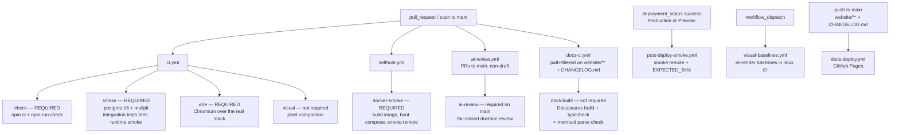
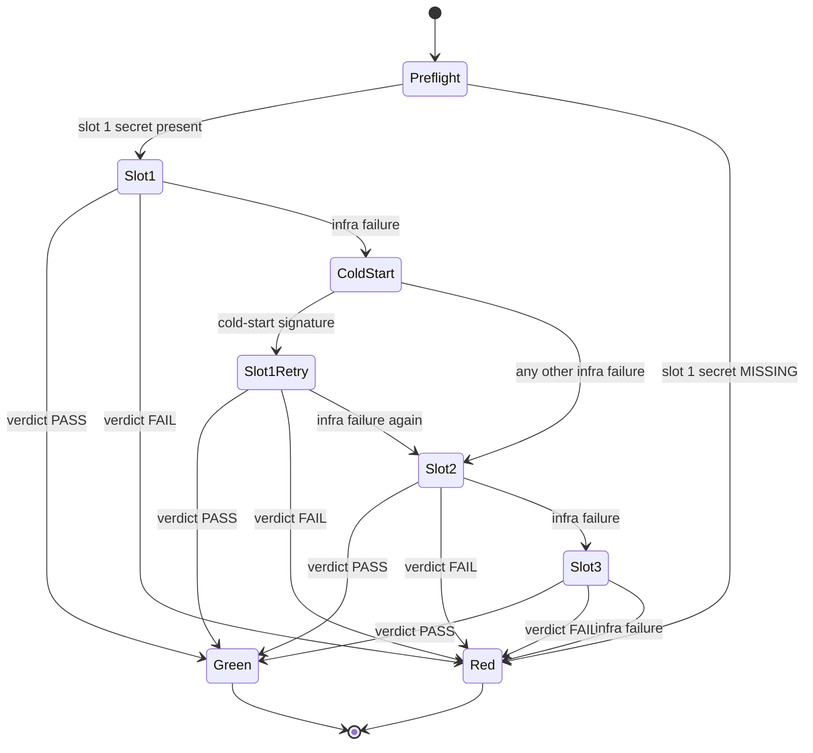

# CI gates 🛡️ \{#ci-gates}

Five consecutive deploy-config failures (PRs #10–#15) shipped with typecheck, lint and tests all green, and production was broken every time; three more incidents traced a green *local* run to a stale `node_modules` or database rather than the committed tree ([ADR-0004](../decisions/0004-no-exceptions-enforcement.md)). Those eight failures are why the foundation's central claim — *static-green is not done* — is enforced by machinery instead of asserted: every gate runs from a clean `npm ci` in CI, on every change, and the enforcers themselves are enforced.

:::info[Sources]
The workflows in [`.github/workflows/`](https://github.com/chomamateusz/agentproofarch/tree/main/.github/workflows), the scripts in [`.github/scripts/`](https://github.com/chomamateusz/agentproofarch/tree/main/.github/scripts), and [ADR-0004](../decisions/0004-no-exceptions-enforcement.md) / [ADR-0008](../decisions/0008-visual-regression.md).
:::

## The pipeline ⚙️ \{#the-pipeline}



| Workflow | Trigger | Jobs | Required by the rulesets |
|---|---|---|---|
| `ci.yml` | `pull_request`, `push` to `main` | `check`, `smoke`, `e2e`, `visual` | first three **yes**; `visual` no |
| `selfhost.yml` | `pull_request`, `push` to `main` | `docker-smoke` | **yes** |
| `ai-review.yml` | PRs to `main` (`opened` / `synchronize` / `ready_for_review`), non-draft | `ai-review` | **yes**, on `main-gates` (since 2026-07-26) |
| `post-deploy-smoke.yml` | `deployment_status` | `smoke-remote` | n/a — runs after a deploy |
| `visual-baselines.yml` | `workflow_dispatch` | `visual-baselines` | n/a — authoring tool |
| `docs-ci.yml` | `pull_request`, path-filtered | `docs-build` (build + `typecheck` + `check:mermaid`) | no |
| `docs-deploy.yml` | `push` to `main`, path-filtered | `build`, `deploy` | n/a — publishes this site |

## The required set 📋 \{#the-required-set}

`production-protection` names four status checks — **`check`**, **`smoke`**, **`e2e`**, **`docker-smoke`** — and `main-gates` names those four plus **`ai-review`**. A merge is *blocked* on a failing or missing one — not merely marked red.

### `check` — the static gate 🔍 \{#check--the-static-gate}

```bash
npm ci
npm run check
# = typecheck && typecheck:islands && lint && lock-lint
#   && depcruise && knip && doc-lint && test:coverage
```

Eight members, in that order: TypeScript; the DOM-free island-core program (`tsconfig.islands.json`); ESLint including the custom `agentproofarch/*` layer rules; `lock-lint`; dependency-cruiser (layer boundaries and vendor containment); knip (dead files and dependency hygiene); `doc-lint` (docs ↔ enforcer config in both directions, plus the migration-sequence lint); and vitest with a coverage ratchet.

One step in the same job is deliberately **advisory**:

```yaml
# Advisory only (architecture §Security baseline): high/critical findings
# are triaged, but audit's transitive noise must not break the build.
- run: npm audit --omit=dev --audit-level=high
  continue-on-error: true
```

### `smoke` — the runtime gate 💨 \{#smoke--the-runtime-gate}

Service containers: `postgres:16` and a **Mailpit** SMTP sink (`axllent/mailpit:v1.21`, SMTP on `47925`, HTTP API on `47980`). Mailpit exists because there is no dev email transport at all — dev, e2e and CI run the *real* `smtp` adapter against a sink that captures every send instead of delivering it ([ADR-0007](../decisions/0007-email-port-and-magic-link-transport.md)).

```yaml
- run: npm run test:integration   # the tier that needs a real Postgres
- run: npm run smoke              # boot the real server, drive the CLI
```

The integration tier lives here rather than in `check` because `check` is database-free, and rather than in the local `smoke` script because that must stay fast. `smoke.ts` creates and drops its own isolated `agentproofarch_smoke` database over the provided `DATABASE_URL`, so a bare `postgres:16` service is sufficient — no `docker compose` in CI.

### `e2e` — a real browser over the real stack 🖱️ \{#e2e--a-real-browser-over-the-real-stack}

```yaml
- run: npx playwright install --with-deps chromium
- run: npm run build:web
- run: npm run e2e
```

This is the only surface `smoke` cannot reach: `smoke` drives the CLI and never a browser. The e2e harness boots `entry.node.ts` against an isolated `agentproofarch_e2e` database and serves the built bundle.

### `docker-smoke` — self-host, proven 🐳 \{#docker-smoke--self-host-proven}

`selfhost.yml` proves the second deploy target for real, from the same commit:

```yaml
- run: cp .env.example .env
- run: echo "SEED_ON_START=true" >> .env
- run: echo "APP_COMMIT_SHA=${GITHUB_SHA}" >> .env
- run: docker compose -f docker-compose.prod.yml up -d --build
# then poll /api/health/ready for up to 60 attempts, 2s apart
- run: npm run smoke:remote
  env:
    BASE_URL: http://localhost:47100
    EXPECTED_SHA: ${{ github.sha }}
```

Note what this buys: the *same* CLI smoke suite the Vercel post-deploy gate runs, pointed at a container instead of a deployment — so "self-host works" is a required check rather than a claim. The default compose profile is `postgres` + `app` only (Caddy is the opt-in `edge` profile), and the job always tears the stack down with `down -v`, dumping `compose logs --no-color` first on failure.

## Deliberately non-required 🚫 \{#deliberately-non-required}

Two jobs run and report without blocking (`ai-review` graduated to required on 2026-07-26), and one external app reviews without any job at all. Each non-required status is a stated design decision, not an oversight.

| Job | Why it does not block | How it becomes blocking |
|---|---|---|
| `visual` | Pixel comparison is the classic rerun-to-green offender, and the flake doctrine treats a flake as a P1 bug. The check earns arming only after a run history of green comparisons ([ADR-0008](../decisions/0008-visual-regression.md) §4). | The owner adds `visual` to `main-gates`' required list — and takes it back out the moment it flakes. |
| `ai-review` | Shipped non-required to accumulate a verdict track record first; **armed as a required `main-gates` check on 2026-07-26**. | Done — the owner added the **`ai-review`** context (the job name) to `main-gates`. Admin-only. |
| `docs-build` | It is **path-filtered** on `website/**` and `CHANGELOG.md`, so on a PR that leaves both alone it never runs — and a required check that never runs is unmergeable. | Not possible as written; the path filter would have to go first. |
| `CodeRabbit` (GitHub App, no workflow) | An advisory second opinion configured by `.coderabbit.yaml` (chill profile, `request_changes_workflow: false`): it comments and reports a status but must never gate — the doctrinal enforcement tier is `ai-review`, and a second AI reviewer stays a perspective, not a wall. | Deliberately never; if it ever gated, a config PR would have to say so here first. |

On failure `visual` uploads `demo/test-results` as a `visual-diff` artifact (7-day retention), because a developer on macOS gets no local comparison at all: baselines are platform-scoped and `ignoreSnapshots` is on for every non-linux platform. New baselines come from the separate `visual-baselines` workflow (`workflow_dispatch`, `update: true`), which re-renders and then **re-runs the suite as a comparison against what it just wrote** before uploading the PNGs — so an authoring run that died before the harness booted cannot ship an empty or partial baseline set.

## The `ai-review` gate 🤖 \{#the-ai-review-gate}

The design goal is one sentence: **"could not verify" and "verified safe" must never collapse to the same colour.** A review check that cannot run — limits hit, tool unavailable, timeout — is **red**, exactly like a found defect. This is the implementation of the fail-closed bullet in the repo's operating hygiene (DECIDE F1).

### Shape 🧱 \{#shape}

`anthropics/claude-code-action` (pinned to a commit SHA) reviews **only the PR diff** — the prompt instructs the model to fetch `git diff origin/main...HEAD` itself rather than read the whole repository — against this repo's doctrine: layer boundaries, the comment doctrine (zero narration), no false claims in prose, no weakening of gates or lint rules to go green, authorize-first tenant-scoped use-cases, no `any`, no `as` except `as const`, and domain errors returned as `Result` rather than thrown. The model gets **read-only tools only**:

```
--model ${{ vars.AI_REVIEW_MODEL || 'sonnet' }}
--max-turns ${{ vars.AI_REVIEW_MAX_TURNS || 40 }}
--allowedTools "Read,Grep,Glob,Task,Bash(git diff:*),Bash(git fetch:*),Bash(git log:*),Bash(git show:*)"
--json-schema '{"type":"object","properties":{"verdict":{"type":"string","enum":["PASS","FAIL"]},…}}'
```

It never writes files, never posts, and never sets the exit code. The workflow does all three. The prompt's own instruction closes the ambiguity gap: *when a real doctrine violation is genuinely in doubt, FAIL.*

### The slot ladder 🪜 \{#the-slot-ladder}



Slots are `CLAUDE_CODE_OAUTH_TOKEN_1` (present today) then the wired-but-optional `_2` and `_3`. Two rules keep the ladder honest:

- **Failover happens only on infra failure.** A real `PASS` or `FAIL` fails fast and never burns the next token re-running the same verdict — the `if:` expression on each later slot literally tests that no earlier slot produced `pass` or `fail`.
- **Absent slots skip cleanly.** A preflight step emits presence booleans and never echoes a token value:

```bash
[ -n "$SLOT1" ] && echo "has_slot_1=true" >> "$GITHUB_OUTPUT" || echo "has_slot_1=false" >> "$GITHUB_OUTPUT"
```

GitHub Actions has no native cross-step token failover; this ordered-attempt ladder is the smallest honest wrapper for it.

### Verdict → exit code ⚖️ \{#verdict--exit-code}

`classify-review.sh` maps each attempt to `pass | fail | infra | skip`. Anything that is not an explicitly parsed verdict is `infra` — empty output, non-JSON, a missing `verdict` field, a crashed or rate-limited attempt:

```bash
verdict="$(printf '%s' "$raw" | jq -r 'if type == "object" then (.verdict // "") else "" end' 2>/dev/null || true)"
case "$verdict" in
  PASS) emit pass ;;
  FAIL) emit fail ;;
  *) emit infra ;;
esac
```

`gate-review.sh` is the authoritative exit code. It walks the slots in order and the first explicit verdict wins:

```bash
for outcome in "${O1:-}" "${O1R:-}" "${O2:-}" "${O3:-}"; do
  case "$outcome" in
    pass) echo "AI review PASS — mergeable."; exit 0 ;;
    fail) echo "AI review FAIL — blocking doctrine issues; merge blocked."; exit 1 ;;
  esac
done
echo "AI review could not obtain a verdict from any available token slot …"
exit 1
```

Everything that is not a positive `PASS` exits non-zero.

| Situation | Gate colour | Why |
|---|---|---|
| A slot returns `verdict: PASS` | green | the only green path |
| A slot returns `verdict: FAIL` | red | blocking doctrine issues |
| Every available slot fails on infra | red | "could not verify" is not "verified safe" |
| Empty or malformed model output | red | classified `infra` |
| `CLAUDE_CODE_OAUTH_TOKEN_1` missing | red | no slot to consult |
| PR from a fork | red | fork runs get no secrets, so all slots skip |
| Job hits `timeout-minutes: 15` | red | bounds the known `--json-schema` CLI hang |
| The verdict comment fails to post | unchanged | posting is `continue-on-error`, so an API hiccup cannot flip a real PASS |

The fork row is the sharpest illustration of the doctrine: fork PRs are deliberately **not** skipped by the job guard, because a skipped *required* check would count as passing.

### The cold-start retry 🔁 \{#the-cold-start-retry}

There is exactly **one** exception to strict slot ordering: a single same-slot retry when an attempt matches the known cold-start signature of [claude-code#23265](https://github.com/anthropics/claude-code/issues/23265) — a `result` event that errored **while costing nothing**, meaning the model was never actually called. `detect-coldstart.sh` reads the CLI execution log:

```bash
cold_start="$(jq -r '
  [ (if type == "array" then .[] else . end)
    | select(type == "object" and .type == "result") ]
  | last
  | (. != null and .is_error == true and .total_cost_usd == 0
     and (((.result // "") | tostring)
          | test("authenticat|invalid bearer|unauthorized|\\b401\\b"; "i") | not))
' "$exec_log" 2>/dev/null || echo false)"
```

Two design details are worth reading twice:

- **The default is fail-safe `false`.** A missing, empty or unparsable log is *not* a cold start, so the gate behaves exactly as it would without this step.
- **A rejected credential is excluded on purpose.** A dead token also produces an errored zero-cost result — the model is never reached — so the result text is tested for auth-rejection wording. Retrying a dead token in the same slot can only fail again, and would merely delay failover to slot 2.

### The un-masking story 🎭 \{#the-un-masking-story}

This is the debugging story worth telling, because it changed what the workflow logs. The action masks **every** failed run that carried a `--json-schema` behind one message:

> `--json-schema was provided but Claude did not return structured_output`

The base action throws that before reaching the branch that would report the real error, so an auth rejection, a rate limit and a network drop all surface as the same schema-shaped lie. `failure-reason.sh` is the only place the underlying message reaches the log — it prints the CLI's own last `result` event:

```bash
jq -r '… | "subtype=\(.subtype) is_error=\(.is_error) num_turns=\(.num_turns) cost=\(.total_cost_usd)\nresult=\(.result)"' \
  "$exec_log" | sed 's/^/  | /'
```

Three constraints shaped that short script:

1. **It is diagnostic only.** Callers run it with `continue-on-error`, so it can never move the gate; a missing or unparsable log is reported, not fatal.
2. **Every emitted line is prefixed** (`sed 's/^/  | /'`). `.result` is model-authored, PR-influenced text: an embedded newline followed by `::` could otherwise reach column 0, where the runner would execute it as a workflow command (`::add-mask::`, `::error::`) against the job's own log.
3. **It runs before the next attempt.** Every attempt writes the *same* execution-log path, so each slot's un-masking step must run before the following attempt overwrites it — which is why the step order is attempt → classify → un-mask → cold-start check → next attempt.

The same PR-controlled-text discipline runs throughout the gate: model output and attempt outcomes arrive as **environment variables** and are parsed with `jq`, never interpolated into the shell.

### Posting 💬 \{#posting}

`post-review.sh` posts a single **sticky** comment (`gh pr comment --edit-last`, falling back to create) so repeated pushes update one comment instead of spamming the PR. When no slot produced a verdict it says so explicitly — "RED (could not run)", with the reason and the remedy — rather than staying silent.

Concurrency is one in-flight review per PR (`cancel-in-progress: true`), so a new push supersedes the previous run.

:::note[Token hygiene]
The OAuth token is a subscription-scoped, rotatable, limited-value credential from `claude setup-token` — **not** a production secret, so keeping it as a repo Actions secret does not violate the "production secrets never in Actions" rule. The workflow never echoes it. Adding slots `_2`/`_3` later needs no workflow edit: create the secrets, and the already-wired slots start participating.
:::

## After the deploy 🚀 \{#after-the-deploy}

`post-deploy-smoke.yml` listens for `deployment_status` and re-runs `smoke:remote` when the state is `success` and the environment is `Production` **or** `Preview` (staging deploys as a Preview, so it is covered too). The target URL depends on the environment, and this is the non-obvious part:

```yaml
BASE_URL: ${{ github.event.deployment.environment == 'Production'
  && 'https://agentproofarch.vercel.app'
  || github.event.deployment_status.environment_url }}
EXPECTED_SHA: ${{ github.event.deployment.sha }}
```

- **Production drives the production *alias*, not the per-deployment URL.** The alias is what users hit, Better Auth only trusts `APP_BASE_URL` as the CSRF origin, and testing the alias also proves promotion/aliasing actually worked.
- **Previews and staging drive their own `environment_url`**, which their `VERCEL_URL`-derived auth origin already trusts.
- **`EXPECTED_SHA` is the attestation.** The smoke asserts the live health `sha` equals the SHA this deployment event carried, so it can never green a stale deploy — see [Health & attestation](./health-and-attestation.md).

Because this drives live production, it runs under the production smoke-account doctrine: a dedicated canary tenant, never `db:seed` against a real database, credentials from CI secrets, and a drive that does not poison itself. Its concurrency half is enforced in the workflow — a per-environment, per-SHA group with **`cancel-in-progress: false`**, because a running smoke is a live production verification that must finish rather than be pre-empted, and because two overlapping runs would race on the shared canary tenant.

## Cross-cutting hardening 🔒 \{#cross-cutting-hardening}

- **Every `uses:` is pinned to a full commit SHA**, never a mutable tag, with a trailing comment recording the human-readable version the SHA resolved to (`# v4.3.0` for `actions/checkout`, `# v4.4.0` for `actions/setup-node`, and `# v1` for `anthropics/claude-code-action`, whose pinned commit is its `v1.0.181` release — the comment records the major line the pin tracks). A tag can be force-moved onto malicious code under an unchanged CI config.
- **Every job is guarded** with `if: github.repository == 'chomamateusz/agentproofarch'`. The repo is public and therefore forkable; a fork must never spend Actions minutes or fail on missing secrets and services.
- **Node 24 with `cache: npm`** and an explicit `cache-dependency-path`, so each workflow caches against the right lockfile (`demo/` or `website/`).
- **The diagrams on this site are parsed, not merely built.** `@docusaurus/theme-mermaid` renders in the browser, so a green `docusaurus build` proves nothing about a fenced `mermaid` block — a malformed one would ship as a red error box with every check green, which is the exact "could not verify, reported green" shape this repo rejects. `npm run check:mermaid` (`website/scripts/check-mermaid.mjs`) feeds every block on the site to mermaid's own parser under node and fails on the first syntax error. It runs in `docs-ci.yml` beside `typecheck`, and again in `docs-deploy.yml` before the Pages artifact is uploaded. Dead links need no such step: `onBrokenLinks`, `onBrokenAnchors` and `onBrokenMarkdownLinks` are all `throw`, so the build itself is the link gate.
- **The enforcers are enforced.** Config-regression probes feed a deliberately violating fixture to a lint or dependency-cruiser rule and assert the gate still goes red, so a rule cannot be quietly deleted while CI stays green ([ADR-0004](../decisions/0004-no-exceptions-enforcement.md) §3).

:::caution[Honest caveats]
- **`ai-review` blocks merges to `main`.** It runs and posts on every non-draft PR to `main` and has been in the `main-gates` required-checks list since 2026-07-26; a PR without a PASS verdict cannot merge. It does not (and technically cannot) gate `production` PRs — the workflow triggers only on PRs to `main`, and every commit reaching a release PR has already been individually reviewed there.
- **`visual` blocks nothing today** either, by design — and runner-image drift (a font package changing in `ubuntu-latest`) will one day redraw a baseline with no code change. That is the accepted cost of exactness at `maxDiffPixels: 0` *and* `threshold: 0`.
- **`docs-build` cannot be made required as written**, because it is path-filtered.
- **`doc-lint` is a named-manifest check**, not proof that every prose-promised guarantee has an enforcer. Some config-regression tests are rule-presence checks rather than fixture-feeding probes.
- **A false RED is possible** — the documented cold-start flake is the known example. Its consequence is a blocked merge the owner re-runs, which is the correct direction for a fail-closed gate.
:::
