# CI gates 🚦 \{#ci-gates}

*Read this if you need to know which job blocks a merge, or you maintain the workflows.*

Five consecutive deploy-config failures (PRs #10–#15) shipped with typecheck, lint and tests all green, and production was broken every time. Three more incidents traced a green *local* run to a stale `node_modules` or database rather than the committed tree ([ADR-0004](../decisions/0004-no-exceptions-enforcement.md)).

Those eight failures are why the foundation's central claim — *static-green is not done* — is enforced by machinery instead of asserted. Every gate runs from a clean `pnpm install --frozen-lockfile` in CI, on every change, and the enforcers themselves are enforced.

:::info[Sources]
The workflows in [`.github/workflows/`](https://github.com/chomamateusz/agentproofarch/tree/main/.github/workflows), the scripts in [`.github/scripts/`](https://github.com/chomamateusz/agentproofarch/tree/main/.github/scripts), and [ADR-0004](../decisions/0004-no-exceptions-enforcement.md) / [ADR-0008](../decisions/0008-visual-regression.md).
:::

## The pipeline ⚙️ \{#the-pipeline}

```mermaid
flowchart TD
    pr["pull_request / push to main"] --> ci["ci.yml"]
    pr --> sh["selfhost.yml"]
    pr --> ai["ai-review.yml<br/>PRs to main, non-draft"]
    pr --> dci["docs-ci.yml<br/>path-filtered on website/** + CHANGELOG.md"]
    pr --> dr["dr-acceptance.yml<br/>backup-package paths"]
    pr --> lh["lhci.yml<br/>path-filtered on website/**"]

    ci --> check["check — REQUIRED<br/>pnpm install --frozen-lockfile + pnpm run check"]
    ci --> smoke["smoke — REQUIRED<br/>postgres:16 + mailpit<br/>integration tests, runtime smoke,<br/>quickstart probe"]
    ci --> e2e["e2e — REQUIRED<br/>Chromium over the real stack"]
    ci --> visual["visual — not required<br/>pixel comparison"]
    visual --> vr["visual-report — not required<br/>sticky PR gallery"]
    sh --> docker["docker-smoke — REQUIRED<br/>build image, boot compose, smoke:remote"]
    ai --> aireview["ai-review — required on main<br/>fail-closed doctrine review"]
    dci --> docsbuild["docs-build — not required<br/>Docusaurus build + typecheck<br/>+ mermaid parse check"]
    dr --> drjob["dr-acceptance — not required<br/>k3d backup + restore"]
    lh --> lhdocs["lhci-docs — not required<br/>Lighthouse assertions at warn"]

    weekly["weekly schedule / dispatch"] --> sc["scorecard.yml"]
    sc --> scjob["analysis — not required<br/>OpenSSF Scorecard SARIF"]

    deploy["deployment_status success<br/>Production or Preview"] --> pds["post-deploy-smoke.yml<br/>smoke:remote + EXPECTED_SHA"]
    dispatch["workflow_dispatch"] --> vb["visual-baselines.yml<br/>re-render baselines in linux CI"]
    approve["/approve-visuals comment<br/>owner only"] --> av["approve-visuals.yml<br/>guard, then dispatch"]
    av --> vb
    pushmain["push to main<br/>website/** + CHANGELOG.md"] --> dd["docs-deploy.yml<br/>GitHub Pages"]
```



| Workflow | Trigger | Jobs | Required by the rulesets |
|---|---|---|---|
| `ci.yml` | `pull_request`, `push` to `main` | `check`, `smoke`, `e2e`, `visual`, `visual-report` (PR only) | first three **yes**; visual jobs no |
| `selfhost.yml` | `pull_request`, `push` to `main` | `docker-smoke` | **yes** |
| `ai-review.yml` | PRs to `main` (`opened` / `synchronize` / `ready_for_review`), non-draft | `ai-review` | **yes**, on `main-gates` (since 2026-07-26) |
| `post-deploy-smoke.yml` | `deployment_status` | `smoke-remote` | n/a — runs after a deploy |
| `tag-release.yml` | push to `production` | `tag` | no — post-merge release indexing |
| `visual-baselines.yml` | `workflow_dispatch` | `visual-baselines` | n/a — authoring tool |
| `approve-visuals.yml` | `issue_comment` (`created`) on a pull request | `guard`, `approve-visuals` | n/a — the re-baseline command |
| `docs-ci.yml` | `pull_request`, path-filtered | `docs-build` (build + `typecheck` + `check:mermaid`) | no |
| `dr-acceptance.yml` | `pull_request`, `push` to `main` (both path-filtered), weekly schedule, manual dispatch | `dr-acceptance` | no |
| `docs-deploy.yml` | `push` to `main`, path-filtered | `build`, `deploy` | n/a — publishes this site |
| `scorecard.yml` | weekly `schedule`, manual dispatch | `analysis` (OpenSSF Scorecard → SARIF) | no — and unrequirable, see below |
| `lhci.yml` | `pull_request`, path-filtered on `website/**` | `lhci-docs` (Lighthouse CI over the built site) | no |

`tag-release` keeps `contents: read` at workflow level and elevates only its
`tag` job to `contents: write`. It creates the manifest's `vX.Y.Z` tag
idempotently after a production merge and fails rather than moving an existing
tag.

## The required set 📋 \{#the-required-set}

`production-protection` names four status checks — **`check`**, **`smoke`**, **`e2e`**, **`docker-smoke`** — and `main-gates` names those four plus **`ai-review`**. A merge is *blocked* on a failing or missing one — not merely marked red.

This page is the single source for two lists the rest of the site links to instead of repeating: what `check` runs, [below](#check--the-static-gate), and which jobs deliberately do not block, [further down](#deliberately-non-required).

### `check` — the static gate 🔍 \{#check--the-static-gate}

```bash
pnpm install --frozen-lockfile
pnpm run check
# = typecheck && typecheck:islands && lint && lock-lint
#   && depcruise && knip && doc-lint && test:coverage
```

Eight members, in that order: TypeScript; the DOM-free island-core program (`tsconfig.islands.json`); ESLint including the custom `agentproofarch/*` layer rules; `lock-lint`; dependency-cruiser (layer boundaries and vendor containment); knip (dead files and dependency hygiene); `doc-lint` (docs ↔ enforcer config in both directions, plus the migration-sequence lint); and vitest with a coverage ratchet.

One step in the same job is deliberately **advisory**:

```yaml
# Advisory only (architecture §Security baseline): high/critical findings
# are triaged, but audit's transitive noise must not break the build.
- run: pnpm audit --prod --audit-level=high
  continue-on-error: true
```

### `smoke` — the runtime gate 💨 \{#smoke--the-runtime-gate}

Service containers: `postgres:16` and a **Mailpit** SMTP sink (`axllent/mailpit:v1.21`, SMTP on `47925`, HTTP API on `47980`). Mailpit exists because there is no dev email transport at all — dev, e2e and CI run the *real* `smtp` adapter against a sink that captures every send instead of delivering it ([ADR-0007](../decisions/0007-email-port-and-magic-link-transport.md)).

```yaml
- run: pnpm run test:integration   # the tier that needs a real Postgres
- run: pnpm run smoke              # boot the real server, drive the CLI
- run: pnpm run quickstart:probe   # the quickstart's promises as assertions
```

The integration tier lives here rather than in `check` because `check` is database-free, and rather than in the local `smoke` script because that must stay fast. `smoke.ts` creates and drops its own isolated `agentproofarch_smoke` database over the provided `DATABASE_URL`, so the databases both steps talk to come from the bare `postgres:16` service — CI never boots the Compose stack. The probe step does invoke the `docker compose` CLI, but only for `config` (parsing `docker-compose.dev.yml` to assert the pinned project name resolves identically from the checkout and from a copied clone); that parse needs the Compose plugin present on the runner, not a running daemon stack.

### `e2e` — a real browser over the real stack 🖱️ \{#e2e--a-real-browser-over-the-real-stack}

```yaml
- run: pnpm exec playwright install --with-deps chromium
- run: pnpm run build:web
- run: pnpm run e2e
```

This is the only surface `smoke` cannot reach: `smoke` drives the CLI and never a browser. The e2e harness boots `entry.node.ts` against an isolated `agentproofarch_e2e` database and serves the built bundle.

### `docker-smoke` — self-host, proven 🐳 \{#docker-smoke--self-host-proven}

`selfhost.yml` proves the second deploy target for real, from the same commit:

```yaml
- run: cp .env.example .env
- run: echo "SEED_ON_START=true" >> .env
- run: echo "APP_COMMIT_SHA=${GITHUB_SHA}" >> .env
- run: docker compose -f docker-compose.prod.yml up -d --build
# then poll /api/health/ready for up to 60 attempts, 2s apart
- run: pnpm run smoke:remote
  env:
    BASE_URL: http://localhost:47100
    EXPECTED_SHA: ${{ github.sha }}
```

Note what this buys: the *same* CLI smoke suite the Vercel post-deploy gate runs, pointed at a container instead of a deployment — so "self-host works" is a required check rather than a claim. The default compose profile is `postgres` + `app` only (Caddy is the opt-in `edge` profile), and the job always tears the stack down with `down -v`, dumping `compose logs --no-color` first on failure.

## Deliberately non-required 🚫 \{#deliberately-non-required}

Exactly six jobs run and report without blocking: **`visual`**, **`visual-report`**, **`docs-build`**, **`dr-acceptance`**, **`analysis`** (OpenSSF Scorecard) and **`lhci-docs`** (Lighthouse CI). One external app reviews without any job at all. Each non-required status is a stated design decision, not an oversight.

`ai-review` is not on this list any more. It shipped non-required to accumulate a verdict track record first, and **graduated to a required `main-gates` check on 2026-07-26** when the owner added its job-name context to the ruleset — an Admin-only action.

| Job | Why it does not block | How it becomes blocking |
|---|---|---|
| `visual` | Pixel comparison is the classic rerun-to-green offender, and the flake doctrine treats a flake as a P1 bug. The check earns arming only after a run history of green comparisons ([ADR-0008](../decisions/0008-visual-regression.md) §4). | The owner adds `visual` to `main-gates`' required list — and takes it back out the moment it flakes. |
| `visual-report` | It is the sticky gallery publisher, not a comparison gate; fork PRs skip it because their token cannot write the utility branch or comments. | Deliberately never; `visual` is the status that could be armed. |
| `docs-build` | It is **path-filtered** on `website/**` and `CHANGELOG.md`, so on a PR that leaves both alone it never runs — and a required check that never runs is unmergeable. | Not possible as written; the path filter would have to go first. |
| `dr-acceptance` | It is path-filtered to the backup package and its workflow, and k3d/MinIO/Compose prove disposable package behavior rather than the real k3s, Neon and offsite environment. | Not possible as written; remove the path filter before considering ruleset changes. |
| `analysis` (`scorecard.yml`) | `ossf/scorecard-action` supports `push` and `schedule` on the default branch only and documents `pull_request` and `workflow_dispatch` as experimental, so it never produces a per-PR status — this one is a property of the tool, not a policy call. Results go to the Security tab and are read by the [`ci-security` audit](audits.md), which records where this repo's doctrine deliberately diverges from a check. | Not possible as written; upstream would have to make the PR trigger supported first. |
| `lhci-docs` (`lhci.yml`) | Every Lighthouse assertion is a **`warn`**, on a pre-1.0 tool measuring a static site from a shared runner. Wiring lab scores to `error` under the flake ruling — where a red gate is never rerun to green — would manufacture exactly the failure the ruling forbids absorbing. It is also path-filtered on `website/**`. | Stable numbers over weeks, an owner decision to promote assertions to `error`, and the path filter removed — in that order. |
| `CodeRabbit` (GitHub App, no workflow) | An advisory second opinion configured by `.coderabbit.yaml` (chill profile, `request_changes_workflow: false`): it comments and reports a status but must never gate — the doctrinal enforcement tier is `ai-review`, and a second AI reviewer stays a perspective, not a wall. | Deliberately never; if it ever gated, a config PR would have to say so here first. |

On failure `visual` uploads `demo/test-results` as a `visual-diff` artifact, kept 7 days. A developer on macOS needs it: baselines are platform-scoped, and `ignoreSnapshots` is on for every non-linux platform, so there is no local comparison at all.

Generate baselines only through the `visual-baselines` workflow (`workflow_dispatch`, `update: true`). It re-renders them, then **re-runs the suite as a comparison against what it just wrote** before uploading the PNGs. An authoring run that died before the harness booted therefore cannot ship an empty or partial baseline set. A second input, `commit: true`, makes that same gated run push the PNGs onto the dispatched branch instead of leaving them in an artifact — it is what `/approve-visuals` triggers, and it fails loud when dispatched without `update: true` or on anything but a branch.

### The review loop 🔁 \{#the-review-loop}

**Wired 2026-07-27** — [ADR-0013](../decisions/0013-visual-review-loop.md) records the loop below.

A second job, `visual-report`, publishes Playwright's PNG triplets to the unprotected `visual-reports` branch under `pr-<number>/run-<id>/` as **baseline / actual / diff** — `*-baseline.png` is Playwright's `*-expected.png` renamed for readers; the artifact and the test-runner paths keep Playwright's vocabulary — and upserts **one** pull-request comment holding them inline under the same **Baseline · Actual · Diff** column headers (plus a link to the full Playwright HTML report artifact). It checks out the protected base SHA explicitly, never the pull-request head, then downloads the untrusted artifact; the write-scoped job therefore never executes PR-authored code. A green comparison updates an existing sticky comment to **no visual changes** without creating a new clean-run comment.

The same comment carries a second section, **Deliberate baseline changes in this PR** (wired 2026-08-01), for the case the mismatch table structurally cannot show: a PR that re-renders the baselines and commits them — the normal way to ship a UI change, and the end state of every `/approve-visuals` — compares green *by construction*, and GitHub collapses the committed PNG diff on the Files tab. Each changed baseline gets a **Before (base) / After (head)** image pair, read from the pull-request files API (the publisher checks out the base and has no head tree to diff) and served as `raw.githubusercontent.com` URLs pinned to `github.event.pull_request.base.sha` and `head.sha` — immutable commits, no token needed on a public repository. A new baseline shows *new surface* on the Before side, a deleted one *baseline removed* on the After side. Rows are capped at 40; a PR with more changed baselines than that gets the first 40 and a trailing note naming how many more are not shown, pointing at the Files tab for the rest. The head SHA reaches the job as a URL component only, never as a checkout ref, and only `demo/visual/__screenshots__/**.png` paths with a conservative character set and no `..` segment are rendered — the file list is pull-request-authored input. The mismatch table sits under its own heading, **Pixel mismatches against the committed baselines**, so the two sections are never confused; a run with neither still posts nothing.

The gallery comment also carries an **AI read** section: one advisory line per changed screenshot, written by the same Claude action the `ai-review` gate uses (the slot-1 token with the same skip-if-absent semantics; model from the repository variable `VISUAL_VERDICT_MODEL`, default `sonnet`), judging whether the pixel change looks intentional given the PR's file diff and the images themselves — the model reads the PNGs straight off the runner's disk. It is **advisory and fail-open by construction**: every verdict step is skippable or `continue-on-error`, the publisher runs regardless, and a missing token, model error or timeout degrades to a one-line *verdict unavailable* note while the gallery still posts. It must never become a gate, accidentally or otherwise — nothing in the job's exit code depends on it.

Approval is a commit, not a click. A maintainer comments **`/approve-visuals`**; `approve-visuals.yml` accepts it only when the comment is `created` (never `edited`) on a pull request, the trimmed body equals that command exactly, and its `author_association` is **`OWNER`** — or the login is listed in the repository variable `VISUAL_APPROVERS`, which is empty by default, so today the command is owner-only. `COLLABORATOR` and `MEMBER` are deliberately refused: an agent that wants a re-baseline dispatches `visual-baselines` itself. The privileged job spells its minimum scopes as `actions: write`, `contents: read`, and `pull-requests: write`, then dispatches the PR branch with `update: true`, `commit: true`, and the recorded head SHA. The render checks out that immutable commit but pushes its result back to the branch; if the tip moved meanwhile, the push fails non-fast-forward instead of baselining unreviewed code. The reply names the dispatched SHA and 👍s the command; after the baselines land as a commit, **GitHub's native 2-up / swipe / onion-skin PNG diff on the Files tab is the final review**. A comment that fails the author rule gets no run and no reply at all — answering it would let any stranger make the bot post on demand.

Because `issue_comment` always runs the **default-branch** copy of a workflow, a pull request cannot alter the rule that guards it. **Fork pull requests get neither half of the loop**: their `GITHUB_TOKEN` is read-only and has no access to the fork, so the gallery job skips and baselines cannot be pushed. An approver who runs the command on a fork PR anyway gets an explicit refusal comment and a red run rather than a silent no-op; the artifact plus a documented manual path is the fork story, spelled out in the ADR.

### Who owns the baseline 📌 \{#who-owns-the-baseline}

The baseline is the set of PNGs committed under `demo/visual/__screenshots__/linux/chromium/` — **git is the source of truth**, not a dashboard and not an artifact. Only the linux CI runner renders them (the `visual-baselines` workflow); a mac compares nothing and can author nothing. Re-baselining is *triggered* by `/approve-visuals` (OWNER or a `VISUAL_APPROVERS` login) or a direct workflow dispatch, but the approval that counts is **merging the PR that carries the new PNGs** — every baseline change goes through the full gates like any other commit.

`dr-acceptance` is a hard-failing acceptance scenario inside its own run: every poll has a timeout and every completion, encrypted artifact, checksum, offsite copy, rotation result, restored row and corruption refusal is asserted. Its non-required status says only that the path-filtered job is outside the rulesets; a red run still means the package or its acceptance harness is wrong and must not be rerun to green.

## The `ai-review` gate, in brief 🤖 \{#the-ai-review-gate}

In four lines, as a contributor needs it:

- `ai-review.yml` runs `anthropics/claude-code-action` over **only the PR diff**, against this repo's doctrine, with read-only tools.
- Only an explicit `verdict: PASS` is green. `FAIL`, empty output, a crash, a rate limit and a fork PR are all red.
- It has been a **required `main-gates` check since 2026-07-26**, so a PR to `main` without a PASS cannot merge.
- One sticky comment per PR carries the verdict and, when no verdict could be obtained, the reason and the remedy.

The full machinery — the token slot ladder, the cold-start retry, the un-masking of the action's error reporting, and the verdict-to-exit-code scripts — has its own page. Read it if you maintain the workflows: [the `ai-review` gate](./ai-review-gate.md).

## After the deploy 🚀 \{#after-the-deploy}

`post-deploy-smoke.yml` listens for `deployment_status` and re-runs `smoke:remote` when the state is `success` and the environment is `Production` **or** `Preview` (staging deploys as a Preview, so it is covered too). The target URL depends on the environment, and this is the non-obvious part:

```yaml
BASE_URL: ${{ github.event.deployment.environment == 'Production'
  && 'https://agentproofarch.vercel.app'
  || github.event.deployment_status.environment_url }}
EXPECTED_SHA: ${{ github.event.deployment.sha }}
```

- **Production drives the production *alias*, not the per-deployment URL.** The alias is what users hit, Better Auth only trusts `APP_BASE_URL` as the CSRF origin, and testing the alias also proves promotion/aliasing actually worked.
- **Previews and staging drive their own `environment_url`**, which their `VERCEL_URL`-derived auth origin already trusts.
- **`EXPECTED_SHA` is the attestation.** The smoke asserts the live health `sha` equals the SHA this deployment event carried, so it can never green a stale deploy — see [Health & attestation](./health-and-attestation.md).

This drives live production, so it runs under the production smoke-account doctrine: a dedicated canary tenant, a smoke that never seeds (the deploy's own `db:seed` step converges the fixture instead, and it is delete-free), credentials from CI secrets rather than the repo, and a drive that does not poison itself. The workflow passes `SMOKE_EMAIL` and `SMOKE_PASSWORD` straight through from repository secrets and hardcodes nothing; an unconfigured secret arrives as an empty string, and `smoke-remote.ts` then falls back to its own baked-in local-canary values — which are the **public demo account** (`demo@agentproofarch.dev`). So with no secrets configured the live smoke drives the public demo login, and configuring the two secrets is what points it at a private canary.

The workflow enforces the concurrency half of that doctrine by serializing **per shared target**, at `cancel-in-progress: false`. Production deploys all drive one alias and one canary tenant, so they share a constant group component — a single writer, and a running verification always finishes rather than being pre-empted. Previews cannot use the environment name alone: every branch and pull request deploys into the *same* `Preview` environment, so a per-environment group would let unrelated preview smokes supersede each other. They key on `github.event.deployment.sha` instead, because each preview has its own URL and its own data. GitHub keeps only the newest pending run per group, so a queued production smoke can still be dropped when a newer production deploy has already taken the alias — that older SHA is no longer what the alias serves, and `EXPECTED_SHA` would fail it anyway.

## Cross-cutting hardening 🔒 \{#cross-cutting-hardening}

- **Every `uses:` is pinned to a full commit SHA**, never a mutable tag, with a trailing comment recording the human-readable version the SHA resolved to (`# v4.3.0` for `actions/checkout`, `# v4` for `pnpm/action-setup`, `# v4.4.0` for `actions/setup-node`, and `# v1` for `anthropics/claude-code-action`, whose pinned commit is its `v1.0.181` release — the comment records the major line the pin tracks). A tag can be force-moved onto malicious code under an unchanged CI config.
- **Every container image the workflows name is pinned by digest**, as `tag@sha256:…` — the service containers (`postgres:16`, `axllent/mailpit:v1.21`), the `dr-acceptance` cluster image (`rancher/k3s`) and every image inside the manifests and compose file that drill writes (`postgres:16-bookworm`, `minio/minio`, `minio/mc`, `alpine:3.20`). The tag stays in front of the digest so the version is still readable. This covers `.github/workflows` only; the repository's own Compose files are not part of this pin.
- **Every job is canonical-repository guarded**, directly with `if: github.repository == 'chomamateusz/agentproofarch'` or transitively through a guarded dependency. `approve-visuals` is the transitive case: it cannot run unless its `guard` job ran and accepted the command. The repo is public and therefore forkable; a fork must never spend Actions minutes or fail on missing secrets and services.
- **pnpm is installed before Node setup**, then Node 24 uses `cache: pnpm` with an explicit `cache-dependency-path`, so each workflow caches against the right `pnpm-lock.yaml` (`demo/` or `website/`).
- **The diagrams on this site are parsed, not merely built.** `@docusaurus/theme-mermaid` renders in the browser, so a green `docusaurus build` proves nothing about a fenced `mermaid` block. A malformed one would ship as a red error box with every check green — the exact "could not verify, reported green" shape this repo rejects. `pnpm run check:mermaid` (`website/scripts/check-mermaid.mjs`) feeds every block on the site to mermaid's own parser under node and fails on the first syntax error; it runs in `docs-ci.yml` beside `typecheck`, and again in `docs-deploy.yml` before the Pages artifact is uploaded. Dead links need no such step: `onBrokenLinks`, `onBrokenAnchors` and `onBrokenMarkdownLinks` are all `throw`, so the build itself is the link gate.
- **The enforcers are enforced.** Config-regression probes feed a deliberately violating fixture to a lint or dependency-cruiser rule and assert the gate still goes red, so a rule cannot be quietly deleted while CI stays green ([ADR-0004](../decisions/0004-no-exceptions-enforcement.md) §3).

:::caution[Honest caveats]
- **`ai-review` blocks merges to `main`.** It runs and posts on every non-draft PR to `main` and has been in the `main-gates` required-checks list since 2026-07-26; a PR without a PASS verdict cannot merge. It does not (and technically cannot) gate `production` PRs — the workflow triggers only on PRs to `main`, and every commit reaching a release PR has already been individually reviewed there.
- **`visual` blocks nothing today** either, by design — and runner-image drift (a font package changing in `ubuntu-latest`) will one day redraw a baseline with no code change. That is the accepted cost of exactness at `maxDiffPixels: 0` *and* `threshold: 0`.
- **`docs-build` cannot be made required as written**, because it is path-filtered.
- **`dr-acceptance` cannot be made required as written** for the same path-filter reason, and it does not replace a real VPS restore drill.
- **`doc-lint` is a named-manifest check**, not proof that every prose-promised guarantee has an enforcer. Some config-regression tests are rule-presence checks rather than fixture-feeding probes.
- **A false RED is possible** — the documented cold-start flake is the known example. Its consequence is a blocked merge the owner re-runs, which is the correct direction for a fail-closed gate.
:::
