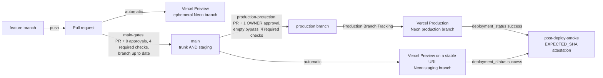
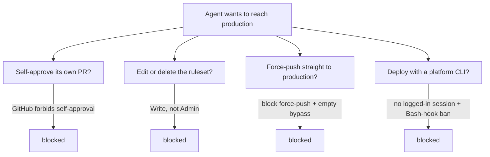
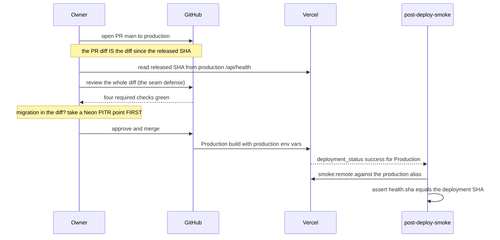

# Environments & promotion topology

Once agents write most of the code, *who can put code into production* stops being a policy question and becomes an architectural one. The answer here is nothing an agent is asked to remember — it is a property of the environment: the same commit flows feature branch → preview → `main` (staging) → `production`, only environment variables differ, and the single edge that reaches production is a pull request the **owner** alone can approve, from a device the agent does not control. Two GitHub rulesets with empty bypass lists are what make that a wall rather than a wish.

:::info Sources
Normative: [`docs/architecture.md` §Environments](https://github.com/chomamateusz/agentproofarch/blob/main/docs/architecture.md).
Click-by-click ritual: [`docs/deploy-promotion.md`](https://github.com/chomamateusz/agentproofarch/blob/main/docs/deploy-promotion.md).
Original mapping: [ADR-0003](../decisions/0003-vercel-environments.md) — its release topology was superseded on 2026-07-24.
:::

## Four environments, one commit

| Env | Git → deploy | Database | Host |
|---|---|---|---|
| **Production** | merge to `production` (owner-approved PR) → Vercel **Production** build | Neon branch `production`, `DB_DRIVER=neon-http` | project domain (+ wildcard when added) |
| **Staging** | `main` → automatic **Preview** on a stable URL | Neon branch `staging` | stable staging URL |
| **Preview** | every PR → automatic Preview | **ephemeral** Neon branch per PR, copy-on-write, deleted with the PR | per-PR URL |
| **Development** | local | Docker `postgres:16` (`docker-compose.dev.yml`, host port `47542`) | `*.localhost` |

Two structural facts follow from the table:

- **`main` is trunk *and* staging.** Because Vercel's Production Branch Tracking points at `production`, a merge to `main` builds a *Preview*, not Production. Give that Preview a stable URL and it is the shared integration surface.
- **Preview + staging *are* the development environment.** There is no separate deployed dev environment; local (`*.localhost`) is the machine loop, and every deployed non-production environment is a preview or the stable staging URL. Both are fully automatic and fully agent-reachable.

The function runs in `fra1` (`vercel.json` → `"regions": ["fra1"]`) and the Neon project lives in `aws-eu-central-1` — co-located deliberately (ADR-0003 §5: whoever moves one side moves both).

## The promotion flow

Agents own everything left of the `production` branch. An agent — acting as the machine account `chomamateusz-agent` — branches, opens PRs, merges to `main` once the four checks pass, dispatches workflows and drives preview + staging deployments freely. It may even **open** the `main → production` release PR. It cannot approve it.

## The wall

The security boundary is **not** "no GitHub event can reach production" — a merge to `production` *is* the release trigger. The wall is that this merge requires a pull request only the owner can approve, so **the owner's diff review happens before the build that sees production secrets runs.** That ordering is the whole point, and it is the specific correction over the older dashboard-promote model, where the review ran *after* the build.

### Base: the identity split

The repository is **public**. Agents act through a machine GitHub account, `chomamateusz-agent`, added as a collaborator with **Write, never Admin**; the owner's own credentials (gh sessions, PATs) never live on the agent machine. The owner's SSH key may remain there, and the rulesets neutralise it for production: SSH can push a ref but **cannot call the API to edit a ruleset or approve a pull request**.

### The two rulesets

Both carry an **empty bypass list**, so no identity — Admin included — merges past them.

| Ruleset | Branch | Enforces |
|---|---|---|
| `production-protection` | `production` | require a PR + **1 approval**, with stale approvals dismissed on push and the last pusher's approval required; merge method **Merge only**; required status checks `check` / `smoke` / `e2e` / `docker-smoke`; block force-pushes; restrict deletions; empty bypass |
| `main-gates` | `main` | require a PR + **0 approvals**; merge method **Merge only**; the same four required status checks **plus `ai-review`** (the fail-closed doctrine review) **and "require branches to be up to date before merging"** (the concurrent-change guard); block force-pushes; restrict deletions; empty bypass |

One asymmetry is worth reading off that table rather than assuming: the **merge-method** restriction lives on `main`, not on `production`. `main-gates` allows a merge commit only; `production-protection` permits merge, squash and rebase, because on that branch the gate is the approval, not the button.

Four independent mechanisms have to hold simultaneously, and each closes a different hole:

:::note The irreducible residue
The merge that triggers the production build runs a build **with production secrets**. Nothing removes that; the design bounds it instead — the owner's diff review lands *before* the merge by construction, and all production env vars are marked Sensitive so their values cannot be read back out of the dashboard or CLI, only overwritten. That is honest scoping of a *read* path, not a claim that the build never sees secrets.
:::

## The release ritual

Performed by the owner. Opening the PR may be delegated to an agent; **approval and merge are not.**

The steps in words, matching [`deploy-promotion.md`](https://github.com/chomamateusz/agentproofarch/blob/main/docs/deploy-promotion.md) §b:

1. **Open the release PR `main → production`.** Its diff *is* the diff since the released SHA.
2. **Review that diff.** Read the released SHA off production `/api/health`, confirm the PR's base is that commit, and read the whole diff. Gates prove the code *runs*; the diff review proves it is *the code you meant to ship*. Do not approve because the gates are green.
3. **Confirm the four required checks are green** on the PR. A check that "could not run" is red, not mergeable.
4. **If the diff includes a migration, take a Neon snapshot / PITR point first.** A constraint-adding or destructive migration can abort mid-`ALTER` against real data; a noted restore point turns a bad migration into a one-command rollback instead of an incident.
5. **Approve and merge.** Merging to `production` triggers the Production build against production env vars.
6. **Verify the post-deploy SHA attestation.** Production `/api/health` must now report the merged commit's `sha`, and `smoke:remote` must be green for it — see [Health & attestation](./health-and-attestation.md).

Because a `production` merge is an ordinary branch push, it emits the normal `deployment_status` event for the `Production` environment, so `post-deploy-smoke.yml` fires without any special wiring. (The older worry — that a dashboard "Promote to Production" click might emit a different event or none — does not apply to the PR-merge model.)

### Rollback

A rollback is a release in reverse: open and merge a PR that returns `production` to the previous known-good SHA (or `git revert` the offending commit), through the same approval gate. **Code rollback and schema rollback are separate** — a migration in the rolled-back release is undone via the Neon PITR point from step 4, not by shipping older code, because old code against a new schema can still break.

## The five standing controls

Each is a property of the environment, not a rule someone is asked to remember.

| # | Control | WHY |
|---|---|---|
| 1 | **Owner-approved PR is the only path to production** — Production Branch Tracking on `production`, guarded by `production-protection`. | Agents get full `main` freedom by design; the wall is an approval the agent structurally cannot supply, landing *before* the secret-exposed build. |
| 2 | **Zero platform-CLI sessions on agent machines, plus a Bash-hook ban** on launching `vercel` / `neonctl` / cloud CLIs. | A logged-in CLI is a standing credential to production infra. A blocked command is enforcement; a documented "please don't" is not. |
| 3 | **All production env vars marked Sensitive** (write-only in the dashboard/CLI). | Bounds the *read* path: secrets are entered once by a human and never re-exfiltrated through the dashboard or CLI. |
| 4 | **Passkey / 2FA on the Vercel login; sessions only on owner devices.** | The login is the single gate to the secret store, so it gets phishing-resistant auth. |
| 5 | **Platform-independent DR** — cold standby on the owner's VPS via the Docker target, an hourly `pg_dump` cron, and Neon PITR. | The topology assumes Vercel + Neon; a total-platform loss (suspension, provider outage) must be recoverable off both. See [Backup & DR](./backup-dr.md). |

Control 5 has a second effect worth naming: the Docker target is the reason a **paid-app topology** works at all. Production for a commercial app lives on its own **Pro** team while non-commercial work stays on **Hobby** — one login spans both, but a pause, suspension or plan-limit hit on one team does not take the other down.

## Tenant addressing per environment

Tenant resolution itself — the fixed custom-domain → subdomain → `X-Tenant` order, what each environment can and cannot address, and the `*.vercel.app` impossibility — is one subject with one page: [Identity & multi-tenancy §Tenant addressing per environment](../architecture/identity-and-multi-tenancy.md). What belongs *here* is the deploy-side consequence of it.

**Only environment variables change.** `APP_BASE_DOMAIN` is what makes a tenant resolvable by subdomain, and because step 2 of resolution treats any subdomain label as a slug, **a single wildcard domain makes every tenant resolve automatically, with no per-tenant registration**. Attaching that domain is an env-var change, never a code change — which is why ADR-0003 could accept "no custom domain yet" as a constraint rather than a debt.

**Wildcard cert mechanics** (research recorded in `architecture.md`): a wildcard cert on Vercel needs an ACME **DNS-01** challenge, which requires **NS delegation to Vercel** *or* a narrow `_acme-challenge` NS delegation. A records-only path (no NS delegation) can only issue certs for **individual, non-wildcard per-tenant hosts** via HTTP-01 over a CNAME — which is what the built US-020 `vercel` provisioner attaches, one host at a time. Hobby caps at **50 custom domains per project**; wildcard is not itself Pro-gated (Pro is a ToS/commercial requirement, not a technical wildcard gate).

:::caution Honest caveats
- **No base-domain shape is live yet.** Both recorded plans — the delegated `agentproofarch.eu.org` and the company-DNS wildcard CNAME bridge — are pending, so the deployed web stays single-tenant on `*.vercel.app` and the CLI's `X-Tenant` carries multi-tenancy.
- **ADR-0003 is superseded in part.** Its point 1 described `main` as production plus a long-lived `staging` branch. That mapping is gone and the branch relic is deleted; points 2–7 stand.
- **Browser multi-tenancy is unexercised on previews** until a wildcard domain exists. `smoke:remote` covers the CLI/`X-Tenant` path meanwhile.
- **One CI job deliberately does not block a merge** (`visual`) — on `main` the required set is the four platform checks plus `ai-review`, armed 2026-07-26 after a verdict track record. See [CI gates](./ci-gates.md).
- **A cross-subdomain session on a real base domain is documented but not locally testable** — it is recorded as a verification residual to be confirmed live on the first custom base-domain deployment.
:::

## Secrets and migrations

- **Secrets live only in Vercel's env store**, scoped per environment (staging uses branch-scoped Preview vars on Hobby). Local dev never pulls them: agent machines hold no platform-CLI sessions, and local development runs entirely on non-secret local values — `.env.example` documents every *name*, and the dev database is local Docker. Nothing secret lives in the repo.
- **Migrations run at build time** against that environment's own database (`vercel-build` = `npm run db:migrate && npm run build`). Previews migrate their ephemeral branch, which is always safe. Staging and production are **forward-only**: destructive changes ship as two deploys, expand → contract. The migration *sequence* is mechanically gated — `npm run doc-lint` runs `lintMigrations`, which fails the build on a duplicate, gapped or reordered migration.
