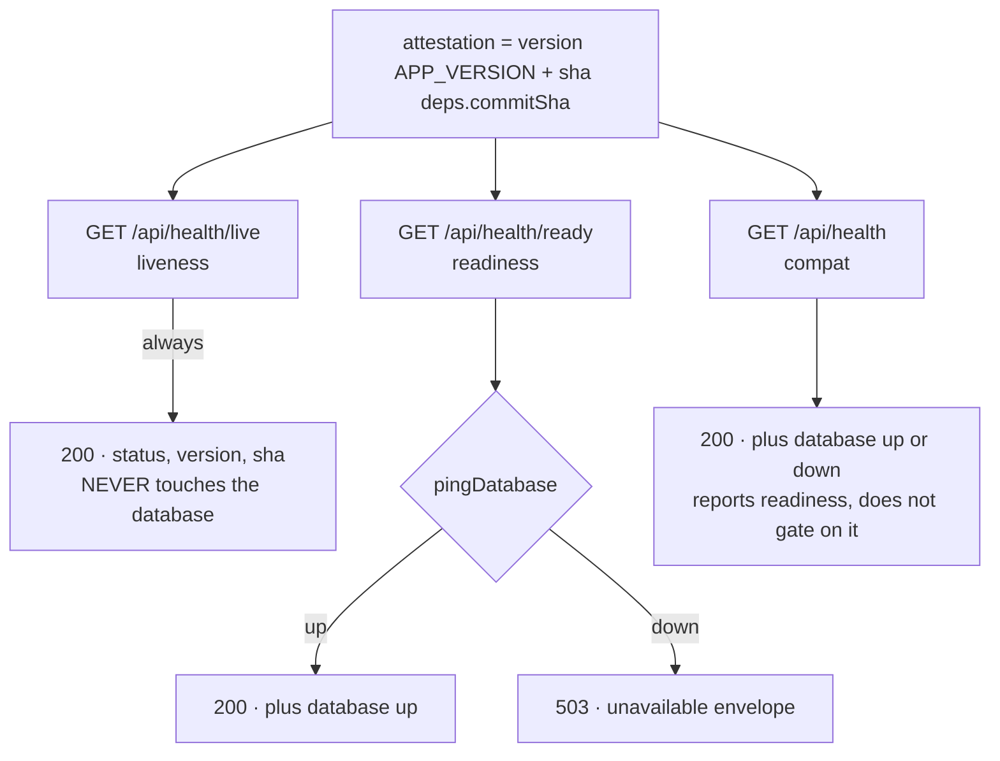
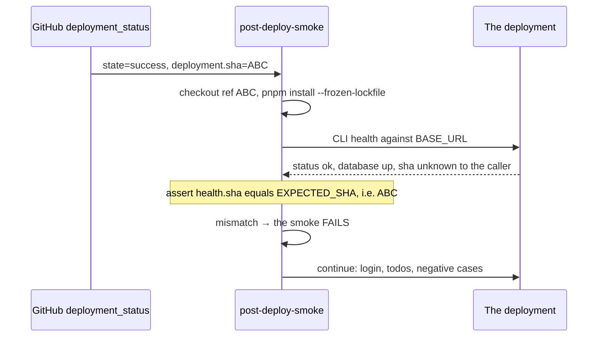

# Health & deploy attestation 🩺 \{#health--deploy-attestation}

*Read this if you are wiring a probe, or proving which build is live.*

*Is the process alive?* and *is it ready to serve traffic?* have different correct answers, and collapsing them into one endpoint breaks both. A restart-on-liveness platform must not kill a healthy process because the database blinked; a load balancer must not keep sending traffic to a process whose database is gone. On top of that split sits a second idea: every health response carries a **build attestation**, so a smoke run can prove *which* deploy it verified instead of asserting it.

:::info[Sources]
Normative: [`docs/architecture.md` §Health & deploy attestation](https://github.com/chomamateusz/agentproofarch/blob/main/docs/architecture.md). Routes: `demo/apps/server/src/app.ts`. Schemas: `demo/core/contract/routes.ts`. Gate: [`post-deploy-smoke.yml`](https://github.com/chomamateusz/agentproofarch/blob/main/.github/workflows/post-deploy-smoke.yml).
:::

## Three endpoints, one attestation 📡 \{#three-endpoints-one-attestation}



| Endpoint | Touches the DB | Success | Failure | Used by |
|---|---|---|---|---|
| `/api/health/live` | **no** | `200` | — (200 as long as the process answers) | container restart policy, Docker `HEALTHCHECK` |
| `/api/health/ready` | yes | `200` with `database: 'up'` | **`503`** `unavailable` envelope, never a `200` | load-balancer drain, the `docker-smoke` readiness poll |
| `/api/health` | yes | `200` with `database: 'up' \| 'down'` | `200` either way | existing callers; the released-SHA read |

All three are mounted **before** tenant resolution — they are a public surface — and all three go out through the shared `respond()` seam, so they carry `cache-control: no-store` and `content-type: application/json` like every other API response.

## Real payloads 📦 \{#real-payloads}

The envelope is the repo-wide one: `{ ok: true, data }` or `{ ok: false, error }`. The commit SHA in the samples below is a stand-in for whatever commit is deployed — the field, not the value, is the point.

**Liveness — the deployed shape.** `version` is SemVer from `demo/package.json`,
bumped only by the release-cut pull request that precedes a promotion
([Versioning & releases](./versioning-and-releases.md)); `sha` is the build
commit.

```bash
curl -sS https://agentproofarch.vercel.app/api/health/live
```

{/*release-version*/}

```json
{
  "ok": true,
  "data": {
    "status": "ok",
    "version": "1.3.0",
    "sha": "9f2c1ab8d4e37c05f1b6a2d9c8e40371bb5ad612"
  }
}
```

Local dev, where `APP_COMMIT_SHA` is unset:

```json
{
  "ok": true,
  "data": { "status": "ok", "version": "1.3.0", "sha": "unknown" }
}
```

{/*/release-version*/}

**Readiness, database up** — `200`:

{/*release-version*/}

```json
{
  "ok": true,
  "data": {
    "status": "ok",
    "version": "1.3.0",
    "sha": "9f2c1ab8d4e37c05f1b6a2d9c8e40371bb5ad612",
    "database": "up"
  }
}
```

{/*/release-version*/}

**Readiness, database down** — `HTTP 503`, and the body is the ordinary error envelope, not a special health shape:

```json
{
  "ok": false,
  "error": {
    "code": "unavailable",
    "message": "Database is not reachable"
  }
}
```

The status code is not hand-written at the route. `respond()` maps the error code through `HTTP_STATUS_BY_ERROR_CODE` (`unavailable` → `503`) and the CLI maps the same code through `EXIT_CODE_BY_ERROR_CODE` (`unavailable` → **exit 8**), so one taxonomy drives HTTP status and process exit code alike.

**Compat `/api/health`** — the readiness *information* at `200`, without the gate:

{/*release-version*/}

```json
{
  "ok": true,
  "data": {
    "status": "ok",
    "version": "1.3.0",
    "sha": "9f2c1ab8d4e37c05f1b6a2d9c8e40371bb5ad612",
    "database": "down"
  }
}
```

{/*/release-version*/}

That `"database": "down"` at `200` is exactly why new callers should use `/ready`: this route reports readiness semantics but does not gate on them.

**From the CLI** — the same data through the agent contract:

{/*release-version*/}

```bash
pnpm run cli health
# status=ok db=up v1.3.0 sha=9f2c1ab8d4e37c05f1b6a2d9c8e40371bb5ad612

pnpm run cli --json health
# exactly one JSON document on stdout: { "ok": true, "data": { … } }
```

{/*/release-version*/}

## Why the split matters ✂️ \{#why-the-split-matters}

The route code is three lines each, and the shapes are what carry the doctrine:

```ts
const attestation = { version: APP_VERSION, sha: deps.commitSha };

app.get(API_PATHS.healthLive, () => respond(ok({ status: 'ok' as const, ...attestation })));

app.get(API_PATHS.healthReady, async () =>
  respond(
    (await deps.health.pingDatabase())
      ? ok({ status: 'ok' as const, ...attestation, database: 'up' as const })
      : err(unavailable('Database is not reachable')),
  ),
);
```

Note that `healthReadyOutputSchema` pins `database: z.literal('up')` — a *successful* readiness body cannot say anything else. "Ready but degraded" is unrepresentable in the contract, not merely discouraged in prose. The liveness schema has no `database` field at all, so a future edit that made liveness ping the database would have nowhere to put the answer.

The Docker image wires liveness (never readiness) into its container healthcheck, which is the same reasoning expressed in infrastructure:

```dockerfile
HEALTHCHECK --interval=10s --timeout=5s --start-period=30s --retries=5 \
  CMD node -e "fetch('http://127.0.0.1:'+(process.env.PORT||47100)+'/api/health/live').then((r)=>process.exit(r.ok?0:1)).catch(()=>process.exit(1))"
```

## The attestation, and the SHA it carries 🧾 \{#the-attestation-and-the-sha-it-carries}

`sha` is a **vendor-neutral** `APP_COMMIT_SHA`. The platform entry (`api/index.ts`) maps Vercel's `VERCEL_GIT_COMMIT_SHA` into it, so the vendor's variable name stays contained to that single platform boundary — the same containment rule the layer doctrine applies to vendor SDKs. Self-host sets `APP_COMMIT_SHA` directly (the `docker-smoke` job writes `APP_COMMIT_SHA=${GITHUB_SHA}` into `.env`). Unset, it reports `unknown`.

### The attestation gate 🛡️ \{#the-attestation-gate}



The assertion itself, from `scripts/smoke-cli.ts`:

```ts
if (target.expectedSha !== undefined) {
  assert(
    health.sha === target.expectedSha,
    `health SHA mismatch: expected ${target.expectedSha}, deployment reports ${health.sha}`,
  );
}
```

This closes a whole failure class — **"the smoke verified the wrong deployment"**: a stale alias, an aliasing step that silently didn't move, a promotion that didn't land. Without the equality, a green smoke against yesterday's build looks identical to a green smoke against today's.

Two properties of the design deserve naming:

- **The attestation is opt-in per caller, not per endpoint.** `EXPECTED_SHA` is an environment variable `smoke-remote.ts` reads; local `smoke` omits it (the SHA would be `unknown`), and `docker-smoke` supplies `${{ github.sha }}`. The endpoint always publishes the SHA; the *assertion* belongs to whoever knows what they deployed.
- **It is the trust anchor for the release gate.** Step 6 of the release ritual is "read the SHA off production `/api/health` and confirm it is the merged commit". That attestation — not a line in a deploy log — is what proves the running code is the code that passed the gates and the owner's diff review. See [Environments & promotion](./environments.md).

## Enforcement ⚖️ \{#enforcement}

Following the repo's TYPE / LINT / TEST / REVIEW+AI vocabulary:

| Tier | What holds the line |
|---|---|
| **TYPE** | The three response shapes are zod schemas in `core/contract` (`healthLiveOutputSchema`, `healthReadyOutputSchema`, `healthOutputSchema`), and `core/client` brands its call surface from them — no client hand-writes a health payload. |
| **LINT** | n/a: route wiring is hand-registered against `API_PATHS`, exactly like every other route. |
| **TEST** | `app.test.ts` asserts liveness returns `200` without a database touch, readiness returns `200`/`up` and `503`/`unavailable` when the ping fails, and the compat route stays `200` with a `sha`. `e2e` hits `/live` and `/ready` on the real stack. `smoke:remote` runs the `EXPECTED_SHA` equality. `routes.test.ts` proves the schemas reject the dishonest shapes — `database: 'down'` on readiness, a missing `sha` on liveness. |
| **REVIEW+AI** | Flag a health route that pings the database on the liveness path, a readiness path that returns `200` while degraded, or a new deploy target that surfaces the raw vendor SHA variable instead of mapping it into `APP_COMMIT_SHA`. |

:::caution[Honest caveats]
- **`sha` is `unknown` wherever `APP_COMMIT_SHA` is unset** — local dev and any deploy target that forgets to wire it. An `unknown` SHA cannot fail an attestation check because the check is only made where an expected SHA is supplied; a new deploy target must wire the variable to gain the guarantee.
- **Readiness reports one dependency: the database.** It is a `pingDatabase()` call, not a fan-out over email, storage or the auth provider. A degraded outbound-mail relay does not make the process un-ready, by design — but it also means readiness is not a whole-system health score.
- **The compat `/api/health` route can report `200` with `"database": "down"`.** That is deliberate backwards compatibility, and it is why it is documented as compat rather than as the endpoint to build on.
- **Alerting, uptime targets and SLOs are not built.** They sit in the deferred-work register under day-2 operations, with the first real production incident (or the first paying tenant) as the named trigger.
:::
