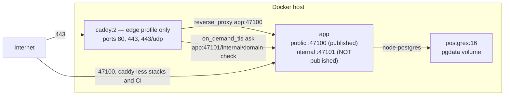
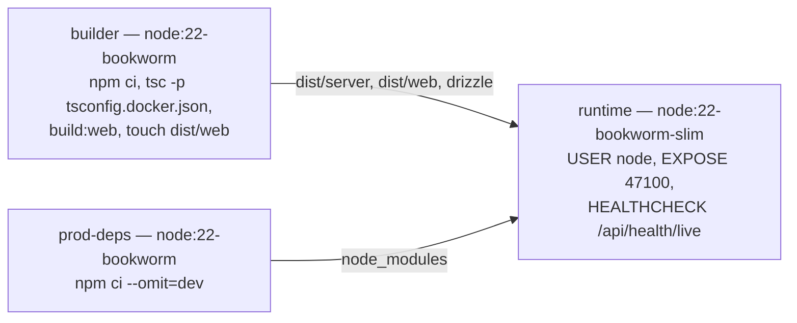
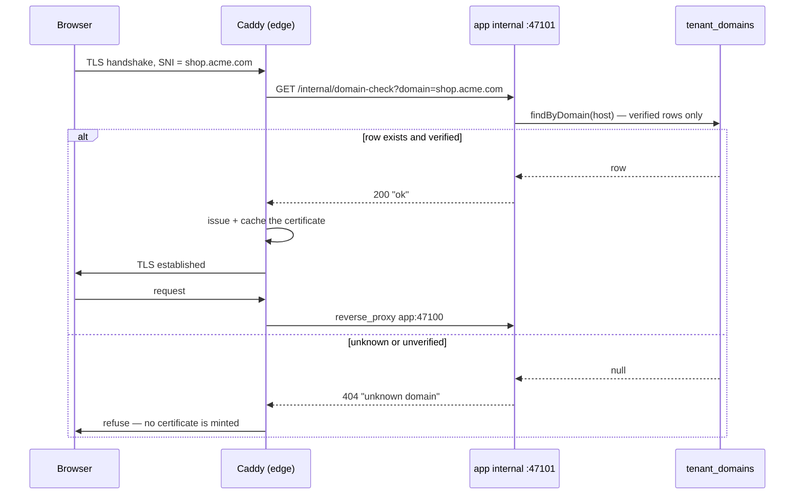
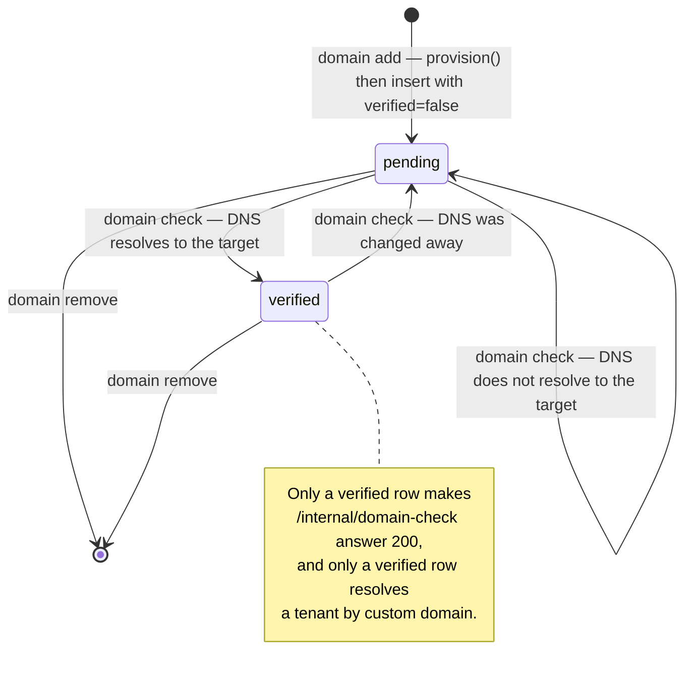

# Self-host & custom domains

This page exists because a foundation that only runs on one vendor is a foundation with a hostage clause. So the same commit that deploys to Vercel also builds a Docker image that serves the API and the SPA from one Node process — and that claim is a **required CI check** (`docker-smoke` builds the image, boots the compose stack and drives the same CLI smoke suite against the container), not a paragraph of intent. The second half of the page is the piece self-host does *better* than the serverless target today: a tenant custom domain gets a real certificate with **zero per-tenant configuration**.

:::info Sources
[`docs/architecture.md`](https://github.com/chomamateusz/agentproofarch/blob/main/docs/architecture.md) §Deployment matrix and §Self-host custom domains and TLS (US-021), [`demo/README.md`](https://github.com/chomamateusz/agentproofarch/blob/main/demo/README.md), and the files themselves: [`Dockerfile`](https://github.com/chomamateusz/agentproofarch/blob/main/demo/Dockerfile), [`docker-compose.prod.yml`](https://github.com/chomamateusz/agentproofarch/blob/main/demo/docker-compose.prod.yml), [`Caddyfile`](https://github.com/chomamateusz/agentproofarch/blob/main/demo/Caddyfile), [`docker-entrypoint.sh`](https://github.com/chomamateusz/agentproofarch/blob/main/demo/docker-entrypoint.sh).
:::

## The deployment matrix

Both columns are built. Vercel is live today; the Docker packaging ships in the tree.

| | Vercel | Docker self-host |
|---|---|---|
| API | Hono handler as a function | the same Hono app in a Node container |
| DB | Neon, `DB_DRIVER=neon-http` | `postgres:16`, `DB_DRIVER=node-postgres` |
| Web | static SPA build | served by the same Node process |
| Server runtime | bundled function | tsc-compiled JS, prod-only deps, non-root, `HEALTHCHECK` on `/api/health/live` |
| Migrations | build step (`vercel-build`) | `docker-entrypoint.sh` on startup (idempotent) |
| TLS for tenant domains | per-host attach over the Vercel Domains API, HTTP-01 cert per host — **built** (US-020), live run pending `VERCEL_TOKEN` | Caddy `on_demand_tls` + internal domain-check endpoint — **built** |
| Domain provisioner env | `DOMAIN_PROVISIONER=vercel` + `VERCEL_TOKEN` + `VERCEL_PROJECT_ID` (+ `VERCEL_TEAM_ID`), selected explicitly | `DOMAIN_PROVISIONER=caddy` + `SELF_HOST_TARGET_CNAME`/`_IP` |
| Packaging | `vercel.json` + `api/index.ts` | `Dockerfile` + `docker-compose.prod.yml` + `Caddyfile` |
| CI proof | `post-deploy-smoke.yml` (smoke the live deploy) | `selfhost.yml` (build image → boot compose → smoke the container) |

Vercel is the **default** because it is the simplest for most applications. It is also invocation-only: no resident process, so no queue workers, schedulers, websockets or long-running jobs. The Docker image is the full-runtime escape hatch from the same commit — meant to run anywhere (VPS, Railway, Fly.io, Kubernetes) — and anything needing a resident process lives on that target. It is also the cold standby for [DR](./backup-dr.md).

The single line of code that differs between targets is a driver name. `DB_DRIVER` defaults by platform (`neon-http` when Vercel injects `VERCEL=1`, `node-postgres` otherwise), and the compose file pins it explicitly for the sidecar.

## Running it

```bash
cd demo
cp .env.example .env     # set BETTER_AUTH_SECRET; for real TLS also set APP_BASE_URL
                         # (https), APP_BASE_DOMAIN and SECURE_COOKIES=true
docker compose -f docker-compose.prod.yml up -d --build
#  -> postgres + app; the entrypoint migrates on startup, then serves API + SPA
#     on http://localhost:47100. Add SEED_ON_START=true to .env for demo data.
```

Add the Caddy edge — the on-demand TLS terminator, which binds 80/443 and needs the `Caddyfile`:

```bash
docker compose -f docker-compose.prod.yml --profile edge up -d --build
```



Why Caddy is behind a **profile**: the default `up` needs no `Caddyfile` and binds no privileged ports, which is exactly what CI and a bare localhost demo want. Real TLS needs the config file and ports 80/443, so it is opt-in.

### The image



Three details are load-bearing:

- **No `tsx` in the final image.** The server TypeScript is compiled with `tsc` in the build stage, so the runtime carries only compiled output plus the production dependency tree.
- **The compiled JS mirrors the source layout**, so `package.json`'s `imports` map (`#core/*`, `#adapters/*`) and `version.ts`'s `../../../package.json` read resolve exactly as they do from source.
- **`find dist/web -exec touch {} +`** stamps the bundle as the newest artifact. The dist-freshness guard compares `dist/web` against the compiled contract/client sources by mtime and `COPY` preserves builder mtimes; in a sealed per-commit image the bundle is always current, so the `touch` keeps a false "STALE BUNDLE" warning off boot.

### Startup

```bash
# docker-entrypoint.sh
node adapters/db/migrate.js            # always: idempotent, drizzle records applied migrations
[ "$SEED_ON_START" = "true" ] && node adapters/db/seed.js   # opt-in, idempotent
exec node apps/server/src/entry.node.js
```

The app never serves against an un-migrated schema, and the seed is off in production by design — it exists for the CI smoke stack and local demos.

### Env keys that only matter here

| Key | Meaning |
|---|---|
| `APP_PORT` | host port the app publishes. Changing it means changing `APP_BASE_URL`'s port too — Better Auth rejects sign-ins whose `Origin` does not match `APP_BASE_URL` (403 invalid origin). |
| `POSTGRES_USER` / `_PASSWORD` / `_DB` | credentials for the sidecar; compose builds the app's `DATABASE_URL` from them and that override always wins over any `.env` value. |
| `CADDY_HTTP_PORT` / `CADDY_HTTPS_PORT` | host ports for the `edge` profile. The 80/443 defaults are what on-demand TLS and ACME need; remap only for local tests. |
| `SEED_ON_START` | entrypoint seeds idempotent demo data when `true`. Leave unset in production. |
| `INTERNAL_PORT` | private port the domain-check control plane binds. **Unset → the internal endpoint does not start at all.** |
| `DOMAIN_PROVISIONER` | `caddy` on self-host; `vercel` on the Vercel target; `noop` (default) in dev. |
| `SELF_HOST_TARGET_CNAME` / `_IP` | the public target tenants point a custom domain at. Set **one**, not both. |

## Per-tenant TLS with zero per-tenant config

A tenant custom domain gets a real certificate through Caddy's on-demand TLS. The whole mechanism is one question Caddy asks the app before it mints a certificate:



The `Caddyfile` is short enough to read in full:

```caddy
{
	on_demand_tls {
		ask http://app:47101/internal/domain-check
	}
}

https:// {
	tls {
		on_demand
	}
	reverse_proxy app:47100
}

http:// {
	reverse_proxy app:47100
}
```

No per-tenant site block is ever added: a newly verified custom domain starts terminating TLS the moment its first request passes the ask check. Caddy appends `?domain=<sni>` to the ask URL; a 2xx means "issue a cert", anything else means "refuse".

:::note Local play vs a real deploy
With no ACME email configured, Caddy uses its internal CA and issues a locally trusted cert for localhost. Add an operator email in the global block (`email ops@example.com`) to switch on public ACME (Let's Encrypt).
:::

### Two properties make this safe

**1. The ask endpoint is unreachable from the public internet.** It is served by a *separate* Hono app (`apps/server/src/internal-app.ts`), mounted only by the self-host entry (`entry.node.ts`) on its own port:

```yaml
environment:
  PORT: '47100'
  # US-021: the domain-check control plane binds here. It is deliberately NOT
  # in `ports:` below, so it is reachable only on this compose network.
  INTERNAL_PORT: '47101'
ports:
  - '${APP_PORT:-47100}:47100'
  # INTERNAL_PORT (47101) is intentionally absent — see above.
```

This is **network-internal isolation, not path secrecy**. The public app on `:47100` does not serve `/internal/*` at all, so even a public routing mistake cannot expose it — there is nothing on that app to expose. A unit test asserts the internal app 404s `/api/health` (the two apps genuinely have disjoint surfaces).

**2. It answers 200 only for a *verified* domain.** The handler returns 200 iff the host exists and is `verified` in `tenant_domains`, and the verified-only filter lives in the repository query itself:

```ts
findByDomain: async (domain) => {
  const rows = await db
    .select()
    .from(tenantDomains)
    .where(and(eq(tenantDomains.domain, domain), eq(tenantDomains.verified, true)))
    .limit(1);
  return rows[0] ?? null;
},
```

Every other case is a 404, so Caddy will not obtain certificates for domains no tenant has proven. Proven by unit tests (`internal-app.test.ts`) and a real-Postgres integration test with both a positive and a negative case (`internal-app.integration.test.ts`), plus `repositories.integration.test.ts` asserting `findByDomain` returns **only** verified domains.

The internal app carries one other route — the backfill batch executor. That is the same tradeoff read from the other side: on self-host the surface is unreachable by construction, while the Vercel target (which has no private port) runs the identical executor on the public app behind a strong shared-secret header, mounted **only** when the secret is configured.

| concern | mechanism | where |
|---|---|---|
| Cert issuance | Caddy `on_demand_tls { ask }` → app | `Caddyfile` |
| Issue/refuse decision | `GET /internal/domain-check?domain=` → 200/404 | `apps/server/src/internal-app.ts` |
| Endpoint isolation | separate app on `INTERNAL_PORT`, never published | `entry.node.ts`, `docker-compose.prod.yml` |
| DNS precondition (the verify action) | `DomainPort.check` resolves the domain → `SELF_HOST_TARGET_CNAME`/`_IP` | `adapters/domain-provisioning/caddy.ts` |
| Provisioner selection | `DOMAIN_PROVISIONER=caddy` / `vercel` / `noop` | `apps/server/src/composition.ts` |

## The domain-management model (US-019, built)

`DomainPort` has three methods and three built adapters, selected in the composition root exactly like `EMAIL_TRANSPORT`:

| provisioner | target | `provision` / `remove` | `check` |
|---|---|---|---|
| `vercel` | the Vercel target | attach / detach the host on the Vercel project over the Domains API; an already-attached host (`409`) is a success, so a retry is safe | the project's domain + config endpoints report `verified` and not `misconfigured` |
| `caddy` | Docker self-host | **no-op** — Caddy issues on demand at handshake time | DNS lookup that the domain CNAMEs to `SELF_HOST_TARGET_CNAME` or resolves to `SELF_HOST_TARGET_IP`; trailing-dot- and case-insensitive comparison |
| `noop` (default) | dev | no-op | always accepts (`"<domain> accepted (noop provisioner)"`) |

The `check` and the ask endpoint are **complementary, not redundant**: the endpoint gates *certificate issuance* at handshake time on `verified` state, while `check` is what the operator-facing "Verify" action calls to confirm DNS was actually pointed at the deploy before flipping `verified`.



Authorization is split deliberately: `domain:read` is `owner` **and** `admin` (staff-readable roster), while `domain:write` — add, check, remove — is **owner only**. Cross-tenant safety is structural rather than checked: the lookups behind check and remove are tenant-scoped, so another tenant's domain is a `not_found`, and a host already attached anywhere is a `conflict` (a domain belongs to at most one tenant globally).

### Driving it from the CLI

```bash
npm run cli -- domain list
# - shop.acme.com	verified
# - beta.acme.com	pending
# (CNAME → apps.example.com)

npm run cli -- domain add shop.acme.com
# attached: shop.acme.com (pending)

npm run cli -- domain check shop.acme.com
# shop.acme.com: verified — shop.acme.com is a CNAME to apps.example.com

npm run cli -- domain remove beta.acme.com
# removed: beta.acme.com (rows: 1)
```

A failed check reports why, not just that it failed — `shop.acme.com does not CNAME to apps.example.com (found: none)` — and with no target configured at all it says `No SELF_HOST_TARGET_CNAME or SELF_HOST_TARGET_IP configured`. The web settings page (`features/settings/DomainsPage.tsx`) renders the same model: the roster with verified status, an add form that shows the required DNS record derived from the configured target (*"Create a CNAME record pointing your domain at …"* / *"Create an A record …"*), a per-domain re-check, and remove with confirmation.

## US-020: built, and never run live

This is the single canonical statement of that gap; every other page links here
rather than repeating it, because the day it closes, one paragraph has to be
deleted and not six.

**What exists.** `adapters/domain-provisioning/vercel.ts` implements the full
`DomainPort`: `provision` attaches a host to the Vercel project, `remove`
detaches it, `check` reads the domain and its DNS config back. Both writes are
convergent — an already-attached host (`409`) and an unknown host on delete
(`404`) are successes — so the use-case may retry. The token travels only in the
`Authorization` header, never into a log or an error detail, and every response
is zod-parsed at the boundary.

**What proves it.** An offline suite against a stubbed `fetch`, 20 tests:
success, team scoping, the convergent `409`/`404`, `401` and `403` (naming the
misconfigured env, never echoing the token), `5xx`, transport failures, and
corrupted payloads on both the domain and DNS-config reads.

**What does not.** It has **never run against the live Vercel Domains API**.
Neither CI nor the build machine holds a `VERCEL_TOKEN`, so nothing has ever
exercised the real contract — the exact failure class that broke this project
five times in a row before the runtime gate existed
([ADR-0004](../decisions/0004-no-exceptions-enforcement.md)). The deployment
therefore still runs `DOMAIN_PROVISIONER=noop`, whose `check` accepts every
domain, so on that target the verify step is a formality rather than a
verification.

**What closes it.** The owner supplying `VERCEL_TOKEN`; the first real
add / check / remove against the live API is the acceptance run. Self-host needs
none of this — Caddy issues per-tenant certificates on demand.

## Wildcard base domain vs per-host attach

These are two different features that solve two different customer requests, and conflating them is the usual source of confusion.

| | Wildcard base domain (`*.example.com`) | Per-tenant custom domain |
|---|---|---|
| Answers the request | "give my tenant a subdomain" — `acme.example.com` | "I want to use **my own** domain" — `shop.acme.com` |
| Tenant resolution step | step 2: subdomain label of `APP_BASE_DOMAIN` treated as the slug | step 1: exact match in `tenant_domains` |
| Per-tenant registration | **none** — one wildcard resolves every tenant | one row per host, plus a DNS record the tenant creates |
| Cert on Vercel | one wildcard cert via ACME **DNS-01**, which needs **NS delegation** to Vercel (or a narrow `_acme-challenge` delegation) | individual **HTTP-01** certs per host over a CNAME — the records-only path, automated by the built US-020 adapter |
| Cert on self-host | Caddy issues per hostname on demand | Caddy issues per hostname on demand — same mechanism, no extra work |
| Session scope | one session spans sibling subdomains (the cookie domain is the real base) | each custom domain is its **own cookie world**, which hard-isolates sessions between tenants ([ADR-0002](../decisions/0002-member-identity-and-idp.md) §5) |
| Limits | Vercel Hobby caps 50 custom domains per project; wildcard is not itself Pro-gated | the same 50-domain cap applies per attached host |

The practical reading: a wildcard covers `*.<base>` subdomain tenants for free, and per-host attach covers the tenant that wants its own non-subdomain domain. On self-host, both work today. On Vercel, the wildcard path is a DNS-delegation decision and the per-host path is what the `vercel` provisioner does.

:::caution Honest caveats
- **The `vercel` adapter is built but has never run against the live Domains API** — the full statement is [above](#us-020-built-and-never-run-live).
- **`noop` accepting everything is a real sharp edge**, not just a placeholder: on a `noop` deploy a `domain check` will flip a row to `verified` without proving any DNS. That is safe on Vercel only because nothing there consults the ask endpoint; do not run `noop` behind Caddy.
- **`INTERNAL_PORT` unset means the internal endpoint does not start.** A Caddy edge pointed at a deploy without it will fail every ask and therefore issue no certificates.
- **`domainNameSchema` accepts a raw IPv4 address** (e.g. `192.168.1.1`) as a custom domain — a recorded verification residual, with the next edit to the domain chain as its trigger.
- **A cross-subdomain session on a real base domain is documented but not locally testable** — another recorded residual, to be verified live on the first custom base-domain deployment.
- **Self-host day-2 operations are deliberately unbuilt**: backup cadence beyond the [DR package](./backup-dr.md), an upgrade contract, and a full Vercel/Docker parity matrix all sit in the deferred-work register with the first real production incident (or the first paying tenant) as the trigger.
:::
