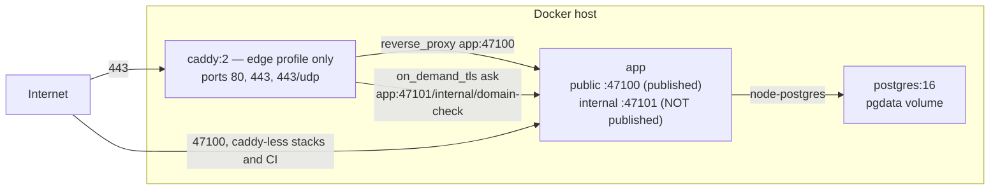
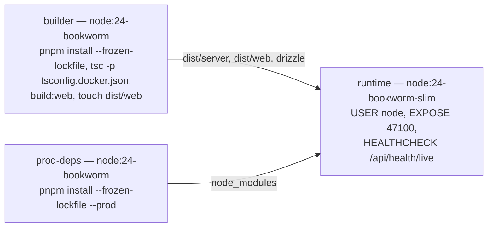

# Self-host (the Docker target) 🐳 \{#self-host-the-docker-target}

*Read this if you are deploying the Docker target. Per-tenant TLS and the domain model live on [Custom domains & TLS](./self-host-and-domains.md).*

This page exists because a foundation that only runs on one vendor is a foundation with a hostage clause. So the same commit that deploys to Vercel also builds a Docker image that serves the API and the SPA from one Node process — and that claim is a **required CI check** (`docker-smoke` builds the image, boots the compose stack and drives the same CLI smoke suite against the container), not a paragraph of intent.

:::info[Sources]
[`docs/architecture.md`](https://github.com/chomamateusz/agentproofarch/blob/main/docs/architecture.md) §Deployment matrix, [`demo/README.md`](https://github.com/chomamateusz/agentproofarch/blob/main/demo/README.md), and the files themselves: [`Dockerfile`](https://github.com/chomamateusz/agentproofarch/blob/main/demo/Dockerfile), [`docker-compose.prod.yml`](https://github.com/chomamateusz/agentproofarch/blob/main/demo/docker-compose.prod.yml), [`docker-entrypoint.sh`](https://github.com/chomamateusz/agentproofarch/blob/main/demo/docker-entrypoint.sh).
:::

## The deployment matrix 📊 \{#the-deployment-matrix}

Both columns are built. Vercel is live today; the Docker packaging ships in the tree.

| | Vercel | Docker self-host |
|---|---|---|
| API | Hono handler as a function | the same Hono app in a Node container |
| DB | Neon, `DB_DRIVER=neon-http` | `postgres:16`, `DB_DRIVER=node-postgres` |
| Web | static SPA build | served by the same Node process |
| Server runtime | bundled function | tsc-compiled JS, prod-only deps, non-root, `HEALTHCHECK` on `/api/health/live` |
| Migrations | build step (`vercel-build`), followed by the convergent `db:seed` | `docker-entrypoint.sh` on startup (idempotent); seeds only with `SEED_ON_START` |
| TLS for tenant domains | per-host attach over the Vercel Domains API, HTTP-01 cert per host — **built** (US-020), production add confirmed live per the [dated US-020 record](./self-host-and-domains.md#us-020-production-add-confirmed-live), alongside one pre-verification `check`; post-verification `check` and `remove` acceptance unrecorded | Caddy `on_demand_tls` + internal domain-check endpoint — **built** |
| Domain provisioner env | `DOMAIN_PROVISIONER=vercel` + `VERCEL_TOKEN` + `VERCEL_PROJECT_ID` (+ `VERCEL_TEAM_ID`), selected explicitly | `DOMAIN_PROVISIONER=caddy` + `SELF_HOST_TARGET_CNAME`/`_IP` |
| Packaging | `vercel.json` + `api/index.ts` | `Dockerfile` + `docker-compose.prod.yml` + `Caddyfile` |
| CI proof | `post-deploy-smoke.yml` (smoke the live deploy) | `selfhost.yml` (build image → boot compose → smoke the container) |

Vercel is the **default** because it is the simplest for most applications. It is also invocation-only: no resident process, so no queue workers, schedulers, websockets or long-running jobs. The Docker image is the full-runtime escape hatch from the same commit — meant to run anywhere (VPS, Railway, Fly.io, Kubernetes) — and anything needing a resident process lives on that target. It is also the cold standby for [DR](./backup-dr.md).

The single line of code that differs between targets is a driver name. `DB_DRIVER` defaults by platform (`neon-http` when Vercel injects `VERCEL=1`, `node-postgres` otherwise), and the compose file pins it explicitly for the sidecar.

## Running it ▶️ \{#running-it}

```bash
cd demo
cp .env.example .env     # set BETTER_AUTH_SECRET; for real TLS also set APP_BASE_URL
                         # (https), APP_BASE_DOMAIN and SECURE_COOKIES=true
docker compose -f docker-compose.prod.yml up -d --build
#  -> postgres + app; the entrypoint migrates on startup, then serves API + SPA
#     on http://localhost:47100. Add SEED_ON_START=true to .env for demo data.
```

Add the Caddy edge — the on-demand TLS terminator, which binds 80/443 and needs the `Caddyfile`:

```bash
docker compose -f docker-compose.prod.yml --profile edge up -d --build
```



Why Caddy is behind a **profile**: the default `up` needs no `Caddyfile` and binds no privileged ports, which is exactly what CI and a bare localhost demo want. Real TLS needs the config file and ports 80/443, so it is opt-in. How the on-demand certificates actually work is the domains page: [Custom domains & TLS](./self-host-and-domains.md).

The compose network pins Caddy to `10.247.0.3`. Caddy overwrites
`X-Forwarded-For` with the connection peer, and the app preserves that header
only when the exact Caddy address connected; a direct connection instead gets
the socket peer written over any supplied header. Better Auth receives the same
exact proxy in `advanced.ipAddress.trustedProxies`, so enabled auth rate limiting
uses one bucket per client rather than a spoofable or shared fallback bucket.

## The image 🐳 \{#the-image}



Three details are load-bearing:

- **No `tsx` in the final image.** The server TypeScript is compiled with `tsc` in the build stage, so the runtime carries only compiled output plus the production dependency tree.
- **The compiled JS mirrors the source layout**, so `package.json`'s `imports` map (`#core/*`, `#adapters/*`) and `version.ts`'s `../../../package.json` read resolve exactly as they do from source.
- **`find dist/web -exec touch {} +`** stamps the bundle as the newest artifact. The dist-freshness guard compares `dist/web` against the compiled contract/client sources by mtime and `COPY` preserves builder mtimes; in a sealed per-commit image the bundle is always current, so the `touch` keeps a false "STALE BUNDLE" warning off boot.

## Startup 🚦 \{#startup}

```bash
# docker-entrypoint.sh
node adapters/db/migrate.js            # always: idempotent, drizzle records applied migrations
[ "$SEED_ON_START" = "true" ] && node adapters/db/seed.js   # opt-in, idempotent
exec node apps/server/src/entry.node.js
```

The app never serves against an un-migrated schema, and the seed is off in production by design — it exists for the CI smoke stack and local demos.

## Env keys that only matter here ⚙️ \{#env-keys-that-only-matter-here}

| Key | Meaning |
|---|---|
| `APP_PORT` | host port the app publishes. Changing it means changing `APP_BASE_URL`'s port too — Better Auth rejects sign-ins whose `Origin` does not match `APP_BASE_URL` (403 invalid origin). |
| `POSTGRES_USER` / `_PASSWORD` / `_DB` | credentials for the sidecar; compose builds the app's `DATABASE_URL` from them and that override always wins over any `.env` value. |
| `CADDY_HTTP_PORT` / `CADDY_HTTPS_PORT` | host ports for the `edge` profile. The 80/443 defaults are what on-demand TLS and ACME need; remap only for local tests. |
| `SEED_ON_START` | entrypoint seeds idempotent demo data when `true`. Leave unset in production. |
| `INTERNAL_PORT` | private port the domain-check control plane binds. **Unset → the internal endpoint does not start at all.** |
| `DOMAIN_PROVISIONER` | `caddy` on self-host; `vercel` on the Vercel target; `noop` (default) in dev. |
| `SELF_HOST_TARGET_CNAME` / `_IP` | the public target tenants point a custom domain at. Set **one**, not both. |

:::caution[Honest caveat]
**Self-host day-2 operations are deliberately unbuilt**: backup cadence beyond the [DR package](./backup-dr.md), an upgrade contract, and a full Vercel/Docker parity matrix all sit in the deferred-work register with the first real production incident (or the first paying tenant) as the trigger.
:::

## Where next ➡️ \{#where-next}

- [Custom domains & TLS](./self-host-and-domains.md) — the piece self-host does *better* than the serverless target today.
- [Backup & DR](./backup-dr.md) — this stack as the cold standby.
- [CI gates](./ci-gates.md#docker-smoke--self-host-proven) — how `docker-smoke` proves all of this on every PR.
