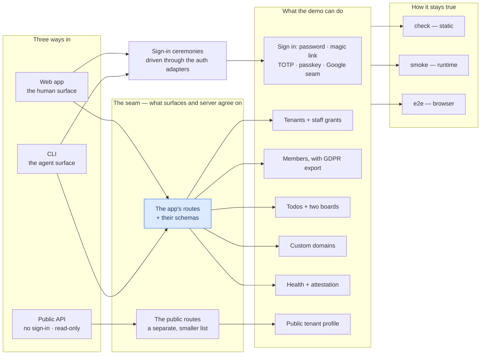
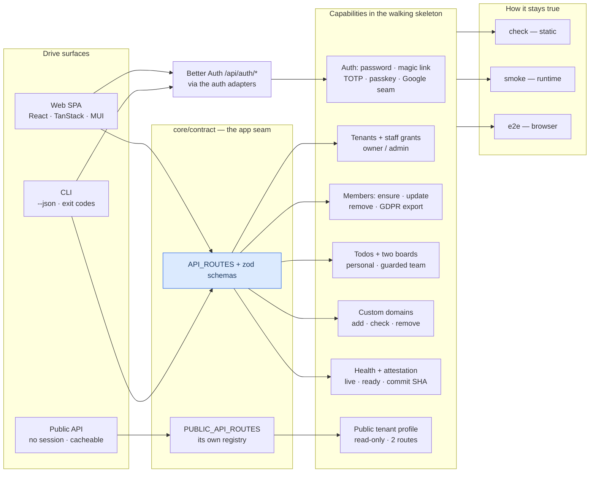

# Agent-Proof Architecture 🔷 \{#agent-proof-architecture}

*Read this if you are evaluating the architecture and deciding whether to go further.*

**agentproofarch** — a strictly layered full-stack TypeScript foundation that
keeps its structure no matter how much of the code an AI agent writes.

When an agent writes most of the code, the thing that decays first is not
correctness — it is *structure*. A generated change lands wherever it compiles.
The seams — the declared boundaries between parts of the system — blur. Six
weeks later nobody can say where the boundary between the database and the
domain went.

agentproofarch is the answer to that specific failure. Every boundary is
machine-enforced by lint, so structure cannot drift silently. The day-to-day
capability surface is drivable from a CLI with machine-readable output, so work
can be verified without a browser — by you or by the agent itself.

The architecture is written down first (`docs/architecture.md` is normative),
the enforcers are written down next, and `demo/` is a running reference
implementation of both.

A free, open project — [MIT licensed](https://github.com/chomamateusz/agentproofarch/blob/main/LICENSE) —
by **Mateusz Choma**, developed privately in collaboration with
**[CodeRoad.pl](https://coderoad.pl)** and **[AmazingDesign.eu](https://amazingdesign.eu)**.

## What problem does it solve 🎯 \{#what-problem-does-it-solve}

If you have watched an AI-assisted codebase rot, you already know these:

| Your problem | The answer here |
|---|---|
| Generated code lands wherever it compiles; layering erodes PR by PR | Layer boundaries are lint rules (`eslint-plugin-boundaries` + dependency-cruiser). A misplaced import **fails the build**. |
| Merged, typechecked — and does not boot | "Done" is two green gates: **`check`** (static — typecheck, lint, boundary rules, unit tests) **and** **`smoke`** (runtime — boots the real server on a real database and drives it through the CLI). |
| The agent verifying its own work through a browser is slow, token-hungry and probabilistic | The day-to-day capability surface is drivable from the CLI with `--json` output and deterministic exit codes — no browser in the loop; the exceptions are named in [the feature map](#the-feature-map). |
| Multi-tenancy bolted on later, painfully | Tenants, subdomains and custom domains are in the skeleton from day one. |
| Locked into one platform | Externals sit behind **ports and adapters**: the core declares the interfaces it needs (ports), thin replaceable modules (adapters) implement them. The same commit runs on Vercel and in Docker. |
| Docs drift from the code | Docs-first rule (`docs/architecture.md` is normative) plus a `doc-lint` cross-check in CI that verifies docs against the enforcers and the source tree. |

Those answers roll up into the four promises the architecture makes
([architecture.md](https://github.com/chomamateusz/agentproofarch/blob/main/docs/architecture.md),
"The promise"):

1. **An agent works, and the architecture does not move.** Generated change
   lands inside the seams; drift is a red gate, not a slow surprise.
2. **The platform is replaceable without a rewrite.** Deploy target, database
   driver and auth provider are adapter choices — one edit in one file, not a
   migration.
3. **A feature enters and leaves touching nothing but its declared
   interfaces.** Adding or removing one changes that slice and its seams,
   nothing else.
4. **Everything is testable.** Cores are pure and test without frameworks; the
   rest is driven end-to-end by the gates — static, runtime, browser.

## Start here 🚀 \{#start-here}

After the install step, [five commands](./quickstart.md#the-five-commands) boot a
working demo on your machine — multi-tenancy included, on localhost, with seeded
data (a demo account and two tenants). The [Quickstart](./quickstart.md) has
them, with every prerequisite, seed value and sharp edge spelled out.

What boots is a small multi-tenant todo app: two tenants, staff grants,
end-customer members, two boards. Deliberately boring, because the product is
the seams, not the todos.

More precisely, it is a **walking skeleton** — the thinnest version of the real
system with every layer connected and actually working — not a scaffold of stubs. Each
capability flows through *every* layer and is drivable from both the web app
and the CLI; the [top of the Quickstart](./quickstart.md#what-you-get-after-boot)
lists them all.

From there:

- **[CLI walkthrough](../guides/cli-walkthrough.md)** — the agent feedback loop,
  command by command.
- **[Adding a feature](../guides/adding-a-feature.md)** — the scaffolder (a
  generator that plants a new resource) and the 12-step wiring checklist.
- **[Layers](../architecture/layers.md)** and
  **[ADRs](../decisions/index.md)** — why the seams sit where they do.
- **[Agent workflow](../guides/agent-workflow.md)** — how this repository is
  actually developed.

Every term this site uses is defined in the [glossary](./glossary.md), which
opens with the architecture in plain words; the full structural story is in
[Layers](../architecture/layers.md).

## The feature map 🗺️ \{#the-feature-map}

There are three ways into the system, and one seam in the middle where the
surfaces and the server agree on what exists.

Every capability is reachable through the web app, and the day-to-day surface is
reachable through the CLI too. The CLI path is the one an agent uses, because it
is the only one that prints machine-readable output and ends with an exit code
mapped from the error taxonomy — the single closed list of error codes this
system uses. Its known exceptions come in two kinds. Browser-bound: passkeys
(the WebAuthn ceremony needs an authenticator, so the CLI auth adapter
hard-errors) and Google sign-in (the consent redirect happens in a browser).
Not written yet: TOTP enrolment works over plain HTTP and simply has no command,
and the internal backfill executor (`POST /api/internal/backfills/:name`) is
driven by raw HTTP from a cron, with no CLI and no UI.

The third surface is deliberately *not* a third door onto everything: the
public API exposes two unauthenticated read-only routes over one tenant profile
(`slug`, `displayName`, `contentVersion`) and nothing else, by construction
rather than by exception
([ADR-0006](../decisions/0006-public-read-only-surface.md)).

The same map with the real symbol names is one click away. The full structural
graph — every layer and every allowed dependency direction — opens
[Layers](../architecture/layers.md).

The same map, with the symbol names the code actually uses

Read the structure top-down in [Layers](../architecture/layers.md), then follow a
single request through it in
[Request lifecycle](../architecture/request-lifecycle.md).

## How it defends itself 🛡️ \{#how-it-defends-itself}

| Gate | Command | What it proves | Required check? |
|---|---|---|---|
| **Static** | `pnpm run check` | Does it compile, does it respect the boundaries, do the unit tests pass — [eight members, in that order](../operations/ci-gates.md#check--the-static-gate). | yes — `check` |
| **Runtime** | `pnpm run smoke` | Boots the real server on a real database and drives it through the CLI, asserting the exit code of every step. | yes — `smoke` |
| **Browser** | `pnpm run e2e` | Drives a real Chromium over the real stack: {/*count:e2e-tests*/}15{/*/count*/} tests across {/*count:e2e-specs*/}6{/*/count*/} spec files. | yes — `e2e` |
| **Container** | `selfhost.yml` | Builds the image, boots `docker-compose.prod.yml`, smokes the container through the CLI. | yes — `docker-smoke` |
| **Pixel** | `pnpm run visual` | Compares CI-rendered screenshots pixel for pixel ([ADR-0008](../decisions/0008-visual-regression.md)). | **no** — by design |
| **Review** | `ai-review.yml` | An AI reads the diff against this repo's doctrine; only a positive `PASS` verdict is green, and a review that could not run is red. | **yes**, on `main` (since 2026-07-26) |

Every tool named here is defined in the [glossary](./glossary.md), and the
[CI gates](../operations/ci-gates.md) page is the one place that lists what each
job actually runs.

:::danger[Done = `check` green AND `smoke` green]
Static-green is not done. A typechecked, linted commit that does not boot is a
red commit. And a red gate is never rerun to green: **a flake is a P1 bug**
(owner ruling, [DECIDE F3](./glossary.md#gates-verification-and-doctrine)) — a
red gate means the commit is wrong or the gate is wrong, and one of them gets
fixed.
:::

Underneath those gates sit four counts: **{/*count:test-files*/}97{/*/count*/}** test files in the database-free
run, **{/*count:integration-tests*/}49{/*/count*/}** integration tests against a real Postgres, **{/*count:e2e-tests*/}15{/*/count*/}** Playwright tests,
and **{/*count:config-regression*/}58{/*/count*/}** config-regression probes.

That last number is the unusual one. Those probes guard the enforcers
themselves: most feed a deliberately illegal fixture and assert rejection, and
the rest are structural scans and non-vacuity guards over the real source. A
silently weakened rule therefore fails CI instead of passing quietly.

The counts are not prose either. They sit in the repository's own READMEs as
machine-checked tokens, and `doc-lint` re-verifies them against the source tree
on every `check`. See [Testing doctrine](../guides/testing-doctrine.md) and
[CI gates](../operations/ci-gates.md).

## Live demo 🖥️ \{#live-demo}

[agentproofarch.vercel.app](https://agentproofarch.vercel.app) — sign in as
`demo@agentproofarch.dev` / `demo1234`. The deployed web app is single-tenant on
`*.vercel.app` (Vercel refuses tenant subdomains under a project's own
`*.vercel.app` apex, so a wildcard base domain is an environment concern, not a
code one — [ADR-0003](../decisions/0003-vercel-environments.md)); the API and CLI
stay fully multi-tenant via the `X-Tenant` header.

## Honest status 🚦 \{#honest-status}

- **Vercel target: live. Docker self-host: built** and proven on every PR and push
  to `main` by the `docker-smoke` job — a multi-stage `Dockerfile`, `docker-compose.prod.yml`
  with an `edge`-profiled Caddy for on-demand TLS, and migrations run by the
  container entrypoint.
- **The Vercel Domains provisioning adapter (US-020) has a live-confirmed
  production add path** as of 2026-07-29. Check/remove acceptance remains
  unrecorded and covered offline. Full statement:
  [US-020 status](../operations/self-host-and-domains.md#us-020-production-add-confirmed-live).
- **Some CI jobs run but block nothing.** `visual` (pixel), `docs-build` (this
  site) and `dr-acceptance` report without gating, each for a stated reason —
  [CI gates](../operations/ci-gates.md#deliberately-non-required) is the one
  list of them. `ai-review` has been a required `main-gates` check since
  2026-07-26. Adding a status check to a ruleset is Admin-only — which the
  agent account deliberately is not.
- **`ai-review` has one token slot provisioned.** `CLAUDE_CODE_OAUTH_TOKEN_1` is
  present; slots `_2` and `_3` are wired in the workflow and skip cleanly while
  absent. The gate is fail-closed by construction: an infra failure on every
  available slot is RED, never a silent pass.
- **Accepted-but-deliberately-unbuilt work is written down**, each entry with a
  named trigger, in the
  [deferred-work register](https://github.com/chomamateusz/agentproofarch/blob/main/docs/backlog.md)
  — day-2 operations, threat model, feature flags, forms doctrine, a11y, i18n,
  per-tenant SSO. When a trigger fires the entry graduates into an ADR or an
  implementation slice; it never gets built silently.

:::note[This is a reference implementation, not a package]
**You read it, fork it, or lift patterns out of it.**

`demo/package.json` is `private: true` and nothing is published to npm. There is
release versioning: releases are SemVer, bumped by a dedicated release-cut pull
request to `main`, promoted to `production` and tagged `vX.Y.Z`. The
[changelog](../changelog.md) keeps its UTC date groups and gains a marker at each
cut; the docs site freezes one snapshot per major.

The version in `demo/package.json` — `1.0.0` in this release cut — is the
build's single release identity, served by every successful health response. The
website's `package.json` holds an inert `0.0.0` placeholder. See
[Versioning & releases](../operations/versioning-and-releases.md) for the
release, API, documentation, and display contracts, and
[Health & attestation](../operations/health-and-attestation.md) for probe
semantics.
:::

## Where the truth lives 📚 \{#where-the-truth-lives}

The authoritative documents remain in the repository:
[`docs/architecture.md`](https://github.com/chomamateusz/agentproofarch/blob/main/docs/architecture.md)
(normative) and the
[PRD](https://github.com/chomamateusz/agentproofarch/blob/main/docs/prd-agentproofarch-foundation.md)
(§3 is the contract). This site condenses them; where the two disagree, the
repository wins.
