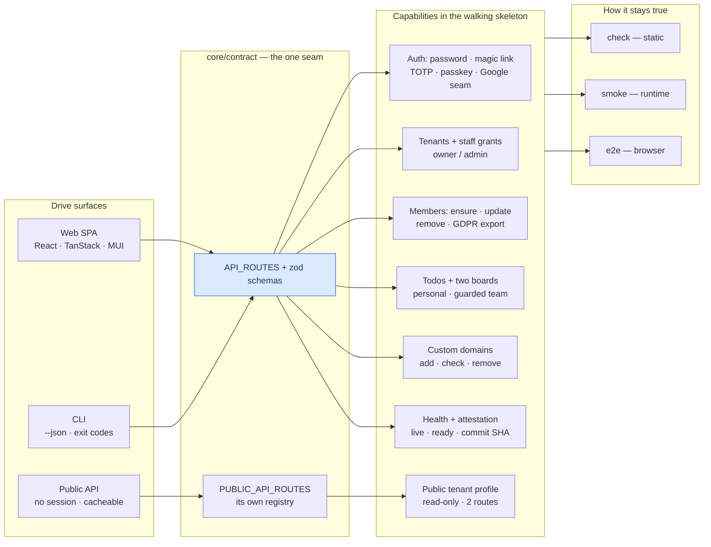

# agentproofarch

When an AI agent writes most of the code, the thing that decays first is not
correctness — it is *structure*. A generated change lands wherever it compiles,
the seams blur, and six weeks later nobody can say where the boundary between the
database and the domain went. **agentproofarch** is the answer to that specific
failure: a strictly layered full-stack TypeScript foundation where every boundary
is machine-enforced by lint, every capability is drivable from a CLI with `--json`
output and deterministic exit codes, and "done" is defined as two green gates
rather than a green typecheck. The architecture is written down first
(`docs/architecture.md` is normative), the enforcers are written down next, and
`demo/` is a running reference implementation of both.

A free, open project by **Mateusz Choma**, developed privately in collaboration
with **[CodeRoad.pl](https://coderoad.pl)** and
**[AmazingDesign.eu](https://amazingdesign.eu)**.

## Start here

Four minutes of reading, or four commands:

```bash
git clone https://github.com/chomamateusz/agentproofarch.git
cd agentproofarch/demo && pnpm install --frozen-lockfile
pnpm run db:up && pnpm run db:migrate && pnpm run db:seed
pnpm run smoke            # the runtime gate: boots the real server, drives the CLI
```

- **[Quickstart](./quickstart.md)** — the same path with every prerequisite,
  seed value and sharp edge spelled out.
- **[CLI walkthrough](../guides/cli-walkthrough.md)** — the agent feedback loop,
  command by command.
- **[Adding a feature](../guides/adding-a-feature.md)** — the scaffolder and the
  12-step chain.
- **[Layers](../architecture/layers.md)** and
  **[Decisions](../decisions/index.md)** — why the seams sit where they do.
- **[Agent workflow](../guides/agent-workflow.md)** — how this repository is
  actually developed.

The rest of this page is what you are looking at and why it is shaped this way.

## What it is, precisely

A pure-TypeScript core — `core/domain` (entities, `Result`, the error taxonomy),
`core/contract` (routes + zod schemas), `core/server` (use-cases + ports),
`core/client` (the typed HTTP client) — surrounded by thin adapters (Drizzle
database, Better Auth, email, domain provisioning) and thin apps (a Hono HTTP
server, a React SPA, a commander CLI). `core/**` may not import hono, react,
drizzle, better-auth, pg or commander; `core/domain` depends on zod alone;
`apps/server/src/composition.ts` is the only place a *server* adapter is
instantiated. None of that is a convention you are asked to remember — it is
`eslint-plugin-boundaries` plus dependency-cruiser, and violating it fails the
build.

The demo is a **walking skeleton**, not a scaffold: authentication (password,
magic link, TOTP two-factor, passkeys, plus a Google seam that stays dormant
unless both of its env vars are set), foundation-owned tenants with flat
`owner`/`admin` staff grants, tenant resolution by custom domain or subdomain,
end-customer members with GDPR export and removal, todos, two exemplar boards (a
personal one and a WIP-guarded team one), and a public unauthenticated read
surface — each one flowing through *every* layer, and each one drivable from both
the web app and the CLI.

## Who it is for

| You are… | What you get from this |
|---|---|
| **Building a multi-tenant SaaS with agents doing the typing** | A layout where a generated change either lands inside a seam or turns a gate red — plus a scaffolder that plants a resource and hands you the 12-step wiring checklist. |
| **Evaluating how far layering can actually be enforced** | A concrete answer: `eslint-plugin-boundaries`, dependency-cruiser, custom `agentproofarch/*` rules, a docs↔enforcer cross-check (`doc-lint`), and probes that feed each rule a violating fixture to prove it still bites. |
| **Deciding whether to trust an AI-written codebase** | The verification story, warts included: a fail-closed AI-review gate, post-deploy commit-SHA attestation, a flake-is-a-P1 rule, and a register of work that was accepted and deliberately *not* built. |
| **Planning to self-host** | The same commit runs on Vercel + Neon and on a Docker stack (Node + Postgres + Caddy on-demand TLS), with a CI job that boots the container stack and smokes it. |

:::note This is a reference implementation, not a package
`demo/package.json` is `private: true` and nothing is published to npm. There is
no release versioning either: a release is a branch promotion
(`main` → `production`), the repository carries no version tags, and the
[changelog](../changelog.md) groups entries by merge date rather than by version. The
one version number that exists — `0.1.0` in `demo/package.json` — is the build's
release identity, served as the `version` field of every health response
([Health & attestation](../operations/health-and-attestation.md)); nothing bumps
it on promotion. You read it, fork it, or lift patterns out of it. CLI
distribution and a version handshake sit on the
[deferred-work register](https://github.com/chomamateusz/agentproofarch/blob/main/docs/backlog.md)
with "first external CLI consumer" as the named trigger.
:::

## The feature map

Every capability is reachable two ways — the web app and the CLI — and the CLI
path is the one an agent uses, because it is the only one with machine-readable
output and a taxonomy-mapped exit code. The third surface is deliberately *not* a
third door onto everything: the public API exposes two unauthenticated read-only
routes over one tenant profile (`slug`, `displayName`, `contentVersion`) and
nothing else, by construction rather than by exception
([ADR-0006](../decisions/0006-public-read-only-surface.md)).



Read the structure top-down in [Layers](../architecture/layers.md), then follow a
single request through it in
[Request lifecycle](../architecture/request-lifecycle.md).

## Why — the four promises

The architecture exists so four things stay true while agents do the work
([architecture.md](https://github.com/chomamateusz/agentproofarch/blob/main/docs/architecture.md),
"The promise"):

1. **An agent works, and the architecture does not move.** Generated change lands
   inside the seams; drift is a red gate, not a slow surprise.
2. **The platform is replaceable without a rewrite.** Deploy target, database
   driver and auth provider are adapter choices behind ports — a composition-root
   edit, not a migration.
3. **A feature enters and leaves touching nothing but its communication
   interfaces.** Adding or removing a vertical slice changes that slice and its
   declared seams, nothing else.
4. **Everything is testable.** Cores are pure and test without frameworks; the
   rest is driven end-to-end by the gates — static, runtime, browser.

## How it defends itself

| Gate | Command | What it proves | Required check? |
|---|---|---|---|
| **Static** | `pnpm run check` | typecheck (incl. the island TS project) + ESLint boundaries + `lock-lint` + dependency-cruiser + knip + `doc-lint` + vitest with a coverage ratchet | yes — `check` |
| **Runtime** | `pnpm run smoke` | recreates an isolated database, boots the real server, drives health → sign-in → todos → unauthorized through the CLI asserting taxonomy exit codes | yes — `smoke` |
| **Browser** | `pnpm run e2e` | a real Chromium over the real stack: 15 tests across 6 spec files | yes — `e2e` |
| **Container** | `selfhost.yml` | builds the image, boots `docker-compose.prod.yml`, smokes the container through the CLI | yes — `docker-smoke` |
| **Pixel** | `pnpm run visual` | Playwright `toHaveScreenshot()` against CI-rendered baselines ([ADR-0008](../decisions/0008-visual-regression.md)) | **no** — by design |
| **Review** | `ai-review.yml` | fail-closed AI diff review; only a positive `PASS` verdict is green | **yes**, on `main` (since 2026-07-26) |

:::danger Done = `check` green AND `smoke` green
Static-green is not done. A typechecked, linted commit that does not boot is a
red commit. And a red gate is never rerun to green: **a flake is a P1 bug**
(owner ruling, DECIDE F3) — a red gate means the commit is wrong or the gate is
wrong, and one of them gets fixed.
:::

Underneath those gates: **84** test files in the database-free run, **48**
integration tests against a real Postgres, **15** Playwright tests, and **47**
config-regression probes that feed a deliberately illegal fixture to an enforcer
and assert it still rejects it — so a silently weakened rule fails CI instead of
passing quietly. Those counts are injected into the repository's own READMEs by
`doc-lint` and re-verified against the source tree on every `check`. See
[Testing doctrine](../guides/testing-doctrine.md) and
[CI gates](../operations/ci-gates.md).

## Live demo

[agentproofarch.vercel.app](https://agentproofarch.vercel.app) — sign in as
`demo@agentproofarch.dev` / `demo1234`. The deployed web app is single-tenant on
`*.vercel.app` (Vercel refuses tenant subdomains under a project's own
`*.vercel.app` apex, so a wildcard base domain is an environment concern, not a
code one — [ADR-0003](../decisions/0003-vercel-environments.md)); the API and CLI
stay fully multi-tenant via the `X-Tenant` header.

## Honest status

- **Vercel target: live. Docker self-host: built** and proven on every PR and push
  to `main` by the `docker-smoke` job — a multi-stage `Dockerfile`, `docker-compose.prod.yml`
  with an `edge`-profiled Caddy for on-demand TLS, and migrations run by the
  container entrypoint.
- **The Vercel Domains provisioning adapter (US-020) is built but has never run
  against the live API** — proven against a stubbed `fetch` only, because no
  `VERCEL_TOKEN` exists on CI or the build machine. Full statement:
  [US-020: built, and never run live](../operations/self-host-and-domains.md#us-020-built-and-never-run-live).
- **Two CI jobs run but block nothing.** `visual` (pixel) and `docs-build`
  (this site) report without gating until the owner arms them; `ai-review`
  has been a required `main-gates` check since 2026-07-26.
  Adding a status check to a ruleset is Admin-only — which the agent account
  deliberately is not.
- **`ai-review` has one token slot provisioned.** `CLAUDE_CODE_OAUTH_TOKEN_1` is
  present; slots `_2` and `_3` are wired in the workflow and skip cleanly while
  absent. The gate is fail-closed by construction: an infra failure on every
  available slot is RED, never a silent pass.
- **Accepted-but-deliberately-unbuilt work is written down**, each entry with a
  named trigger, in the
  [deferred-work register](https://github.com/chomamateusz/agentproofarch/blob/main/docs/backlog.md)
  — day-2 operations, threat model, feature flags, forms doctrine, a11y, i18n,
  per-tenant SSO. When a trigger fires the entry graduates into an ADR or an
  implementation slice; it never gets built silently.

## Where the truth lives

The authoritative documents remain in the repository:
[`docs/architecture.md`](https://github.com/chomamateusz/agentproofarch/blob/main/docs/architecture.md)
(normative) and the
[PRD](https://github.com/chomamateusz/agentproofarch/blob/main/docs/prd-agentproofarch-foundation.md)
(§3 is the contract). This site condenses them; where the two disagree, the
repository wins.
